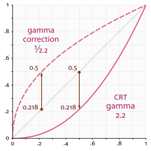

:article_outdated: True

.. _doc_high_dynamic_range:

High dynamic range lighting
===========================

Introduction
------------

Normally, an artist does all the 3D modeling, then all the texturing, looks at
their awesome looking model in the 3D modeling software and says "looks
fantastic, ready for integration!" then goes into the game, lighting is setup
and the game runs.

So at what point does all this "HDR" business come into play? To understand
the answer, we need to look at how displays behave.

Your display outputs linear light ratios from some maximum to some minimum
intensity. Modern game engines perform complex math on linear light values in
their respective scenes. So what's the problem?

The display has a limited range of intensity, depending on the display type.
The game engine renders to an unlimited range of intensity values, however.
While "maximum intensity" means something to an sRGB display, it has no bearing
in the game engine; there is only a potentially infinitely wide range
of intensity values generated per frame of rendering.

This means that some transformation of the scene light intensity, also known
as *scene-referred* light ratios, need to be transformed and mapped to fit
within the particular output range of the chosen display. This can be most
easily understood if we consider virtually photographing our game engine scene
through a virtual camera. Here, our virtual camera would apply a particular
camera rendering transform to the scene data, and the output would be ready
for display on a particular display type.

.. note::

    Godot does not support high dynamic range *output* yet. It can only perform
    lighting in HDR and tonemap the result to a low dynamic range image.

    For advanced users, it is still possible to get a non-tonemapped image
    of the viewport with full HDR data, which can then be saved to an OpenEXR file.

Computer displays
-----------------

Almost all displays require a nonlinear encoding for the code values sent
to them. The display in turn, using its unique transfer characteristic,
"decodes" the code value into linear light ratios of output, and projects
the ratios out of the uniquely colored lights at each reddish, greenish,
and blueish emission site.

For a majority of computer displays, the specifications of the display are
outlined in accordance with IEC 61966-2-1, also known as the
1996 sRGB specification. This specification outlines how an sRGB display
is to behave, including the color of the lights in the LED pixels as well as
the transfer characteristics of the input (OETF) and output (EOTF).

Not all displays use the same OETF and EOTF as a computer display.
For example, television broadcast displays use the BT.1886 EOTF.
However, Godot currently only supports sRGB displays.

The sRGB standard is based around the nonlinear relationship between the current
to light output of common desktop computing CRT displays.

The mathematics of a scene-referred model require that we multiply the scene by
different values to adjust the intensities and exposure to different
light ranges. The transfer function of the display can't appropriately render
the wider dynamic range of the game engine's scene output using the simple
transfer function of the display. A more complex approach to encoding
is required.

Scene linear & asset pipelines
------------------------------

Working in scene-linear sRGB is more complex than pressing a single switch. First,
imported image assets must be converted to linear light ratios on import. Even
when linearized, those assets may not be perfectly well-suited for use
as textures, depending on how they were generated.

There are two ways to do this:

sRGB transfer function to display linear ratios on image import
~~~~~~~~~~~~~~~~~~~~~~~~~~~~~~~~~~~~~~~~~~~~~~~~~~~~~~~~~~~~~~~

This is the easiest method of using sRGB assets, but it's not the most ideal.
One issue with this is loss of quality. Using 8 bits per channel to represent
linear light ratios is not sufficient to quantize the values correctly.
These textures may also be compressed later, which can exacerbate the problem.

Hardware sRGB transfer function to display linear conversion
~~~~~~~~~~~~~~~~~~~~~~~~~~~~~~~~~~~~~~~~~~~~~~~~~~~~~~~~~~~~

The GPU will do the conversion after reading the texel using floating-point.
This works fine on PC and consoles, but most mobile devices don't support it,
or they don't support it on compressed texture formats (iOS for example).

Scene linear to display-referred nonlinear
~~~~~~~~~~~~~~~~~~~~~~~~~~~~~~~~~~~~~~~~~~

After all the rendering is done, the scene linear render requires transforming
to a suitable output such as an sRGB display. To do this, enable sRGB conversion
in the current :ref:`Environment <class_Environment>` (more on that below).

Keep in mind that the **sRGB -> Display Linear** and **Display Linear -> sRGB**
conversions must always be **both** enabled. Failing to enable one of them will
result in horrible visuals suitable only for avant-garde experimental
indie games.

Parameters of HDR
-----------------

HDR settings can be found in the :ref:`Environment <class_Environment>`
resource. Most of the time, these are found inside a
:ref:`WorldEnvironment <class_WorldEnvironment>`
node or set in a Camera node. For more information, see
:ref:`doc_environment_and_post_processing`.
