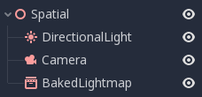
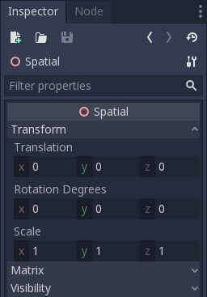
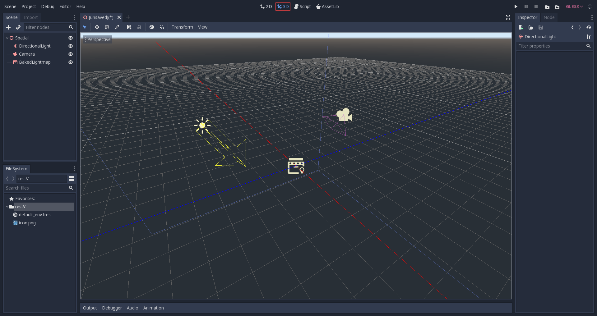
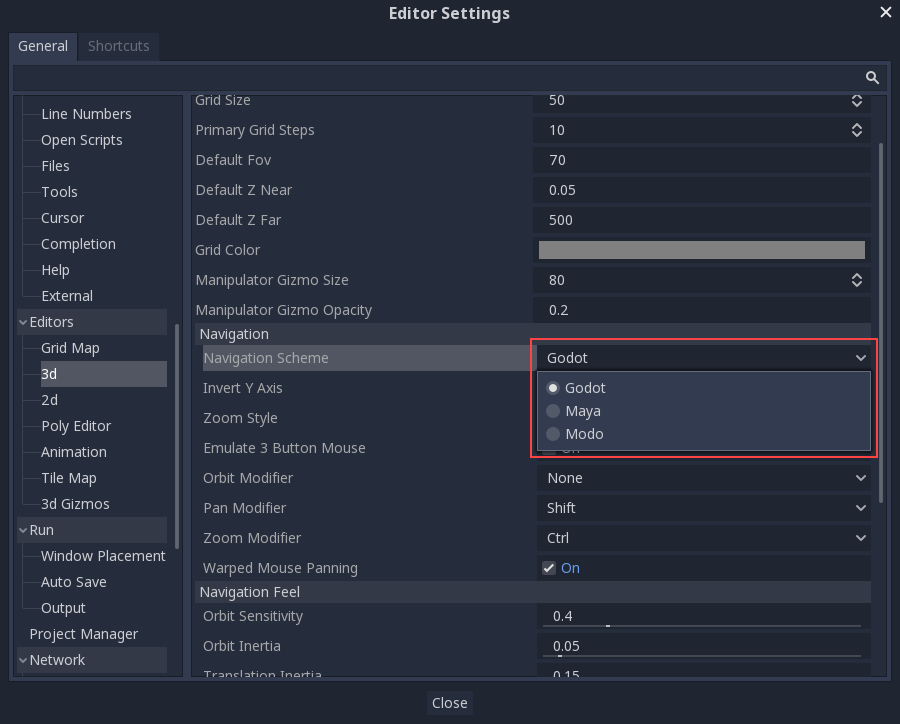
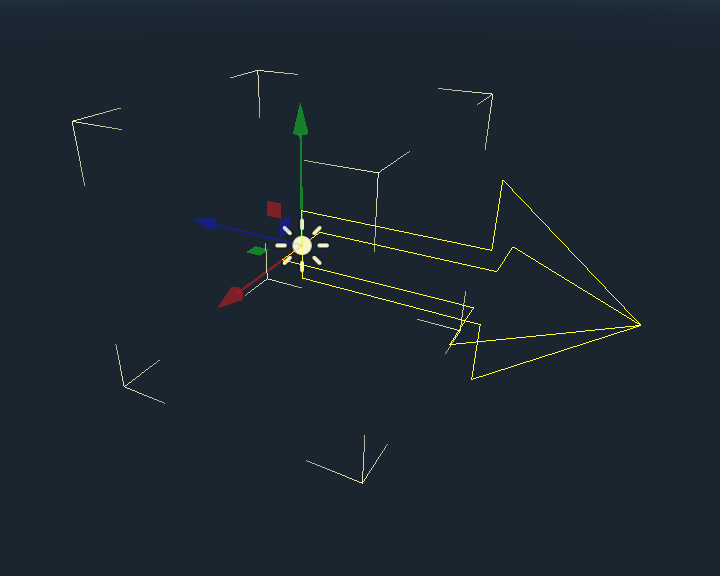
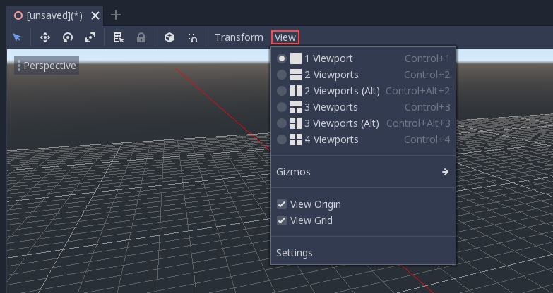
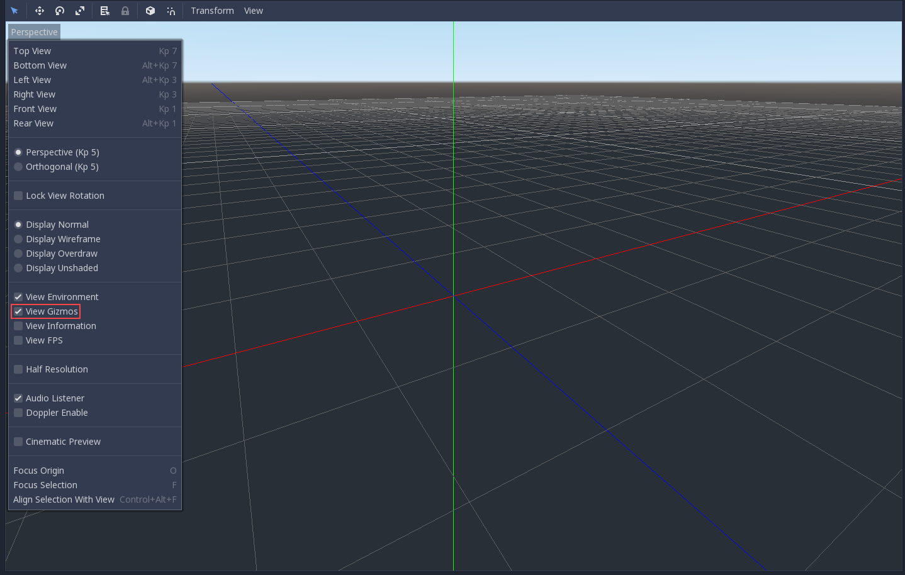
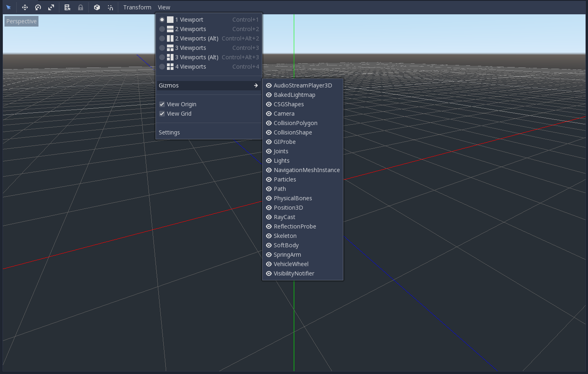
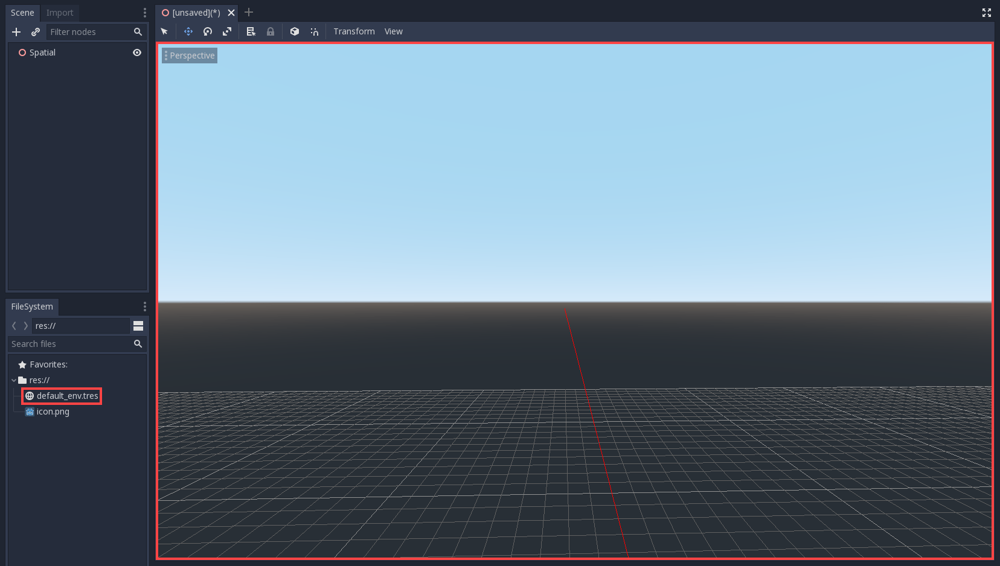
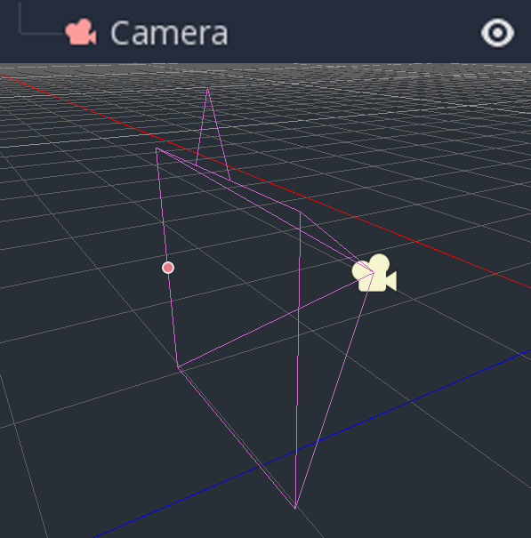

.. _doc_introduction_to_3d:

Introduction to 3D
==================

Creating a 3D game can be challenging. That extra Z coordinate makes
many of the common techniques that helped to make 2D games simple no
longer work. To aid in this transition, it is worth mentioning that
Godot uses similar APIs for 2D and 3D. Most nodes are the same and
are present in both 2D and 3D versions. In fact, it is worth checking
the 3D platformer tutorial, or the 3D kinematic character tutorials,
which are almost identical to their 2D counterparts.

In 3D, math is a little more complex than in 2D, so also checking the
:ref:`doc_vector_math` entry in the wiki (which was especially created for game
developers, not mathematicians or engineers) will help pave the way for you
to develop 3D games efficiently.

Spatial node
~~~~~~~~~~~~

:ref:`Node2D <class_Node2D>` is the base node for 2D.
:ref:`Control <class_Control>` is the base node for everything GUI.
Following this reasoning, the 3D engine uses the :ref:`Spatial <class_Spatial>`
node for everything 3D.

Spatial nodes have a local transform, which is relative to the parent
node (as long as the parent node is also of **or inherits from** the type
Spatial). This transform can be accessed as a 4×3
:ref:`Transform <class_Transform>`, or as 3 :ref:`Vector3 <class_Vector3>`
members representing location, Euler rotation (X, Y and Z angles) and
scale.

3D content
~~~~~~~~~~

Unlike 2D, where loading image content and drawing is straightforward,
3D is a little more difficult. The content needs to be created with
special 3D tools (usually referred to as DCCs) and exported to an
exchange file format in order to be imported in Godot (3D formats are
not as standardized as images).

DCC-created models
------------------

.. FIXME: Needs update to properly description Godot 3.x workflow
   (used to reference a non existing doc_importing_3d_meshes importer).

There are two pipelines to import 3D models in Godot. The first and most
common one is by :ref:`doc_importing_3d_scenes`, which allows you to import
entire scenes (just as they look in the DCC), including animation,
skeletal rigs, blend shapes, etc.

The second pipeline is by importing simple .OBJ files as mesh resources,
which can be then put inside a :ref:`MeshInstance <class_MeshInstance>`
node for display.

Generated geometry
------------------

It is possible to create custom geometry by using the
:ref:`ArrayMesh <class_ArrayMesh>` resource directly. Simply create your arrays
and use the :ref:`ArrayMesh.add_surface_from_arrays() <class_ArrayMesh_method_add_surface_from_arrays>`
function. A helper class is also available, :ref:`SurfaceTool <class_SurfaceTool>`,
which provides a more straightforward API and helpers for indexing,
generating normals, tangents, etc.

In any case, this method is meant for generating static geometry (models
that will not be updated often), as creating vertex arrays and
submitting them to the 3D API has a significant performance cost.

Immediate geometry
------------------

If, instead, there is a requirement to generate simple geometry that
will be updated often, Godot provides a special node,
:ref:`ImmediateGeometry <class_ImmediateGeometry>`,
which provides an OpenGL 1.x style immediate-mode API to create points,
lines, triangles, etc.

2D in 3D
--------

While Godot packs a powerful 2D engine, many types of games use 2D in a
3D environment. By using a fixed camera (either orthogonal or
perspective) that does not rotate, nodes such as
:ref:`Sprite3D <class_Sprite3D>` and
:ref:`AnimatedSprite3D <class_AnimatedSprite3D>`
can be used to create 2D games that take advantage of mixing with 3D
backgrounds, more realistic parallax, lighting/shadow effects, etc.

The disadvantage is, of course, that added complexity and reduced
performance in comparison to plain 2D, as well as the lack of reference
of working in pixels.

Environment
~~~~~~~~~~~

Besides editing a scene, it is often common to edit the environment.
Godot provides a :ref:`WorldEnvironment <class_WorldEnvironment>`
node that allows changing the background color, mode (as in, put a
skybox), and applying several types of built-in post-processing effects.
Environments can also be overridden in the Camera.

3D viewport
~~~~~~~~~~~

Editing 3D scenes is done in the 3D tab. This tab can be selected
manually, but it will be automatically enabled when a Spatial node is
selected.

Default 3D scene navigation controls are similar to Blender (aiming to
have some sort of consistency in the free software pipeline..), but
options are included to customize mouse buttons and behavior to be
similar to other tools in the Editor Settings:

Coordinate system
-----------------

Godot uses the `metric <https://en.wikipedia.org/wiki/Metric_system>`__
system for everything. 3D Physics and other areas are tuned for this, so
attempting to use a different scale is usually a bad idea (unless you
know what you are doing).

When working with 3D assets, it's always best to work in the correct
scale (set your DCC to metric). Godot allows scaling post-import and,
while this works in most cases, in rare situations it may introduce
floating-point precision issues (and thus, glitches or artifacts) in
delicate areas, such as rendering or physics, so make sure your artists
always work in the right scale!

The Y coordinate is used for "up", though for most objects that need
alignment (like lights, cameras, capsule collider, vehicle, etc.), the Z
axis is used as a "pointing towards" direction. This convention roughly
means that:

-  **X** is sides
-  **Y** is up/down
-  **Z** is front/back

Space and manipulation gizmos
-----------------------------

Moving objects in the 3D view is done through the manipulator gizmos.
Each axis is represented by a color: Red, Green, Blue represent X, Y, Z
respectively. This convention applies to the grid and other gizmos too
(and also to the shader language, ordering of components for
Vector3, Color, etc.).

Some useful keybindings:

-  To snap placement or rotation, press :kbd:`Ctrl` while moving, scaling
   or rotating.
-  To center the view on the selected object, press :kbd:`F`.

View menu
---------

The view options are controlled by the "View" menu in the viewport's toolbar.

You can hide the gizmos in the 3D view of the editor through this menu:

To hide a specific type of gizmos, you can toggle them off in the "View" menu.

Default environment
-------------------

When created from the Project Manager, the 3D environment has a default sky.

Given how physically based rendering works, it is advised to always try to
work with a default environment in order to provide indirect and reflected
light to your objects.

Cameras
-------

No matter how many objects are placed in the 3D space, nothing will be
displayed unless a :ref:`Camera <class_Camera>` is
also added to the scene. Cameras can work in either orthogonal or
perspective projections:

Cameras are associated with (and only display to) a parent or grandparent
viewport. Since the root of the scene tree is a viewport, cameras will
display on it by default, but if sub-viewports (either as render target
or picture-in-picture) are desired, they need their own children cameras
to display.

.. image:: img/tuto_3d11.png

When dealing with multiple cameras, the following rules are enforced for
each viewport:

-  If no cameras are present in the scene tree, the first one that
   enters it will become the active camera. Further cameras entering the
   scene will be ignored (unless they are set as *current*).
-  If a camera has the "*current*" property set, it will be used
   regardless of any other camera in the scene. If the property is set,
   it will become active, replacing the previous camera.
-  If an active camera leaves the scene tree, the first camera in
   tree-order will take its place.

Lights
------

There is no limitation on the number of lights, nor of types of lights, in
Godot. As many as desired can be added (as long as performance allows).
