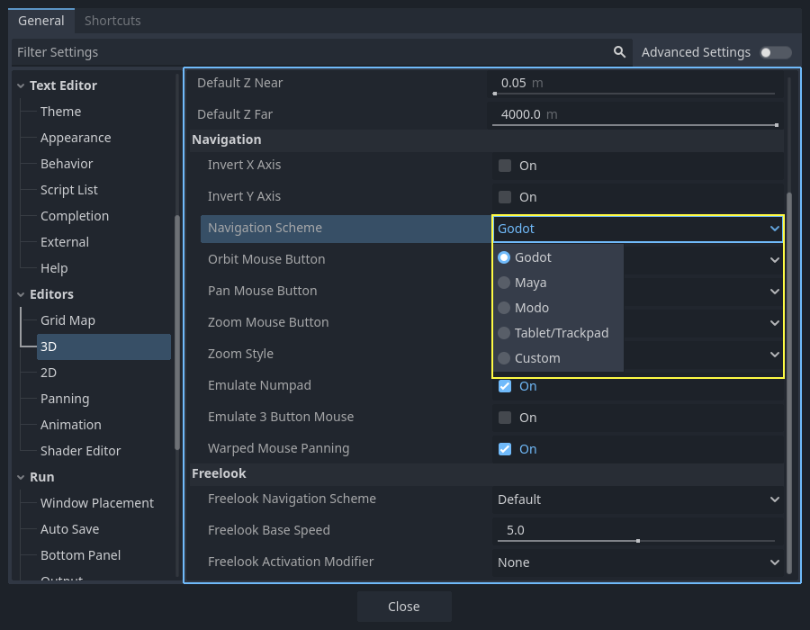
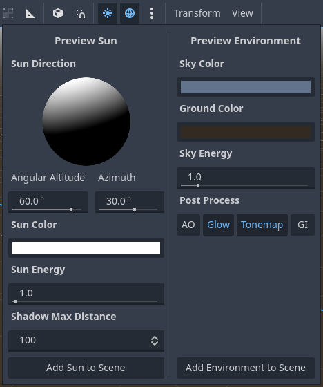

.. _doc_introduction_to_3d:

Introduction to 3D
==================

Creating a 3D game can be challenging. That extra Z coordinate makes
many of the common techniques that helped to make 2D games simpler no
longer work. To aid in this transition, it is worth mentioning that
Godot uses similar APIs for 2D and 3D. Most nodes are the same and
are present in both 2D and 3D versions. In fact, it is worth checking
the 3D platformer tutorial, or the 3D kinematic character tutorials,
which are almost identical to their 2D counterparts.

   Godot Third Person Shooter (TPS) Demo, available on the 
   `Github repository <https://github.com/godotengine/tps-demo>`__ or the 
   :ref:`Asset Library <doc_project_manager_downloading_demos>`.

In 3D, math is a little more complex than in 2D. For an introduction to the
relevant math written for game developers, not mathemeticians or engineers,
check out :ref:`doc_vector_math` and :ref:`doc_using_transforms`.

3D workspace
~~~~~~~~~~~~

Editing 3D scenes is done in the 3D workspace. This workspace can be selected
manually, but it will be automatically selected when a Node3D node is
selected.

.. image:: img/redot01.png

Similar to 2D, the tabs below the workspace selector are used to change between
currently opened scenes or create a new one using the plus (+) button. The left and
right docks should be familiar from :ref:`editor introduction <doc_editor_introduction>`.

Below the scene selector, the main toolbar is visible, and beneath the main toolbar
is the 3D viewport.

Main toolbar
------------

Some buttons in the main toolbar are the same as those in the 2D workspace. A brief explanation
is given with the shortcut if the mouse cursor is hovered over a button for one second. 
Some buttons may have additional functionality if another keypress is performed. A recap 
of main functionality of each button with its default shortcut is provided below from 
left to right:

.. image:: img/redot02.jpg

- **Select Mode** (:kbd:`Q`): Allows selection of nodes in the viewport. Left clicking
  on a node to select one. Left clicking and dragging a rectangle selects all 
  nodes within the rectangle's boundaries, once released.
  Holding :kbd:`Shift` while selecting adds more nodes to the selection.
  Clicking on a selected node while holding :kbd:`Shift` deselects the node.
  In this mode, you can use the gizmos to perform movement or rotation.
- **Move Mode** (:kbd:`W`): Enables move (or translate) mode for the selected nodes. 
  See :ref:`doc_introduction_to_3d_space_and_manipulation` for more details.
- **Rotate Mode** (:kbd:`E`): Enables rotation mode for the selected nodes. See 
  :ref:`doc_introduction_to_3d_space_and_manipulation` for more details.
- **Scale Mode** (:kbd:`R`): Enables scaling and displays scaling gizmos in different 
  axes for the selected nodes. See :ref:`doc_introduction_to_3d_space_and_manipulation` 
  for more details.

- **Show the list of selectable nodes at the clicked position**: As the description suggests,
  this provides a list of selectable nodes at the clicked position as a context menu,
  if there is more than one node in the clicked area.
- **Lock** (:kbd:`Ctrl + L`) the selected nodes, preventing selection and movement in the viewport.
  Clicking the button again (or using :kbd:`Ctrl + Shift + L`) unlocks the selected nodes. 
  Locked nodes can only be selected in the scene tree.
  They can easily be identified with a padlock next to their node names in the scene tree. 
  Clicking on this padlock also unlocks the nodes.
- **Group selected nodes** (:kbd:`Ctrl + G`). This allows selection of the root node if 
  any of the children are selected.
  Using :kbd:`Ctrl + G` ungroups them. Additionally, clicking the ungroup button in 
  the scene tree performs the same action.
- **Use Local Space** (:kbd:`T`): If enabled, gizmos of a node are drawn using the current node's 
  rotation angle instead of the :ref:`global viewport axes <doc_introduction_to_3d_coordinate_system>`.
- **Use Snap** (:kbd:`Y`): If enabled, movement, and rotation snap to grid. Snapping can also 
  temporarily be activated using :kbd:`Ctrl` while performing the action.
  The settings for changing snap options are explained below.
- **Project Camera Override**: This action temporarily replaces the active camera in the level 
  (e.g., the camera following the player) with the camera in the editor's viewport, allowing you 
  to move freely and inspect the level's different parts, while game is running.
- **Toggle preview sunlight**: If no DirectionalLight3D exist in the scene, a preview 
  of sunlight can be used as a light source. See 
  :ref:`doc_introduction_to_3d_preview_environment_light` for more details.
- **Toggle preview environment**: If no WorldEnvironment exists in the scene, a preview of the 
  environment can be used as a placeholder. See 
  :ref:`doc_introduction_to_3d_preview_environment_light` for more details.
- **Edit Sun and Environment Settings (three dots)**: Opens the menu to configure preview 
  sunlight and environment settings. See :ref:`doc_introduction_to_3d_preview_environment_light` 
  for more details.

- **Transform menu**: It has three options:

   - *Snap Object to Floor*: Snaps an object to a solid floor.
   - *Transform Dialog*: Opens a dialog to adjust transform parameters (translate, rotate, scale, 
     and transform) manually.
   - *Snap Settings*: Allows you to change transform, rotate snap (in degrees), and scale snap 
     (in percent) settings.

- **View menu**: Controls the view options and enables additional viewports:

.. image:: img/redot03.png

In this menu, you can also show/hide grids, which are set to 1x1 meter by default,
and the origin, where the blue, green, and red axis lines intersect.
Moreover, specific types of gizmos can be toggled in this menu.

.. image:: img/redot04.png

An open eye means that the gizmo is visible, a closed eye means it is hidden.
A half-open eye means that it is also visible through opaque surfaces.

Clicking on *Settings* in this view menu opens a window to change the 
*Vertical Field of View (VFOV)* parameter
(in degrees), *Z-Near*, and *Z-Far* values.

Next to the View menu, additional buttons may be visible. In the toolbar image
at the beginning of this chapter, an additional *Mesh* button appears because a
MeshInstance3D is selected. This menu provides some quick actions or tools to
work on a specific node or selection.

View menu of viewport
---------------------

Below the *Select* tool, in the 3D viewport, clicking on the three dots opens the
**View menu** for the viewport.
Hiding all shown gizmos in the editor's 3D view can also be performed through
this menu:

.. image:: img/tuto_3d6_1.webp

This menu also displays the current view type and enables quick adjustment of the 
viewport's viewing angle. Additionally, it offers options to modify the appearance of 
nodes within the viewport.

.. _doc_introduction_to_3d_coordinate_system:

Coordinate system
-----------------

Godot uses the `metric <https://en.wikipedia.org/wiki/Metric_system>`__
system for everything in 3D, with 1 unit being equal to 1 meter.
Physics and other areas are tuned for this scale. Therefore, attempting to use a
different scale is usually a bad idea (unless you know what you are doing).

When working with 3D assets, it's always best to work in the correct scale (set
the unit to metric in your 3D modeling software). Godot allows scaling
post-import and, while this works in most cases, in rare situations it may
introduce floating-point precision issues (and thus, glitches or artifacts) in
delicate areas such as rendering or physics. Make sure your artists always work
in the right scale!

The Y coordinate is used for "up". As for the horizontal X/Z axes, Godot uses a
**right-handed** coordinate system. This means that for most objects that need
alignment (such as lights or cameras), the Z axis is used as a "pointing
towards" direction. This convention roughly means that:

-  **X** is sides
-  **Y** is up/down
-  **Z** is front/back

See this chart for comparison with other 3D software:

.. figure:: img/introduction_to_3d_coordinate_systems.webp
   :align: center
   :alt: 3D coordinate systems comparison chart

   Image by `Freya Holmér <https://twitter.com/FreyaHolmer>`__

.. _doc_introduction_to_3d_space_and_manipulation:

Space and manipulation gizmos
-----------------------------

Moving, rotating, and scaling objects in the 3D view is done through the
manipulator gizmos.
Each axis is represented by a color: Red, Green, Blue represent X, Y, Z
respectively. This convention applies to the grid and other gizmos too
(and also to the shader language, ordering of components for
Vector3, Color, etc.).

.. image:: img/tuto_3d5.webp

Some useful keybindings:

-  To snap placement or rotation, press :kbd:`Ctrl` while moving, scaling,
   or rotating.
-  To center the view on the selected object, press :kbd:`F`.

In the viewport, the arrows can be clicked and held to move the object on an axis.
The arcs can be clicked and held to rotate the object.
To lock one axis and move the object freely in the other two axes, the colored rectangles
can be clicked, held, and dragged.

If the transform mode is changed from *Select Mode* to *Scale Mode*, the arrows will be 
replaced by cubes, which can be dragged to scale an object as if the object is being moved.

Navigating the 3D environment
-----------------------------

In 3D environments, it is often important to adjust the viewpoint or angle
from which you are viewing the scene.
In Godot, navigating the 3D environment in the viewport (or spatial editor)
can be done in multiple ways.

The default 3D scene navigation controls are similar to Blender (aiming to
have some sort of consistency in the free software pipeline), but
options are included to customize mouse buttons and behavior to be
similar to other tools in the Editor Settings. To change the controls
to Maya or Modo controls, you can navigate to **Editor Settings > Editors > 3D**.
Then, under *Navigation*, search for *Navigation Scheme*.

Using the default settings, the following shortcuts control how one can
navigate in the viewport:

Pressing the middle mouse button and dragging the mouse allows you to orbit around 
the center of what is on the screen.

It is also possible to left-click and hold the manipulator gizmo located
on the top right of the viewport to orbit around the center:

Left-clicking on one of the colored circles will set the view to the chosen
orthogonal and the viewport's view menu will be updated accordingly.

If the *Perspective* view is enabled on the viewport (can be seen on the viewport's View menu,
not the View menu on the main toolbar), holding down the right mouse button on the viewport
or pressing :kbd:`Shift + F` switches to "free-look" mode.
In this mode you can move the mouse to look around, use the :kbd:`W` :kbd:`A`
:kbd:`S` :kbd:`D` keys to fly around the view, :kbd:`E` to go up, and :kbd:`Q` to 
go down. To disable this mode, release the right mouse button or press
:kbd:`Shift + F` again.

In the free-look mode, you can temporarily increase the flying
speed using :kbd:`Shift` or decrease it using :kbd:`Alt`. To change and keep the
speed modifier use :kbd:`mouse wheel up` or :kbd:`mouse wheel down`, to increase or
decrease it, respectively.

In orthogonal mode, holding the right mouse button will pan the view instead.
Use :kbd:`Keypad 5` to toggle between perspective and orthogonal view.

Using Blender-style transform shortcuts
---------------------------------------

Since Godot 4.2, you can enable Blender-style shortcuts for translating,
rotating and scaling nodes. In Blender, these shortcuts are:

- :kbd:`G` for translating
- :kbd:`R` for rotating
- :kbd:`S` for scaling

After pressing a shortcut key while focusing on the 3D editor viewport,
move the mouse or enter a number to move the selected node(s) by the
specified amount in 3D units. You can constrain movement to a specific
axis by specifying the axis as a letter, then the distance (if entering a
value with the keyboard).

For instance, to move the selection upwards by 2.5 units, enter the
following sequence in order (Y+ is upwards in Godot):

:kbd:`G`-:kbd:`Y`-:kbd:`2`-:kbd:`.`-:kbd:`5`-:kbd:`Enter`

To use Blender-style transform shortcuts in Godot, go to the Editor Settings'
**Shortcuts** tab, then in the Spatial Editor section:

- Bind **Begin Translate Transformation** to :kbd:`G`.
- Bind **Begin Rotate Transformation** to :kbd:`R`.
- Bind **Begin Scale Transformation** to :kbd:`S`.
- Finally, unbind **Scale Mode** so that its shortcut won't conflict with
  **Begin Rotate Transformation**.

.. tip:: More shortcuts can be found on the 
  :ref:`doc_default_key_mapping_shortcuts_spatial_editor` page.

Node3D node
~~~~~~~~~~~

:ref:`Node2D <class_Node2D>` is the base node for 2D.
:ref:`Control <class_Control>` is the base node for everything GUI.
Following this reasoning, the 3D engine uses the :ref:`Node3D <class_Node3D>`
node for everything 3D.

.. image:: img/tuto_3d1.webp

Node3Ds have a local transform, which is relative to the parent
node (as long as the parent node is also of **or inherits from** the type
Node3D). This transform can be accessed as a 3×4
:ref:`Transform3D <class_Transform3D>`, or as 3 :ref:`Vector3 <class_Vector3>`
members representing location, Euler rotation (X, Y and Z angles) and
scale.

.. image:: img/tuto_3d2.webp

3D content
~~~~~~~~~~

Unlike 2D, where loading image content and drawing is straightforward, 3D is a
little more difficult. The content needs to be created with special 3D tools
(also called Digital Content Creation tools, or DCCs) and exported to an
exchange file format to be imported in Godot. This is required since 3D formats
are not as standardized as images.

Manually authored models (using 3D modeling software)
-----------------------------------------------------

.. FIXME: Needs update to properly description Godot 3.x workflow
   (used to reference a non existing doc_importing_3d_meshes importer).

It is possible to import 3D models in Godot created in external tools.
Depending on the format, you can import entire scenes (exactly as they look in 
the 3D modeling software), including animation, skeletal rigs, blend shapes, or
as simple resources.

.. seealso:: See :ref:`doc_importing_3d_scenes` for more on importing.

Generated geometry
------------------

It is possible to create custom geometry by using the
:ref:`ArrayMesh <class_ArrayMesh>` resource directly. Simply create your arrays
and use the :ref:`ArrayMesh.add_surface_from_arrays() <class_ArrayMesh_method_add_surface_from_arrays>`
function. A helper class is also available, :ref:`SurfaceTool <class_SurfaceTool>`,
which provides a more straightforward API and helpers for indexing,
generating normals, tangents, etc.

In any case, this method is meant for generating static geometry (models
that will not be updated often), as creating vertex arrays and
submitting them to the 3D API has a significant performance cost.

.. note:: To learn about prototyping inside Godot or using external tools, see
   :ref:`doc_csg_tools`.

Immediate geometry
------------------

If, instead, you need to generate simple geometry that will be updated often,
Godot provides a special :ref:`ImmediateMesh <class_ImmediateMesh>` resource
that can be used in a :ref:`MeshInstance3D <class_MeshInstance3D>` node.
This provides an OpenGL 1.x-style immediate-mode API to create points, lines,
triangles, etc.

2D in 3D
--------

While Godot packs a powerful 2D engine, many types of games use 2D in a
3D environment. By using a fixed camera (either orthogonal or
perspective) that does not rotate, nodes such as
:ref:`Sprite3D <class_Sprite3D>` and
:ref:`AnimatedSprite3D <class_AnimatedSprite3D>`
can be used to create 2D games that take advantage of mixing with 3D
backgrounds, more realistic parallax, lighting/shadow effects, etc.

The disadvantage is, of course, that added complexity and reduced
performance in comparison to plain 2D, as well as the lack of reference
of working in pixels.

Environment
~~~~~~~~~~~

Besides editing a scene, it is often common to edit the environment.
Godot provides a :ref:`WorldEnvironment <class_WorldEnvironment>`
node that allows changing the background color, mode (as in, put a
skybox), and applying several types of built-in post-processing effects.
Environments can also be overridden in the Camera.

.. _doc_introduction_to_3d_preview_environment_light:

Preview environment and light
-----------------------------

By default, any 3D scene that doesn't have a :ref:`WorldEnvironment <class_WorldEnvironment>`
node, or a :ref:`DirectionalLight3D <class_DirectionalLight3D>`, will have
a preview turned on for what it's missing to light the scene.

The preview light and environment will only be visible in the scene while
in the editor. If you run the scene or export the project they will not
affect the scene.

The preview light and environment can be turned on or off from the top menu
by clicking on their respective icon.

.. image:: img/tuto_3d8.webp

 
The three dots dropdown menu next to those icons can be used to adjust the properties 
of the preview environment and light if they are enabled.

The same preview sun and environment is used for every scene in the same project,
So only make adjustments that would apply to all of the scenes you will need a preview
light and environment for.

Cameras
-------

No matter how many objects are placed in the 3D space, nothing will be
displayed unless a :ref:`Camera3D <class_Camera3D>` is
also added to the scene. Cameras can work in either orthogonal or
perspective projections:

.. image:: img/tuto_3d10.webp

Cameras are associated with (and only display to) a parent or grandparent
viewport. Since the root of the scene tree is a viewport, cameras will
display on it by default, but if sub-viewports (either as render target
or picture-in-picture) are desired, they need their own children cameras
to display.

.. image:: img/tuto_3d11.png

When dealing with multiple cameras, the following rules are enforced for
each viewport:

-  If no cameras are present in the scene tree, the first one that
   enters it will become the active camera. Further cameras entering the
   scene will be ignored (unless they are set as *current*).
-  If a camera has the "*current*" property set, it will be used
   regardless of any other camera in the scene. If the property is set,
   it will become active, replacing the previous camera.
-  If an active camera leaves the scene tree, the first camera in
   tree-order will take its place.

Lights
------

The background environment emits some ambient light which appears on surfaces.
Still, without any light sources placed in the scene, the scene will appear
quite dark unless the background environment is very bright.

Most outdoor scenes have a directional light (the sun or moon), while indoor
scenes typically have several positional lights (lamps, torches, …).
See :ref:`doc_lights_and_shadows` for more information on setting up lights in Godot.
