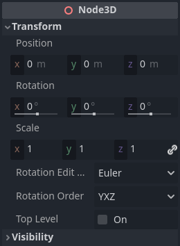

.. _doc_introduction_to_3d:

Introduction to 3D
==================

Creating a 3D game can be challenging. That extra Z coordinate makes
many of the common techniques that helped to make 2D games simpler no
longer work. To aid in this transition, it is worth mentioning that
Godot uses similar APIs for 2D and 3D. Most nodes are the same and
are present in both 2D and 3D versions. In fact, it is worth checking
the 3D platformer tutorial, or the 3D kinematic character tutorials,
which are almost identical to their 2D counterparts.

In 3D, math is a little more complex than in 2D, so also checking the
:ref:`doc_vector_math` entry in the wiki (which was especially created for game
developers, not mathematicians or engineers) will help pave the way for you
to develop 3D games efficiently.

Node3D node
~~~~~~~~~~~

:ref:`Node2D <class_Node2D>` is the base node for 2D.
:ref:`Control <class_Control>` is the base node for everything GUI.
Following this reasoning, the 3D engine uses the :ref:`Node3D <class_Node3D>`
node for everything 3D.

Node3Ds have a local transform, which is relative to the parent
node (as long as the parent node is also of **or inherits from** the type
Node3D). This transform can be accessed as a 4×3
:ref:`Transform3D <class_Transform3D>`, or as 3 :ref:`Vector3 <class_Vector3>`
members representing location, Euler rotation (X, Y and Z angles) and
scale.

3D content
~~~~~~~~~~

Unlike 2D, where loading image content and drawing is straightforward, 3D is a
little more difficult. The content needs to be created with special 3D tools
(also called Digital Content Creation tools, or DCCs) and exported to an
exchange file format to be imported in Godot. This is required since 3D formats
are not as standardized as images.

Manually authored models (using 3D modeling software)
-----------------------------------------------------

.. FIXME: Needs update to properly description Godot 3.x workflow
   (used to reference a non existing doc_importing_3d_meshes importer).

There are two pipelines to import 3D models in Godot. The first and most common
one is by :ref:`doc_importing_3d_scenes`, which allows you to import entire
scenes (exactly as they look in the 3D modeling software), including animation,
skeletal rigs, blend shapes, etc.

The second pipeline is by importing simple .OBJ files as mesh resources,
which can be then put inside a :ref:`MeshInstance3D <class_MeshInstance3D>`
node for display.

Generated geometry
------------------

It is possible to create custom geometry by using the
:ref:`ArrayMesh <class_ArrayMesh>` resource directly. Simply create your arrays
and use the :ref:`ArrayMesh.add_surface_from_arrays() <class_ArrayMesh_method_add_surface_from_arrays>`
function. A helper class is also available, :ref:`SurfaceTool <class_SurfaceTool>`,
which provides a more straightforward API and helpers for indexing,
generating normals, tangents, etc.

In any case, this method is meant for generating static geometry (models
that will not be updated often), as creating vertex arrays and
submitting them to the 3D API has a significant performance cost.

Immediate geometry
------------------

If, instead, you need to generate simple geometry that will be updated often,
Godot provides a special :ref:`ImmediateMesh <class_ImmediateMesh>` resource
that can be used in a :ref:`MeshInstance3D <class_MeshInstance3D>` node.
This provides an OpenGL 1.x-style immediate-mode API to create points, lines,
triangles, etc.

2D in 3D
--------

While Godot packs a powerful 2D engine, many types of games use 2D in a
3D environment. By using a fixed camera (either orthogonal or
perspective) that does not rotate, nodes such as
:ref:`Sprite3D <class_Sprite3D>` and
:ref:`AnimatedSprite3D <class_AnimatedSprite3D>`
can be used to create 2D games that take advantage of mixing with 3D
backgrounds, more realistic parallax, lighting/shadow effects, etc.

The disadvantage is, of course, that added complexity and reduced
performance in comparison to plain 2D, as well as the lack of reference
of working in pixels.

Environment
~~~~~~~~~~~

Besides editing a scene, it is often common to edit the environment.
Godot provides a :ref:`WorldEnvironment <class_WorldEnvironment>`
node that allows changing the background color, mode (as in, put a
skybox), and applying several types of built-in post-processing effects.
Environments can also be overridden in the Camera.

3D viewport
~~~~~~~~~~~

Editing 3D scenes is done in the 3D tab. This tab can be selected
manually, but it will be automatically enabled when a Node3D node is
selected.

.. image:: img/tuto_3d3.webp

Default 3D scene navigation controls are similar to Blender (aiming to
have some sort of consistency in the free software pipeline..), but
options are included to customize mouse buttons and behavior to be
similar to other tools in the Editor Settings:

.. image:: img/tuto_3d4.webp

Coordinate system
-----------------

Godot uses the `metric <https://en.wikipedia.org/wiki/Metric_system>`__
system for everything in 3D, with 1 unit being equal to 1 meter.
Physics and other areas are tuned for this scale. Therefore, attempting to use a
different scale is usually a bad idea (unless you know what you are doing).

When working with 3D assets, it's always best to work in the correct scale (set
the unit to metric in your 3D modeling software). Godot allows scaling
post-import and, while this works in most cases, in rare situations it may
introduce floating-point precision issues (and thus, glitches or artifacts) in
delicate areas such as rendering or physics. Make sure your artists always work
in the right scale!

The Y coordinate is used for "up". As for the horizontal X/Z axes, Godot uses a
**right-handed** coordinate system. This means that for most objects that need
alignment (such as lights or cameras), the Z axis is used as a "pointing
towards" direction. This convention roughly means that:

-  **X** is sides
-  **Y** is up/down
-  **Z** is front/back

See this chart for comparison with other 3D software:

.. figure:: img/introduction_to_3d_coordinate_systems.webp
   :align: center
   :alt: 3D coordinate systems comparison chart

   Image by `Freya Holmér <https://twitter.com/FreyaHolmer>`__

Space and manipulation gizmos
-----------------------------

Moving objects in the 3D view is done through the manipulator gizmos.
Each axis is represented by a color: Red, Green, Blue represent X, Y, Z
respectively. This convention applies to the grid and other gizmos too
(and also to the shader language, ordering of components for
Vector3, Color, etc.).

Some useful keybindings:

-  To snap placement or rotation, press :kbd:`Ctrl` while moving, scaling
   or rotating.
-  To center the view on the selected object, press :kbd:`F`.

Using Blender-style transform shortcuts
---------------------------------------

Since Godot 4.2, you can enable Blender-style shortcuts for translating,
rotating and scaling nodes. In Blender, these shortcuts are:

- :kbd:`G` for translating
- :kbd:`R` for rotating
- :kbd:`S` for scaling

After pressing a shortcut key while focusing on the 3D editor viewport,
move the mouse or enter a number to move the selected node(s) by the
specified amount in 3D units. You can constrain movement to a specific
axis by specifying the axis as a letter, then the distance (if entering a
value with the keyboard).

For instance, to move the selection upwards by 2.5 units, enter the
following sequence in order (Y+ is upwards in Godot):

:kbd:`G`-:kbd:`Y`-:kbd:`2`-:kbd:`.`-:kbd:`5`-:kbd:`Enter`

To use Blender-style transform shortcuts in Godot, go to the Editor Settings'
**Shortcuts** tab, then in the Spatial Editor section:

- Bind **Begin Translate Transformation** to :kbd:`G`.
- Bind **Begin Rotate Transformation** to :kbd:`R`.
- Bind **Begin Scale Transformation** to :kbd:`S`.
- Finally, unbind **Scale Mode** so that its shortcut won't conflict with
  **Begin Rotate Transformation**.

View menu
---------

The view options are controlled by the "View" menu in the viewport's toolbar.

You can hide the gizmos in the 3D view of the editor through this menu:

To hide a specific type of gizmos, you can toggle them off in the "View" menu.

preview environment and light
-----------------------------

By default, any 3D scene that doesn't have a :ref:`WorldEnvironment <class_WorldEnvironment>`
node, or a :ref:`DirectionalLight3D <class_DirectionalLight3D>`, will have
a preview turned on for what it's missing to light the scene.

The preview light and environment will only be visible in the scene while
in the editor. If you run the scene or export the project they will not
affect the scene.

The preview light and environment can be turned on or off from the top menu
by clicking on their respective icon, and the 3 dots dropdown menu next to
those icons can be used to adjust the properties of the preview environment
and light.

The same preview sun and environment is used for every scene in the same project,
So only make adjustments that would apply to all of the scenes you will need a preview
light and environment for.

Cameras
-------

No matter how many objects are placed in the 3D space, nothing will be
displayed unless a :ref:`Camera3D <class_Camera3D>` is
also added to the scene. Cameras can work in either orthogonal or
perspective projections:

Cameras are associated with (and only display to) a parent or grandparent
viewport. Since the root of the scene tree is a viewport, cameras will
display on it by default, but if sub-viewports (either as render target
or picture-in-picture) are desired, they need their own children cameras
to display.

.. image:: img/tuto_3d11.png

When dealing with multiple cameras, the following rules are enforced for
each viewport:

-  If no cameras are present in the scene tree, the first one that
   enters it will become the active camera. Further cameras entering the
   scene will be ignored (unless they are set as *current*).
-  If a camera has the "*current*" property set, it will be used
   regardless of any other camera in the scene. If the property is set,
   it will become active, replacing the previous camera.
-  If an active camera leaves the scene tree, the first camera in
   tree-order will take its place.

Lights
------

The background environment emits some ambient light which appears on surfaces.
Still, without any light sources placed in the scene, the scene will appear
quite dark unless the background environment is very bright.

Most outdoor scenes have a directional light (the sun or moon), while indoor
scenes typically have several positional lights (lamps, torches, …).
See :ref:`doc_lights_and_shadows` for more information on setting up lights in Godot.
