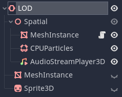
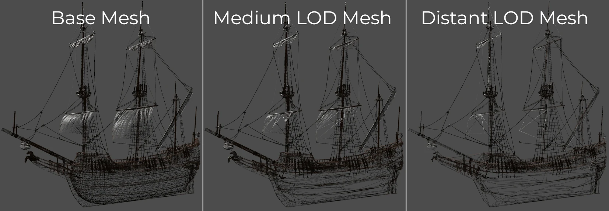

.. _doc_level_of_detail:

Level of Detail (LOD)
=====================

Level of detail (LOD) is one of the most important ways to optimize rendering
(and performance in general) in a 3D project, along with occlusion culling.

The LOD node
------------

The ``LOD`` node provides a simple way of automatically switching between visual
representations as the node gets closer or further from the
:ref:`Camera <class_Camera>`, in order to increase performance.

You might:

-  substitute lower poly count meshes
-  swap several separate meshes for a single approximate mesh
-  swap from a mesh to a billboard
-  turn off particle effects, animations, sounds, scripts according to distance
-  entirely remove visuals in the distance

The ``LOD`` node should be added as a parent to whatever you wish to use to show
the object, e.g. a :ref:`MeshInstance <class_MeshInstance>`. You can place
several :ref:`Spatial <class_Spatial>` derived nodes as children.

The ``LOD`` node will automatically hide and show Spatial children depending on
the distance from the ``Camera``.

.. tip::

    You can react to ``NOTIFICATION_VISIBILITY_CHANGED`` in scripts to detect
    when a node has been shown or hidden.
    
Children are shown in order with the first children shown when closest to the
``Camera``, and the latter children shown when further away.

You can determine the distance at which these swaps occur by setting the
**lod_range** property of ``Spatial``.

.. note::

    Children of the ``LOD`` node can in turn have any number of children, of
    any type. These grandchildren will inherit their visibility as the ``LOD``
    node operates.

One of the most common cases is to swap between high-poly and low-poly models.

   From most detailed (left) to least detailed (right), wireframe view

.. note::

    Godot 3.x does not currently generate decimated meshes for you.
    You are advised to generate several versions of a mesh in your
    modeling program (e.g. using the Decimate modifier in Blender).

