.. _doc_lights_and_shadows:

3D lights and shadows
=====================

Introduction
------------

Light sources emit light that mixes with the materials and produces a visible
result. Light can come from several types of sources in a scene:

- From the material itself, in the form of the emission color (though it does
  not affect nearby objects unless baked or screen-space indirect lighting is enabled).
- Light nodes: DirectionalLight3D, OmniLight3D and SpotLight3D.
- Ambient light in the :ref:`Environment <class_Environment>` or
  :ref:`doc_reflection_probes`.
- Global illumination (:ref:`LightmapGI <doc_using_lightmap_gi>`,
  :ref:`VoxelGI <doc_using_voxel_gi>` or :ref:`SDFGI <doc_using_sdfgi>`).

The emission color is a material property. You can read more about it
in the :ref:`doc_standard_material_3d` tutorial.

.. seealso::

    You can compare various types of lights in action using the
    `3D Lights and Shadows demo project <https://github.com/godotengine/godot-demo-projects/tree/master/3d/lights_and_shadows>`__.

Light nodes
-----------

There are three types of light nodes: :ref:`class_DirectionalLight3D`,
:ref:`class_OmniLight3D` and :ref:`class_SpotLight3D`. Let's take a look at the common
parameters for lights:

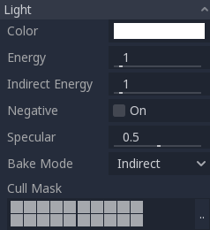

Each property has a specific function:

- **Color:** Base color for emitted light.
- **Energy:** Energy multiplier. This is useful for saturating lights or working with :ref:`doc_high_dynamic_range`.
- **Indirect Energy:** Secondary multiplier used with indirect light (light bounces). This works with :ref:`doc_using_lightmap_gi`, VoxelGI or SDFGI.
- **Volumetric Fog Energy:** Secondary multiplier used with volumetric fog. This only has an effect when volumetric fog is enabled.
- **Negative:** Light becomes subtractive instead of additive. It's sometimes useful to manually compensate some dark corners.
- **Specular:** Affects the intensity of the specular blob in objects affected by this light. At zero, this light becomes a pure diffuse light.
- **Bake Mode:** Sets the bake mode for the light. See :ref:`doc_using_lightmap_gi`.
- **Cull Mask:** Objects that are in the selected layers below will be affected by this light.
  Note that objects disabled via this cull mask will still cast shadows.
  If you don't want disabled objects to cast shadows, adjust the **Cast Shadow**
  property on the GeometryInstance3D to the desired value.

.. seealso::

    See :ref:`doc_physical_light_and_camera_units` if you wish to use real world
    units to configure your lights' intensity and color temperature.

Light number limits
-------------------

When using the Forward+ renderer, Godot uses a *clustering* approach for
real-time lighting. As many lights as desired can be added (as long as
performance allows). However, there's still a default limit of 512 *clustered
elements* that can be present in the current camera view. A clustered element is
an omni light, a spot light, a :ref:`decal <doc_using_decals>` or a
:ref:`reflection probe <doc_reflection_probes>`. This limit can be increased by
adjusting the **Rendering > Limits > Cluster Builder > Max Clustered Elements**
advanced project setting.

When using the Forward Mobile renderer, there is a limitation of 8 OmniLights +
8 SpotLights per mesh resource. There is also a limit of 256 OmniLights + 256
SpotLights that can be rendered in the current camera view. These limits
currently cannot be changed.

When using the Compatibility renderer, up to 8 OmniLights + 8 SpotLights can be
rendered per mesh resource. This limit can be increased in the advanced Project
Settings by adjusting **Rendering > Limits > OpenGL > Max Renderable Lights**
and/or **Rendering > Limits > OpenGL > Max Lights Per Object** at the cost of
performance and longer shader compilation times. The limit can also be decreased
to reduce shader compilation times and improve performance slightly.

With all rendering methods, up to 8 DirectionalLights can be visible at a time.
However, each additional DirectionalLight with shadows enabled will reduce the
effective shadow resolution of each DirectionalLight. This is because
directional shadow atlas is shared between all lights.

If the rendering limit is exceeded, lights will start popping in and out during
camera movement, which can be distracting. Enabling **Distance Fade** on light
nodes can help reduce this issue while also improving performance. Splitting
your meshes into smaller portions can also help, especially for level geometry
(which also improves culling efficiency).

If you need to render more lights than possible in a given rendering backend,
consider using :ref:`baked lightmaps <doc_using_lightmap_gi>` with lights' bake
mode set to **Static**. This allows lights to be fully baked, which also makes
them much faster to render. You can also use emissive materials with any
:ref:`global illumination <doc_introduction_to_global_illumination>` technique
as a replacement for light nodes that emit light over a large area.

Shadow mapping
--------------

Lights can optionally cast shadows. This gives them greater realism (light does
not reach occluded areas), but it can incur a bigger performance cost.
There is a list of generic shadow parameters, each also has a specific function:

- **Enabled:** Check to enable shadow mapping in this light.
- **Opacity:** Areas occluded are darkened by this opacity factor. Shadows are
  fully opaque by default, but this can be changed to make shadows translucent
  for a given light.
- **Bias:** When this parameter is too low, self-shadowing occurs. When too
  high, shadows separate from the casters. Tweak to what works best for you.
- **Normal Bias:** When this parameter is too low, self-shadowing occurs. When too
  high, shadows appear misaligned from the casters. Tweak to what works best for you.
- **Transmittance Bias:** When this parameter is too low, self-shadowing
  occurs on materials that have transmittance enabled. When too high, shadows
  will not affect materials that have transmittance enabled consistently. Tweak
  to what works best for you.
- **Reverse Cull Face:** Some scenes work better when shadow mapping is rendered
  with face-culling inverted.
- **Blur:** Multiplies the shadow blur radius for this light. This works with
  both traditional shadow mapping and contact-hardening shadows (lights with
  **Angular Distance** or **Size** greater than ``0.0``). Higher values result
  in softer shadows, which will also appear to be more temporally stable for
  moving objects. The downside of increasing shadow blur is that it will make
  the grainy pattern used for filtering more noticeable.
  See also :ref:`doc_lights_and_shadows_shadow_filter_mode`.

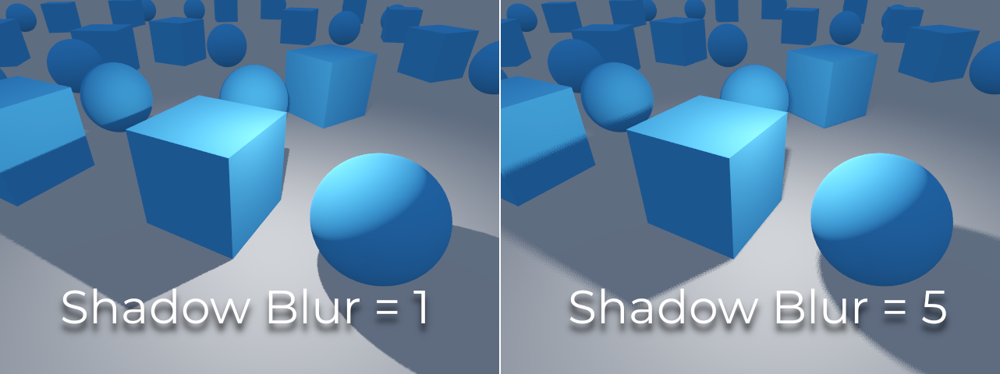

Tweaking shadow bias
^^^^^^^^^^^^^^^^^^^^

Below is an image of what tweaking bias looks like. Default values work for most
cases, but in general, it depends on the size and complexity of geometry.

If the **Shadow Bias** or **Shadow Normal Bias** is set too low for a given light,
the shadow will be "smeared" onto the objects. This will cause the light's
intended appearance to darken, and is called *shadow acne*:

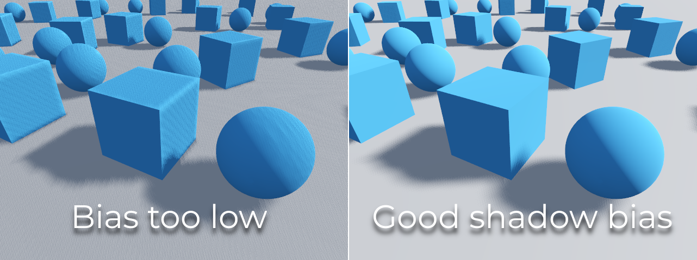

On the other hand, if the **Shadow Bias** or **Shadow Normal Bias** is set too
high for a given light, the shadow may appear to be disconnected from the
object. This is called *peter-panning*:

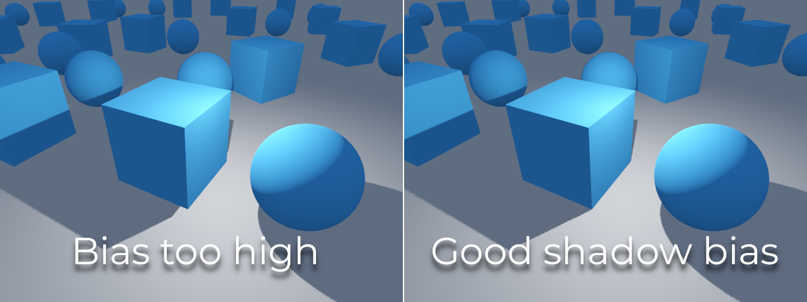

In general, increasing **Shadow Normal Bias** is preferred over increasing
**Shadow Bias**. Increasing **Shadow Normal Bias** does not cause as much
peter-panning as increasing **Shadow Bias**, but it can still resolve
most shadow acne issues efficiently. The downside of increasing **Shadow Normal
Bias** is that it can make shadows appear thinner for certain objects.

Any sort of bias issues can be fixed by
:ref:`increasing the shadow map resolution <doc_lights_and_shadows_balancing_performance_and_quality>`,
at the cost of decreased performance.

.. note::

    Tweaking shadow mapping settings is an art – there are no "one size fits
    all" settings. To achieve the best visuals, you may need to use different
    shadow bias values on a per-light basis.

**Note on Appearance Changes**: When enabling shadows on a light, be aware that the light's 
appearance might change compared to when it's rendered without shadows in the compatibility 
renderer. Due to limitations with older mobile devices, shadows are implemented using a multi-pass 
rendering approach so lights with shadows are rendered in sRGB space instead of linear space. 
This change in rendering space can sometimes drastically alter the light's appearance. To achieve a similar 
appearance to an unshadowed light, you may need to adjust the light's energy setting. 

Directional light
-----------------

This is the most common type of light and represents a light source very far
away (such as the sun). It is also the cheapest light to compute and should be
used whenever possible (although it's not the cheapest shadow-map to compute,
but more on that later).

Directional light models an infinite number of parallel light rays
covering the whole scene. The directional light node is represented by a big arrow which
indicates the direction of the light rays. However, the position of the node
does not affect the lighting at all and can be anywhere.

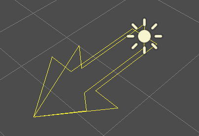

Every face whose front-side is hit by the light rays is lit, while the others
stay dark. Unlike most other light types, directional lights don't have specific
parameters.

The directional light also offers a **Angular Distance** property, which
determines the light's angular size in degrees. Increasing this above ``0.0``
will make shadows softer at greater distances from the caster, while also
affecting the sun's appearance in procedural sky materials. This is called a
*contact-hardening* shadow (also known as PCSS).

For reference, the angular distance of the Sun viewed from the Earth is
approximately ``0.5``. This kind of shadow is expensive, so check the
recommendations in :ref:`doc_lights_and_shadows_pcss_recommendations` if setting
this value above ``0.0`` on lights with shadows enabled.

Directional shadow mapping
^^^^^^^^^^^^^^^^^^^^^^^^^^

To compute shadow maps, the scene is rendered (only depth) from an orthogonal
point of view that covers the whole scene (or up to the max distance). There is,
however, a problem with this approach because objects closer to the camera
receive low-resolution shadows that may appear blocky.

To fix this, a technique named *Parallel Split Shadow Maps* (PSSM) is used.
This splits the view frustum in 2 or 4 areas. Each area gets its own shadow map.
This allows small areas close to the viewer to have the same shadow resolution
as a huge, far-away area. When shadows are enabled for DirectionalLight3D, the 
default shadow mode is PSSM with 4 splits. In scenarios where an object is large 
enough to appear in all four splits, it results in increased draw calls. Specifically, 
such an object will be rendered five times in total: once for each of the four shadow 
splits and once for the final scene rendering. This can impact performance, understanding
this behavior is important for optimizing your scene and managing performance expectations.

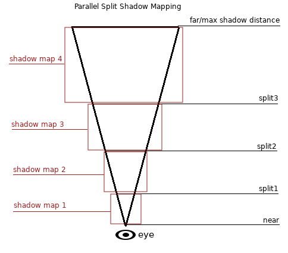

With this, shadows become more detailed:

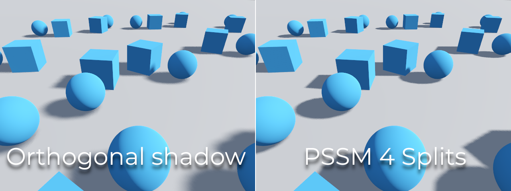

To control PSSM, a number of parameters are exposed:

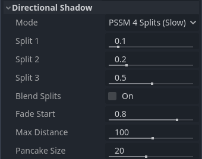

Each split distance is controlled relative to the camera far (or shadow
**Max Distance** if greater than ``0.0``). ``0.0`` is the eye position and
``1.0`` is where the shadow ends at a distance. Splits are in-between.
Default values generally work well, but tweaking the first split a bit is common
to give more detail to close objects (like a character in a third-person game).

Always make sure to set a shadow **Max Distance** according to what the scene
needs. A lower maximum distance will result in better-looking shadows and better
performance, as fewer objects will need to be included in shadow rendering. You
can also adjust **Fade Start** to control how aggressive the shadow fade-out
should be at a distance. For scenes where the **Max Distance** fully covers the
scene at any given camera position, you can increase **Fade Start** to ``1.0``
to prevent the shadow from fading at a distance. This should not be done in
scenes where **Max Distance** doesn't fully cover the scene, as the shadow will
appear to be suddenly cut off at a distance.

Sometimes, the transition between a split and the next can look bad. To fix
this, the **Blend Splits** option can be turned on, which sacrifices detail and
performance in exchange for smoother transitions:

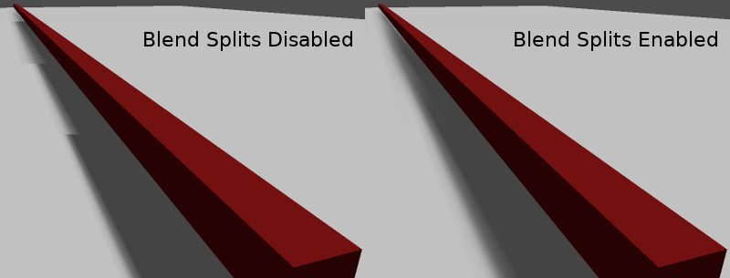

The **Shadow > Normal Bias** parameter can be used to fix special cases of
self-shadowing when objects are perpendicular to the light. The only downside is
that it makes the shadow a bit thinner. Consider increasing **Shadow > Normal
Bias** before increasing **Shadow > Bias** in most situations.

Lastly, **Pancake Size** is a property that can be adjusted to fix missing
shadows when using large objects with unsubdivided meshes. Only change this
value if you notice missing shadows that are not related to shadow biasing
issues.

Omni light
----------

Omni light is a point source that emits light spherically in all directions up to a given
radius.

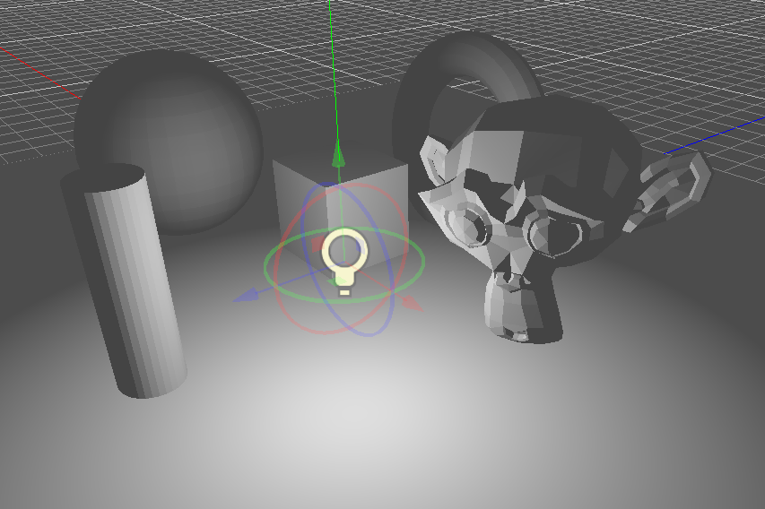

In real life, light attenuation is an inverse function, which means omni lights don't have a radius.
This is a problem because it means computing several omni lights would become demanding.

To solve this, a **Range** parameter is introduced together with an attenuation function.

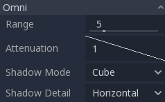

These two parameters allow tweaking how this works visually in order to find aesthetically pleasing results.

.. image:: img/light_attenuation.png

A **Size** parameter is also available in OmniLight3D. Increasing this value
will make the light fade out slower and shadows appear blurrier when far away
from the caster. This can be used to simulate area lights to an extent. This is
called a *contact-hardening* shadow (also known as PCSS). This kind of shadow is
expensive, so check the recommendations in
:ref:`doc_lights_and_shadows_pcss_recommendations` if setting this value above
``0.0`` on lights with shadows enabled.

.. image:: img/lights_and_shadows_pcss.webp

Omni shadow mapping
^^^^^^^^^^^^^^^^^^^

Omni light shadow mapping is relatively straightforward. The main issue that
needs to be considered is the algorithm used to render it.

Omni Shadows can be rendered as either **Dual Paraboloid** or **Cube** mapped.
**Dual Parabolid** renders quickly, but can cause deformations, while **Cube**
is more correct, but slower. The default is **Cube**, but consider changing it
to **Dual Parabolid** for lights where it doesn't make much of a visual
difference.

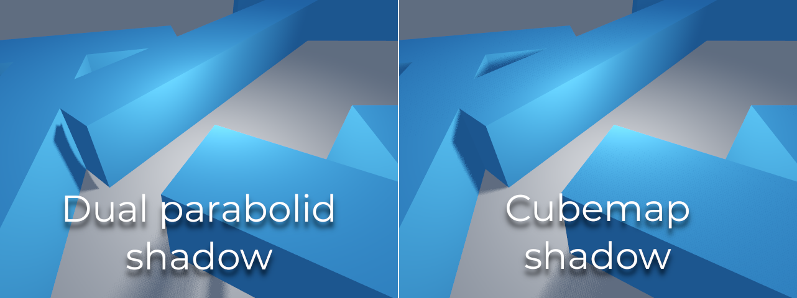

If the objects being rendered are mostly irregular and subdivided, Dual
Paraboloid is usually enough. In any case, as these shadows are cached in a
shadow atlas (more on that at the end), it may not make a difference in
performance for most scenes.

Omni lights with shadows enabled can make use of projectors. The projector
texture will *multiply* the light's color by the color at a given point on the
texture. As a result, lights will usually appear to be darker once a projector
texture is assigned; you can increase **Energy** to compensate for this.

Omni light projector textures require a special 360° panorama mapping, similar
to :ref:`class_PanoramaSkyMaterial` textures.

With the projector texture below, the following result is obtained:

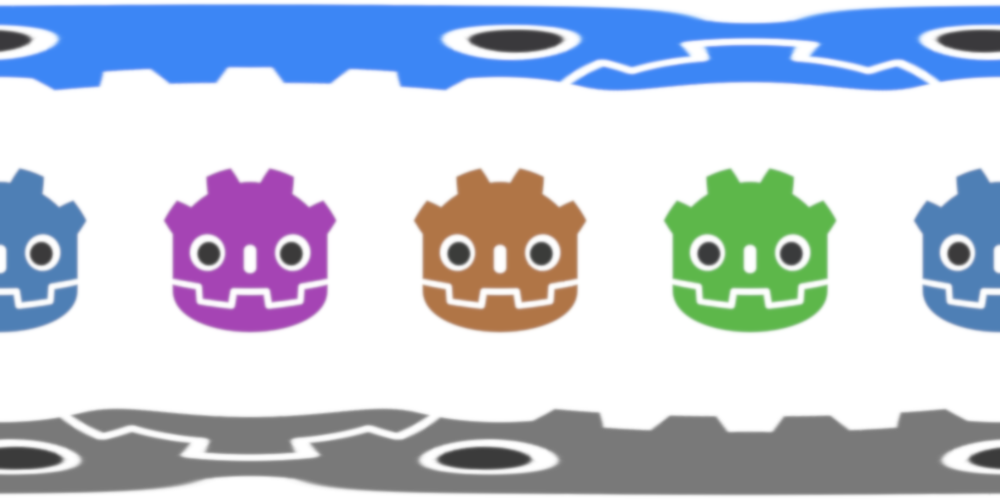

.. image:: img/lights_and_shadows_omni_projector.webp

.. tip::

    If you've acquired omni projectors in the form of cubemap images, you can use
    `this web-based conversion tool <https://danilw.github.io/GLSL-howto/cubemap_to_panorama_js/cubemap_to_panorama.html>`__
    to convert them to a single panorama image.

Spot light
----------

Spot lights are similar to omni lights, except they emit light only into a cone
(or "cutoff"). They are useful to simulate flashlights,
car lights, reflectors, spots, etc. This type of light is also attenuated towards the
opposite direction it points to.

Spot lights share the same **Range**, **Attenuation** and **Size** as OmniLight3D,
and add two extra parameters:

- **Angle:** The aperture angle of the light.
- **Angle Attenuation:** The cone attenuation, which helps soften the cone borders.

Spot shadow mapping
^^^^^^^^^^^^^^^^^^^

Spots feature the same parameters as omni lights for shadow mapping. Rendering
spot shadow maps is significantly faster compared to omni lights, as only one
shadow texture needs to be rendered (instead of rendering 6 faces, or 2 in dual
parabolid mode).

Spot lights with shadows enabled can make use of projectors. The projector
texture will *multiply* the light's color by the color at a given point on the
texture. As a result, lights will usually appear to be darker once a projector
texture is assigned; you can increase **Energy** to compensate for this.

Unlike omni light projectors, a spot light projector texture doesn't need to
follow a special format to look correct. It will be mapped in a way similar to a
:ref:`decal <doc_using_decals>`.

With the projector texture below, the following result is obtained:

.. image:: img/lights_and_shadows_spot_projector.webp

.. note::

    Spot lights with wide angles will have lower-quality shadows than spot
    lights with narrow angles, as the shadow map is spread over a larger
    surface. At angles wider than 89 degrees, spot light shadows will stop
    working entirely. If you need shadows for wider lights, use an omni light
    instead.

.. _doc_lights_and_shadows_shadow_atlas:

Shadow atlas
------------

Unlike Directional lights, which have their own shadow texture, omni and spot
lights are assigned to slots of a shadow atlas. This atlas can be configured in
the advanced Project Settings (**Rendering > Lights And Shadows > Positional Shadow**).

The resolution applies to the whole shadow atlas. This atlas is divided into four quadrants:

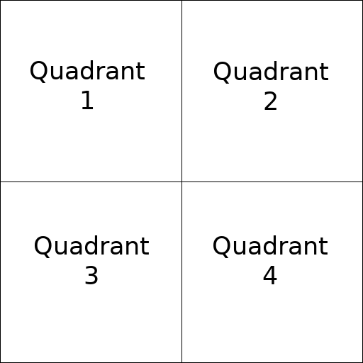

Each quadrant can be subdivided to allocate any number of shadow maps; the following is the default subdivision:

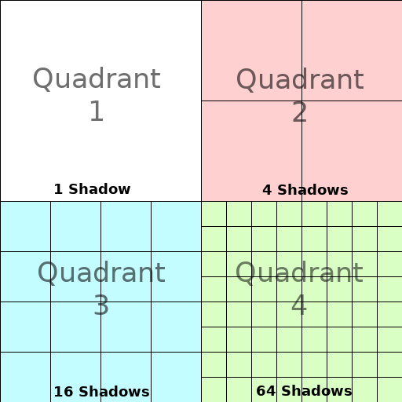

The shadow atlas allocates space as follows:

- The biggest shadow map size (when no subdivision is used) represents a light the size of the screen (or bigger).
- Subdivisions (smaller maps) represent shadows for lights that are further away from view and proportionally smaller.

Every frame, the following procedure is performed for all lights:

1. Check if the light is on a slot of the right size. If not, re-render it and move it to a larger/smaller slot.
2. Check if any object affecting the shadow map has changed. If it did, re-render the light.
3. If neither of the above has happened, nothing is done, and the shadow is left untouched.

If the slots in a quadrant are full, lights are pushed back to smaller slots,
depending on size and distance. If all slots in all quadrants are full, some
lights will not be able to render shadows even if shadows are enabled on them.

The default shadow allocation strategy allows rendering up to 88 lights with
shadows enabled in the camera frustum (4 + 4 + 16 + 64):

1. The first and most detailed quadrant can store 4 shadows.
2. The second quadrant can store 4 other shadows.
3. The third quadrant can store 16 shadows, with less detail.
4. The fourth and least detailed quadrant can store 64 shadows, with even less detail.

Using a higher number of shadows per quadrant allows supporting a greater amount
of total lights with shadows enabled, while also improving performance (as
shadows will be rendered at a lower resolution for each light). However,
increasing the number of shadows per quadrant comes at the cost of lower shadow
quality.

In some cases, you may want to use a different allocation strategy. For example,
in a top-down game where all lights are around the same size, you may want to
set all quadrants to have the same subdivision so that all lights have shadows
of similar quality level.

.. _doc_lights_and_shadows_balancing_performance_and_quality:

Balancing performance and quality
---------------------------------

Shadow rendering is a critical topic in 3D rendering performance. It's important
to make the right choices here to avoid creating bottlenecks.

Directional shadow quality settings can be changed at run-time by calling the
appropriate :ref:`class_RenderingServer` methods.

Positional (omni/spot) shadow quality settings can be changed at run-time on the
root :ref:`class_Viewport`.

Shadow map size
^^^^^^^^^^^^^^^

High shadow resolutions result in sharper shadows, but at a significant
performance cost. It should also be noted that *sharper shadows are not always
more realistic*. In most cases, this should be kept at its default value of
``4096`` or decreased to ``2048`` for low-end GPUs.

If positional shadows become too blurry after decreasing the shadow map size,
you can counteract this by adjusting the
:ref:`shadow atlas <doc_lights_and_shadows_shadow_atlas>` quadrants to contain
fewer shadows. This will allow each shadow to be rendered at a higher resolution.

.. _doc_lights_and_shadows_shadow_filter_mode:

Shadow filter mode
^^^^^^^^^^^^^^^^^^

Several shadow map quality settings can be chosen here. The default **Soft Low**
is a good balance between performance and quality for scenes with detailed
textures, as the texture detail will help make the dithering pattern less noticeable.

However, in projects with less detailed textures, the shadow dithering pattern
may be more visible. To hide this pattern, you can either enable
:ref:`doc_3d_antialiasing_taa`, :ref:`doc_3d_antialiasing_fsr2`,
:ref:`doc_3d_antialiasing_fxaa`, or increase the shadow filter quality to
**Soft Medium** or higher.

The **Soft Very Low** setting will automatically decrease shadow blur to make
artifacts from the low sample count less visible. Conversely, the **Soft High**
and **Soft Ultra** settings will automatically increase shadow blur to better
make use of the increased sample count.

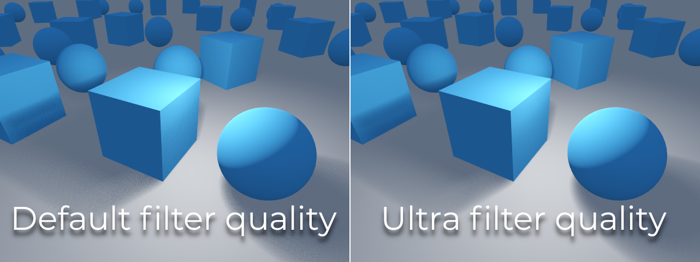

16-bits versus 32-bit
^^^^^^^^^^^^^^^^^^^^^

By default, Godot uses 16-bit depth textures for shadow map rendering. This is
recommended in most cases as it performs better without a noticeable difference
in quality.

If **16 Bits** is disabled, 32-bit depth textures will be used instead. This
can result in less artifacting in large scenes and large lights with shadows
enabled. However, the difference is often barely visible, yet this can have a
significant performance cost.

Light/shadow distance fade
^^^^^^^^^^^^^^^^^^^^^^^^^^

OmniLight3D and SpotLight3D offer several properties to hide distant lights.
This can improve performance significantly in large scenes with dozens of lights
or more.

- **Enabled:** Controls whether distance fade (a form of :abbr:`LOD (Level of Detail)`)
  is enabled. The light will fade out over **Begin + Length**, after which it
  will be culled and not sent to the shader at all. Use this to reduce the number
  of active lights in a scene and thus improve performance.
- **Begin:** The distance from the camera at which the light begins to fade away
  (in 3D units).
- **Shadow:** The distance from the camera at which the shadow begins to fade away
  (in 3D units). This can be used to fade out shadows sooner compared to the light,
  further improving performance. Only available if shadows are enabled for the light.
- **Length:** The distance over which the light and shadow fades (in 3D units).
  The light becomes slowly more transparent over this distance and is completely
  invisible at the end. Higher values result in a smoother fade-out transition,
  which is more suited when the camera moves fast.

.. _doc_lights_and_shadows_pcss_recommendations:

PCSS recommendations
^^^^^^^^^^^^^^^^^^^^

Percentage-closer soft shadows (PCSS) provide a more realistic shadow mapping
appearance, with the penumbra size varying depending on the distance between the
caster and the surface receiving the shadow. This comes at a high performance
cost, especially for directional lights.

To avoid performance issues, it's recommended to:

- Only use a handful of lights with PCSS shadows enabled at a given time. The
  effect is generally most visible on large, bright lights. Secondary light
  sources that are more faint usually don't benefit much from using PCSS
  shadows.
- Provide a setting for users to disable PCSS shadows. On directional lights,
  this can be done by setting the DirectionalLight3D's
  ``light_angular_distance`` property to ``0.0`` in a script. On positional
  lights, this can be done by setting the OmniLight3D or SpotLight3D's
  ``light_size`` property to ``0.0`` in a script.

Projector filter mode
^^^^^^^^^^^^^^^^^^^^^

The way projectors are rendered also has an impact on performance. The
**Rendering > Textures > Light Projectors > Filter** advanced project setting
lets you control how projector textures should be filtered. **Nearest/Linear** do
not use mipmaps, which makes them faster to render. However, projectors will
look grainy at distance. **Nearest/Linear Mipmaps** will look smoother at a
distance, but projectors will look blurry when viewed from oblique angles. This
can be resolved by using **Nearest/Linear Mipmaps Anisotropic**, which is the
highest-quality mode but also the most expensive.

If your project has a pixel art style, consider setting the filter to one of the
**Nearest** values so that projectors use nearest-neighbor filtering. Otherwise,
stick to **Linear**.
