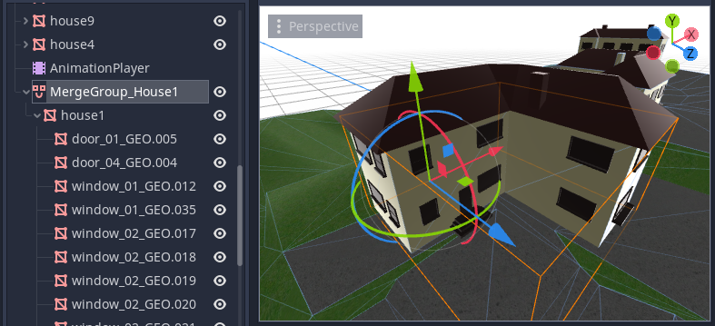
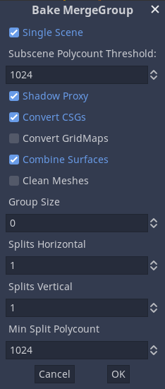

.. _doc_merge_groups:

MergeGroups
===========

The ``MergeGroup`` node allows the user to merge similar meshes so that they can
be grouped into a smaller number of nodes, and render using a single draw call
(per :ref:`Material <class_Material>`). This can greatly increase performance when
used with care.

Explanation
-----------

Usually individual meshes in Godot are represented by their own
:ref:`VisualInstance <class_VisualInstance>` in the
:ref:`SceneTree <class_SceneTree>`, such as :ref:`MeshInstance <class_MeshInstance>`.
These:

-  Move independently
-  Cull independently
-  Render individually

In terms of performance however, each ``VisualInstance`` adds a cost, both in
terms of management, and in terms of rendering. Each mesh (and each surface on a
``MeshInstance`` is rendered as an individual mesh) will require an expensive
draw call to the graphics API, and often incur expensive rendering state changes.

If instead we can identify groups of meshes that could be potentially be
rendered together, and merge them ahead of time (either at design time, or
during level load), this can potentially lighten the load on the CPU and GPU,
and increase frame rates.

The merging trade-off
^^^^^^^^^^^^^^^^^^^^^

Lowering draw calls and reducing state changes tends to increase performance.
However, merged meshes are culled as a unit, and therefore if any part of the
merged mesh is visible in the view frustum, the cost of rendering all parts of
the mesh are incurred. For this reason it is recommended that you evaluate
performance both before and after merging, in order to find the best balance in
each case.

.. tip::
    Remember that the bottlenecks may be different on different hardware.
    Be sure to test on the lowest-end platforms you're targeting for your
    project, especially mobile devices and integrated graphics.

Requirements
------------

There are some requirements for any group of meshes to be merged.

The most important requirement is that the source meshes must not move in
relation to each other. They must be either be completely static (non-moving)
or move together only as a single unit. This is because once several meshes are
merged into one, the relative transforms of the source meshes cannot change,
the transforms are baked into the new geometry.

The simplest candidate for merging is static level geometry, such as walls,
floors, tables etc. But groups of meshes that move "as one" are also good
candidates. Examples might be a pirate ship, or spacecraft.

Using MergeGroups
-----------------

After adding a ``MergeGroup`` node into your ``SceneTree``, move all the
VisualInstances you want to be merged so that they are parented by the
``MergeGroup`` (either as children, or grandchildren). By default, if you now
run the scene, the engine will automatically merge suitable meshes as the
``MergeGroup`` enters the ``SceneTree``.

You can change the transform of the ``MergeGroup`` at runtime, and the whole
group will move as a unit (``MergeGroup`` is derived from
:ref:`Spatial <class_Spatial>`, so can be manipulated in all the regular ways,
such as changing transform or visibility).

Mesh similarity
---------------

It is important to note that not all meshes (or more accurately, mesh surfaces,
because merging takes place at the level of mesh surfaces) can be merged
together. There are strict limitations for the mesh surfaces to match.

All the following properties must match for merging to take place:

-  Material
-  Shadow casting settings
-  Visibility
-  Layer mask
-  Portal settings
-  Cull margin
-  Lightmap settings

Usually this means only multiple instances of the same mesh will be merged (such
as a group of walls), but similar variations of mesh (e.g. different sized
tables) can sometimes be merged. Additionally, if you reuse materials (using
e.g. a "wood" material in several different meshes), these can often be merged.

Exceptions
----------

When you place a hierarchy of nodes underneath a ``MergeGroup``, such as a
pirate ship, there may be exceptions - meshes that you *do not* want merged.
This may be because, for instance, you may want them to move independently of
the ``MergeGroup``. An example might be a steering wheel, or sail.

Godot allows you fine control over exactly which nodes should be considered for
merging, via the ``merging_mode`` property which is present in the inspector
for every ``Spatial``, inside the ``Misc`` tab.

Merging modes:

-  ``Inherit`` - Inherit the setting from the parent. The default for the scene root node is ``On``.
-  ``On`` - Change the mode of the node (and any inheriting children) to allow merging.
-  ``Off`` - Change the mode of the node (and any inheriting children) to disallow merging.

This means that if you, e.g. set the mode of a steering wheel to ``Off``, it
will not be considered for merging, and neither will any children or
grandchildren of the steering wheel (unless one of them explicitly reactivates
merging with an ``On`` ``merge_mode``).

Ways to use MergeGroups
-----------------------

There are three ways to use MergeGroups:

AutoMerge
^^^^^^^^^

The ``MergeGroup`` will attempt to merge any descendent merges as it enters the
``SceneTree``.
This is the simplest method, and the best introduction to merging.

Baking in the Editor
^^^^^^^^^^^^^^^^^^^^

When the ``MergeGroup`` is selected in the editor, a new ``bake`` button should
appear in the toolbar. This allows you to bake the entire merged scene out to a
file (.tscn (text scene) or .scn (binary scene)) at *design time* rather than at
*runtime*. This can be used creatively to build sensible composite objects which
are later used to compose a game level (this general approach is often known as
"kitbashing").

Additionally, baking in advance offers a great way to preview what will happen
when merging at runtime. It allows you to open the merged scene, and see which
meshes were successfully merged, and which were problematic.

Pros
~~~~

-  Allows you easily see the results of merging
-  Allows you to further build levels using these merged scenes
-  No time is taken by the merging process at runtime

Cons
~~~~

-  Merged scenes typically require substantially more storage than the original meshes
-  The size of your exported game will likely increase
-  Larger merged scenes may take longer to load
-  Larger merged scenes may take up more RAM at runtime, especially on the GPU

If you merge, e.g. 10 boxes, the merged scene will have to store 10 times as
much geometry data, as the polygons are duplicated. More storage means your
exported game will be larger, the data will take longer to load, and consume
more RAM at runtime. For this reason, baking in advance tends to be more
practical with low poly meshes and art styles.

.. tip::
    Due to the increased storage requirements, it is recommended that, wherever possible,
    you bake scenes in binary format (``.scn``) rather than text (``.tscn``).
    This is because binary scenes are much more compact in terms of storage,
    while also being faster to load and save.

Manually at runtime
^^^^^^^^^^^^^^^^^^^

If the ``automerge`` property of a ``MergeGroup`` is disabled, then the node
will do nothing at runtime until you call its ``merge_meshes()`` function.
Triggering merging manually in this way has two major use cases:

1. Procedural levels. If you place objects (e.g. trees, boxes) at runtime using
   script, rather than placing them at design time, then you want a way to *delay*
   merging until after your placement is complete. Manually calling
   ``merge_meshes()`` allows this.
2. Merging parameters. These can be set via the ``MergeGroup::set_param()`` and
   ``MergeGroup::set_param_enabled()`` functions, prior to calling
   ``merge_meshes()``.

Merging parameters
------------------

Although the default operation of the ``MergeGroup`` works well in many
circumstances, there are a number of parameters which can be altered prior to
merging in order to access more advanced features. These can be set via the
``MergeGroup::set_param()`` functions, however the easiest way to visualize them
is via the ``bake`` method, which displays a dialog allowing you to modify
parameters. These are described in detail in the documentation for
``MergeGroup``.

Merging by locality - grouping and splitting
--------------------------------------------

When merging large numbers of meshes across a large map, sometimes the merging
goes too far, and results in a huge mesh that is too difficult to cull (as part
is always in the view frustum).

For example if you merge every tree in a forest, regardless of your viewpoint,
the whole forest will be rendered. Although rendering each tree individually
would be inefficient, rendering the whole forest in all cases is also
inefficient, but in a different way.

You may think instead to create several ``MergeGroups`` spread across the
forest, and only merge the trees in the local area. This would create an ideal
balance between reduced drawcalls, but still allowing broad scale culling to
take effect. The downside is that this kind of thing could be extremely labour
intensive in terms of scene design.

For this reason, ``MergeGroup`` has built in functionality for helping deal with
this problem automatically.

.. note::
    Grouping and splitting is considered advanced, so is only available via the
    manual method (setting parameters and calling ``merge_meshes()`` explicitly),
    or via the bake method.

Grouping
^^^^^^^^

One of the simplest ways to get the advantages of merging without the
disadvantages of loss of culling resolution is grouping. The ``group_size``
parameter defaults to zero, which indicates that all suitable meshes be merged.
But if you set ``group_size`` to e.g. 2, then only the closest pairs of meshes
will be merged.

If you have 10 trees, it will try to merge 5 pairs of trees, with each pair
being as close together as possible (so that they can be culled efficiently).
This same principle works even in a forest of 1,000 trees.

Splitting
^^^^^^^^^

The alternative approach to grouping is splitting. Splitting takes place as a
post-step, *after* all the meshes have been merged.

Following our forest example, if we assume our 1,000 tree forest has been merged
into 1 huge mesh, splitting allows us to specify a 3D grid (with a horizontal
number of splits and vertical number of splits) and the ``MergeGroup`` will
attempt to split the large mesh into smaller ones more suitable for culling.

For example, with 5 horizontal splits and 1 vertical split we should get 25
final meshes (5 x 5 x 1) which should give us enough resolution for some decent
culling for our forest.

.. note::
    The reason for allowing separate horizontal and vertical splits is that
    many games are based on flat ground, where horizontal splits may be more
    important than vertical. Increasing vertical splits may be counter-productive.
.. tip::
    Splitting can make a lot of sense if you are building a world with voxels.

Other functionality
^^^^^^^^^^^^^^^^^^^

Also via the ``MergeGroup`` parameters, ``CSG`` nodes (e.g. :ref:`CSGBox <class_CSGBox>`)
and :ref:`GridMap <class_GridMap>` nodes can optionally be converted to a regular
:ref:`MeshInstance <class_MeshInstance>`. This allows them to be merged like any other mesh. 
