.. _doc_mesh_generation_with_heightmap_and_shaders:

Mesh generation with heightmap and shaders
==========================================

Introduction
------------

This tutorial will help you to use Godot shaders to deform a plane
mesh so it appears like a basic terrain. Remember that this solution
has pros and cons.

Pros:

-  Pretty easy to do.
-  This approach allows computation of LOD terrains.
-  The heightmap can be used in Godot to create a normal map.

Cons:

-  The Vertex Shader can't re-compute normals of the faces. Thus, if
   your mesh is not static, this method will **not** work with shaded
   materials.
-  This tutorial uses a plane mesh imported from Blender to Godot
   Engine. Godot is able to create meshes as well.

See this tutorial as an introduction, not a method that you should
employ in your games, except if you intend to do LOD. Otherwise, this is
probably not the best way.

However, let's first create a heightmap,or a 2D representation of the terrain.
To do this, I'll use GIMP, but you can use any image editor you like.

The heightmap
-------------

We will use a few functions of GIMP image editor to produce a simple
heightmap. Start GIMP and create a square image of 512x512 pixels.

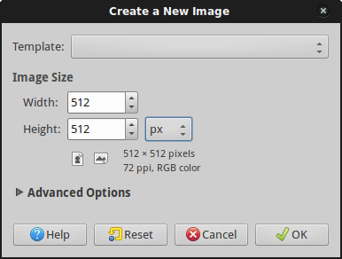

You are now in front of a new, blank, square image.

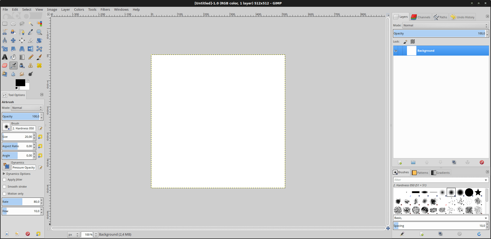

Then, use a filter to render some clouds on this new image.

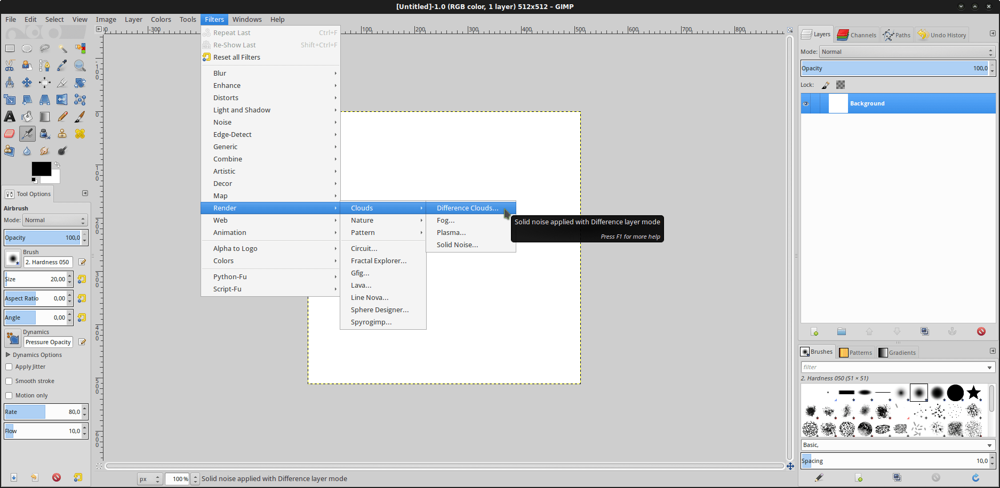

Parameter this filter to whatever you want. A white pixel corresponds
to the highest point of the heightmap, a black pixel corresponds to
the lowest one. So, darker regions are valleys and brighter are
mountains. If you want, you can check "tileable" to render a heightmap
that can be cloned and tiled close together with another one. X and Y
size don't matter a lot as long as they are big enough to provide a
decent ground. A value of 4.0 or 5.0 for both is nice. Click on the
"New Seed" button to roll a dice and GIMP will create a new random
heightmap. Once you are happy with the result, click "OK".

.. image:: img/4_GIMP_Clouds.png

You can continue to edit your image if you wish. For our example,
let's keep the heightmap as is, and let's export it to a PNG file, say
"heightmap.png". Save it in your Godot project folder.

The plane mesh
--------------

Now, we will need a plane mesh to import in Godot. Let's run Blender.

.. image:: img/5_Blender.png

Remove the start cube mesh, then add a new plane to the scene.

.. image:: img/6_Blender_CreatePlane.png

Zoom a bit, then switch to Edit mode (Tab key) and in the Tools
buttongroup at the left, hit "Subdivide" 5 or 6 times.

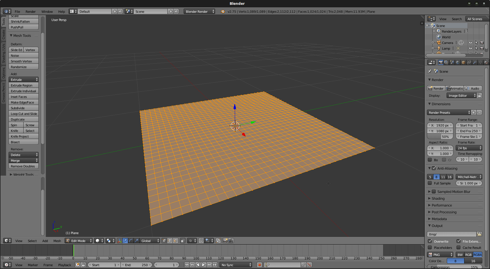

Your mesh is now subdivided, which means we added vertices to the
plane mesh that we will later be able to move. Job's not finished yet:
in order to texture this mesh a proper UV map is necessary. Currently,
the default UV map contains only the 4 corner vertices we had at the
beginning. However, we now have more, and we want to be able to
texture over the whole mesh correctly.

If all the vertices of your mesh are not selected, select them all
(hit "A"). They must appear orange, not black. Then, in the
Shading/UVs button group to the left, click the "Unwrap" button (or
simply hit "U") and select "Smart UV Project". Keep the default
options and hit "Ok".

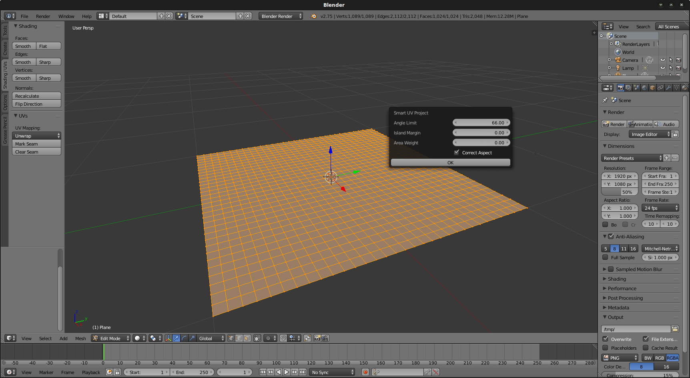

Now, we need to switch our view to "UV/Image editor".

.. image:: img/9_Blender_UV_editor.png

Select all the vertices again ("A") then in the UV menu, select
"Export UV Layout".

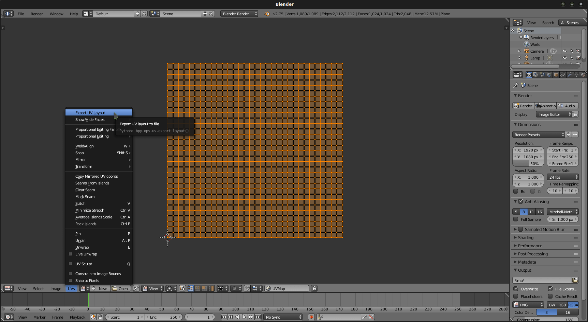

Export the layout as a PNG file. Name it "plane.png" and save it in
your Godot project folder. Now, let's export our mesh as an OBJ file.
Top of the screen, click "File/Export/Wavefront (obj)". Save your
object as "plane.obj" in your Godot project folder.

Shader magic
------------

Let's now open Godot Editor.

Create a new project in the folder you previously created and name it
what you want.

.. image:: img/11_Godot.png

In our default scene (3D), create a root node "Spatial".

Create a MeshInstance node as a child of the node we just created. 
Then, load the Mesh selecting "Load" and then our "plane.obj" file.

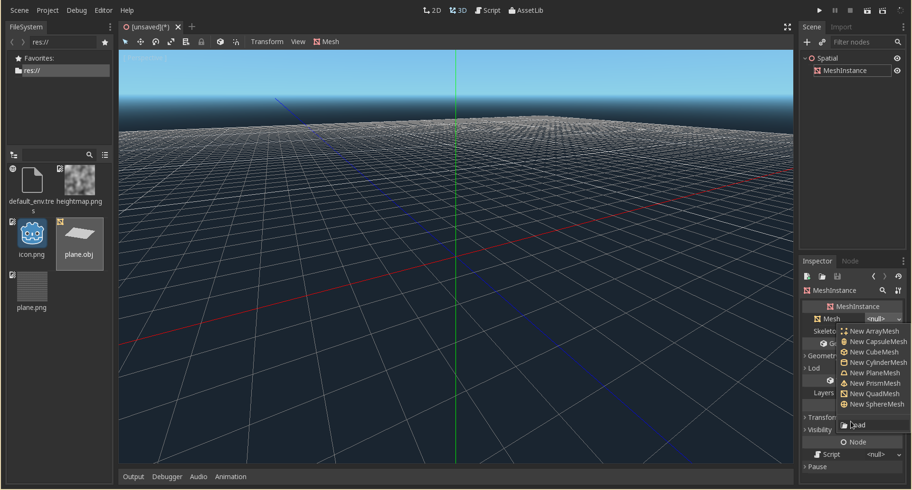

Great! Our plane is now rendered in the 3D view.

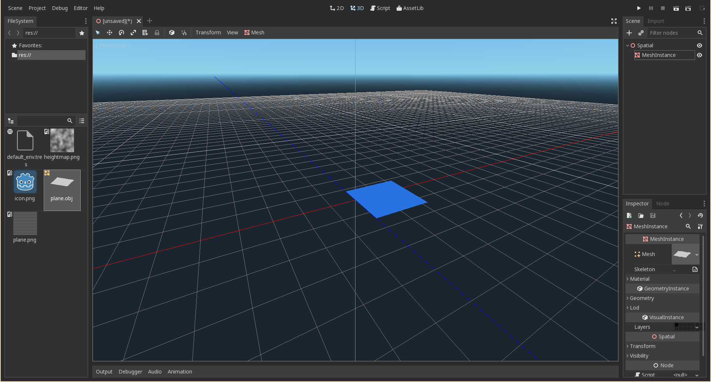

It is time to add some shader stuff. In the Inspector, in the
"Material" line, add a "New ShaderMaterial". Edit it by
clicking it and then selecting the "Edit" option.

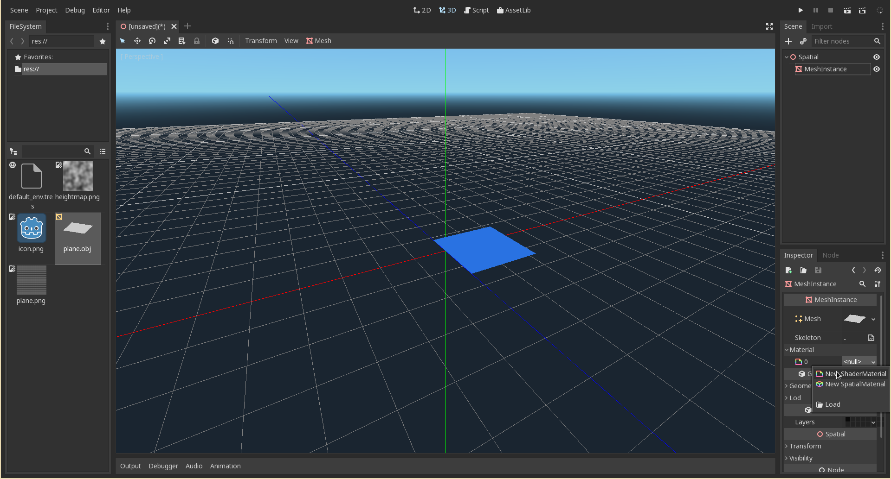

We need now to create the actual shader. On the Inspector,
select the "Shader" line and click on "New Shader".

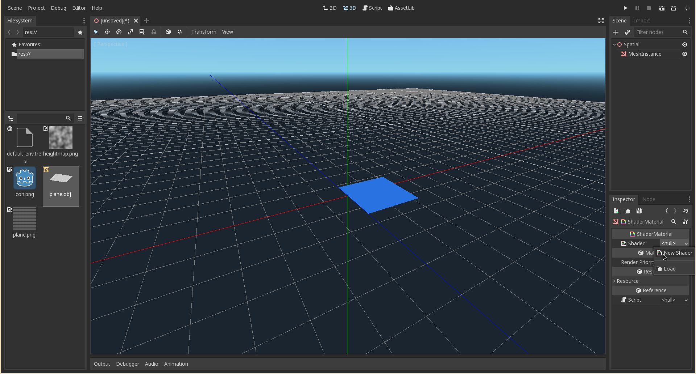

Edit it by clicking the "Edit" option just like we did before. The Shader
editor opens.

.. image:: img/18_Godot_ShaderEditorOpened.png

Let's start writing our shader. If you don't know how to use shaders in Godot 
you can check the :ref:`doc_shading_language` page.

Let's start with the Fragment part. 
This one is used to texture the plane using an image.
For this example, we will texture it with the heightmap image itself,
so we'll actually see mountains as brighter regions and canyons as
darker regions. Use this code:

::

    shader_type spatial;
    render_mode unshaded;
    
    uniform sampler2D source;
    
    void fragment() {
        ALBEDO = texture(source, UV).rgb;
    }

First, we set the shader type as ``spatial`` (for 3D). The
``render_mode unshaded`` line makes our MeshInstance be unaffected
by the lighting in our world. It doesn't matter since it is a
greyscale image. We take a parameter (``uniform``) as a ``sampler2D``,
which will be the texture of our heightmap.

Then, we set the color of every pixel of the image given by
``texture(source, UV).rgb`` setting it to the ALBEDO variable. 
Remember that the ``UV`` variable is a shader variable that returns
the 2D position of the pixel in the texture image, according to the
vertex we are currently dealing with. That is the use of the UV Layout 
we made before.

However, the plane is displayed white! This is because we didn't set
the texture file and the color to use.

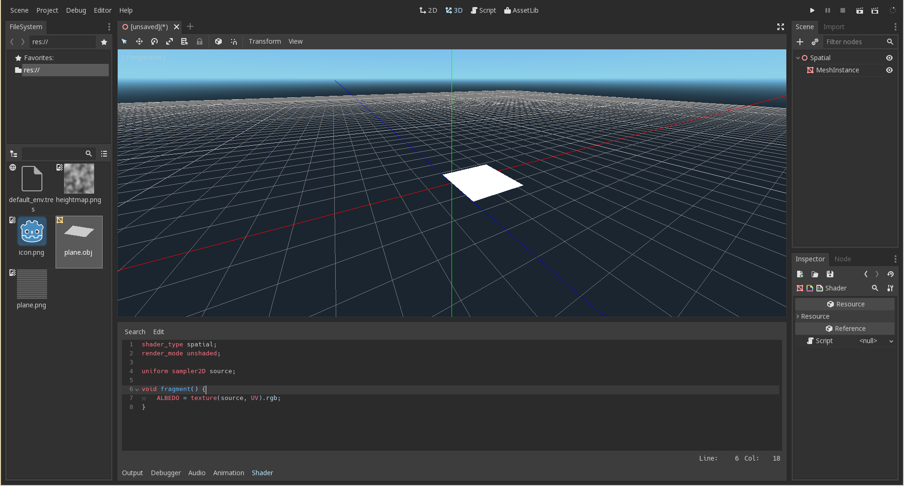

In the Inspector, click the back arrow to get back to the
ShaderMaterial. This is where you want to set the texture and the
color. Click the "Shader Param" line, in "Source", click "Load" 
and select the texture file "heightmap.png". Now you will see
our heightmap.

.. image:: img/20_Godot_TexturedPlane.png

Good. Now, the Vertex part.

The Vertex Shader is the first shader to be executed by the pipeline. It
deals with vertices.

Insert a new "uniform" variable right after the one that we introduced
before:

::

    uniform float height_range;

The ``height_range`` parameter is a
parameter that we will use to increase the height effect.

Then, insert the following function before the fragment function we wrote before.

::

    void vertex() {
        vec2 xz = VERTEX.xz;
        float h = texture(source, UV).g * height_range;
        VERTEX = vec3(xz.x, h, xz.y);
    }

First, we save the x and z position of the VERTEX, because we
do not want them to change: the plane must remain square. Remember
that Y axis corresponds to the "altitude", which is the only one we
want to change with the heightmap.

Then, we compute an ``h`` variable by multiplying the pixel value
at the UV position and the ``height_range``. As the heightmap is a
greyscale image, all r, g and b channels contain the same value. We
use ``g``, but any of r, g and b have the same effect.

After that, we set the current vertex' position at (xz.x, h, xz.y)
position. Concerning xz.y remember that its type is "vec2". Thus, its
components are x and y.

That's all good, but our plane remains flat. This is because the
``height_range`` value is 0. Increase this value to observe the mesh
distort and take to form of the terrain we set before:

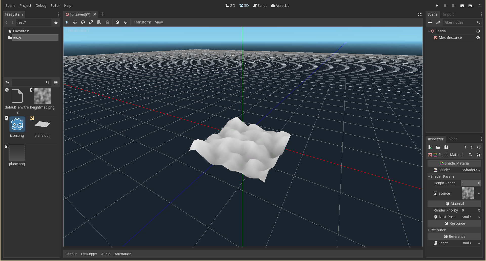
