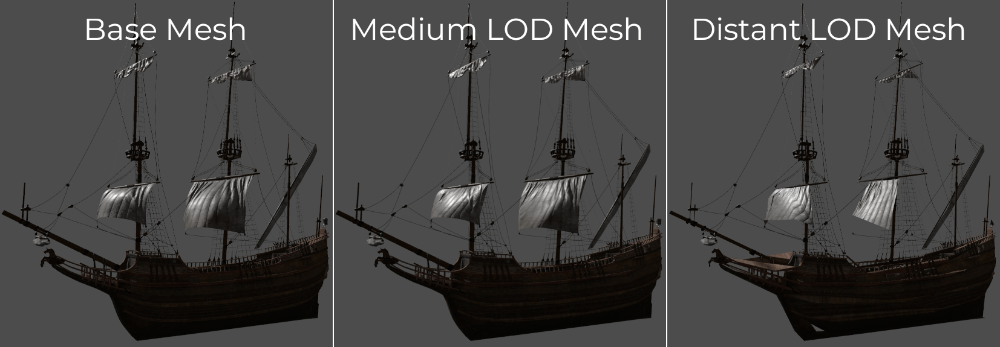
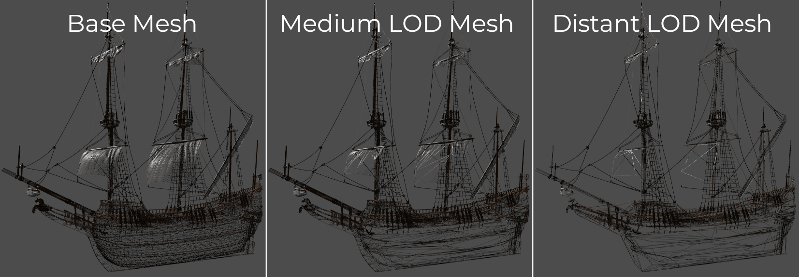
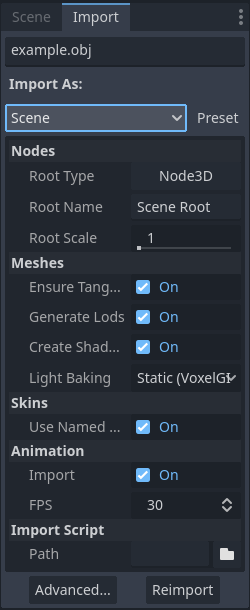
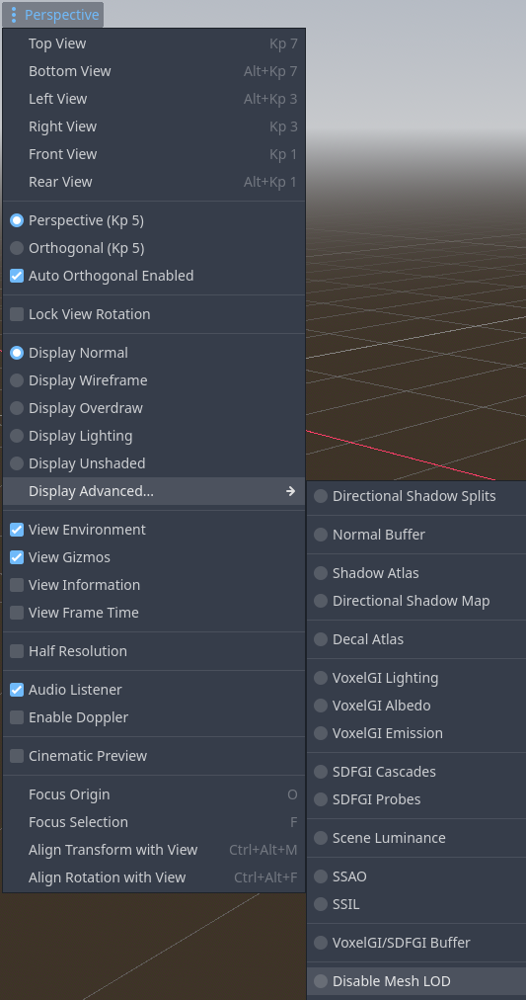

.. _doc_mesh_lod:

Mesh level of detail (LOD)
==========================

Level of detail (LOD) is one of the most important ways to optimize rendering
performance in a 3D project, along with :ref:`doc_occlusion_culling`.

On this page, you'll learn:

- How mesh LOD can improve your 3D project's rendering performance.
- How to set up mesh LOD in Godot.
- How to measure mesh LOD's effectiveness in your project
  (and alternatives you can explore if it doesn't meet your expectations).

.. seealso::

    You can see how mesh LOD works in action using the
    `Occlusion Culling and Mesh LOD demo project <https://github.com/godotengine/godot-demo-projects/tree/master/3d/occlusion_culling_mesh_lod>`__.

Introduction
------------

Historically, level of detail in 3D games involved manually authoring meshes
with lower geometry density, then configuring the distance thresholds at which
these lower-detailed meshes should be drawn. This approach is still used today
when increased control is needed.

However, in projects that have a large amount of detailed 3D assets, setting up
LOD manually can be a very time-consuming process. As a result, automatic mesh
decimation and LOD configuration is becoming increasingly popular.

Godot provides a way to automatically generate less detailed meshes for LOD
usage on import, then use those LOD meshes when needed automatically. This is
completely transparent to the user.
The `meshoptimizer <https://meshoptimizer.org/>`__ library is used for LOD mesh
generation behind the scenes.

Mesh LOD works with any node that draws 3D meshes. This includes MeshInstance3D,
MultiMeshInstance3D, GPUParticles3D and CPUParticles3D.

Visual comparison
-----------------

Here is an example of LOD meshes generated on import. Lower detailed meshes
will be used when the camera is far away from the object:

   From most detailed (left) to least detailed (right), shaded view

Here's the same image with wireframe rendering to make the decimation easier to see:

   From most detailed (left) to least detailed (right), wireframe view

.. seealso::

    If you need to manually configure level of detail with artist-created meshes,
    use :ref:`doc_visibility_ranges` instead of automatic mesh LOD.

Generating mesh LOD
-------------------

By default, mesh LOD generation happens automatically for imported 3D scenes
(glTF, .blend, Collada, FBX). Once LOD meshes are generated, they will
automatically be used when rendering the scene. You don't need to configure
anything manually.

However, mesh LOD generation does **not** automatically happen for imported 3D
meshes (OBJ). This is because OBJ files are not imported as full 3D scenes by
default, but only as individual mesh resources to load into a MeshInstance3D
node (or GPUParticles3D, CPUParticles3D, ...).

To make an OBJ file have mesh LOD generated for it, select it in the FileSystem
dock, go to the Import dock, change its **Import As** option to **Scene** then
click **Reimport**:

   Changing the import type on an OBJ file in the Import dock

This will require restarting the editor after clicking **Reimport**.

.. note::

   The mesh LOD generation process is not perfect, and may occasionally
   introduce rendering issues (especially in skinned meshes). Mesh LOD
   generation can also take a while on complex meshes.

   If mesh LOD causes a specific mesh to look broken, you can disable LOD
   generation for it in the Import dock. This will also speed up resource
   importing. This can be done globally in the 3D scene's import options, or on
   a per-mesh basis using the Advanced Import Settings dialog.

   See :ref:`Importing 3D scenes <doc_importing_3d_scenes_using_the_import_dock>`
   for more information.

Comparing mesh LOD visuals and performance
------------------------------------------

To disable mesh LOD in the editor for comparison purposes, use the
**Disable Mesh LOD** advanced debug draw mode. This can be done using the menu
in the top-left corner of the 3D viewport (labeled **Perspective** or
**Orthogonal** depending on camera mode):

   Disabling mesh LOD in the 3D viewport's top-left menu

Enable **View Frame Time** in the same menu to view FPS in the top-right corner.
Also enable **View Information** in the same menu to view the number of primitives
(vertices + indices) rendered in the bottom-right corner.

If mesh LOD is working correctly in your scene and your camera is far away
enough from the mesh, you should notice the number of drawn primitives
decreasing and FPS increasing when mesh LOD is left enabled (unless you are
CPU-bottlenecked).

To see mesh LOD decimation in action, change the debug draw mode to
**Display Wireframe** in the menu specified above, then adjust the
**Rendering > Mesh LOD > LOD Change > Threshold Pixels** project setting.

Configuring mesh LOD performance and quality
--------------------------------------------

You can adjust how aggressive mesh LOD transitions should be in the root viewport
by changing the **Rendering > Mesh LOD > LOD Change > Threshold Pixels** project
setting. To change this value at run-time, set ``mesh_lod_threshold`` on the
root viewport as follows:

::

    get_tree().root.mesh_lod_threshold = 4.0

Each viewport has its own ``mesh_lod_threshold`` property, which can be set
independently from other viewports.

The default mesh LOD threshold of 1 pixel is tuned to look *perceptually*
lossless; it provides a significant performance gain with an unnoticeable loss
in quality. Higher values will make LOD transitions happen sooner when the
camera moves away, resulting in higher performance but lower quality.

If you need to perform per-object adjustments to mesh LOD, you can adjust how
aggressive LOD transitions should be by adjusting the **LOD Bias** property on
any node that inherits from GeometryInstance3D. Values *above* ``1.0`` will make
LOD transitions happen later than usual (resulting in higher quality but lower
performance). Values *below* ``1.0`` will make LOD transitions happen sooner than
usual (resulting in lower quality but higher performance).

Additionally, ReflectionProbe nodes have their own **Mesh LOD Threshold** property
that can be adjusted to improve rendering performance when the reflection probe
updates. This is especially important for ReflectionProbes that use the **Always**
update mode.

.. note::

    When rendering the scene, mesh LOD selection uses a screen-space metric.
    This means it automatically takes camera field of view and viewport
    resolution into account. Higher camera FOV and lower viewport resolutions
    will make LOD selection more aggressive; the engine will display heavily
    decimated models earlier when the camera moves away.

    As a result, unlike :ref:`doc_visibility_ranges`, you don't need to do
    anything specific in your project to take camera FOV and viewport resolution
    into account.

Using mesh LOD with MultiMesh and particles
-------------------------------------------

For LOD selection, the point of the node's :abbr:`AABB (Axis-Aligned Bounding Box)`
that is the closest to the camera is used as a basis. This applies to any kind
of mesh LOD (including for individual MeshInstance3D)s, but this has some implications
for nodes that display multiple meshes at once, such as MultiMeshInstance3D,
GPUParticles3D and GPUParticles3D. Most importantly, this means that all
instances will be drawn with the same LOD level at a given time.

If you are noticing incorrect LOD selection with GPUParticles3D, make sure
the node's visibility AABB is configured by selecting the GPUParticles3D
node and using **GPUParticles3D > Generate AABB** at the top of the 3D
viewport.

If you have instances in a MultiMesh that are far away from each other, they
should be placed in a separate MultiMeshInstance3D node. Doing so will also
improve rendering performance, as frustum and occlusion culling will be able to
cull individual nodes (while they can't cull individual instances in a
MultiMesh).
