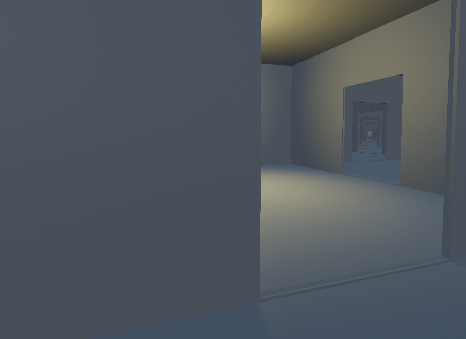
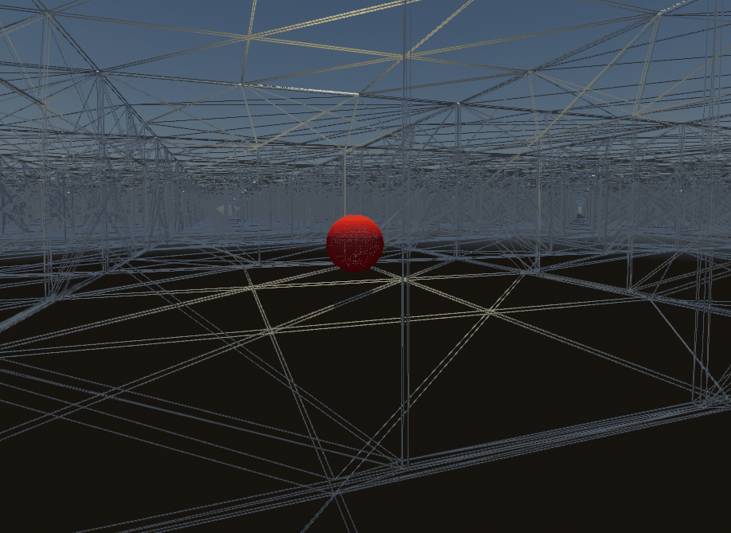
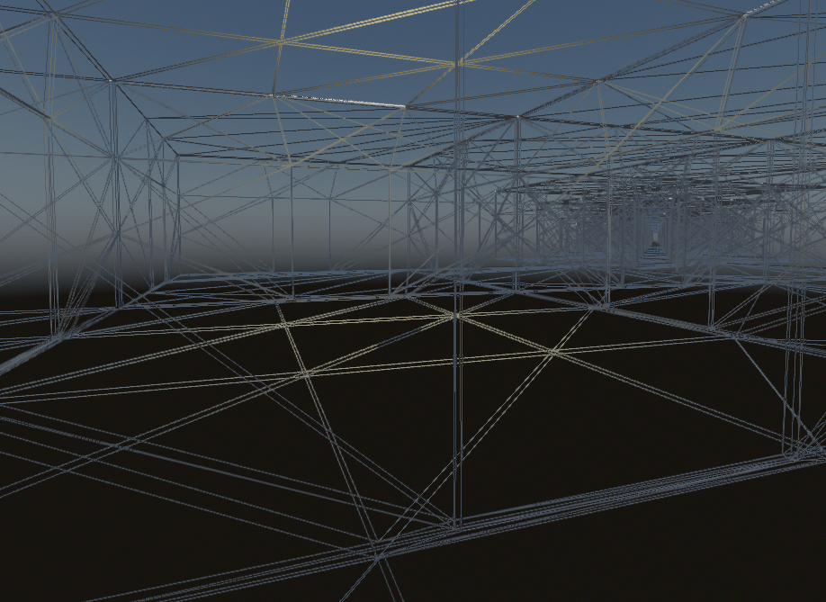

.. _doc_occlusion_culling:

Occlusion culling
=================

In a 3D rendering engine, **occlusion culling** is the process of performing
hidden geometry removal.

On this page, you'll learn:

- What are the advantages and pitfalls of occlusion culling.
- How to set up occlusion culling in Godot.
- Troubleshooting common issues with occlusion culling.

.. seealso::

    You can see how occlusion culling works in action using the
    `Occlusion Culling and Mesh LOD demo project <https://github.com/godotengine/godot-demo-projects/tree/master/3d/occlusion_culling_mesh_lod>`__.

Why use occlusion culling
-------------------------

In this example scene with hundreds of rooms stacked next to each other, a
dynamic object (red sphere) is hidden behind the wall in the lit room (on the
left of the door):

   Example scene with an occlusion culling-friendly layout

With occlusion culling disabled, all the rooms behind the lit room have to be
rendered. The dynamic object also has to be rendered:

   Example scene with occlusion culling **disabled** (wireframe)

With occlusion culling enabled, only the rooms that are actually visible have to
be rendered. The dynamic object is also occluded by the wall, and therefore no
longer has to be rendered:

   Example scene with occlusion culling **enabled** (wireframe)

Since the engine has less work to do (fewer vertices to render and fewer draw calls),
performance will increase as long as there are enough occlusion culling opportunities
in the scene. This means occlusion culling is most effective in indoor scenes,
preferably with many smaller rooms instead of fewer larger rooms. Combine
this with :ref:`doc_mesh_lod` and :ref:`doc_visibility_ranges` to further improve
performance gains.

.. note::

    When using the Clustered Forward rendering backend, the engine already
    performs a *depth prepass*. This consists in rendering a depth-only version
    of the scene before rendering the scene's actual materials. This is used to
    ensure each opaque pixel is only shaded once, reducing the cost of overdraw
    significantly.

    The greatest performance benefits can be observed when using the Forward
    Mobile rendering backend, as it does not feature a
    depth prepass for performance reasons. As a result, occlusion culling will
    actively decrease shading overdraw with that rendering backend.

    Nonetheless, even when using a depth prepass, there is still a noticeable
    benefit to occlusion culling in complex 3D scenes. However, in scenes with
    few occlusion culling opportunities, occlusion culling may not be worth the
    added setup and CPU usage.

How occlusion culling works in Godot
------------------------------------

.. note::

    *"occluder" refers to the shape blocking the view, while "occludee" refers to the object being hidden.*

In Godot, occlusion culling works by rasterizing the scene's occluder geometry
to a low-resolution buffer on the CPU. This is done using
the software raytracing library `Embree <https://github.com/embree/embree>`__.

The engine then uses this low-resolution buffer to test occludees'
:abbr:`AABB (Axis-Aligned Bounding Box)` against the occluder shapes.
The occludee's :abbr:`AABB (Axis-Aligned Bounding Box)` must be *fully occluded*
by the occluder shape to be culled.

As a result, smaller objects are more likely to be effectively culled than
larger objects. Larger occluders (such as walls) also tend to be much more
effective than smaller ones (such as decoration props).

Setting up occlusion culling
----------------------------

The first step to using occlusion culling is to enable the
**Rendering > **Occlusion Culling > Use Occlusion Culling** project setting.
(Make sure the **Advanced** toggle is enabled in the Project Settings dialog to
be able to see it.)

This project setting applies immediately, so you don't need to restart the editor.

After enabling the project setting, you still need to create some occluders. For
performance reasons, the engine doesn't automatically use all visible geometry
as a basis for occlusion culling. Instead, the engine requires a simplified
representation of the scene with only static objects to be baked.

There are two ways to set up occluders in a scene:

.. _doc_occlusion_culling_baking:

Automatically baking occluders (recommended)
^^^^^^^^^^^^^^^^^^^^^^^^^^^^^^^^^^^^^^^^^^^^

.. note::

    Only MeshInstance3D nodes are currently taken into account in the *occluder*
    baking process. MultiMeshInstance3D, GPUParticles3D, CPUParticles3D and CSG
    nodes are **not** taken into account when baking occluders. If you wish
    those to be treated as occluders, you have to manually create occluder
    shapes that (roughly) match their geometry.

    This restriction does not apply to *occludees*. Any node type that inherits
    from GeometryInstance3D can be occluded.

After enabling the occlusion culling project setting mentioned above, add an
OccluderInstance3D node to the scene containing your 3D level.

Select the OccluderInstance3D node, then click **Bake Occluders** at the top of
the 3D editor viewport. After baking, the OccluderInstance3D node will contain
an Occluder3D resource that stores a simplified version of your level's
geometry. This occluder geometry appears as purple wireframe lines in the 3D view
(as long as **View Gizmos** is enabled in the **Perspective** menu).
This geometry is then used to provide occlusion culling for both static and
dynamic occludees.

After baking, you may notice that your dynamic objects (such as the player,
enemies, etc…) are included in the baked mesh. To prevent this, set the
**Bake > Cull Mask** property on the OccluderInstance3D to exclude certain visual
layers from being baked.

For example, you can disable layer 2 on the cull mask, then configure your
dynamic objects' MeshInstance3D nodes to be located on the visual layer 2
(instead of layer 1). To do so, select the MeshInstance3D node in question, then
on the **VisualInstance3D > Layers** property, uncheck layer 1 then check layer
2. After configuring both cull mask and layers, bake occluders again by
following the above process.

Manually placing occluders
^^^^^^^^^^^^^^^^^^^^^^^^^^

This approach is more suited for specialized use cases, such as creating occlusion
for MultiMeshInstance3D setups or CSG nodes (due to the aforementioned limitation).

After enabling the occlusion culling project setting mentioned above, add an
OccluderInstance3D node to the scene containing your 3D level. Select the
OccluderInstance3D node, then choose an occluder type to add in the **Occluder**
property:

- QuadOccluder3D (a single plane)
- BoxOccluder3D (a cuboid)
- SphereOccluder3D (a sphere-shaped occluder)
- PolygonOccluder3D (a 2D polygon with as many points as you want)

There is also ArrayOccluder3D, whose points can't be modified in the editor but
can be useful for procedural generation from a script.

.. _doc_occlusion_culling_preview:

Previewing occlusion culling
----------------------------

You can enable a debug draw mode to preview what the occlusion culling is
actually "seeing". In the top-left corner of the 3D editor viewport, click the
**Perspective** button (or **Orthogonal** depending on your current camera
mode), then choose **Display Advanced… > Occlusion Culling Buffer**. This will
display the low-resolution buffer that is used by the engine for occlusion
culling.

In the same menu, you can also enable **View Information** and **View Frame
Time** to view the number of draw calls and rendered primitives (vertices +
indices) in the bottom-right corner, along with the number of frames per second
rendered in the top-right corner.

If you toggle occlusion culling in the project settings while this information
is displayed, you can see how much occlusion culling improves performance in
your scene. Note that the performance benefit highly depends on the 3D editor
camera's view angle, as occlusion culling is only effective if there are
occluders in front of the camera.

To toggle occlusion culling at run-time, set ``use_occlusion_culling`` on the
root viewport as follows:

::

    get_tree().root.use_occlusion_culling = true

Toggling occlusion culling at run-time is useful to compare performance on a
running project.

Performance considerations
--------------------------

Design your levels to take advantage of occlusion culling
^^^^^^^^^^^^^^^^^^^^^^^^^^^^^^^^^^^^^^^^^^^^^^^^^^^^^^^^^

**This is the most important guideline.** A good level design is not just about
what the gameplay demands; it should also be built with occlusion in mind.

For indoor environments, add opaque walls to "break" the line of sight at
regular intervals and ensure not too much of the scene can be seen at once.

For large open scenes, use a pyramid-like structure for the terrain's elevation
when possible. This provides the greatest culling opportunities compared to any
other terrain shape.

Avoid moving OccluderInstance3D nodes during gameplay
^^^^^^^^^^^^^^^^^^^^^^^^^^^^^^^^^^^^^^^^^^^^^^^^^^^^^

This includes moving the parents of OccluderInstance3D nodes, as this will cause
the nodes themselves to move in global space, therefore requiring the :abbr:`BVH
(Bounding Volume Hierarchy)` to be rebuilt.

Toggling an OccluderInstance3D's visibility (or one of its parents' visibility)
is not as expensive, as the update only needs to happen once (rather than
continuously).

For example, if you have a sliding or rotating door, you can make the
OccluderInstance3D node not be a child of the door itself (so that the occluder
never moves), but you can hide the OccluderInstance3D visibility once the door
starts opening. You can then reshow the OccluderInstance3D once the door is
fully closed.

If you absolutely have to move an OccluderInstance3D node during gameplay, use a
primitive Occluder3D shape for it instead of a complex baked shape.

Use the simplest possible occluder shapes
^^^^^^^^^^^^^^^^^^^^^^^^^^^^^^^^^^^^^^^^^

If you notice low performance or stuttering in complex 3D scenes, it may mean
that the CPU is overloaded as a result of rendering detailed occluders.
Select the OccluderInstance3D node,
increase the **Bake > Simplification** property then bake occluders again.

Remember to keep the simplification value reasonable. Values that are too high
for the level's geometry may cause incorrect occlusion culling to occur, as in
:ref:`doc_occlusion_culling_troubleshooting_false_negative`.

If this still doesn't lead to low enough CPU usage,
you can try adjusting the **Rendering > Occlusion Culling > BVH Build Quality**
project setting and/or decreasing
**Rendering > Occlusion Culling > Occlusion Rays Per Thread**.
You'll need to enable the **Advanced** toggle in the Project Settings dialog to
see those settings.

Troubleshooting
---------------

My occludee isn't being culled when it should be
^^^^^^^^^^^^^^^^^^^^^^^^^^^^^^^^^^^^^^^^^^^^^^^^

**On the occluder side:**

First, double-check that the **Bake > Cull Mask** property in the
OccluderInstance3D is set to allow baking the meshes you'd like. The visibility
layer of the MeshInstance3D nodes must be present within the cull mask for the
mesh to be included in the bake.

Also note that occluder baking only takes meshes with *opaque* materials into
account. Surfaces will *transparent* materials will **not** be included in the
bake, even if the texture applied on them is fully opaque.

Lastly, remember that MultiMeshInstance3D, GPUParticles3D, CPUParticles3D and CSG
nodes are **not** taken into account when baking occluders. As a workaround, you
can add OccluderInstance3D nodes for those manually.

**On the occludee side:**

Make sure **Extra Cull Margin** is set as low as possible (it should usually be
``0.0``), and that **Ignore Occlusion Culling** is disabled in the object's
GeometryInstance3D section.

Also, check the AABB's size (which is represented by an orange box when
selecting the node). This axis-aligned bounding box must be *fully* occluded by
the occluder shapes for the occludee to be hidden.

.. _doc_occlusion_culling_troubleshooting_false_negative:

My occludee is being culled when it shouldn't be
^^^^^^^^^^^^^^^^^^^^^^^^^^^^^^^^^^^^^^^^^^^^^^^^

The most likely cause for this is that objects that were included in the
occluder bake have been moved after baking occluders. For instance, this can
occur when moving your level geometry around or rearranging its layout. To fix
this, select the OccluderInstance3D node and bake occluders again.

This can also happen because dynamic objects were included in the bake, even
though they shouldn't be. Use the
:ref:`occlusion culling debug draw mode <doc_occlusion_culling_preview>` to look
for occluder shapes that shouldn't be present, then
:ref:`adjust the bake cull mask accordingly <doc_occlusion_culling_baking>`.

The last possible cause for this is overly aggressive mesh simplification during
the occluder baking process. Select the OccluderInstance3D node,
decrease the **Bake > Simplification** property then bake occluders again.

As a last resort, you can enable the **Ignore Occlusion Culling** property on
the occludee. This will negate the performance improvements of occlusion culling
for that object, but it makes sense to do this for objects that will never be
culled (such as a first-person view model).
