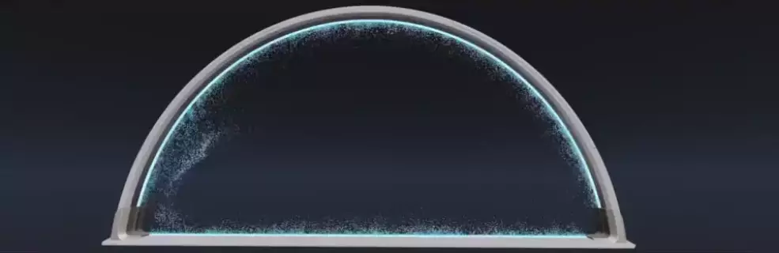
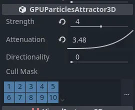
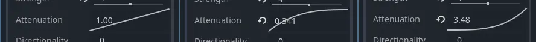
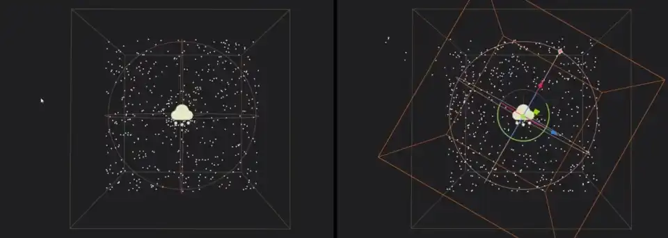
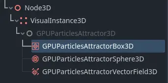
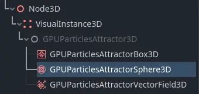
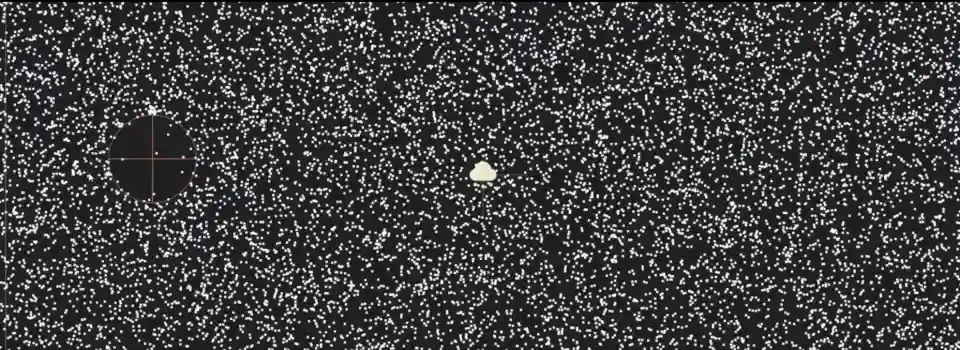
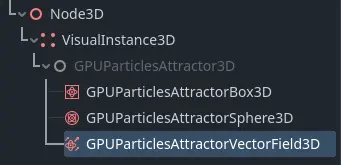
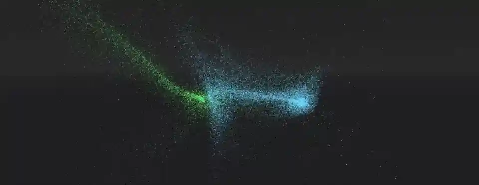

.. _doc_3d_particles_attractors:

3D Particle attractors
----------------------

Particle attractors are nodes that apply a force to all particles within their reach. They pull
particles closer or push them away based on the direction of that force. There are three types
of attractors: :ref:`class_GPUParticlesAttractorBox3D`, :ref:`class_GPUParticlesAttractorSphere3D`,
and :ref:`class_GPUParticlesAttractorVectorField3D`. You can instantiate them at runtime and
change their properties from gameplay code; you can even animate and combine them for complex
attraction effects.

.. note::

   Particle attractors are not yet implemented for 2D particle systems.

The first thing you have to do if you want to use attractors is enable the ``Attractor Interaction``
property on the ParticleProcessMaterial. Do this for every particle system that needs to react to attractors.
Like most properties in Godot, you can also change this at runtime.

Common properties
~~~~~~~~~~~~~~~~~

   Common attractor properties

There are some properties that you can find on all attractors. They're located in the
``GPUParticlesAttractor3D`` section in the inspector.

``Strength`` controls how strong the attractor force is. A positive value pulls particles
closer to the attractor's center, while a negative value pushes them away.

``Attenuation`` controls the strength falloff within the attractor's influence region. Every
particle attractor has a boundary. Its strength is weakest at the border of this boundary
and strongest at its center. Particles outside of the boundary are not affected by the attractor
at all. The attenuation curve controls how the strength weakens over that distance. A straight
line means that the strength is proportional to the distance: if a particle is halfway
between the boundary and the center, the attractor strength will be half of what it is
at the center. Different curve shapes change how fast particles accelerate towards the
attractor.

   Strength increase variations: constantly over the distance to the attractor (left), fast
   at the boundary border and slowly at the center (middle), slowly at the boundary and
   fast at the center (right).

The ``Directionality`` property changes the direction towards which particles are pulled.
At a value of ``0.0``, there is no directionality, which means that particles are pulled towards
the attractor's center. At ``1.0``, the attractor is fully directional, which means particles
will be pulled along the attractor's local ``-Z``-axis. You can change the global direction
by rotating the attractor. If ``Strength`` is negative, particles are instead pulled along
the ``+Z``-axis.

   No directionality (left) vs. full directionality (right). Notice how the particles move along
   the attractor's local Z-axis.

The ``Cull Mask`` property controls which particle systems are affected by an attractor based
on each system's :ref:`visibility layers <class_VisualInstance3D>`. A particle system is only
affected by an attractor if at least one of the system's visibility layers is enabled in the
attractor's cull mask.

.. warning::

   There is a `known issue <https://github.com/godotengine/godot/issues/61014>`_ with
   GPU particle attractors that prevent the cull mask from working properly in Godot 4.0. We will
   update the documentation as soon as it is fixed.

Box attractors
~~~~~~~~~~~~~~

   Box attractor in the node list

Box attractors have a box-shaped influence region. You control their size with the ``Extents``
property. Box extents always measure half of the sides of its bounds, so a value of
``(X=1.0,Y=1.0,Z=1.0)`` creates a box with an influence region that is 2 meters wide on each side.

To create a box attractor, add a new child node to your scene and select ``GPUParticlesAttractorBox3D``
from the list of available nodes. You can animate the box position or attach it to a
moving node for more dynamic effects.

.. figure:: img/particle_attractor_box.webp
   :alt: Box attractor parts particle field

   A box attractor with a negative strength value parts a particle field as it moves through it.

Sphere attractors
~~~~~~~~~~~~~~~~~

   Sphere attractor in the node list

Sphere attractors have a spherical influence region. You control their size with the ``Radius``
property. While box attractors don't have to be perfect cubes, sphere attractors will always be
spheres: You can't set width independently from height. If you want to use a sphere attractor for
elongated shapes, you have to change its ``Scale`` in the attractor's ``Node3D`` section.

To create a sphere attractor, add a new child node to your scene and select ``GPUParticlesAttractorSphere3D``
from the list of available nodes. You can animate the sphere position or attach it to a
moving node for more dynamic effects.

   A sphere attractor with a negative strength value parts a particle field as it moves through it.

Vector field attractors
~~~~~~~~~~~~~~~~~~~~~~~

   Vector field attractor in the node list

A vector field is a 3D area that contains vectors positioned on a grid. The grid density controls
how many vectors there are and how far they're spread apart. Each vector in a vector field points
in a specific direction. This can be completely random or aligned in a way that forms distinct
patterns and paths.

When particles interact with a vector field, their movement direction changes to match the nearest vector
in the field. As a particle moves closer to the next vector in the field, it changes
direction to match that vector's direction. The particle's speed depends on the vector's length.

Like box attractors, vector field attractors have a box-shaped influence region. You control their size with the ``Extents``
property, where a value of ``(X=1.0,Y=1.0,Z=1.0)`` creates a box with an influence region that is
2 meters wide on each side. The ``Texture`` property takes a :ref:`3D texture <class_Texture3D>`
where every pixel represents a vector with the pixel's color interpreted as the vector's direction and size.

.. note::

   When a texture is used as a vector field, there are two types of conversion you need to be aware of:

   1. The texture coordinates map to the attractor bounds. The image below shows which part of the texture
      corresponds to which part of the vector field volume. For example, the bottom half of the texture
      affects the top half of the vector field attractor because ``+Y`` points down in the texture UV space,
      but up in Godot's world space.
   2. The pixel color values map to direction vectors in space. The image below provides an overview. Since
      particles can move in two directions along each axis, the lower half of the color range represents
      negative direction values while the upper half represents positive direction values. So a yellow pixel
      ``(R=1,G=1,B=0)`` maps to the vector ``(X=1,Y=1,Z=-1)`` while a neutral gray ``(R=0.5,G=0.5,B=0.5)``
      results in no movement at all.

   .. figure:: img/particle_attractor_vector_mapping.webp
      :alt: Mapping from texture to vector field

To create a vector field attractor, add a new child node to your scene and select ``GPUParticlesAttractorVectorField3D``
from the list of available nodes. You can animate the attractor's position or attach it to a
moving node for more dynamic effects.

.. tip::

   If you don't have external tools to create vector field textures, you can use
   a NoiseTexture3D with a Color Ramp attached as a vector field texture. The
   Color Ramp can be modified to adjust how much each coordinate is affected by
   the vector field.

   Two particle systems are affected by the same vector field attractor. :download:`Click here to download the 3D texture `.
