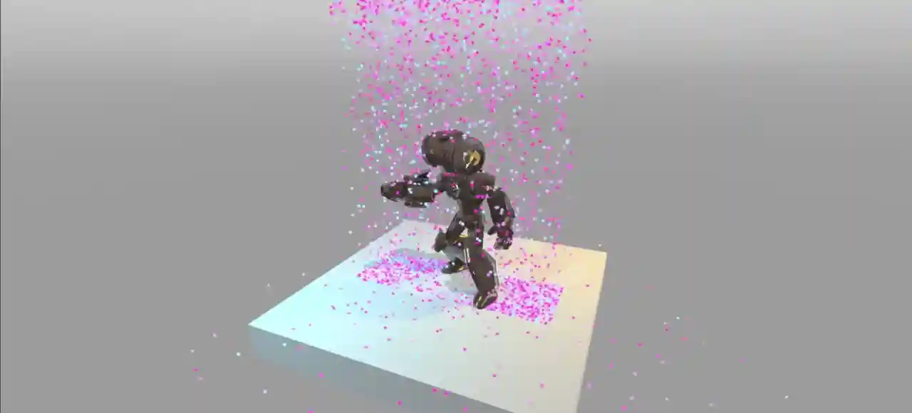
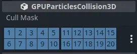
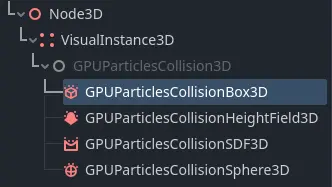
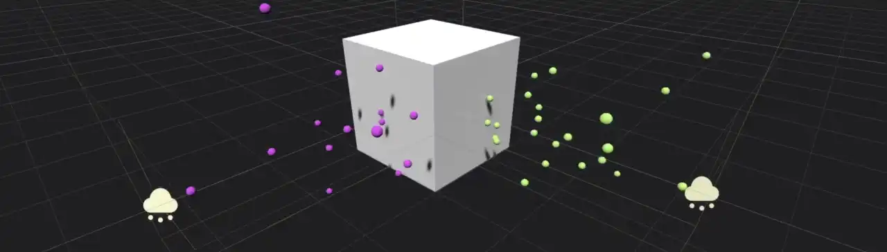
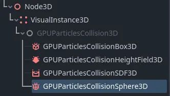
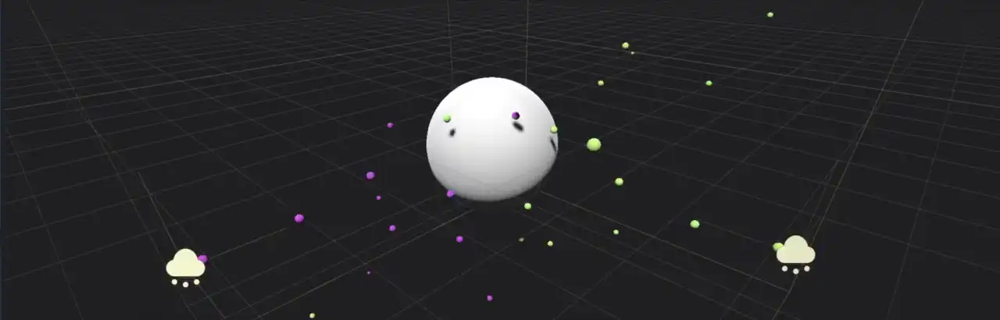
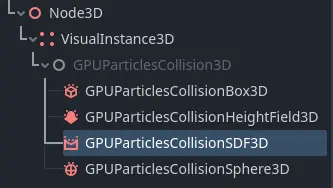
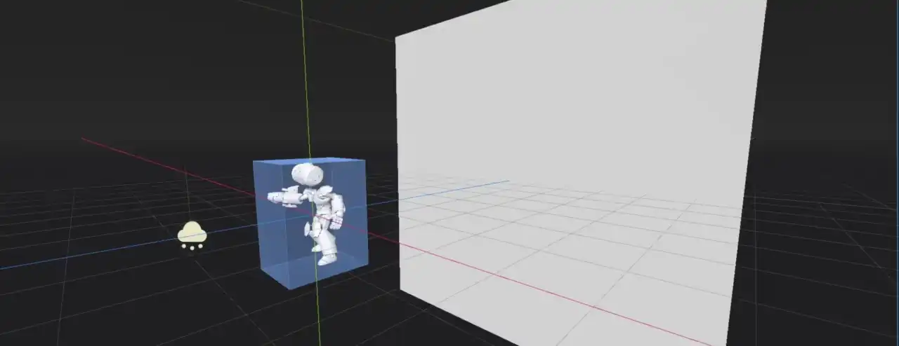
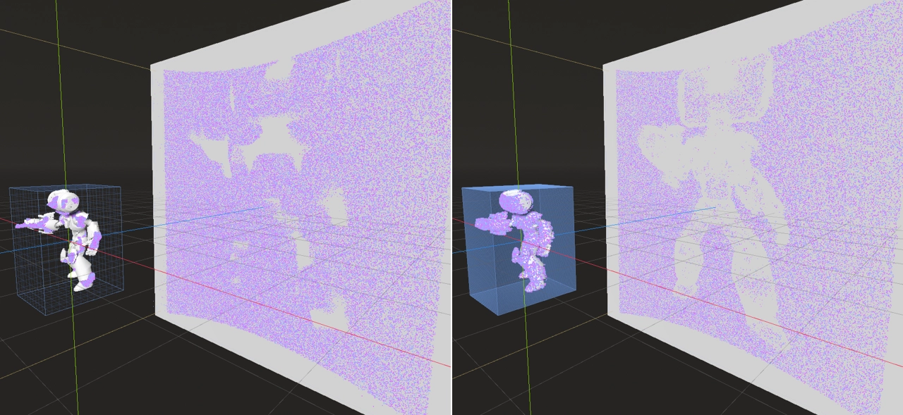

.. _doc_3d_particles_collision:

3D Particle collisions
----------------------

Since GPU particles are processed entirely on the GPU, they don't have access to the game's physical
world. If you need particles to collide with the environment, you have to set up particle collision nodes.
There are four of them: :ref:`class_GPUParticlesCollisionBox3D`, :ref:`class_GPUParticlesCollisionSphere3D`,
:ref:`class_GPUParticlesCollisionSDF3D`, and :ref:`class_GPUParticlesCollisionHeightField3D`.

Common properties
~~~~~~~~~~~~~~~~~

   Common collision properties

There are some properties that you can find on all collision nodes. They're located in the
``GPUParticlesCollision3D`` section in the inspector.

The ``Cull Mask`` property controls which particle systems are affected by a collision node based
on each system's :ref:`visibility layers <class_VisualInstance3D>`. A particle system collides with a
collision node only if at least one of the system's visibility layers is enabled in the
collider's cull mask.

.. warning::

   There is a `known issue <https://github.com/godotengine/godot/issues/61014>`_ with
   GPU particle collision that prevent the cull mask from working properly in Godot 4.0. We will
   update the documentation as soon as it is fixed.

Box collision
~~~~~~~~~~~~~

   Box collision in the node list

Box collision nodes are shaped like a solid, rectangular box. You control their size with the ``Extents``
property. Box extents always measure half of the sides of its bounds, so a value of ``(X=1.0,Y=1.0,Z=1.0)``
creates a box that is 2 meters wide on each side. Box collision nodes are useful for simulating floor
and wall geometry that particles should collide against.

To create a box collision node, add a new child node to your scene and select ``GPUParticlesCollisionBox3D``
from the list of available nodes. You can animate the box position or attach it to a
moving node for more dynamic effects.

   Two particle systems collide with a box collision node

Sphere collision
~~~~~~~~~~~~~~~~

   Sphere collision in the node list

Sphere collision nodes are shaped like a solid sphere. The ``Radius`` property controls the size of the sphere.
While box collision nodes don't have to be perfect cubes, sphere collision nodes will always be
spheres. If you want to set width independently from height, you have to change the ``Scale``
property in the ``Node3D`` section.

To create a sphere collision node, add a new child node to your scene and select ``GPUParticlesCollisionSphere3D``
from the list of available nodes. You can animate the sphere's position or attach it to a
moving node for more dynamic effects.

   Two particle systems collide with a sphere collision node

Height field collision
~~~~~~~~~~~~~~~~~~~~~~

.. figure:: img/particle_collision_height.webp
   :alt: Particle collision height field
   :align: right

   Height field collision in the node list

Height field particle collision is very useful for large outdoor areas that need to collide with particles.
At runtime, the node creates a height field from all the meshes within its bounds that match its cull mask.
Particles collide against the mesh that this height field represents. Since the height field generation is
done dynamically, it can follow the player camera around and react to changes in the level. Different
settings for the height field density offer a wide range of performance adjustments.

To create a height field collision node, add a new child node to your scene and select ``GPUParticlesCollisionHeightField3D``
from the list of available nodes.

A height field collision node is shaped like a box. The ``Extents`` property controls its size. Extents
always measure half of the sides of its bounds, so a value of ``(X=1.0,Y=1.0,Z=1.0)`` creates a box that
is 2 meters wide on each side. Anything outside of the node's extents is ignored for height field creation.

The ``Resolution`` property controls how detailed the height field is. A lower resolution performs faster
at the cost of accuracy. If the height field resolution is too low, it may look like particles penetrate level geometry
or get stuck in the air during collision events. They might also ignore some smaller meshes completely.

.. figure:: img/particle_heightfield_res.webp
   :alt: Height field resolutions

   At low resolutions, height field collision misses some finer details (left)

The ``Update Mode`` property controls when the height field is recreated from the meshes within its
bounds. Set it to ``When Moved`` to make it refresh only when it moves. This performs well and is
suited for static scenes that don't change very often. If you need particles to collide with dynamic objects
that change position frequently, you can select ``Always`` to refresh every frame. This comes with a
cost to performance and should only be used when necessary.

.. note::

   It's important to remember that when ``Update Mode`` is set to ``When Moved``, it is the *height field node*
   whose movement triggers an update. The height field is not updated when one of the meshes inside it moves.

The ``Follow Camera Enabled`` property makes the height field follow the current camera when enabled. It will
update whenever the camera moves. This property can be used to make sure that there is always particle collision
around the player while not wasting performance on regions that are out of sight or too far away.

SDF collision
~~~~~~~~~~~~~

   SDF collision in the node list

SDF collision nodes create a `signed distance field <https://www.reddit.com/r/explainlikeimfive/comments/k2zbos/eli5_what_are_distance_fields_in_graphics>`_
that particles can collide with. SDF collision is similar to height field collision in that it turns multiple
meshes within its bounds into a single collision volume for particles. A major difference is that signed distance
fields can represent holes, tunnels and overhangs, which is impossible to do with height fields alone. The
performance overhead is larger compared to height fields, so they're best suited for small-to-medium-sized environments.

To create an SDF collision node, add a new child node to your scene and select ``GPUParticlesCollisionSDF3D``
from the list of available nodes. SDF collision nodes have to be baked in order to have any effect on particles
in the level. To do that, click the :button:`Bake SDF` button in the viewport toolbar
while the SDF collision node is selected and choose a directory to store the baked data. Since SDF collision needs
to be baked in the editor, it's static and cannot change at runtime.

   SDF particle collision allows for very detailed 3-dimensional collision shapes

An SDF collision node is shaped like a box. The ``Extents`` property controls its size. Extents
always measure half of the sides of its bounds, so a value of ``(X=1.0,Y=1.0,Z=1.0)`` creates a box that
is 2 meters wide on each side. Anything outside of the node's extents is ignored for collision.

The ``Resolution`` property controls how detailed the distance field is. A lower resolution performs faster
at the cost of accuracy. If the resolution is too low, it may look like particles penetrate level geometry
or get stuck in the air during collision events. They might also ignore some smaller meshes completely.

   The same area covered by a signed distance field at different resolutions: 16 (left) and 256 (right)

The ``Thickness`` property gives the distance field, which is usually hollow on the inside, a thickness to
prevent particles from penetrating at high speeds. If you find that some particles don't collide with the
level geometry and instead shoot right through it, try setting this property to a higher value.

The ``Bake Mask`` property controls which meshes will be considered when the SDF is baked. Only meshes that
render on the active layers in the bake mask contribute to particle collision.

Troubleshooting
~~~~~~~~~~~~~~~

For particle collision to work, the particle's :ref:`visibility AABB <doc_3d_particles_properties_draw>`
must overlap with the collider's AABB. If collisions appear to be not working
despite colliders being set up, generate an updated visibility AABB by selecting
the GPUParticles3D node and choosing **GPUParticles3D > Generate Visibility AABB…**
at the top of the 3D editor viewport.

If the particles move fast and colliders are thin. There are two solutions for this:

- Make the colliders thicker. For instance, if particles cannot get below a
  solid floor, you could make the collider representing the floor thicker than
  its actual visual representation. The heightfield collider automatically
  handles this by design, as heightfields cannot represent "room over room"
  collision.
- Increased ``Fixed FPS`` in the GPUParticles3D node, which will perform collision
  checks more often. This comes at a performance cost, so avoid setting this too high.
