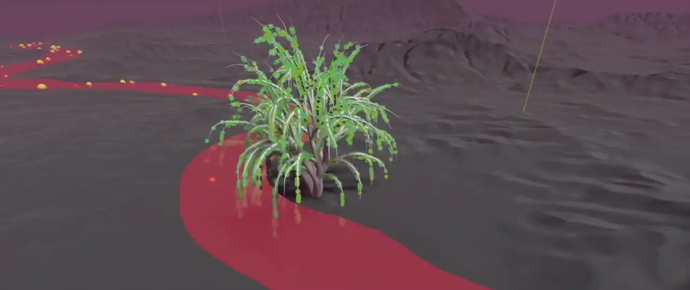
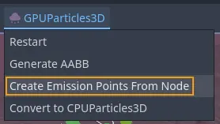
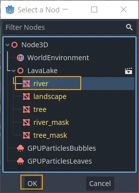
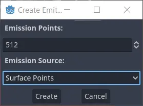
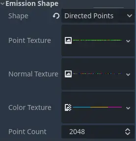

.. _doc_3d_particles_complex_shapes:

Complex emission shapes
-----------------------

When it is not enough to emit particles from one of the simple shapes available
in the :ref:`process material <doc_process_material_properties_shapes>`, Godot provides
a way to emit particles from arbitrary, complex shapes. The shapes are generated from
meshes in the scene and stored as textures in the particle process material. This is a
very versatile workflow that has allowed users to use particle systems for things that
go beyond traditional use cases, like foliage, leaves on a tree, or complex
holographic effects.

.. note::

    When you create emission points from meshes, you can only select a single node as
    emission source. If you want particles to emit from multiple shapes, you either
    have to create several particle systems or combine the meshes into one in an
    external DCC software.

   Create particle emission points...

   \...from a mesh instance as the source

   More points = higher particle density

To make use of this feature, start by creating a particle system in the current scene.
Add a mesh instance that serves as the source of the particle emission points. With the
particle system selected, navigate to the viewport menu and select the *GPUParticles3D*
entry. From there, select ``Create Emission Points From Node``.

A dialog window will pop up and ask you to select a node as the emission source.
Choose one of the mesh instances in the scene and confirm your selection. The next
dialog window deals with the amount of points and how to generate them.

``Emission Points`` controls the total number of points that you are about to generate.
Particles will spawn from these points, so what to enter here depends on the
size of the source mesh (how much area you have to cover) and the desired density of
the particles.

``Emission Source`` offers 3 different options for how the points are generated.
Select ``Surface Points`` if all you want to do is distribute the emission points across the
surface of the mesh. Select ``Surface Points + Normal (Directed)`` if you also want to
generate information about the surface normals and make particles move in the direction
that the normals point at. The last option, ``Volume``, creates emission points everywhere
inside the mesh, not just across its surface.

The emission points are stored in the particle system's local coordinate system, so
you can move the particle node around and the emission points will follow. This might be
useful when you want to use the same particle system in several different places. On the
other hand, you might have to regenerate the emission points when you move either
the particle system or the source mesh.

Emission shape textures
~~~~~~~~~~~~~~~~~~~~~~~

   The available emission shape textures

All the data for complex particle emission shapes is stored in a set of textures. How
many, depends on the type of emission shape you use. If you set the ``Shape`` property
in the ``Emission Shape`` group on the particle process material to ``Points``, you
have access to 2 texture properties, the ``Point Texture`` and the ``Color Texture``.
Set it to ``Directed Points`` and there is a third property called ``Normal Texture``.

``Point Texture`` contains all possible emission points that were generated in the
previous step. A point is randomly selected for every particle when it spawns.
``Normal Texture``, if it exists, provides a direction vector at that same location.
If the ``Color Texture`` property is also set, it provides color for the particle,
sampled at the same location as the other two textures and modulating any other color
that was set up on the process material.

There is also the ``Point Count`` property that you can use to change the number of
emission points at any time after creating the emission shape. This includes dynamically
at runtime while the playing the game.
