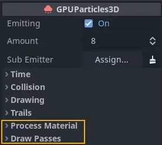
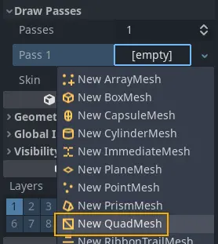
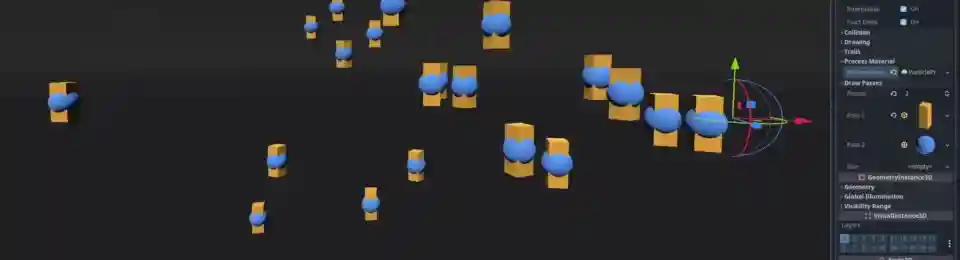
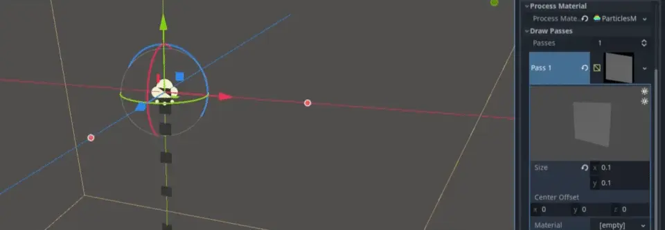
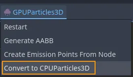

.. _doc_creating_3d_particle_system:

Creating a 3D particle system
-----------------------------

   Required particle node properties

To get started with particles, the first thing we need to do is add a ``GPUParticles3D``
node to the scene. Before we can actually see any particles, we have to set up two parameters on the node:
the ``Process Material`` and at least one ``Draw Pass``.

The process material
~~~~~~~~~~~~~~~~~~~~

To add a process material to your particles node, go to ``Process Material`` in the inspector panel.
Click on the box next to ``Process Material`` and from the dropdown menu select ``New ParticleProcessMaterial``.

.. figure:: img/particle_new_process_material.webp
   :align: right

   Creating a process material

:ref:`class_ParticleProcessMaterial` is a special kind of material. We don't use it to draw any objects.
We use it to update particle data and behavior on the GPU instead of the CPU, which comes with a massive performance
boost. A click on the newly added material displays a long list of properties that you can set to
control each particle's behavior.

Draw passes
~~~~~~~~~~~

   At least one draw pass is required

In order to render any particles, at least one draw pass needs to be defined. To do that, go to
``Draw Passes`` in the inspector panel. Click on the box next to ``Pass 1`` and select ``New QuadMesh``
from the dropdown menu. After that, click on the mesh and set its ``Size`` to 0.1 for both ``x``
and ``y``. Reducing the mesh's size makes it a little easier to tell the individual particle
meshes apart at this stage.

You can use up to 4 draw passes per particle system. Each pass can render a different
mesh with its own unique material. All draw passes use the data that is computed by the process material,
which is an efficient method for composing complex effects: Compute particle
behavior once and feed it to multiple render passes.

   Using multiple draw passes: yellow rectangles (pass1) and blue spheres (pass 2)

If you followed the steps above, your particle system should now be emitting particles in a waterfall-like fashion,
making them move downwards and disappear after a few seconds. This is the foundation for all
particle effects. Take a look at the documentation for :ref:`particle <doc_3d_particles_properties>` and
:ref:`particle material <doc_process_material_properties>` properties to
learn how to make particle effects more interesting.

Particle conversion
~~~~~~~~~~~~~~~~~~~

   Turning GPU into CPU particles

You can convert GPU particles to CPU particles at any time using the entry in the viewport
menu. When you do so, keep in mind that not every feature of GPU particles is available for
CPU particles, so the resulting particle system will look and behave differently from the
original.

You can also convert CPU particles to GPU particles if you no longer need to use CPU particles.
This is also done from the viewport menu.

Some of the most notable features that are lost during the conversion include:

- multiple draw passes
- turbulence
- sub-emitters
- trails
- attractors
- collision

You also lose the following properties:

- ``Amount Ratio``
- ``Interp to End``
- ``Damping as Friction``
- ``Emission Shape Offset``
- ``Emission Shape Scale``
- ``Inherit Velocity Ratio``
- ``Velocity Pivot``
- ``Directional Velocity``
- ``Radial Velocity``
- ``Velocity Limit``
- ``Scale Over Velocity``

Converting GPU particles to CPU particles can become necessary when you want to release a game
on older devices that don't support modern graphics APIs.
