.. _doc_process_material_properties:

Process material properties
---------------------------

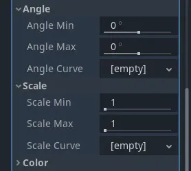

   Min, max, and curve properties

The properties in this material control how particles behave and change over their lifetime.
A lot of them have ``Min``, ``Max``, and ``Curve`` values that allow you to fine-tune
their behavior. The relationship between these values is this: When a particle is spawned,
the property is set with a random value between ``Min`` and ``Max``. If ``Min`` and ``Max`` are
the same, the value will always be the same for every particle. If the ``Curve`` is also set,
the value of the property will be multiplied by the value of the curve at the current point
in a particle's lifetime. Use the curve to change a property over the particle lifetime. Very
complex behavior can be expressed this way.

Time
~~~~

The ``Lifetime Randomness`` property controls how much randomness to apply to each particle's
lifetime. A value of ``0`` means there is no randomness at all and all particles live for
the same amount of time, set by the :ref:`Lifetime <doc_3d_particles_properties_time>` property. A value of ``1`` means
that a particle's lifetime is completely random within the range of [0.0, ``Lifetime``].

Particle flags
--------------

The ``Align Y`` property aligns each particle's Y-axis with its velocity. Enabling this
property is the same as setting the :ref:`Transform Align <doc_3d_particles_properties_draw>` property to
``Y to Velocity``.

The ``Rotate Y`` property works with the properties in the `Angle <#angle>`__ and
`Angular Velocity <#angular-velocity>`__ groups to control particle rotation. ``Rotate Y``
has to be enabled if you want to apply any rotation to particles. The exception to this
is any particle that uses the :ref:`Standard Material <doc_standard_material_3d>`
where the ``Billboard`` property is set to ``Particle Billboard``. In that case, particles
rotate even without ``Rotate Y`` enabled.

When the ``Disable Z`` property is enabled, particles will not move along the Z-axis.
Whether that is going to be the particle system's local Z-axis or the world Z-axis is
determined by the :ref:`Local Coords <doc_3d_particles_properties_draw>` property.

The ``Damping as Friction`` property changes the behavior of damping from a constant
deceleration to a deceleration based on speed.

Spawn
-----

.. _doc_process_material_properties_shapes:

Emission shape
~~~~~~~~~~~~~~

Particles can emit from a single point in space or in a way that they fill out a shape.
The ``Shape`` property controls that shape. ``Point`` is the default value. All
particles emit from a single point in the center of the particle system. When set to ``Sphere``
or ``Box``, particles emit in a way that they fill out a sphere or a box shape evenly.
You have full control over the size of these shapes. ``Sphere Surface`` works like ``Sphere``,
but instead of filling it out, all particles spawn on the sphere's surface.

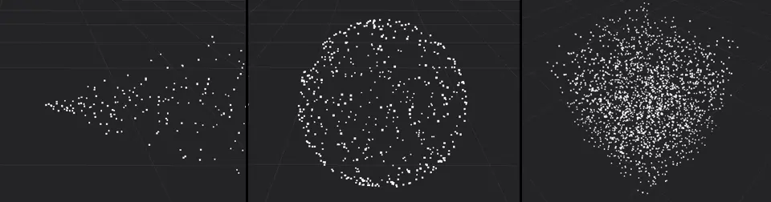

   Particles emitting from a point (left), in a sphere (middle), and in a box (right)

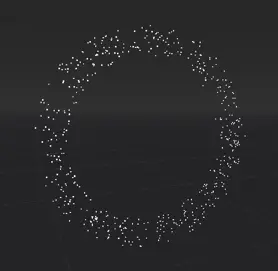

   A ring-shaped particle system

The ``Ring`` emission shape makes particles emit in the shape of a ring. You can control the ring's
direction by changing the ``Ring Axis`` property. ``Ring Height`` controls the thickness
of the ring along its axis. ``Ring Radius`` and ``Ring Inner Radius`` control how wide
the ring is and how large the hole in the middle should be. The image shows a particle
system with a radius of ``2`` and an inner radius of ``1.5``, the axis points along the
global Z-axis.

In addition to these relatively simple shapes, you can select the ``Points`` or
``Directed Points`` option to create highly complex emission shapes. See the
:ref:`Complex emission shapes <doc_3d_particles_complex_shapes>` section for a detailed
explanation of how to set these up.

Angle
~~~~~

The ``Angle`` property controls a particle's starting rotation `as described above <#process-material-properties>`__.
In order to have an actual effect on the particle, you have to enable one of two properties: `Rotate Y <#particle-flags>`__
rotates the particle around the particle system's Y-axis. The ``Billboard`` property in
the :ref:`Standard Material <doc_standard_material_3d>`, if it is set to ``Particle Billboard``, rotates
the particle around the axis that points from the particle to the camera.

Direction
~~~~~~~~~

.. note::

   The ``Direction`` property alone is not enough to see any particle movement. Whatever
   values you set here only take effect once velocity or acceleration properties are set, too.

The ``Direction`` property is a vector that controls each particle's direction of movement
at the moment it is spawned. A value of ``(X=1,Y=0,Z=0)`` would make all particles move
sideways along the X-axis. For something like a fountain where particles shoot out up in the
air, a value of ``(X=0,Y=1,Z=0)`` would be a good starting point.

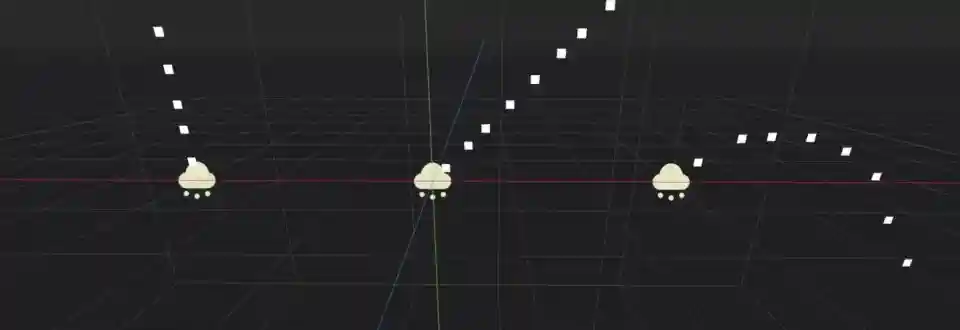

   Different direction values: Y-axis only (left), equal values for X and Y (middle), X and Y with gravity enabled (right)

After setting a direction, you will notice that all particles move in the same direction in
a straight line. The ``Spread`` property adds some variation and randomness to each particle's
direction. The higher the value, the stronger the deviation from the original path. A value
of ``0`` means there is no spread at all while a value of ``180`` makes particles shoot out in
every direction. You could use this for something like pieces of debris during an explosion effect.

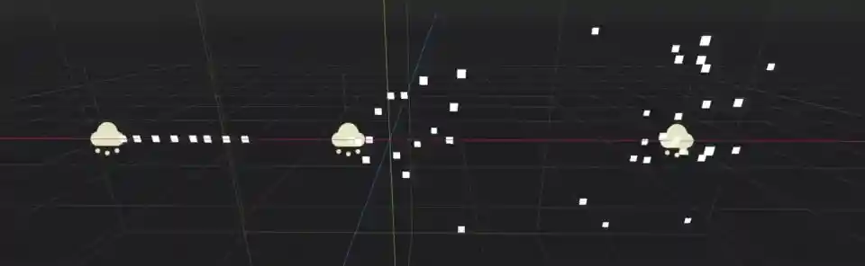

   No spread (left), 45 degree angle (middle), full 180 degrees (right)

The ``Flatness`` property limits the spread along the Y-axis. A value of ``0`` means there
is no limit and a value of ``1`` will eliminate all particle movement along the Y-axis. The
particles will spread out completely "flat".

You won't see any actual movement until you also set some values for the velocity and
acceleration properties below, so let's take a look at those next.

Initial velocity
~~~~~~~~~~~~~~~~

While the ``Direction`` property controls a particle's movement direction, the ``Initial Velocity``
controls how fast it goes. It's separated into ``Velocity Min`` and ``Velocity Max``, both
set to ``0`` by default, which is why you don't see any movement initially. As soon as you set
values for either of these properties `as described above <#process-material-properties>`__, the
particles begin to move. The direction is multiplied by these values, so you can make particles
move in the opposite direction by setting a negative velocity.

Accelerations
-------------

Gravity
~~~~~~~

The next few property groups work closely together to control particle movement and rotation.
``Gravity`` drags particles in the direction it points at, which is straight down at the strength
of Earth's gravity by default. Gravity affects all particle movement.
If your game uses physics and the world's gravity can change at runtime, you can use this property
to keep the game's gravity in sync with particle gravity. A ``Gravity`` value of ``(X=0,Y=0,Z=0)`` means
no particle will ever move at all if none of the other movement properties are set.

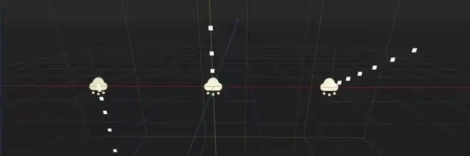

   Left\: (X=0,Y=-9.8,Z=0), middle\: (X=0,Y=9.8,Z=0), right\: (X=4,Y=2,Z=0).

Angular velocity
~~~~~~~~~~~~~~~~

``Angular Velocity`` controls a particle's speed of rotation `as described above <#process-material-properties>`__.
You can reverse the direction by using negative numbers for ``Velocity Min`` or ``Velocity Max``. Like the
`Angle <#angle>`__ property, the rotation will only be visible if the `Rotate Y <#particle-flags>`__ flag is set
or the ``Particle Billboard`` mode is selected in the :ref:`Standard Material <doc_standard_material_3d>`.

.. note::

   The `Damping <#damping>`__ property has no effect on the angular velocity.

Linear acceleration
~~~~~~~~~~~~~~~~~~~

A particle's velocity is a constant value: once it's set, it doesn't change and the particle will
always move at the same speed. You can use the ``Linear Accel`` property to
change the speed of movement over a particle's lifetime `as described above <#process-material-properties>`__.
Positive values will speed up the particle and make it move faster. Negative values will slow it
down until it stops and starts moving in the other direction.

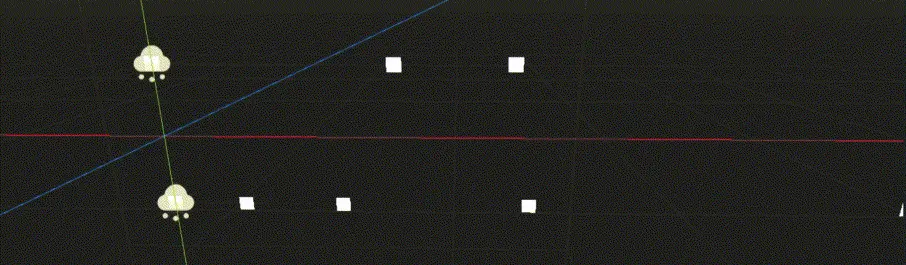

   Negative (top) and positive (bottom) linear acceleration

It's important to keep in mind that when we change acceleration, we're not changing the velocity
directly, we're changing the *change* in velocity. A value of ``0`` on the acceleration curve
does not stop the particle's movement, it stops the change in the particle's movement. Whatever
its velocity was at that moment, it will keep moving at that velocity until the acceleration is
changed again.

Radial acceleration
~~~~~~~~~~~~~~~~~~~

The ``Radial Accel`` property adds a gravity-like force to all particles, with the origin
of that force at the particle system's current location. Negative values make particles move
towards the center, like the force of gravity from a planet on objects in its orbit. Positive
values make particles move away from the center.

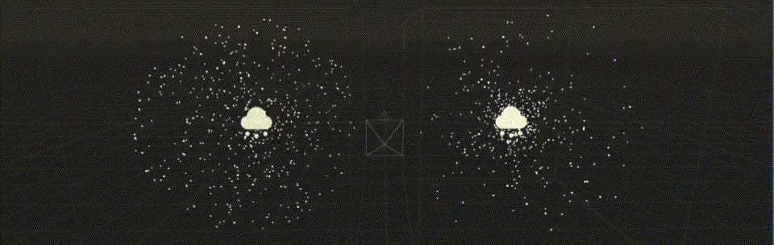

   Negative (left) and positive (right) radial acceleration

Tangential acceleration
~~~~~~~~~~~~~~~~~~~~~~~

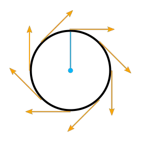

   Tangents on a circle

This property adds particle acceleration in the direction of the tangent to a circle on the particle
system's XZ-plane with the origin at the system's center and a radius the distance between each
particle's current location and the system's center projected onto that plane.

Let's unpack that.

A tangent to a circle is a straight line that "touches" the circle in a right angle to the circle's
radius at the touch point. A circle on the particle system's XZ-plane is the circle that you see
when you look straight down at the particle system from above.

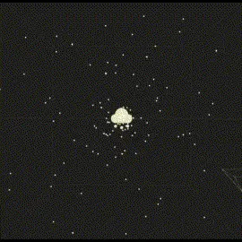

   Tangential acceleration from above

``Tangential Accel`` is always limited to that plane and never move particles along the system's Y-axis.
A particle's location is enough to define such a circle where the distance to the system's center is
the radius if we ignore the vector's Y component.

The ``Tangential Accel`` property will make particles orbit the particle system's center, but the
radius will increase constantly. Viewed from above, particles will move away from the center
in a spiral. Negative values reverse the direction.

Damping
~~~~~~~

The ``Damping`` property gradually stops all movement. Each frame, a particle's movement
is slowed down a little unless the total acceleration is greater than the damping effect. If
it isn't, the particle will keep slowing down until it doesn't move at all. The greater the value, the less
time it takes to bring particles to a complete halt.

Attractor interaction
~~~~~~~~~~~~~~~~~~~~~

If you want the particle system to interact with :ref:`particle attractors <doc_3d_particles_attractors>`,
you have to check the ``Enabled`` property. When it is disabled, the particle system
ignores all particle attractors.

Display
-------

Scale
~~~~~

``Scale`` controls a particle's size `as described above <#process-material-properties>`__. You can set
different values for ``Scale Min`` and ``Scale Max`` to randomize each particle's size. Negative values
are not allowed, so you won't be able to flip particles with this property. If you emit particles as
billboards, the ``Keep Size`` property on the :ref:`Standard Material <doc_standard_material_3d>`
in your draw passes has to be enabled for any scaling to have an effect.

Color
~~~~~

The ``Color`` property controls a particle's initial color. It will have an effect only after the
``Use As Albedo`` property in the ``Vertex Color`` group of the :ref:`Standard Material <doc_standard_material_3d>`
is enabled. This property is multiplied with color coming from the particle material's
own ``Color`` or ``Texture`` property.

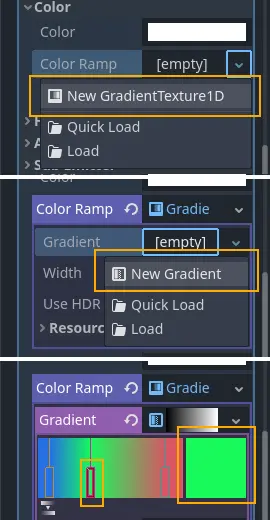

   Setting up a color ramp

There are two ``Ramp`` properties in the ``Color`` group. These allow you to define a range of colors
that are used to set the particle's color. The ``Color Ramp`` property changes a particle's color
over the course of its lifetime. It moves through the entire range of colors you defined.
The ``Color Initial Ramp`` property selects the particle's initial color from a random
position on the color ramp.

To set up a color ramp, click on the box next to the property name and from the dropdown menu
select ``New GradientTexture1D``. Click on the box again to open the texture's details.
Find the ``Gradient`` property, click on the box next to it and select ``New Gradient``.
Click on that box again and you will see a color range. Click anywhere on that range
to insert a new marker. You can move the marker with the mouse and delete it by clicking
the right mouse button. When a marker is selected, you can use the color picker next to
the range to change its color.

Hue variation
~~~~~~~~~~~~~

Like the ``Color`` property, ``Hue Variation`` controls a particle's color, but in a
different way. It does so not by setting color values directly, but by
*shifting the color's hue*.

Hue describes a color's pigment: red, orange, yellow, green and so on. It does not
tell you anything about how bright or how saturated the color is. The ``Hue Variation``
property controls the range of available hues `as described above <#process-material-properties>`__.

It works on top of the particle's current color. The values you set for
``Variation Min`` and ``Variation Max`` control how far the hue is allowed to shift
in either direction. A higher value leads to more color variation while a low value
limits the available colors to the closest neighbors of the original color.

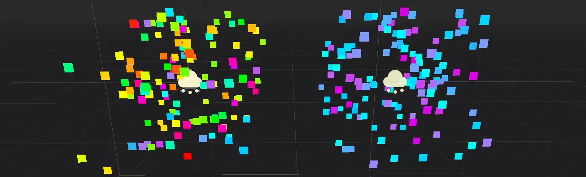

   Different values for hue variation, both times with blue as base color: 0.6 (left) and 0.1 (right)

.. _doc_process_material_properties_animation:

Animation
~~~~~~~~~

The ``Animation`` property group controls the behavior of sprite
sheet animations in the particle's :ref:`Standard Material <doc_standard_material_3d>`.
The ``Min``, ``Max``, and ``Curve`` values work `as described above <#process-material-properties>`__.

An animated sprite sheet is a texture that contains several smaller images aligned on a grid.
The images are shown one after the other so fast that they combine to play a short
animation, like a flipbook. You can use them for animated particles like smoke or fire.
These are the steps to create an animated particle system:

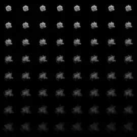

   An 8x8 animated smoke sprite sheet

#. Import a sprite sheet texture into the engine. If you don't have one at hand, you can download the :download:`high-res version of the example image `.
#. Set up a particle system with at least one draw pass and assign a ``Standard Material`` to the mesh in that draw pass.
#. Assign the sprite sheet to the ``Texture`` property in the ``Albedo`` group
#. Set the material's ``Billboard`` property to ``Particle Billboard``. Doing so makes the ``Particles Anim`` group available in the material.
#. Set ``H Frames`` to the number of columns and ``V Frames`` to the number of rows in the sprite sheet.
#. Check ``Loop`` if you want the animation to keep repeating.

That's it for the Standard Material. You won't see any animation right away. This is
where the ``Animation`` properties come in. The ``Speed`` properties control how fast
the sprite sheet animates. Set ``Speed Min`` and ``Speed Max`` to ``1`` and you should see the
animation playing. The ``Offset`` properties control where the animation starts on a
newly spawned particle. By default, it will always be the first image in the sequence.
You can add some variety by changing ``Offset Min`` and ``Offset Max`` to randomize
the starting position.

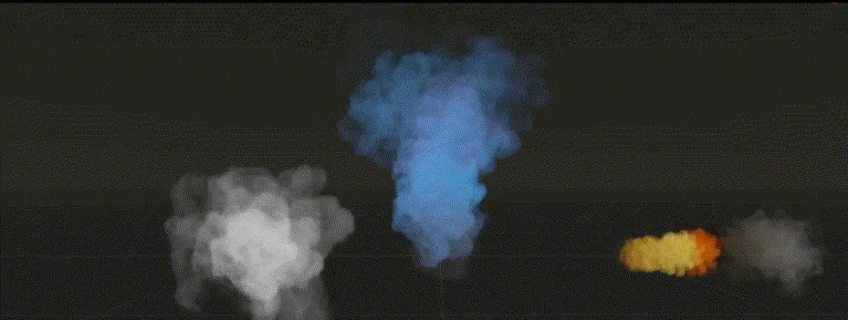

   Three different particle systems using the same smoke sprite sheet

Depending on how many images your sprite sheet contains and for how long your
particle is alive, the animation might not look smooth. The relationship between
particle lifetime, animation speed, and number of images in the sprite sheet is
this:

.. note::

   At an animation speed of ``1.0``, the animation will reach the last image
   in the sequence just as the particle's lifetime ends.

   .. math::
      Animation\ FPS = \frac{Number\ of\ images}{Lifetime}

If your sprite sheet contains
64 (8x8) images and the particle's lifetime is set to ``1 second``, the animation
will be very smooth at **64 FPS** (1 second / 64 images). if the lifetime is set to ``2 seconds``, it
will still be fairly smooth at **32 FPS**. But if the particle is alive for
``8 seconds``, the animation will be visibly choppy at **8 FPS**. In order to make the
animation smooth again, you need to increase the animation speed to something like ``3``
to reach an acceptable framerate.

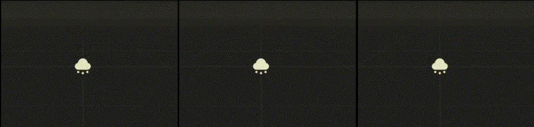

   The same particle system at different lifetimes: 1 second (left), 2 seconds (middle), 8 seconds (right)

Note that the GPUParticles3D node's **Fixed FPS** also affects animation
playback. For smooth animation playback, it's recommended to set it to 0 so that
the particle is simulated on every rendered frame. If this is not an option for
your use case, set **Fixed FPS** to be equal to the effective framerate used by
the flipbook animation (see above for the formula).

.. _doc_process_material_properties_turbulence:

Turbulence
~~~~~~~~~~

Turbulence adds noise to particle movement, creating interesting and lively patterns.
Check the box next to the ``Enabled`` property to activate it. A number
of new properties show up that control the movement speed, noise pattern and overall influence
on the particle system. You can find a detailed explanation of these in the section on
:ref:`particle turbulence <doc_3d_particles_turbulence>`.

.. _doc_process_material_properties_subemitter:

Collision
---------

The ``Mode`` property controls how and if emitters collide with particle collision nodes. Set it
to ``Disabled`` to disable any collision for this particle system. Set it to ``Hide On Contact``
if you want particles to disappear as soon as they collide. Set it to ``Constant`` to make
particles collide and bounce around. You will see two new properties appear in the inspector.
They control how particles behave during collision events.

A high ``Friction`` value will reduce sliding along surfaces. This is especially
helpful if particles collide with sloped surfaces and you want them to stay in
place instead of sliding all the way to the bottom, like snow falling on a mountain.
A high ``Bounce`` value will make particles bounce off surfaces they collide with,
like rubber balls on a solid floor.

If the ``Use Scale`` property is enabled, the :ref:`collision base size <doc_3d_particles_properties_collision>`
is multiplied by the particle's `current scale <#scale>`__. You can use this to
make sure that the rendered size and the collision size match for particles
with random scale or scale that varies over time.

You can learn more about particle collisions in the :ref:`Collisions <doc_3d_particles_collision>`
section in this manual.

Sub-emitter
-----------

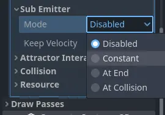

   The available sub-emitter modes

The ``Mode`` property controls how and when sub-emitters are spawned. Set it to ``Disabled``
and no sub-emitters will ever be spawned. Set it to ``Constant`` to make sub-emitters
spawn continuously at a constant rate. The ``Frequency`` property controls how often
that happens within the span of one second. Set the mode to ``At End`` to make the sub-emitter
spawn at the end of the parent particle's lifetime, right before it is destroyed. The
``Amount At End`` property controls how many sub-emitters will be spawned. Set the
mode to ``At Collision`` to make sub-emitters spawn when a particle collides with the
environment. The ``Amount At Collision`` property controls how many sub-emitters will be spawned.

When the ``Keep Velocity`` property is enabled, the newly spawned sub-emitter starts off
with the parent particle's velocity at the time the sub-emitter is created.

See the :ref:`Sub-emitters <doc_3d_particles_subemitters>` section in this manual for a detailed explanation of how
to add a sub-emitter to a particle system.
