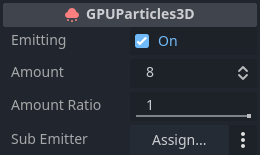
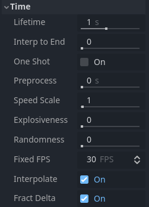

.. _doc_3d_particles_properties:

3D Particle system properties
-----------------------------

Emitter properties
~~~~~~~~~~~~~~~~~~

The checkbox next to the ``Emitting`` property activates and deactivates the particle system. Particles will
only be processed and rendered if the box is checked. You can set this property at runtime if you
want to activate or deactivate particle systems dynamically.

The ``Amount`` property controls the maximum number of particles visible at any given time. Increase the
value to spawn more particles at the cost of performance.

The ``Amount Ratio`` property is the ratio of particles compared to the amount that will be emitted.
If it's less than ``1.0``, the amount of particles emitted through the lifetime will be the ``Amount`` *
``Amount Ratio``. Changing this value while emitted doesn't affect already created particles and doesn't
cause the particle system to restart. It's useful for making effects where the number of emitted particels
varies over time.

You can set another particle node as a ``Sub Emitter``, which will be spawned as a child of each
particle. See the :ref:`Sub-emitters <doc_3d_particles_subemitters>` section in this manual for a detailed explanation of how
to add a sub-emitter to a particle system.

.. _doc_3d_particles_properties_time:

Time properties
~~~~~~~~~~~~~~~

The ``Lifetime`` property controls how long each particle exists before it disappears again. It
is measured in seconds. A lot of particle properties can be set to change over the particle's
lifetime and blend smoothly from one value to another.

``Lifetime`` and ``Amount`` are related. They determine the particle system's emission rate.
Whenever you want to know how many particles are spawned per second, this is the formula you
would use:

.. math::

   Particles per second = \frac{Amount}{Lifetime}

Example: Emitting 32 particles with a lifetime of 4 seconds each would mean the system emits
8 particles per second.

The ``Interp to End`` property causes all the particles in the node to interpolate towards
the end of their lifetime.

If the checkbox next to the ``One Shot`` property is checked, the particle system will emit ``amount`` particles
and then disable itself. It "runs" only once. This property is unchecked by default, so the system will
keep emitting particles until it is disabled or destroyed manually. One-shot particles are a good fit for
effects that react to a single event, like item pickups or splinters that burst away when a bullet hits a wall.

The ``Preprocess`` property is a way to fast-forward to a point in the middle of the
particle system's lifetime and start rendering from there. It is measured in seconds. A value of
``1`` means that when the particle system starts, it will look as if it has been
running for one second already.

This can be useful if you want the particle system to look like it has been active for a while even
though it was just loaded into the scene. Consider the example below. Both particle systems simulate
dust flying around in the area. With a preprocess value of ``0``, there wouldn't be any dust for the
first couple of seconds because the system has not yet emitted enough particles for the effect to
become noticeable. This can be seen in the video on the left. Compare that to the video on the
right where the particle system is preprocessed for ``4`` seconds. The dust is fully visible from
the very beginning because we skipped the first four seconds of "setup" time.

.. figure:: img/particle_preprocess.webp

   No preprocess (left) vs. 4 seconds of preprocess (right)

You can slow down or speed up the particle system with the ``Speed Scale`` property. This applies
to processing the data as well as rendering the particles. Set it to ``0`` to pause the particle
system completely or set it to something like ``2`` to make it move twice as fast.

.. figure:: img/particle_speed_scale.webp

   Different speed scale values: 0.1 (left), 0.5 (middle), 1.0 (right)

The ``Explosiveness`` property controls whether particles are emitted sequentially or simultaneously.
A value of ``0`` means that particles emit one after the other.
A value of ``1`` means that all ``amount`` particles emit at the same time, giving
the effect a more "explosive" appearance.

The ``Randomness`` property adds some randomness to the particle emission timing. When set to ``0``,
there is no randomness at all and the interval between the emission of one particle and
the next is always the same: the particles are emitted at *regular* intervals. A ``Randomness``
value of ``1`` makes the interval completely random. You can use this property to break
up some of the uniformity in your effects. When ``Explosiveness`` is set to ``1``, this
property has no effect.

.. figure:: img/particle_interpolate.webp
   :alt: Particles running at low FPS
   :align: right

   Interpolation on (left) vs. off (right)

The ``Fixed FPS`` property limits how often the particle system is processed. This includes
property updates as well as collision and attractors. This can improve performance a lot,
especially in scenes that make heavy use of particle collision. Note that this does not
change the speed at which particles move or rotate. You would use the ``Speed Scale``
property for that.

When you set ``Fixed FPS`` to very low values, you will notice that
the particle animation starts to look choppy. This can sometimes be desired if it fits
the art direction, but most of the time, you'll want particle systems to animate smoothly.
That's what the ``Interpolate`` property does. It blends particle properties between
updates so that even a particle system running at ``10`` FPS appears as smooth as
running at ``60``.

.. _doc_3d_particles_properties_collision:

Collision properties
~~~~~~~~~~~~~~~~~~~~

The ``Base Size`` property defines each particle's default collision size, which is used
to check whether a particle is currently colliding with the environment. You would usually want this
to be about the same size as the particle. It can make sense to increase this value
for particles that are very small and move very fast to prevent them from clipping
through the collision geometry.

.. _doc_3d_particles_properties_draw:

Drawing properties
~~~~~~~~~~~~~~~~~~

.. figure:: img/particle_drawing.webp
   :alt: Particle drawing properties
   :align: right

The ``Visibility AABB`` property defines a box around the particle system's origin.
As long as any part of this box is in the camera's field of view, the particle system
is visible. As soon as it leaves the camera's field of view, the particle system stops
being rendered at all. You can use this property to boost performance by keeping the
box as small as possible.

One thing to keep in mind when you set a size for the ``Visibility AABB`` is that particles
that are outside of its bounds disappear instantly when it leaves the camera's field of view.
This, while not technically a bug, can have a negative effect on the visual experience.

When the ``Local Coords`` property is checked, all particle calculations use the local
coordinate system to determine things like up and down, gravity, and movement direction.
Up and down, for example, would follow the particle system's or its parent node's rotation.
When the property is unchecked, the global world space is used for these calculations:
Down will always be -Y in world space, regardless of the particle system's rotation.

.. figure:: img/particle_coords.webp

   Local space coordinates (left) vs. world space coordinates (right)

The ``Draw Order`` property controls the order in which individual particles are drawn. ``Index`` means
that they are drawn in the order of emission: particles that are spawned later are drawn
on top of earlier ones. ``Lifetime`` means that they are drawn in the order of their
remaining lifetime. ``Reverse Lifetime`` reverses the ``Lifetime`` draw order. ``View Depth``
means particles are drawn according to their distance from the camera: The ones closer
to the camera on top of those farther away.

The ``Transform Align`` property controls the particle's default rotation. ``Disabled``
means they don't align in any
particular way. Instead, their rotation is determined by the values set in the process
material. ``Z-Billboard`` means that the particles will always face the camera. This is
similar to the ``Billboard`` property in the :ref:`Standard Material <doc_standard_material_3d>`.
``Y to Velocity`` means that each particle's Y-axis aligns with its movement
direction. This can be useful for things like bullets or arrows, where you want particles
to always point "forward". ``Z-Billboard + Y to Velocity`` combines the previous two modes.
Each particle's Z-axis will point towards the camera while its Y-axis will align with
their velocity.

Trail properties
~~~~~~~~~~~~~~~~

.. figure:: img/particle_trail.webp
   :alt: Particle trails
   :align: right

   Particle trail properties

The ``Enabled`` property controls whether particles are rendered as trails. The box needs
to be checked if you want to make use of particle trails.

The ``Length Secs`` property controls for how long a trail should be emitted. The longer
this duration is, the longer the trail will be.

See the :ref:`Particle trails <doc_3d_particles_trails>` section in this manual for a detailed
explanation of how particle trails work and how to set them up.
