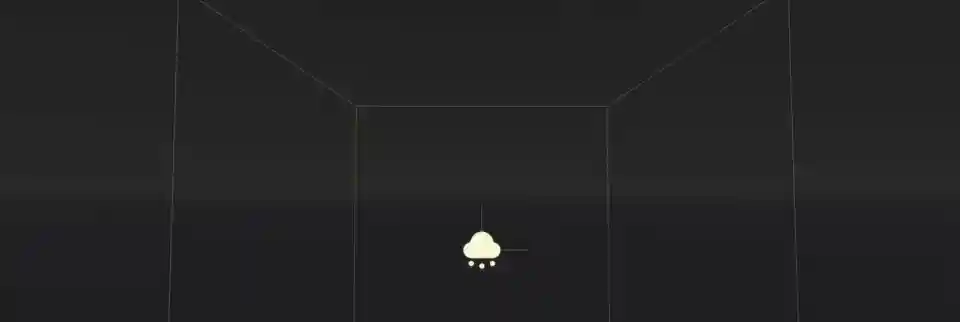
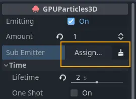
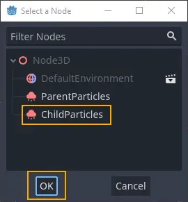

.. _doc_3d_particles_subemitters:

Particle sub-emitters
---------------------

Sometimes a visual effect cannot be created with a single particle system alone.
Sometimes a particle system needs to be spawned as a response to something that happens in
another particle system. Fireworks are a good example of that. They usually consist of
several stages of explosions that happen in sequence. Sub-emitters are a good way to achieve
this kind of effect.

   Click to assign a sub-emitter...

   \...and select one from the scene

A sub-emitter is a particle system that spawns as a child of another particle system.
You can add sub-emitters to sub-emitters, chaining particle effects as deep as you like.

To create a sub-emitter, you need at least two particle systems in the same scene. One of them will be the
parent and one will be set as the child. Find the ``Sub Emitter`` property on the parent
and click the box next to it to assign the sub-emitter. You will see a list of available particle
systems in the scene. Select one and click the confirmation button.

Particle systems from instanced scenes can be set as sub-emitters too, as long as the
``Editable Children`` property is enabled on the instanced scene. This also works the other
way around: You can assign a sub-emitter to a particle system in an instanced scene,
even one coming from a different instanced scene.

.. note::

   When you set a particle system as the sub-emitter of another, the system stops
   emitting, even if the ``Emitting`` property was checked. Don't worry, it didn't break. This happens
   to every particle system as soon as it becomes a sub-emitter. You also won't be able to
   re-enable the property as long as the particle system is used as a sub-emitter.

.. warning::

   Even though the parent particle system can be selected from the list of available particle
   systems, a particle system which is its own sub-emitter does not work in Godot. It will
   simply not spawn. The same is true for any other kind of recursive or self-referential
   sub-emitter setup.

Emitter mode
~~~~~~~~~~~~

When you assign a sub-emitter, you don't see it spawn right away. Emitting is disabled
by default and needs to be enabled first. Set the ``Mode`` property in the ``Sub Emitter`` group
of the :ref:`ParticleProcessMaterial <doc_process_material_properties_subemitter>` to something other than ``Disabled``.

The emitter mode also determines how many sub-emitter particles are spawned. ``Constant``
spawns a single particle at a frequency set by the ``Frequency`` property. For ``At End``
and ``At Collision`` you can set the amount directly with the ``Amount At End`` and the
``Amount At Collision`` properties.

Limitations
~~~~~~~~~~~

One thing to keep in mind is that the total number of active particles from the sub-emitter
is always capped by the ``Amount`` property on the sub-emitter particle system. If you find
that there are not enough particles spawned from the sub-emitter, you might have to increase
the amount in the particle system.

Some emitter properties are ignored when a particle system is spawned as a sub-emitter.
The ``Explosiveness`` property, for example, has no effect. Depending on the emitter mode,
the particles are either spawned sequentially at fixed intervals or explosively all at once.
