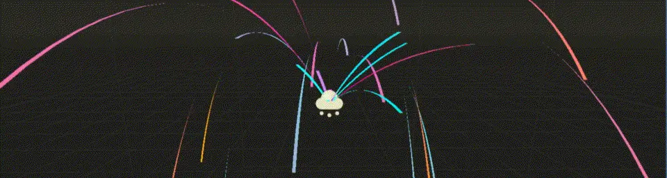
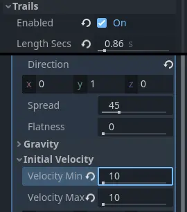
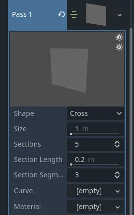
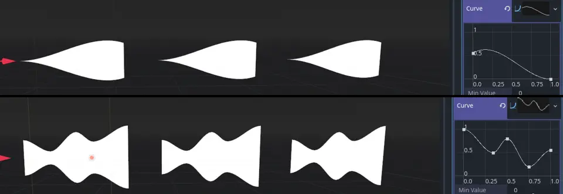
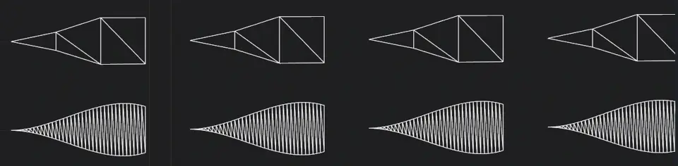
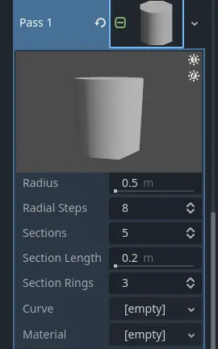
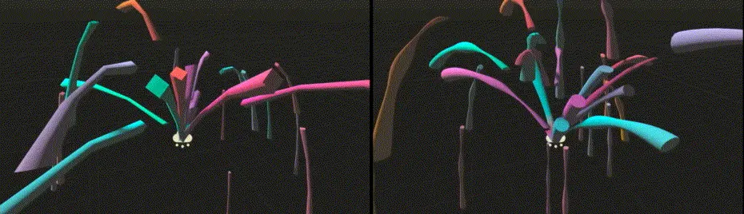
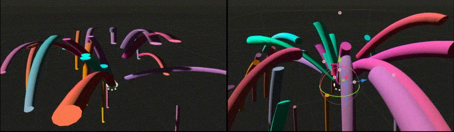

.. _doc_3d_particles_trails:

3D Particle trails
------------------

   Setting up particle trails

Godot provides several types of trails you can add to a particle system. Before you can
work with trails, you need to set up a couple of parameters first. Create a new particle
system and assign a process material :ref:`as described before <doc_creating_3d_particle_system>`.
In the ``Trails`` group of the particle system, check the box next to ``Enabled`` and
increase the emission duration by setting ``Lifetime`` to something like ``0.8``. On
the process material, set ``Direction`` to ``(X=0,Y=1.0,Z=0)`` and ``Initial Velocity`` to
``10.0`` for both ``Min`` and ``Max``.

The only thing that's still missing is a mesh for the draw pass. The type of mesh that you
set here controls what kind of particle trail you will end up with.

Ribbon trails
~~~~~~~~~~~~~

   Important ribbon mesh parameters

The simplest type of particle trail is the ribbon trail. Navigate to the ``Draw Passes``
section and select ``New RibbonTrailMesh`` from the options for ``Pass 1``. A
:ref:`RibbonTrailMesh <class_RibbonTrailMesh>` is a simple quad that is divided into
sections and then stretched and repeated along those sections.

Assign a new :ref:`Standard Material <doc_standard_material_3d>` to the ``Material``
property and enable ``Use Particle Trails`` in the ``Transform`` property group. The
particles should now be emitting in trails.

You have two options for the ribbon mesh ``Shape`` parameter. ``Cross`` creates two
perpendicular quads, making the particle trail a little more three-dimensional. This
really only makes sense if you don't draw the trails in ``Particle Billboard`` mode
and helps when looking at the particles from different angles. The ``Flat`` option
limits the mesh to a single quad and works best with billboard particles.

The ``Size`` parameter controls the trail's width. Use it to make trails wider or
more narrow.

``Sections``, ``Section Length`` and ``Section Segments`` all work together to
control how smooth the particle trail looks. When a particle trail does not travel
in a straight line, the more sections it has the smoother it looks as it bends and swirls.
``Section Length`` controls the length of each section. Multiply this value by
the number of sections to know the trail's total length.

.. figure:: img/particle_ribbon_sections.webp
   :alt: Particle ribbon sections

   3 sections, 1m section length (left) vs. 12 sections, 0.25m section length (right). Notice how the total length of the trails stays the same.

The ``Section Segments`` parameter further subdivides each section into segments.
It has no effect on the smoothness of the trail's sections, though. Instead, it controls
the smoothness of the particle trail's overall shape. The ``Curve`` property defines
this shape. Click the box next to ``Curve`` and assign or create a new curve. The
trail will be shaped just like the curve with the curve's value at ``0.0`` at the
trail's head and the curve's value at ``1.0`` at the trail's tail.

   Particle trails shaped by different curves. The trails move from left to right.

Depending on the complexity of the curve, the particle trail's shape will not look
very smooth when the number of sections is low. This is where the ``Section Segments`` property
comes in. Increasing the amount of section segments adds more vertices to the trail's
sides so that it can follow the curve more closely.

   Particle trail shape smoothness: 1 segment per section (top), 12 segments per section (bottom)

Tube trails
~~~~~~~~~~~

Tube trails share a lot of their properties with ribbon trails. The big difference between them
is that tube trails emit cylindrical meshes instead of quads.

.. figure:: img/particle_tube.webp
   :alt: Particle tube trails

   Tube trails emit cylindrical particles

To create a tube trail, navigate to the ``Draw Passes`` section and select ``New TubeTrailMesh``
from the options for ``Pass 1``. A :ref:`TubeTrailMesh <class_TubeTrailMesh>` is a cylinder
that is divided into sections and then stretched and repeated along those sections. Assign a
new :ref:`Standard Material <doc_standard_material_3d>` to the ``Material`` property and enable
``Use Particle Trails`` in the ``Transform`` property group. The particles should now be emitting
in long, cylindrical trails.

   Important tube mesh parameters

The ``Radius`` and ``Radial Steps`` properties are to tube trails what ``Size`` is to ribbon trails.
``Radius`` defines the radius of the tube and increases or decreases its overall size. ``Radial Steps``
controls the number of sides around the tube's circumference. A higher value increases the resolution
of the tube's cap.

``Sections`` and ``Section Length`` work the same for tube trails and ribbon trails. They control how
smooth the tube trail looks when it is bending and twisting instead of moving in a straight line.
Increasing the number of sections will make it look smoother. Change the ``Section Length`` property
to change the length of each section and with it the total length of the trail. ``Section Rings``
is the tube equivalent of the ``Section Segments`` property for ribbons. It subdivides the sections
and adds more geometry to the tube to better fit the custom shape defined in the ``Curve`` property.

You can shape tube trails with curves, just as you can with ribbon trails. Click the box next to the
``Curve`` property and assign or create a new curve. The trail will be shaped like the curve with
the curve's value at ``0.0`` at the trail's head and the curve's value at ``1.0`` at the trail's tail.

   Particle tube trails with a custom curve shape: 4 radial steps, 3 sections, 1 section ring (left),
   12 radial steps, 9 sections, 3 section rings (right)

An important property you might want to set is ``Transform Align`` in the particle
system's ``Drawing`` group. If you leave it as is, the tubes will not preserve volume; they
flatten out as they move because their Y-axis keeps pointing up even as they change direction.
This can cause a lot of rendering artifacts. Set the property to ``Y to Velocity`` instead
and each particle trail keeps its Y-axis aligned along the direction of its movement.

   Particle tube trails without alignment (left) and with Y-axis aligned to velocity (right)
