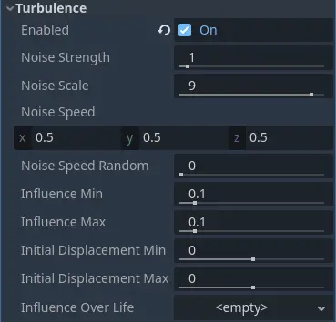
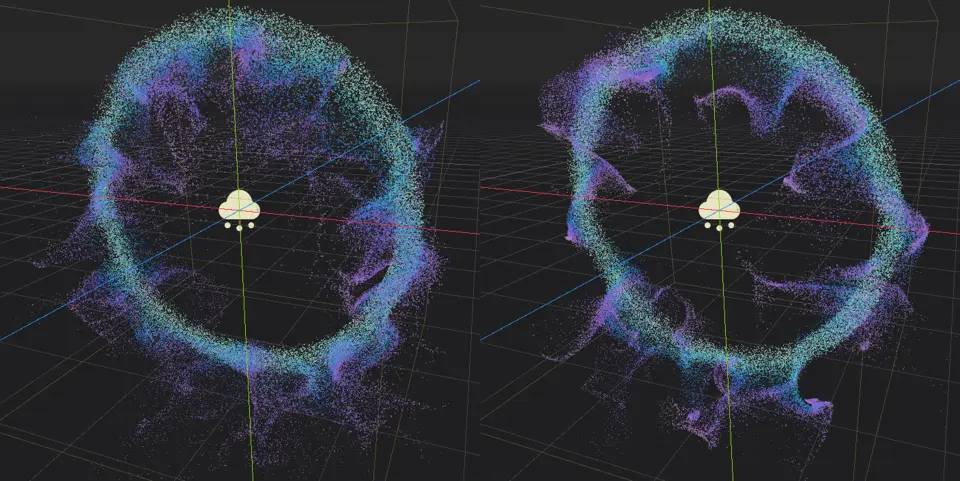
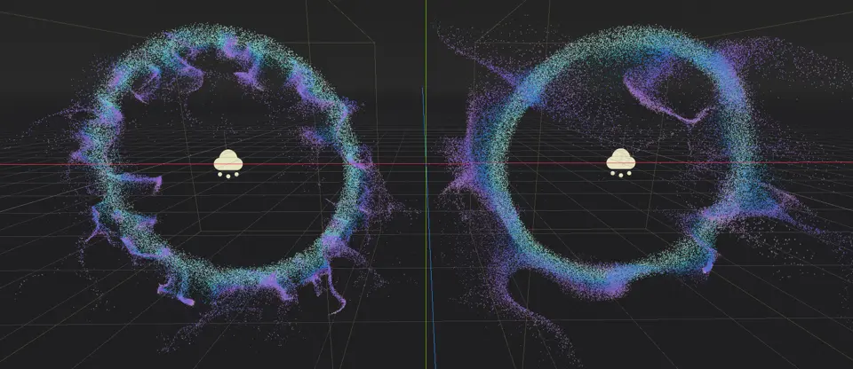
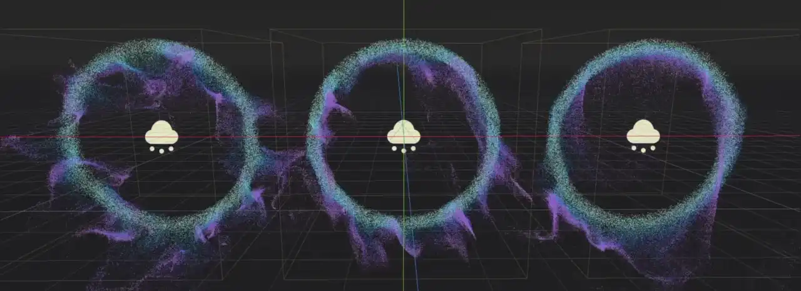
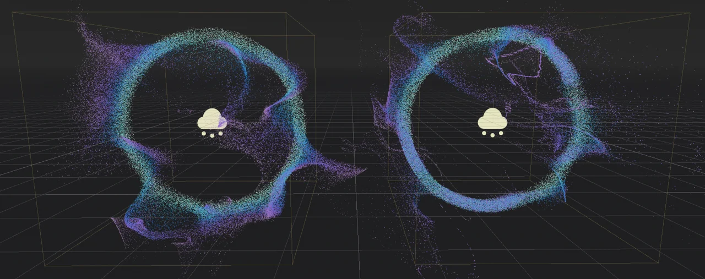
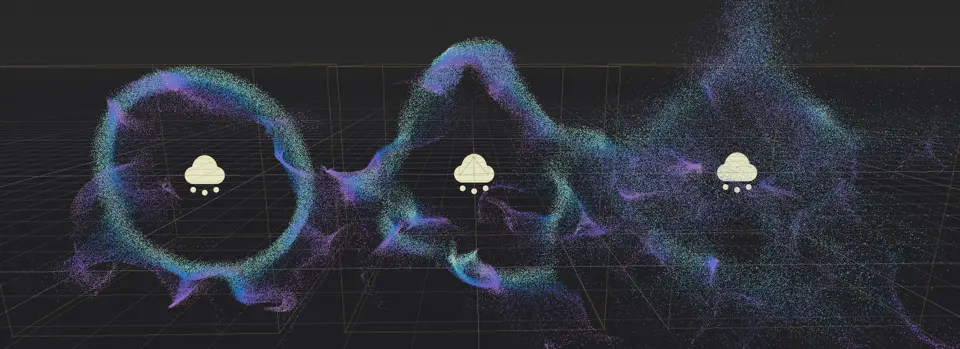

.. _doc_3d_particles_turbulence:

Particle turbulence
-------------------

.. figure:: img/particle_turbulence.webp
   :alt: Particle turbulence

Turbulence uses a noise texture to add variation and interesting patterns to particle movement.
It can be combined with :ref:`particle attractors <doc_3d_particles_attractors>` and
:ref:`collision <doc_3d_particles_collision>` nodes to create even more complex looking behavior.

   Particle turbulence properties

There are two things you have to do before turbulence has any effect on a particle system. First you must
add movement to the particle system. Turbulence modifies a particle's movement
direction and speed, but it doesn't create any. It is enough to give the particle system some
gravity, but you can just as well create a number of attractors if you want the particles
to follow a more complex movement path. Second, you need to :ref:`enable turbulence in the particle process material <doc_process_material_properties_turbulence>`.
Once enabled, you have access to all the turbulence properties.

.. warning::

	Turbulence makes use of 3D noise, which has a high performance cost on the GPU.
	Only enable turbulence on a few particle systems on screen at most.
	Using turbulence is not recommended when targeting mobile/web platforms.

Noise properties
~~~~~~~~~~~~~~~~

The basis for particle turbulence is a noise pattern. There are several
properties that allow you to manipulate different attributes of this pattern.

The ``Noise Strength`` property controls the pattern's contrast, which affects the overall turbulence
sharpness. A lower value creates a softer pattern where individual movement paths are
not as sharply separated from another. Set this to a higher number to make the pattern more
distinct.

   At a value of 1 (left), the noise strength produces softer turbulence patterns than at 20 (right)

The ``Noise Scale`` property controls the pattern's frequency. It basically changes the noise texture's UV scale
where a smaller value produces finer detail, but repeating patterns become noticeable faster. A larger value
results in a weaker turbulence pattern overall, but the particle system can cover a larger area before repetition
starts to become an issue.

   Turbulence noise scale produces finer details at a value of 1.5 (left) than at 6 (right)

The ``Noise Speed`` property takes a vector and controls the noise panning speed and direction.
This allows you to move the noise pattern over time, which adds another layer of movement
variation to the particle system.

.. warning::

   Don't mix up particle movement speed and noise panning speed! They are two different things.
   Particle movement is determined by a number of properties, including the turbulence noise.
   The ``Noise Speed`` property moves the pattern itself, which in turn changes where the
   noise affects the particles.

At a value of ``(X=0,Y=0,Z=0)``, the noise pattern doesn't move at all. The influence on particle
movement stays the same at any given point. Set the speed to ``(X=1,Y=0,Z=0)`` instead, and the
noise pattern moves along the X-axis.

   Different noise speed values. Left\: (X=0,Y=0,Z=0), middle\: (X=0.5,Y=0.5,Z=0.5), right\: (X=0,Y=-2,Z=0).

The ``Noise Speed Random`` property adds some randomness to the noise panning speed. This helps
with breaking up visible patterns, especially at higher panning speeds when repetition becomes
noticeable faster.

Influence properties
~~~~~~~~~~~~~~~~~~~~

The influence properties determine how much each particle is affected by turbulence. Use
``Influence Min`` to set a minimum value and ``Influence Max`` to set a maximum value. When a
particle spawns, the influence is randomly chosen from within this range. You can
also set up a curve with the ``Influence Over Life`` property that modifies that value
over each particle's lifetime. These three properties together control the strength of
the turbulence's effect on the particle system :ref:`as described before <doc_process_material_properties>`.

Since these properties affect the overall influence of the turbulence over a particle system,
both movement direction and speed change as you set different values. A stronger influence causes
a particle to move faster and all particles to follow along narrower paths as a result of that.

   Notice how the particle paths are more narrow and less spread out at high influence values (right)

Displacement properties
~~~~~~~~~~~~~~~~~~~~~~~

Displacement changes a particle's starting position. Use ``Initial Displacement Min`` to set a
lower limit and ``Initial Displacement Max`` to set an upper limit. When a particle spawns, the
amount of displacement is randomly chosen from within this range and multiplied by a random
direction.

Displacement is very useful to break up regular shapes or to create complex shapes from simpler
ones. The only difference between the particle systems in the screenshot below is the value
given to the displacement properties.

   No displacement (left), displacement value of 5 (middle), displacement range [-20, 20] (right)
