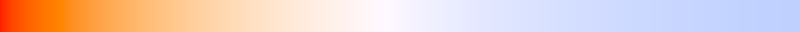

.. _doc_physical_light_and_camera_units:

Physical light and camera units
===============================

Why use physical light and camera units?
----------------------------------------

Godot uses arbitrary units for many physical properties that apply to light like
color, energy, camera field of view, and exposure. By default, these properties
use arbitrary units, because using accurate physical units comes with a few
tradeoffs that aren't worth it for many games. As Godot favors ease of use by
default, physical light units are disabled by default.

Advantages of physical units
^^^^^^^^^^^^^^^^^^^^^^^^^^^^

If you aim for photorealism in your project, using real world units as a basis
can help make things easier to adjust. References for real world materials,
lights and scene brightness are wildly available on websites such as
`Physically Based <https://physicallybased.info/>`__.

Using real world units in Godot can also be useful when porting a scene from
other 3D software that uses physical light units (such as Blender).

Disadvantages of physical units
^^^^^^^^^^^^^^^^^^^^^^^^^^^^^^^

The biggest disadvantage of using physical light units is you will have to pay
close attention to the dynamic range in use at a given time. You can run into
floating point precision errors when mixing very high light intensities with
very low light intensities.

In practice, this means that you will have to manually manage your exposure
settings to ensure that you aren't over-exposing or under-exposing your scene
too much. Auto-exposure can help you balance the light in a scene to bring it
into a normal range, but it can't recover lost precision from a dynamic range
that is too high.

Using physical light and camera units will not automatically make your project
look *better*. Sometimes, moving away from realism can actually make a scene
look better to the human eye. Also, using physical units requires a greater
amount of rigor compared to non-physical units. Most benefits of physical units
can only be obtained if the units are correctly set to match real world
reference.

.. note::

    Physical light units are only available in 3D rendering, not 2D.

Setting up physical light units
-------------------------------

Physical light units can be enabled separately from physical camera units.

To enable physical light units correctly, there are 4 steps required:

1. Enable the project setting.
2. Configure the camera.
3. Configure the environment.
4. Configure Light3D nodes.

Since physical light and camera units only require a handful of calculations to
handle unit conversion, enabling them doesn't have any noticeable performance
impact on the CPU. However, on the GPU side, physical camera units currently
enforce depth of field. This has a moderate performance impact. To alleviate
this performance impact, depth of field quality can be decreased in the advanced
Project Settings.

Enable the project setting
^^^^^^^^^^^^^^^^^^^^^^^^^^

Open the Project Settings, enable the **Advanced** toggle then enable
**Rendering > Lights And Shadows > Use Physical Light Units**. Restart the editor.

Configure the camera
^^^^^^^^^^^^^^^^^^^^

.. warning::

    When physical light units are enabled and if you have a WorldEnvironment
    node in your scene (i.e. the editor Environment is disabled), you **must**
    have a :ref:`class_CameraAttributes` resource assigned to the
    WorldEnvironment node. Otherwise, the 3D editor viewport will appear
    extremely bright if you have a visible DirectionalLight3D node.

On the Camera3D node, you can add a :ref:`class_CameraAttributes`
resource to its **Attributes** property. This resource is used to control the
camera's depth of field and exposure. When using
:ref:`class_CameraAttributesPhysical`, its focal length property is also used to
adjust the camera's field of view.

When physical light units are enabled, the following additional properties
become available in CameraAttributesPhysical's **Exposure** section:

- **Aperture:** The size of the aperture of the camera, measured in f-stops. An
  f-stop is a unitless ratio between the focal length of the camera and the
  diameter of the aperture. A high aperture setting will result in a smaller
  aperture which leads to a dimmer image and sharper focus. A low aperture
  results in a wide aperture which lets in more light resulting in a brighter,
  less-focused image.
- **Shutter Speed:** The time for shutter to open and close, measured in
  *inverse seconds* (``1/N``). A lower value will let in more light leading to a
  brighter image, while a higher value will let in less light leading to a
  darker image. *When getting or setting this property with a script, the unit
  is in seconds instead of inverse seconds.*
- **Sensitivity:** The sensitivity of camera sensors, measured in ISO. A higher
  sensitivity results in a brighter image. When auto exposure is enabled, this
  can be used as a method of exposure compensation. Doubling the value will
  increase the exposure value (measured in EV100) by 1 stop.
- **Multiplier:** A *non-physical* exposure multiplier. Higher values will
  increase the scene's brightness. This can be used for post-processing
  adjustments or for animation purposes.

The default **Aperture** value of 16 f-stops is appropriate for outdoors at
daytime (i.e. for use with a default DirectionalLight3D). For indoor lighting, a
value between 2 and 4 is more appropriate.

Typical shutter speed used in photography and movie production is 1/50 (0.02
seconds). Night-time photography generally uses a shutter around 1/10 (0.1
seconds), while sports photography uses a shutter speed between 1/250 (0.004
seconds) and 1/1000 (0.001 seconds) to reduce motion blur.

In real life, sensitivity is usually set between 50 ISO and 400 ISO for daytime
outdoor photography depending on weather conditions. Higher values are used for
indoor or night-time photography.

.. note::

    Unlike real life cameras, the adverse effects of increasing ISO sensitivity
    or decreasing shutter speed (such as visible grain or light trails) are not
    simulated in Godot.

See :ref:`doc_physical_light_and_camera_units_setting_up_physical_camera_units`
for a description of CameraAttributesPhysical properties that are also available when
**not** using physical light units.

Configure the environment
^^^^^^^^^^^^^^^^^^^^^^^^^

.. warning::

    The default configuration is designed for daytime outdoor scenes. Night-time
    and indoor scenes will need adjustments to the DirectionalLight3D and
    WorldEnvironment background intensity to look correct. Otherwise, positional
    lights will be barely visible at their default intensity.

If you haven't added a :ref:`class_WorldEnvironment` and :ref:`class_Camera3D`
node to the current scene yet, do so now by clicking the 3 vertical dots at the
top of the 3D editor viewport. Click **Add Sun to Scene**, open the dialog again
then click **Add Environment to Scene**.

After enabling physical light units, a new property becomes available to edit in
the :ref:`class_Environment` resource:

- **Background Intensity:** The background sky's intensity in
  `nits <https://en.wikipedia.org/wiki/Candela_per_square_metre>`__
  (candelas per square meter). This also affects ambient and reflected light if
  their respective modes are set to **Background**. If a custom **Background Energy**
  is set, this energy is multiplied by the intensity.

Configure the light nodes
^^^^^^^^^^^^^^^^^^^^^^^^^

After enabling physical light units, 2 new properties become available in Light3D nodes:

- **Intensity:** The light's intensity in `lux
  <https://en.wikipedia.org/wiki/Lux>`__ (DirectionalLight3D) or
  `lumens <https://en.wikipedia.org/wiki/Lumen_(unit)>`__ (OmniLight3D/SpotLight3D).
  If a custom **Energy** is set, this energy is multiplied by the intensity.
- **Temperature:** The light's *color temperature* defined in Kelvin.
  If a custom **Color** is set, this color is multiplied by the color temperature.

**OmniLight3D/SpotLight3D intensity**

Lumens are a measure of luminous flux, which is the total amount of visible
light emitted by a light source per unit of time.

For SpotLight3Ds, we assume that the area outside the visible cone is surrounded
by a perfect light absorbing material. Accordingly, the apparent brightness of
the cone area does *not* change as the cone increases and decreases in size.

A typical household lightbulb can range from around 600 lumens to 1200 lumens.
A candle is about 13 lumens, while a streetlight can be approximately 60000 lumens.

**DirectionalLight3D intensity**

Lux is a measure pf luminous flux per unit area, it is equal to one lumen per
square metre. Lux is the measure of how much light hits a surface at a given
time.

With DirectionalLight3D, on a clear sunny day, a surface in direct sunlight may
receive approximately 100000 lux. A typical room in a home may receive
approximately 50 lux, while the moonlit ground may receive approximately 0.1
lux.

**Color temperature**

6500 Kelvin is white. Higher values result in colder (bluer) colors, while lower
values result in warmer (more orange) colors.

The sun on a cloudy day is approximately 6500 Kelvin. On a clear day, the sun is
between 5500 to 6000 Kelvin. On a clear day at sunrise or sunset, the sun ranges
to around 1850 Kelvin.

   Color temperature chart from 1,000 Kelvin (left) to 12,500 Kelvin (right)

Other Light3D properties such as **Energy** and **Color** remain editable for
animation purposes, and when you occasionally need to create lights with
non-realistic properties.

.. _doc_physical_light_and_camera_units_setting_up_physical_camera_units:

Setting up physical camera units
--------------------------------

Physical camera units can be enabled separately from physical light units.

After adding a :ref:`class_CameraAttributesPhysical` resource to the **Camera
Attributes** property of a Camera3D nodes, some properties such as **FOV** will
no longer be editable. Instead, these properties are now governed by the
CameraAttributesPhysical's properties, such as focal length and aperture.

CameraAttributesPhysical offers the following properties in its **Frustum** section:

- **Focus Distance:** Distance from camera of object that will be in focus,
  measured in meters. Internally, this will be clamped to be at least 1
  millimeter larger than the **Focal Length**.
- **Focal Length:** Distance between camera lens and camera aperture, measured
  in millimeters. Controls field of view and depth of field. A larger focal
  length will result in a smaller field of view and a narrower depth of field
  meaning fewer objects will be in focus. A smaller focal length will result in
  a wider field of view and a larger depth of field, which means more objects will be
  in focus. This property overrides the Camera3D's **FOV** and **Keep Aspect**
  properties, making them read-only in the inspector.
- **Near/Far:** The near and far clip distances in meters. These behave the same
  as the Camera3D properties of the same name. Lower **Near** values allow the
  camera to display objects that are very close, at the cost of potential
  precision (Z-fighting) issues in the distance. Higher **Far** values allow the
  camera to see further away, also at the cost of potential precision
  (Z-fighting) issues in the distance.

The default focal length of 35 mm corresponds to a wide angle lens. It still
results in a field of view that is noticeably narrower compared to the default
"practical" vertical FOV of 75 degrees. This is because non-gaming use cases
such as filmmaking and photography favor using a narrower field of view for a
more cinematic appearance.

Common focal length values used in filmmaking and photography are:

- **Fisheye (ultrawide angle):** Below 15 mm. Nearly no depth of field visible.
- **Wide angle:** Between 15 mm and 50 mm. Reduced depth of field.
- **Standard:** Between 50 mm and 100 mm. Standard depth of field.
- **Telephoto:** Greater than 100 mm. Increased depth of field.

Like when using the **Keep Height** aspect mode, the effective field of view
depends on the viewport's aspect ratio, with wider aspect ratios automatically
resulting in a wider *horizontal* field of view.

Automatic exposure adjustment based on the camera's average brightness level can
also be enabled in the **Auto Exposure** section, with the following properties:

- **Min Sensitivity:** The darkest brightness the camera is allowed to get to,
  measured in EV100.
- **Max Sensitivity:** The brightest the camera is allowed to get to, measured in EV100.
- **Speed:** The speed of the auto exposure effect. Affects the time needed for
  the camera to perform auto exposure. Higher values allow for faster
  transitions, but the resulting adjustments may look distracting depending on
  the scene.
- **Scale:** The scale of the auto exposure effect. Affects the intensity of
  auto exposure.

EV100 is an exposure value (EV) measured at an ISO sensitivity of 100. See
`this table <https://en.wikipedia.org/wiki/Exposure_value#Tabulated_exposure_values>`__
for common EV100 values found in real life.
