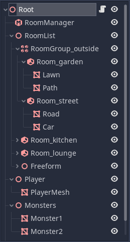
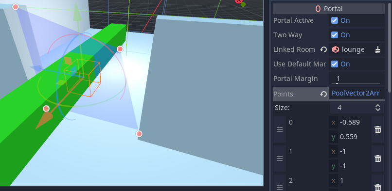
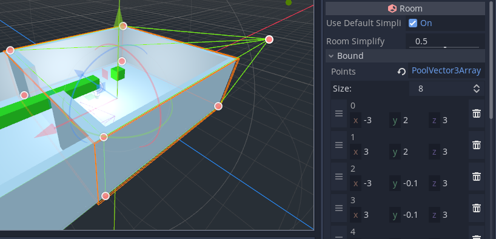

Editing Rooms and Portals
=========================

Example SceneTree
~~~~~~~~~~~~~~~~~

Putting all the ideas together, here is an example scene tree:

- We have used a :ref:`RoomGroup<class_RoomGroup>` to denote an outside area.
- The :ref:`MeshInstance<class_MeshInstance>`\ s inside the :ref:`Room<class_Room>`\ s are either ``STATIC`` or ``DYNAMIC``.
- We have created a :ref:`Spatial<class_Spatial>` (I decided to call it 'Freeform', but you could use any name) under which to place ``STATIC`` and ``DYNAMIC`` objects that will be autoplaced in rooms
  (Freeform is inside the ``roomlist``, but *not* inside a room.)
- The player and the monsters are on branches *OUTSIDE* the ``roomlist``.
- The player and monster meshes have portal mode ``ROAMING`` so they can be in any room.
- The camera is outside the ``roomlist``.

.. _doc_rooms_and_portals_blender:

Creating room systems in Blender (or other modeling tools)
~~~~~~~~~~~~~~~~~~~~~~~~~~~~~~~~~~~~~~~~~~~~~~~~~~~~~~~~~~

Although you can create your room system entirely within the editor, you can also build rooms and portals within your modeling tool. There is one small snag - modeling tools such as Blender have no knowledge of Room, RoomGroup and Portal nodes. In order to work around this we use a series of naming conventions. The first time Godot encounters these specially named nodes, it will convert them into Rooms, RoomGroups and Portals.

Postfix convention
^^^^^^^^^^^^^^^^^^

- ``-room`` becomes a :ref:`Room<class_Room>`.
- ``-roomgroup`` becomes a :ref:`RoomGroup<class_RoomGroup>`.
- ``-portal`` becomes a :ref:`Portal<class_Portal>`.
- ``-bound`` becomes a manual bound.

Rooms and RoomGroups should be created as Empties within Blender. Any mesh children of the ``-room`` Empty will thus be placed in the Room during conversion in Godot.

For example:

- ``kitchen-room`` - create a Room called "kitchen".
- ``outside-roomgroup`` - create a RoomGroup called "outside".
- ``kitchen-portal`` - create a Portal leading to the "kitchen" Room.

Portals
^^^^^^^

Portals are different from Rooms. In Portals, we need to specify the geometry of the Portal in our modelling tool, in addition to just the name. To do this your "portal-to-be" should be created as a Mesh.

Portal meshes have some restrictions to work properly. They must be convex, and the polygon points should be in the same plane. The accuracy to the plane does not have to be exact, as Godot will automatically average the direction of the portal plane. Once converted to a :ref:`Portal<class_Portal>` node, the snapping to the portal plane is enforced, and the vertices are specified (and editable) as 2D coordinates in the inspector, rather than 3D points.

The portal's naming is quite important. You can either name the portal ``-portal`` which will attempt to autolink the Portal in Godot, or you can use the name of the Room you wish to link the Portal to as a prefix.

Wildcard
^^^^^^^^

In most cases, this can be done using a name such as ``kitchen-portal``. However, there is one problem. Blender and Godot do not deal well when you have multiple objects with the same name. What happens when we want more than one Portal to lead to the kitchen?

The workaround is the use of a *wildcard* character, ``*``. When Godot reads the wildcard, it will ignore anything placed after it in the name.

This means we can use the following portal names:

- ``kitchen*1-portal`` - creates a Portal leading to the "kitchen".
- ``kitchen*2-portal`` - also creates a Portal leading to the "kitchen".
- ``kitchen*anything_you_want_here-portal`` - also works.

Wildcards work on all of the nodes which use these naming conventions.

Manual bounds
^^^^^^^^^^^^^

Manual bounds are a way of explicitly setting the convex hull for a room, and are used if they are present as children of a room in the scene tree. Aside from the postfix, the naming is unimportant. They should be meshes (i.e. MeshInstance in Godot). Bear in mind they will be converted to convex hulls during the conversion process, so they don't have to be perfect.

.. tip:: Once used during conversion, they will be converted to the ``IGNORE`` **Portal Mode** and won't be shown. You can alternatively use **Generate Points** within the editor to convert these to a set of points stored in the room, and delete the original ``-bound`` MeshInstance.

Portal point editing
~~~~~~~~~~~~~~~~~~~~

Portals are defined by a combination of the transform of the portal node, and by a set of points which form the corners.

The default portal has 4 corners as shown in the inspector:

You can edit these points in the gizmo or inspector to make a better match to the opening in your game level. It's generally better to keep the number of points as low as possible for the efficiency of the system. For example, it's better to risk rendering a little too much than to spend the time culling objects at 20 different edges.

.. _doc_room_point_editing:

Room point editing
~~~~~~~~~~~~~~~~~~

You also have the option to manually edit the points used to define the convex hull of a room. These points are not present by default. You would typically create them by pressing the **Generate Points** button in the editor toolbar when a room is selected. This will transfer the auto bound from the geometry (or manual ``-bound`` mesh) into the inspector. Once there are points in the inspector, they will be used and override any other method. So if you wish to revert your manual editing, delete all the room's points.

Manually editing points can be useful in some situations, especially where the auto-bound doesn't *quite* get the right result you want. It is usually a good idea to use a lot of **Simplification** in the inspector for the Room before generating the points. Be aware though that by default, the **Simplification** value will be inherited from the RoomManager.

RoomManager
~~~~~~~~~~~

Show Debug
^^^^^^^^^^

This can be used to control the amount of logging, especially the room conversion logs. Debug will always be set to ``false`` on exported projects.

Debug Sprawl
^^^^^^^^^^^^

This mode will only display meshes that are sprawling through portals from the current camera room. Large statics that cross portals are usually the ones you want to sprawl. Typical examples might be terrain mesh areas, or large floor or ceiling meshes. You usually don't want things like door frames to sprawl to the adjacent room - that is what fine tuning the **Portal Margin** is for.

Merge Meshes
^^^^^^^^^^^^

To keep drawcalls to a minimum, the system offers the option to automatically merge similar ``STATIC`` meshes within a room (also known as *static batching*). This can increase performance in many cases. The culling accuracy is reduced, but as a room is a fairly logical unit for culling, this trade off usually works in your favor.

Plane Simplification
^^^^^^^^^^^^^^^^^^^^

In some cases, the convex hulls automatically generated for rooms may contain a very large number of planes, particularly if you use curved surfaces. This is not ideal because it slows down the system. This option can optionally simplify hulls. The degree of simplification can be selected by the user, between ``0`` (no simplification) and ``1`` (maximum simplification). You can also override this value in individual rooms.

Portals
~~~~~~~

Portal Active
^^^^^^^^^^^^^

Portals can be turned on and off at runtime. This is especially useful if you have doors that can open and close.

Two Way
^^^^^^^

Portals can either be two-way or one-way. The default two-way portals are quicker to set up in most circumstances, but one-way portals can be useful in some cases. For example, you can use one-way portals to create windows that can be seen out of, but not seen into. This can help performance when viewing buildings from outdoors.

Particle Systems
~~~~~~~~~~~~~~~~

Be aware that when placing ``STATIC`` particle systems, the AABB on conversion may have zero size. This means the particle system may be unexpectedly culled early. To prevent this, either set the particle system ``portal mode`` to ``DYNAMIC``, or alternatively, add an **Extra Cull Margin** to the particle system in the Geometry Inspector.

Multimeshes
~~~~~~~~~~~

Note that multimeshes will be culled as a group, rather than individually. You should therefore attempt to keep them localised to the same area wherever possible.
