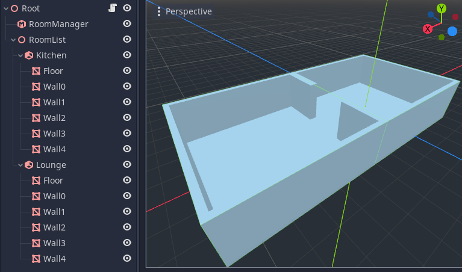
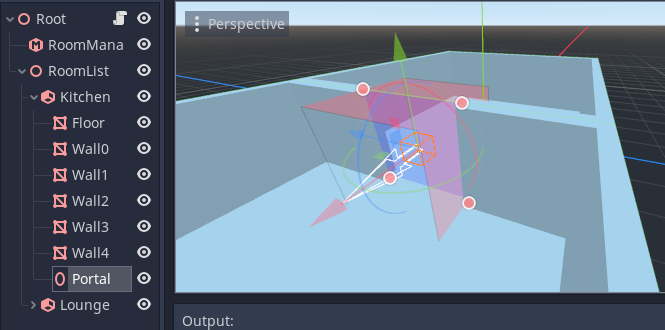
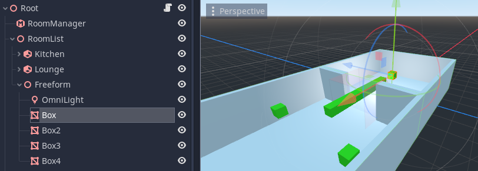
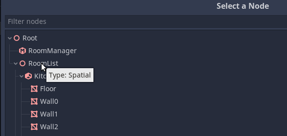
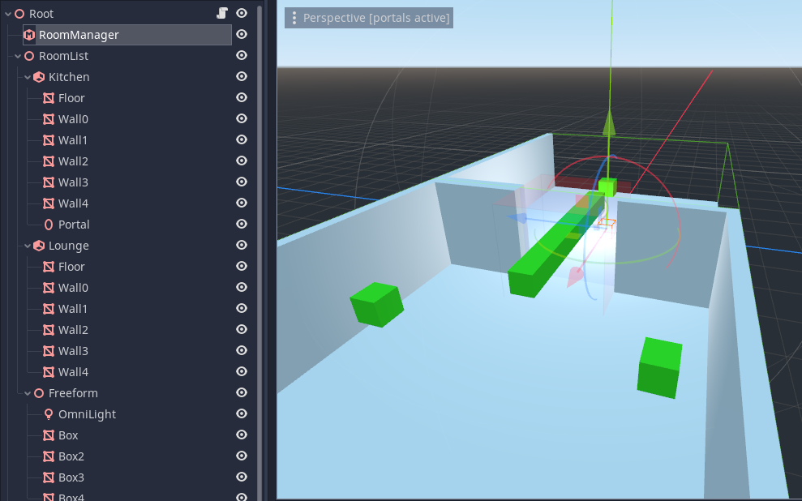

Rooms and Portals example
=========================

Download this tutorial project:
`Simple Portals Example <https://github.com/lawnjelly/godot-demo-projects/tree/portals_simple_demo/3d/portals/room_and_portals_simple_example>`_
.

Introduction
~~~~~~~~~~~~

This tutorial will introduce you to building a "Hello World" room system with two rooms, and a portal in between.

Step 1
~~~~~~

.. image:: tutorial_simple/img/tutorial_simple_1.png

- Create a new project.
- Add a :ref:`Spatial<class_Spatial>` as the scene root (on the screenshot, it's called "Root").
- Next add a :ref:`RoomManager<class_RoomManager>` node. We will need this later to process the room system.
- Next we need to start defining our rooms. We create all our rooms under another Spatial we have called 'RoomList'.
- Add a new :ref:`Room<class_Room>` node as a child of the roomlist.
- We have named the room ``Kitchen``.
- We will now create the geometry of our room. The names you give to the geometry is up to you.
- Create a :ref:`MeshInstance<class_MeshInstance>` for the floor. Create a box by adding a CubeMesh resource to the MeshInstance. Scale and position it to form a floor.
- Create MeshInstances for the walls. Create more box meshes for this, then scale and position them. Be sure to leave an opening on one side. You will need to create two wall segments to do this on that side.

Step 2
~~~~~~

- Now we need to create the other room.
- You can do this simply by duplicating the first room (select the ``Kitchen`` node, right click and choose **Duplicate**).
- Rotate and position the second room so that the openings line up.
- Rename the second room to ``Lounge``.

Step 3
~~~~~~

- Next, we will add a portal between the two rooms.
- Create a new :ref:`Portal<class_Portal>` in the kitchen.
- Scale and position the portal using the node ``Transform`` in the inspector, so it fits within the opening between the two rooms.
- The portal plane should face *outward* from the source room, i.e. towards the lounge. This direction is indicated by the arrow in the editor gizmo, and portal gizmo's color.

Step 4
~~~~~~

- To make things more exciting, we want to add a few more boxes to the rooms.
- Placing these boxes as children or grandchildren of the room nodes explicitly tells the system which room the objects should be in. However, we can also create these objects *outside* the rooms. Provided they are in the RoomList branch, the system will attempt to automatically place them in the correct room at runtime.
- On the screenshot, the boxes were places as children of a Spatial I have called ``Freeform`` to keep things tidy.
- Boxes also have a green SpatialMaterial assigned to them to make them stand out more from the rest of the room.
- Let's also create an :ref:`OmniLight<class_OmniLight>` so it will be autoplaced in one of the rooms.

Step 5
~~~~~~

- Next comes a crucial stage. We must let the RoomManager know where the rooms are!
- Select the RoomManager and look in the Inspector window in the **Paths** section.
- You need to assign the **Room List** to point to the RoomList node we created earlier (which is the parent of all the rooms).

Step 6
~~~~~~

- Make sure you have saved your project before this next step. It is always a good idea to save and make a backup before converting.
- Select the RoomManager, and you will see a button in the toolbar at the top of the 3d editor viewport called **Convert Rooms**. Press this button.
- If all goes well, the RoomManager will have created the runtime data (the *room graph*) to perform occlusion culling at runtime.
- You can see a log of the conversion process in the output window. This is helpful for finding problems.
- If you now move the editor camera inside the rooms, you should see the meshes in the opposite room being culled depending on what you can see through the portal.

Conclusion
~~~~~~~~~~

This concludes this simple tutorial. Don't be afraid to experiment with the new room system you have created.

Some things to try
^^^^^^^^^^^^^^^^^^

- Create different types of geometry. CSG nodes, Particle systems, and Multimeshes are all supported by the portal system.
- Try creating a Camera and adding it to the scene. If you run the scene you will notice that the portal culling is not active. This is because the ``room graph`` must be created each time you load a level, by converting the rooms. Instead of using a button in the editor, in real games you call a function in the RoomManager to convert the level, called ``rooms_convert()``. Try this out with a script, perhaps running within a ``_ready()`` function.
- The geometry you created so far is all ``STATIC`` (non-moving). If you look in the inspector for geometry nodes, you will see they derive from ``CullInstance``. Here you can set the **Portal Mode** for objects in the portal system. This determines how the node is processed.
- If you now write a script to move one of your objects within a room and view it through a Camera as the scene runs, you may notice that the object gets culled incorrectly. This is because ``STATIC`` objects are assumed not to move in the system. If you instead change the object to ``DYNAMIC``, it should now update the culling correctly.
- There are several ``portal_modes``, these are described in the main documentation.
- Try turning the portal on and off at runtime from your script. You can call ``set_portal_active()`` to open and close the portal.
- If you select the portal, you should see 4 handles appear. Try dragging the portal points with the mouse, and see how it affects the objects that are culled.
- If you select a room and click the **Generate Points** button in the toolbar, it will store the points of the room hull in the room inspector. You can now edit these with the gizmo handles.
