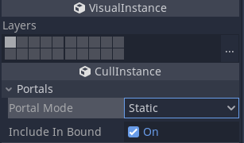
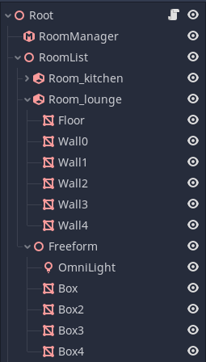

Using objects in Rooms and Portals
==================================

Normally, when you use Godot, all objects that you can see (:ref:`VisualInstance<class_VisualInstance>`\ s) are treated in the same way by the engine. The portal renderer is slightly different, in that it makes a distinction between the different roles objects will have in your game. It makes this distinction to define the :ref:`Room<class_Room>`\ s, and to render and process everything in the most efficient way.

Portal mode
~~~~~~~~~~~

If you look in the inspector, every VisualInstance in Godot is derived from a :ref:`CullInstance<class_CullInstance>`, where you can set a ``PortalMode``. This determines how objects will behave in the portal system.

STATIC
^^^^^^

The default mode for objects is ``STATIC``. Static objects are objects within rooms that will not move throughout the lifecycle of the level. Things like floors, walls, ceilings are good candidates for ``STATIC`` objects.

DYNAMIC
^^^^^^^

Dynamic mode is for objects that are expected to move during the game. But there is a limitation - **they must not move outside of their original room**. These objects are handled very efficiently by the system. Examples might include moving platforms, and elevators.

ROAMING
^^^^^^^

Roaming mode is for objects that can move between rooms. Things like players and enemies should be marked as roaming. These are more expensive to calculate than ``STATIC`` or ``DYNAMIC`` modes, because the system has to keep track of which room a roaming object is within.

GLOBAL
^^^^^^

Global mode is for objects that you don't want occlusion culled at all. Things like a main player's weapon, bullets and some particle effects are good candidates for ``GLOBAL`` mode.

IGNORE
^^^^^^

Ignore is a special mode for objects that will be essentially free in the system. Manual bounds (``-bound``) get converted to ignore portal mode automatically. They don't need to show up during the game, but are kept in the scene tree in case you need to convert the level multiple times (e.g. in the Editor). You might also choose to use this for objects that you *only* want to show up in the editor (when RoomManager is inactive).

Should you place objects within rooms (in the scene tree) or not?
^^^^^^^^^^^^^^^^^^^^^^^^^^^^^^^^^^^^^^^^^^^^^^^^^^^^^^^^^^^^^^^^^

``STATIC`` and ``DYNAMIC`` objects are ideally placed within rooms in the scene tree. The system needs to know which room they are in during conversion as it assumes they will never change room. Placing them within rooms in the scene tree allows you to explicitly tell the system where you want them.

Autoplace
^^^^^^^^^

However, for ease of use, it is also possible to place ``STATIC`` and ``DYNAMIC`` objects *outside* the rooms in the scene tree, but within the RoomList branch. The system will attempt to **autoplace** the objects into the appropriate room. This works in most cases but if in doubt, use the explicit approach. The explicit approach is especially needed when dealing with internal rooms, which have some restrictions for sprawling objects.

Note that if you place ``STATIC`` and ``DYNAMIC`` objects outside of rooms, they will not contribute to the room bound. If you are using the room geometry to derive the bound, tables and chairs can be placed outside the room. However, walls and floors should be explicitly within the Room's branch of the scene tree to ensure the bound is correct.

``ROAMING`` and ``GLOBAL`` objects are recommended to be kept in a branch of the scene tree outside of any rooms or the RoomList. They *can* be placed inside the rooms, but to save confusion, they are normally better kept on their own branch. There are no restrictions on the placement of ``IGNORE`` objects.

Object Lifetimes
^^^^^^^^^^^^^^^^

It is important to note that the lifetime of ``STATIC`` and ``DYNAMIC`` objects is tied to the lifetime of the level, between when you call ``rooms_convert()`` to activate the portal system, and calling ``rooms_clear()`` to unload the system. This is because quite a bit of pre-processing goes on during the conversion phase in order to render them efficiently.

You should therefore not try to create or delete ``STATIC`` or ``DYNAMIC`` objects while the portal system is active. Doing so will cause the system to automatically unload because it is in an invalid state. You can however, freely ``show()`` and ``hide()`` these objects.

The sequence should be therefore:

- Load your level.
- Place any ``STATIC`` or ``DYNAMIC`` objects.
- Then run ``rooms_convert()`` *after* all the ``STATIC`` and ``DYNAMIC`` objects were added to the scene tree.

Objects that are ``ROAMING``, ``GLOBAL`` or ``IGNORE`` can be freely created and deleted as required.

Sprawling
~~~~~~~~~

Although users can usually ignore the internals of the portal system, they should be aware that it is capable of handling objects that are so big they end up in more than one room. Each object has a central room, but using the AABB or geometry the system can detect when an object extends across a portal into a neighbouring room (or several rooms). This is referred to as **sprawling**.

This means that if the corner of an object extends into a neighbouring room, but the object's main room is not showing (e.g. a train where the end is in a different room), the object will not be culled, and will still be shown. The object will only be culled if it is not present in any of the rooms that are visible.

Portal Margins
^^^^^^^^^^^^^^

It is hard to place objects exactly at the edges of rooms, and if we chose to sprawl objects to the adjacent room the moment a portal was crossed (even by a very small amount), there would be an unnecessary amount of sprawling, and objects would end up being rendered when not really required. To counter this, portals have an adjustable ``margin`` over which an object can cross without being considered in the next room. The margin is shown in the editor gizmo as a red translucent area.

You can set the margin globally in the RoomManager. You can also override this margin value in any portal if you need to finetune things. As you edit the margin values in the inspector, you should see the margins update in the 3D editor viewport.

Include in Bound
^^^^^^^^^^^^^^^^

The support for objects that are larger than a single room has one side effect. You may not want to include some objects in the calculation of the automatic room bound. You can turn this on and off in the inspector for each object. See **Cull Instance > Include In Bound**.

While sprawling works great for large moving objects, it also gives you a lot more leeway in level design. You can for instance create a large terrain section and have it present in multiple rooms, without having to split up the mesh.

Lighting
~~~~~~~~

In general lights are handled like any other visual instance. They can be placed in rooms, and they will sprawl to affect neighbouring rooms, following the dimensions and direction of the light. The exception to this is :ref:`DirectionalLight<class_DirectionalLight>`\ s. DirectionalLights have no source room as they affect *everywhere*. They should therefore not be placed in a room. As DirectionalLights can be expensive, it is a good idea to turn them off when inside, see the later :ref:`doc_rooms_and_portals_roomgroups` section for details on how to do this.

Congratulations! You have now mastered the intermediate techniques required to use rooms and portals. You can use these to make games already, but there are many more features.
