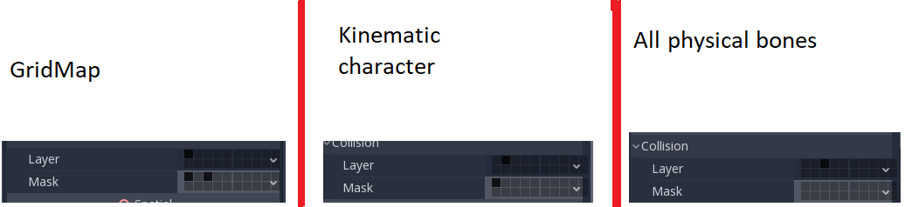

.. _doc_ragdoll_system:

Ragdoll system
==============

Introduction
------------

A ragdoll is the use of physics body's simulation to control the bone of a mesh. It is used for death animations in many games and other kind of physics-based animation. Godot has a built-in ragdoll system. We will be using the Platformer3D demo to demonstrate the set up of a ragdoll.

.. note:: You can download the Platformer3D demo on `GitHub <https://github.com/godotengine/godot-demo-projects/tree/master/3d/platformer>`_ or the `Asset Library <https://godotengine.org/asset-library/asset/125>`_.

Setting up the ragdoll
----------------------

Create physical bones
~~~~~~~~~~~~~~~~~~~~~

Similar to many godot's features, there is a node for setting up a ragdoll. You will be using a :ref:`PhysicalBone <class_PhysicalBone>` node. To simplify the set up, you can create the required physical bones with the feature "Create physical skeleton" in the skeleton node.

In the demo, select the skeleton node (in the player scene of Robi the robot). You will notice that a skeleton button appears on the top bar menu:

.. image:: img/ragdoll_menu.png

Click it and select the Create physical skeleton option. The engine will automatically generate physical bones (with their own shape) for each bone of the skeleton and pin joints for connecting the physical bones.

.. image:: img/ragdoll_bones.png

Clean up the skeleton
~~~~~~~~~~~~~~~~~~~~~

In the picture above, there are unnecessary physical bones like the MASTER bone, your next step is to clean up our skeleton by removing these physical bones.

.. note:: The rule is to remove all physical bones that are too small to make a difference in the simulation and all utility bones (like the MASTER bone in this case).

.. note:: For example, if we take a humanoid skeleton where the hand is comprised of many bones, it's really useless and wasteful to maintain all bones of the hand. One important thing to do in this case is to remove all physical bones and replace them by one or two bones to simulate the hand.

Remove these physical bones : MASTER, waist, neck, headtracker. The goal is to maintain an optimized skeleton structure for easy control.

Collision shape adjustment
~~~~~~~~~~~~~~~~~~~~~~~~~~

After cleaning up the unnecessary physical bones, you next task is adjust the collision shape and/or the size of physical bones in order to match the part of body that each bone should simulate.

.. image:: img/ragdoll_shape_adjust.gif

Joints adjustment
~~~~~~~~~~~~~~~~~

After the collision shapes adjustment, your ragdoll is ready for simulation.

.. note:: To achieve a better simulation, you should adjust the default pin joints.

The joint assigned by default is Pin Joint that doesn't has any constraint. To change it, select the physical bone then change the type of constraint in the Joint section. It's possible to change the orientation of constraint and limits.

.. image:: img/ragdoll_joint_adjust.gif

This is the final result

.. image:: img/ragdoll_result.png

Simulating the ragdoll
----------------------

You have correctly set up the ragdoll and the ragdoll is ready for simulation. You will need a script for running the simulation.

To start the simulation, attach a script to the skeleton node and write down this code:

.. tabs::
 .. code-tab:: gdscript GDScript

    func _ready():
        physical_bones_start_simulation()

To stop it you can call the function ``physical_bones_stop_simulation()``.

.. image:: img/ragdoll_sim_stop.gif

To simulate only few parts of the body, passing the bone name as parameter.

This is the result of partial simulation.

.. image:: img/ ragdoll_sim_part.gif

Collision layer and mask
~~~~~~~~~~~~~~~~~~~~~~~~

.. note:: To avoid the collision between the physical bones and the kinematic capsule but allow the collision between the physical bones and the ground, you need to set up the layer and mask properly.

.. note:: Don't know what is collision layer and mask? Read more about it in :ref:`doc_physics_introduction`.
