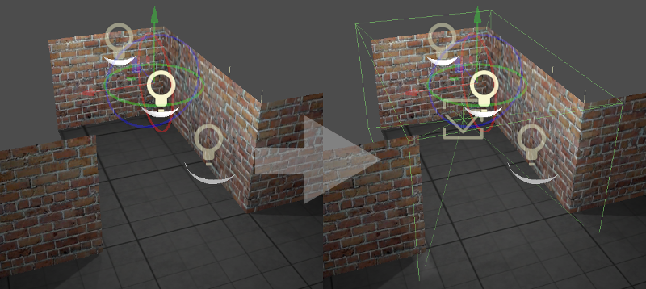
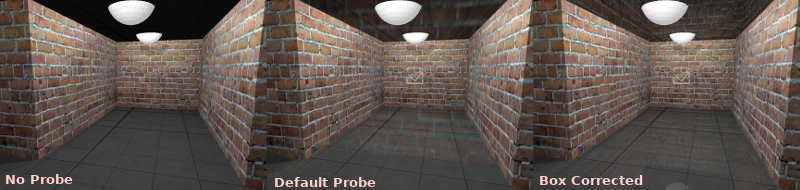
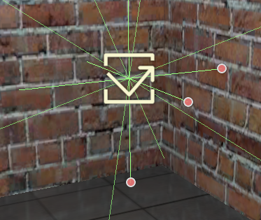
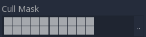
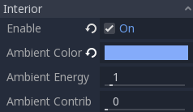
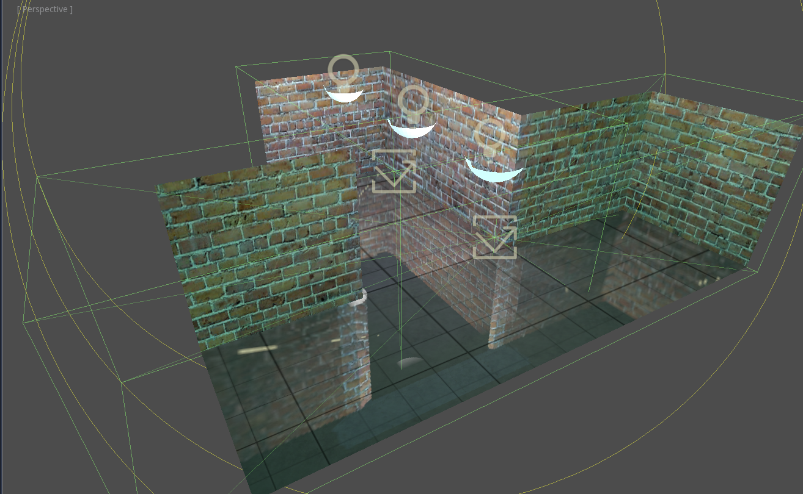
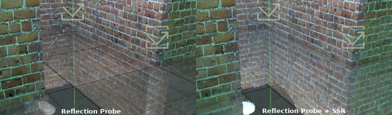
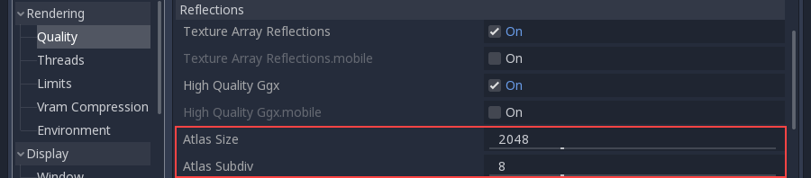

.. _doc_reflection_probes:

Reflection probes
=================

Introduction
------------

As stated in the :ref:`doc_spatial_material`, objects can show reflected or diffuse light.
Reflection probes are used as a source of reflected and ambient light for objects inside their area of influence.

A probe of this type captures the surroundings (as a sort of 360 degrees image), and stores versions
of it with increasing levels of *blur*. This is used to simulate roughness in materials, as well as ambient lighting.

While these probes are an efficient way of storing reflections, they have a few shortcomings:

* They are efficient to render, but expensive to compute. This leads to a default behavior where they only capture on scene load.
* They work best for rectangular shaped rooms or places, otherwise the reflections shown are not as faithful (especially when roughness is 0).

Setting up
----------

Create a ReflectionProbe node and wrap it around the area where you want to have reflections:

This should result in immediate local reflections. If you are using a Sky texture,
reflections are by default blended with it.

By default, on interiors, reflections may appear not to have much consistence.
In this scenario, make sure to tick the *"Box Correct"* property.

This setting changes the reflection from an infinite skybox to reflecting
a box the size of the probe:

Adjusting the box walls may help improve the reflection a bit, but it will
always look best in box shaped rooms.

The probe captures the surrounding from the center of the gizmo. If, for some
reason, the room shape or contents occlude the center, it
can be displaced to an empty place by moving the handles in the center:

By default, shadow mapping is disabled when rendering probes (only in the
rendered image inside the probe, not the actual scene). This is
a simple way to save on performance and memory. If you want shadows in the probe,
they can be toggled on/off with the *Enable Shadow* setting:

Finally, keep in mind that you may not want the Reflection Probe to render some
objects. A typical scenario is an enemy inside the room which will
move around. To keep objects from being rendered in the reflections,
use the *Cull Mask* setting:

Interior vs exterior
--------------------

If you are using reflection probes in an interior setting, it is recommended
that the **Interior** property be enabled. This stops
the probe from rendering the sky and also allows custom ambient lighting settings.

When probes are set to **Interior**, custom constant ambient lighting can be
specified per probe. Just choose a color and an energy.

Optionally, you can blend this ambient light with the probe diffuse capture by
tweaking the **Ambient Contribution** property (0.0 means pure ambient color,
while 1.0 means pure diffuse capture).

Blending
--------

Multiple reflection probes can be used, and Godot will blend them where they overlap using a smart algorithm:

As you can see, this blending is never perfect (after all, these are
box reflections, not real reflections), but these artifacts
are only visible when using perfectly mirrored reflections.
Normally, scenes have normal mapping and varying levels of roughness, which
can hide this.

Alternatively, Reflection Probes work well blended together with Screen Space
Reflections to solve these problems. Combining them makes local reflections appear
more faithful, while probes are only used as a fallback when no screen-space information is found:

Finally, blending interior and exterior probes is the recommended approach when making
levels that combine both interiors and exteriors. Near the door, a probe can
be marked as *exterior* (so it will get sky reflections) while on the inside, it can be interior.

Reflection atlas
----------------

In the current renderer implementation, all probes are the same size and
are fit into a Reflection Atlas. The size and amount of probes can be
customized in Project Settings -> Quality -> Reflections

The default setting of Atlas Subdiv: 8 will allow up to 16 reflection probes in a scene. This value needs to be increased if you need more reflection probes.

