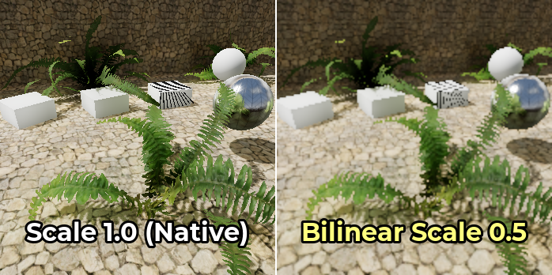
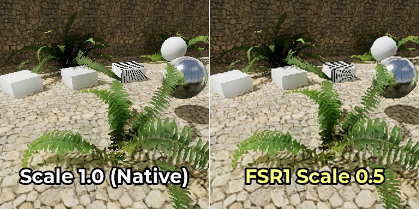
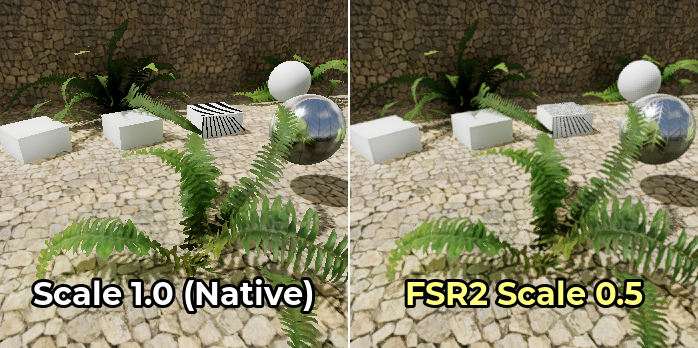
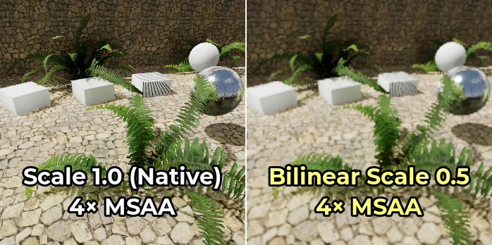
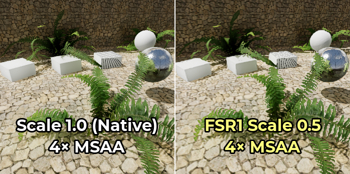
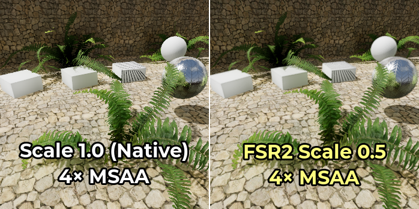
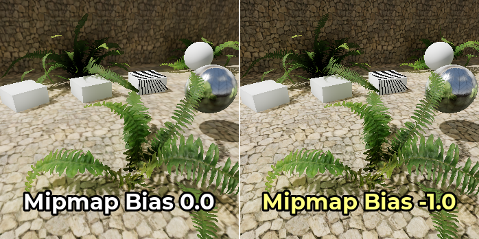

.. _doc_resolution_scaling:

Resolution scaling
==================

.. Images on this page were generated using the project below:
.. https://github.com/Calinou/godot-antialiasing-comparison

Why use resolution scaling?
---------------------------

With the ever-increasing rendering complexity of modern games, rendering at
native resolution isn't always viable anymore, especially on lower-end GPUs.

Resolution scaling is one of the most direct ways to influence the GPU
requirements of a scene. In scenes that are bottlenecked by the GPU (rather than
by the CPU), decreasing the resolution scale can improve performance
significantly. Resolution scaling is particularly important on mobile GPUs where
performance and power budgets are limited.

While resolution scaling is an important tool to have, remember that resolution
scaling is not intended to be a replacement for decreasing graphics settings on
lower-end hardware. Consider exposing both resolution scale and graphics
settings in your in-game menus.

.. seealso::

    You can compare resolution scaling modes and factors in action using the
    `3D Antialiasing demo project <https://github.com/godotengine/godot-demo-projects/tree/master/3d/antialiasing>`__.

.. note::

    Resolution scaling is currently not available for 2D rendering, but it can be
    simulated using the ``viewport`` stretch mode. See :ref:`doc_multiple_resolutions`
    for more information.

Resolution scaling options
--------------------------

In the advanced Project Settings' **Rendering > Scaling 3D** section, you can
find several options for 3D resolution scaling:

Scaling mode
^^^^^^^^^^^^

- **Bilinear:** Standard bilinear filtering (default).
- **FSR 1.0:** `AMD FidelityFX Super Resolution 1.0 <https://gpuopen.com/fidelityfx-superresolution/>`__.
  Slower, but higher quality compared to bilinear scaling. On very slow GPUs,
  the cost of FSR1 may be too expensive to be worth using it over bilinear
  scaling.
- **FSR 2.2:** AMD FidelityFX Super Resolution 2.2 (since Godot 4.2). Slowest,
  but even higher quality compared to FSR1 and bilinear scaling. On slow GPUs,
  the cost of FSR2 may be too expensive to be worth using it over bilinear
  scaling or FSR1. To match FSR2 performance with FSR1, you need to use a lower
  resolution scale factor.

Here are comparison images between native resolution, bilinear scaling with 50%
resolution scale, FSR1, and FSR2 scaling with 50% resolution scale:

FSR1 upscaling works best when coupled with another form of antialiasing.
Temporal antialiasing (TAA) or multisample antialiasing (MSAA) should preferably
be used in this case, as FXAA does not add temporal information and introduces
more blurring to the image.

On the other hand, FSR2 provides its own temporal antialiasing. This means you
don't need to enable other antialiasing methods for the resulting image to look
smooth. The **Use TAA** project setting is ignored when FSR2 is used as the 3D
scaling method, since FSR2's temporal antialiasing takes priority.

Here's the same comparison, but with 4× MSAA enabled on all images:

Notice how the edge upscaling of FSR1 becomes much more convincing once 4×
MSAA is enabled. However, FSR2 doesn't benefit much from enabling MSAA since it
already performs temporal antialiasing.

Rendering scale
^^^^^^^^^^^^^^^

The **Rendering > Scaling 3D > Scale** setting adjusts the resolution scale.
``1.0`` represents the full resolution scale, with the 3D rendering resolution
matching the 2D rendering resolution. Resolution scales *below* ``1.0`` can be
used to speed up rendering, at the cost of a blurrier final image and more aliasing.

The rendering scale can be adjusted at run-time by changing the ``scaling_3d_scale``
property on a :ref:`class_Viewport` node.

Resolution scales *above* ``1.0`` can be used for supersample antialiasing
(SSAA). This will provide antialiasing at a *very* high performance cost, and is
**not recommended** for most use cases. See :ref:`doc_3d_antialiasing` for more
information.

The tables below list common screen resolutions, the resulting 3D rendering
resolution and the number of megapixels that need to be rendered each frame
depending on the rendering scale option. Rows are sorted from fastest to slowest
in each table.

.. note::

    The resolution scale is defined on a **per-axis** basis. For example, this
    means that halving the resolution scale factor will reduce the number of
    rendered megapixels per frame by a factor of 4, not 2. Therefore, very low
    or very high resolution scale factors can have a greater performance impact
    than expected.

**1920×1080 (Full HD)**

+--------------------------+-------------------------+-------------------------------+
| Resolution scale factor  | 3D rendering resolution | Megapixels rendered per frame |
+==========================+=========================+===============================+
| ``0.50``                 | 960×540                 | 0.52 MPix                     |
+--------------------------+-------------------------+-------------------------------+
| ``0.67``                 | 1286×723                | 0.93 MPix                     |
+--------------------------+-------------------------+-------------------------------+
| ``0.75``                 | 1440×810                | 1.17 MPix                     |
+--------------------------+-------------------------+-------------------------------+
| ``0.85``                 | 1632×918                | 1.50 MPix                     |
+--------------------------+-------------------------+-------------------------------+
| ``1.00`` **(native)**    | **1920×1080**           | **2.07 MPix**                 |
+--------------------------+-------------------------+-------------------------------+
| ``1.33`` (supersampling) | 2553×1436               | 3.67 MPix                     |
+--------------------------+-------------------------+-------------------------------+
| ``1.50`` (supersampling) | 2880×1620               | 4.67 MPix                     |
+--------------------------+-------------------------+-------------------------------+
| ``2.00`` (supersampling) | 3840×2160               | 8.29 MPix                     |
+--------------------------+-------------------------+-------------------------------+

**2560×1440 (QHD)**

+--------------------------+-------------------------+-------------------------------+
| Resolution scale factor  | 3D rendering resolution | Megapixels rendered per frame |
+==========================+=========================+===============================+
| ``0.50``                 | 1280×720                | 0.92 MPix                     |
+--------------------------+-------------------------+-------------------------------+
| ``0.67``                 | 1715×964                | 1.65 MPix                     |
+--------------------------+-------------------------+-------------------------------+
| ``0.75``                 | 1920×1080               | 2.07 MPix                     |
+--------------------------+-------------------------+-------------------------------+
| ``0.85``                 | 2176×1224               | 2.66 MPix                     |
+--------------------------+-------------------------+-------------------------------+
| ``1.00`` **(native)**    | **2560×1440**           | **3.69 MPix**                 |
+--------------------------+-------------------------+-------------------------------+
| ``1.33`` (supersampling) | 3404×1915               | 6.52 MPix                     |
+--------------------------+-------------------------+-------------------------------+
| ``1.50`` (supersampling) | 3840×2160               | 8.29 MPix                     |
+--------------------------+-------------------------+-------------------------------+
| ``2.00`` (supersampling) | 5120×2880               | 14.75 MPix                    |
+--------------------------+-------------------------+-------------------------------+

**3840×2160 (Ultra HD "4K")**

+--------------------------+-------------------------+-------------------------------+
| Resolution scale factor  | 3D rendering resolution | Megapixels rendered per frame |
+==========================+=========================+===============================+
| ``0.50``                 | 1920×1080               | 2.07 MPix                     |
+--------------------------+-------------------------+-------------------------------+
| ``0.67``                 | 2572×1447               | 3.72 MPix                     |
+--------------------------+-------------------------+-------------------------------+
| ``0.75``                 | 2880×1620               | 4.67 MPix                     |
+--------------------------+-------------------------+-------------------------------+
| ``0.85``                 | 3264×1836               | 5.99 MPix                     |
+--------------------------+-------------------------+-------------------------------+
| ``1.00`` **(native)**    | **3840×2160**           | **8.29 MPix**                 |
+--------------------------+-------------------------+-------------------------------+
| ``1.33`` (supersampling) | 5107×2872               | 14.67 MPix                    |
+--------------------------+-------------------------+-------------------------------+
| ``1.50`` (supersampling) | 5760×3240               | 18.66 MPix                    |
+--------------------------+-------------------------+-------------------------------+
| ``2.00`` (supersampling) | 7680×4320               | 33.18 MPix                    |
+--------------------------+-------------------------+-------------------------------+

FSR Sharpness
^^^^^^^^^^^^^

When using the FSR1 or FSR2 scaling modes, the sharpness can be controlled using the
**Rendering > Scaling 3D > FSR Sharpness** advanced project setting.

The intensity is inverted compared to most other sharpness sliders: *lower*
values will result in a sharper final image, while *higher* values will *reduce*
the impact of the sharpening filter. ``0.0`` is the sharpest, while ``2.0`` is
the least sharp. The default value of ``0.2`` provides a balance between
preserving the original image's sharpness and avoiding additional aliasing due
to oversharpening.

.. note::

    If you wish to use sharpening when rendering at native resolution, Godot
    currently doesn't allow using the sharpening component of FSR1 (RCAS)
    independently from the upscaling component (EASU).

    As a workaround, you can set the 3D rendering scale to ``0.99``, set the
    scaling mode to **FSR 1.0** then adjust FSR sharpness as needed. This allows
    using FSR1 while rendering at a near-native resolution.

    Alternatively, you can set the scaling mode to **FSR 2.2** with the 3D
    rendering scale set to ``1.0`` if you have enough GPU headroom. This also
    provides high-quality temporal antialiasing. The **FSR Sharpness** setting
    remains functional in this case.

.. _doc_resolution_scaling_mipmap_bias:

Mipmap bias
^^^^^^^^^^^

Godot automatically uses a negative texture mipmap bias when the 3D resolution
scale is set below ``1.0``. This allows for better preservation of texture
detail at the cost of a grainy appearance on detailed textures.

The texture LOD bias currently affects both 2D and 3D rendering in the same way.
However, keep in mind it only has an effect on textures with mipmaps enabled.
Textures used in 2D don't have mipmaps enabled by default, which means only 3D
rendering is affected unless you enabled mipmaps on 2D textures in the Import
dock.

The formula used to determine the texture mipmap bias is:
``log2f(min(scaling_3d_scale, 1.0)) + custom_texture_mipmap_bias``

To counteract the blurriness added by some antialiasing methods, Godot also adds
a ``-0.25`` offset when FXAA is enabled, and a ``-0.5`` offset when TAA is
enabled. If both are enabled at the same time, a ``-0.75`` offset is used. This
mipmap bias offset is applied *before* the resolution scaling offset, so it does
not change depending on resolution scale.

The texture LOD bias can manually be changed by adjusting the **Rendering >
Textures > Default Filters > Texture Mipmap Bias** advanced project setting. It
can also be changed at run-time on :ref:`Viewports <class_Viewport>` by
adjusting the ``texture_mipmap_bias`` property.

.. warning::

    Adjusting the mipmap LOD bias manually can be useful in certain scenarios,
    but this should be done carefully to prevent the final image from looking
    grainy in motion.

    *Negative* mipmap LOD bias can also decrease performance due to
    higher-resolution mips having to be sampled further away. Recommended values
    for a manual offset are between ``-0.5`` and ``0.0``.

    *Positive* mipmap LOD bias will make mipmapped textures appear blurrier than
    intended. This may improve performance slightly, but is otherwise not
    recommended as the loss in visual quality is usually not worth the
    performance gain.

The example below shows an extreme case, with a mipmap LOD bias of ``-1.0`` and
anisotropic filtering disabled to make the difference more noticeable:

Troubleshooting
---------------

Performance does not increase much when decreasing resolution scale
^^^^^^^^^^^^^^^^^^^^^^^^^^^^^^^^^^^^^^^^^^^^^^^^^^^^^^^^^^^^^^^^^^^

If performance doesn't increase much when decreasing resolution scale to a value
like ``0.5``, it likely means the performance bottleneck is elsewhere in your
scene. For example, your scene could have too many draw calls, causing a CPU
bottleneck to occur. Likewise, you may have too many graphics effects enabled
for your GPU to handle (such as SDFGI, SSAO or SSR).

See the :ref:`doc_performance` tutorials for more information.
