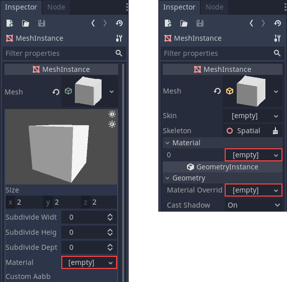
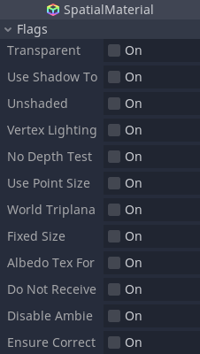
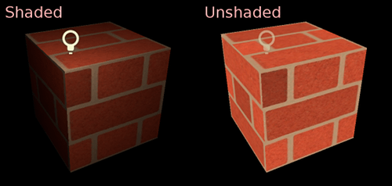
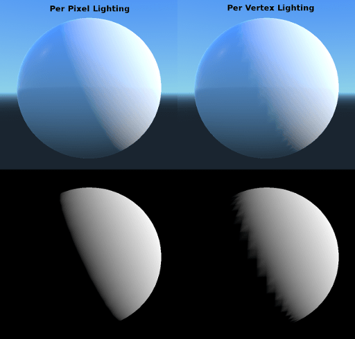
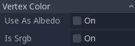
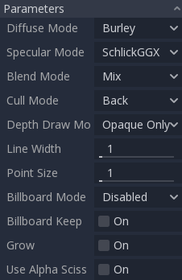
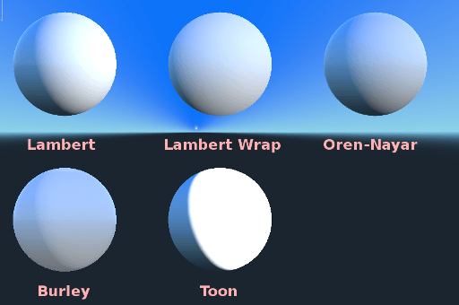
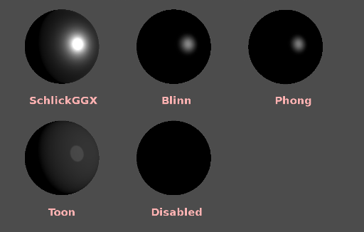
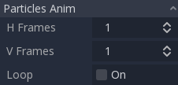

.. _doc_spatial_material:

Spatial Material
================

Introduction
------------

``SpatialMaterial`` is a default 3D material that aims to provide most of the features
artists look for in a material, without the need for writing shader code. However,
it can be converted to shader code if additional functionality is needed.

This tutorial explains most parameters present in ``SpatialMaterial``.

There are three ways to add a ``SpatialMaterial`` to an object. It can be added in
the *Material* property of the mesh. It can be added in the *Material* property of
the node using the mesh (such as a MeshInstance node), or in the *Material Override*
property of the node using the mesh.

If you add a material to the mesh itself, every time that mesh is used it will have that
material. If you add a material to the node using the mesh, the material will only be used
by that node, it will also override the material property of the mesh. If a material is
added in the *Material Override* property of the node, it will only be used by that node.
It will also override the regular material property of the node and the material property of
the mesh.

Flags
-----

Spatial materials have many flags determining the general usage of a material.

Transparent
~~~~~~~~~~~

In Godot, materials are not transparent unless specifically configured to be.
The main reason behind this is that transparent materials are rendered
using a different technique (sorted from back to front and rendered in order).

This technique is less efficient (many state changes happen) and makes
the materials unusable with many mid- and post-processing effects
(such as SSAO, SSR, etc.) that require perfectly opaque geometry.

For this reason, materials in Godot are assumed opaque unless
specified otherwise. The main settings that enable transparency are:

* Transparent flag (this one)
* Blend mode set to other than "Mix"
* Enabling distance or proximity fade

Use Shadow to Opacity
~~~~~~~~~~~~~~~~~~~~~

Lighting modifies the alpha so shadowed areas are opaque and non-shadowed
areas are transparent. Useful for overlaying shadows onto a camera feed in AR.

Unshaded
~~~~~~~~

In most cases it is common for materials to be affected by lighting (shaded).

However, in some cases you might want to show just the albedo (color) and
ignore the rest. Toggling this flag on will remove all shading and display
pure, unlit color.

Vertex Lighting
~~~~~~~~~~~~~~~

Godot has a more or less uniform cost per pixel thanks to depth pre-pass. All
lighting calculations are made by running the lighting shader on every pixel.

As these calculations are costly, performance can be brought down considerably
in some corner cases such as drawing several layers of transparency (which is
common in particle systems). Switching to per-vertex lighting may help in these
cases.

Additionally, on low-end or mobile devices, switching to vertex lighting
can considerably increase rendering performance.

Keep in mind that when vertex lighting is enabled, only directional lighting
can produce shadows (for performance reasons).

No Depth Test
~~~~~~~~~~~~~

In order for close objects to appear over far away objects, depth testing
is performed. Disabling it has the result of objects appearing over
(or under) everything else.

Disabling this makes the most sense for drawing indicators in world space,
and works very well with the *Render Priority* property of Material
(see the bottom of this page).

.. image:: img/spatial_material3.png

Use Point Size
~~~~~~~~~~~~~~~

This option is only effective when the geometry rendered is made of points
(generally it's made of triangles when imported from 3D DCCs). If so, then
those points can be resized (see below).

World Triplanar
~~~~~~~~~~~~~~~

When using triplanar mapping (see below, in the UV1 and UV2 settings),
triplanar is computed in object local space. This option makes triplanar work
in world space.

Fixed Size
~~~~~~~~~~

This causes the object to be rendered at the same size no matter the distance.
This is useful mostly for indicators (no depth test and high render priority)
and some types of billboards.

Do Not Receive Shadows
~~~~~~~~~~~~~~~~~~~~~~

Makes the object not receive any kind of shadow that would otherwise
be cast onto it.

Disable Ambient Light
~~~~~~~~~~~~~~~~~~~~~

Makes the object not receive any kind of ambient lighting that would
otherwise light it.

Ensure Correct Normals
~~~~~~~~~~~~~~~~~~~~~~

Fixes normals when non-uniform scaling is used.

Vertex Color
------------

This setting allows choosing what is done by default to vertex colors that come
from your 3D modelling application. By default, they are ignored.

Use as Albedo
~~~~~~~~~~~~~

Choosing this option means vertex color is used as albedo color.

Is sRGB
~~~~~~~

Most 3D DCCs will likely export vertex colors as sRGB, so toggling this
option on will help them look correct.

Parameters
-----------

``SpatialMaterial`` also has several configurable parameters to tweak
many aspects of the rendering:

Diffuse Mode
~~~~~~~~~~~~

Specifies the algorithm used by diffuse scattering of light when hitting
the object. The default is *Burley*. Other modes are also available:

* **Burley:** Default mode, the original Disney Principled PBS diffuse algorithm.
* **Lambert:** Is not affected by roughness.
* **Lambert Wrap:** Extends Lambert to cover more than 90 degrees when
  roughness increases. Works great for hair and simulating cheap
  subsurface scattering. This implementation is energy conserving.
* **Oren Nayar:** This implementation aims to take microsurfacing into account
  (via roughness). Works well for clay-like materials and some types of cloth.
* **Toon:** Provides a hard cut for lighting, with smoothing affected by roughness.
  It is recommended you disable sky contribution from your environment's
  ambient light settings or disable ambient light in the spatial material
  to achieve a better effect.

Specular Mode
~~~~~~~~~~~~~

Specifies how the specular blob will be rendered. The specular blob
represents the shape of a light source reflected in the object.

* **ShlickGGX:** The most common blob used by PBR 3D engines nowadays.
* **Blinn:** Common in previous-generation engines.
  Not worth using nowadays, but left here for the sake of compatibility.
* **Phong:** Same as above.
* **Toon:** Creates a toon blob, which changes size depending on roughness.
* **Disabled:** Sometimes the blob gets in the way. Begone!

Blend Mode
~~~~~~~~~~

Controls the blend mode for the material. Keep in mind that any mode
other than *Mix* forces the object to go through the transparent pipeline.

* **Mix:** Default blend mode, alpha controls how much the object is visible.
* **Add:** Object is blended additively, nice for flares or some
  fire-like effects.
* **Sub:** Object is subtracted.
* **Mul:** Object is multiplied.

.. image:: img/spatial_material8.png

Cull Mode
~~~~~~~~~

Determines which side of the object is not drawn when backfaces are rendered:

* **Back:** The back of the object is culled when not visible (default).
* **Front:** The front of the object is culled when not visible.
* **Disabled:** Used for objects that are double-sided (no culling is performed).

Depth Draw Mode
~~~~~~~~~~~~~~~

Specifies when depth rendering must take place.

* **Opaque Only (default):** Depth is only drawn for opaque objects.
* **Always:** Depth draw is drawn for both opaque and transparent objects.
* **Never:** No depth draw takes place
  (do not confuse this with the No Depth Test option above).
* **Depth Pre-Pass:** For transparent objects, an opaque pass is made first
  with the opaque parts, then transparency is drawn above.
  Use this option with transparent grass or tree foliage.

.. image:: img/material_depth_draw.png

Line Width
~~~~~~~~~~

When drawing lines, specify the width of the lines being drawn.
This option is not available on most modern hardware.

Point Size
~~~~~~~~~~

When drawing points, specify the point size in pixels.

Billboard Mode
~~~~~~~~~~~~~~

Enables billboard mode for drawing materials. This controls how the object
faces the camera:

* **Disabled:** Billboard mode is disabled.
* **Enabled:** Billboard mode is enabled, the object's -Z axis will always
  face the camera.
* **Y-Billboard:** The object's X axis will always be aligned with the camera.
* **Particles:** Most suited for particle systems, because it allows
  specifying animation options.

The above options are only enabled for Particle Billboard.

Billboard Keep Scale
~~~~~~~~~~~~~~~~~~~~

Enables scaling a mesh in billboard mode.

Grow
~~~~

Grows the object vertices in the direction pointed by their normals:

.. image:: img/spatial_material10.png

This is commonly used to create cheap outlines. Add a second material pass,
make it black and unshaded, reverse culling (Cull Front), and add some grow:

.. image:: img/spatial_material11.png

Use Alpha Scissor
~~~~~~~~~~~~~~~~~

When transparency other than ``0`` or ``1`` is not needed, it's possible to
set a threshold to prevent the object from rendering semi-transparent pixels.

.. image:: img/spatial_material12.png

This renders the object via the opaque pipeline, which is faster and allows it
to use mid- and post-process effects such as SSAO, SSR, etc.

Material colors, maps and channels
----------------------------------

Besides the parameters, what defines materials themselves are the colors,
textures, and channels. Godot supports an extensive list of them. They are
described in detail below:

Albedo
~~~~~~

*Albedo* is the base color for the material, on which all the other settings
operate. When set to *Unshaded*, this is the only color that is visible. In
previous versions of Godot, this channel was named *Diffuse*. The change
of name mainly happened because, in PBR (Physically Based Rendering), this color affects many
more calculations than just the diffuse lighting path.

Albedo color and texture can be used together as they are multiplied.

*Alpha channel* in albedo color and texture is also used for the
object transparency. If you use a color or texture with *alpha channel*,
make sure to either enable transparency or *alpha scissoring* for it to work.

Metallic
~~~~~~~~

Godot uses a metallic model over competing models due to its simplicity.
This parameter defines how reflective the material is. The more reflective, the
less diffuse/ambient light affects the material and the more light is reflected.
This model is called "energy-conserving".

The *Specular* parameter is a general amount for the reflectivity (unlike
*Metallic*, this is not energy-conserving, so leave it at ``0.5`` and don't touch
it unless you need to).

The minimum internal reflectivity is ``0.04``, so it's impossible to make a
material completely unreflective, just like in real life.

.. image:: img/spatial_material13.png

Roughness
~~~~~~~~~

*Roughness* affects the way reflection happens. A value of ``0`` makes it a
perfect mirror while a value of ``1`` completely blurs the reflection (simulating
natural microsurfacing). Most common types of materials can be achieved with
the right combination of *Metallic* and *Roughness*.

.. image:: img/spatial_material14.png

Emission
~~~~~~~~

*Emission* specifies how much light is emitted by the material (keep in mind this
does not include light surrounding geometry unless :ref:`doc_gi_probes` are used).
This value is added to the resulting final image and is not affected by other
lighting in the scene.

.. image:: img/spatial_material15.png

Normal map
~~~~~~~~~~

Normal mapping allows you to set a texture that represents finer shape detail.
This does not modify geometry, only the incident angle for light. In Godot,
only the red and green channels of normal maps are used for better compression
and wider compatibility.

.. image:: img/spatial_material16.png

.. note::

  Godot requires the normal map to use the X+, Y- and Z+ coordinates. In other
  words, if you've imported a material made to be used with another engine, you
  may have to convert the normal map so its Y axis is flipped. Otherwise, the
  normal map direction may appear to be inverted on the Y axis.

  More information about normal maps (including a coordinate order table for
  popular engines) can be found
  `here <http://wiki.polycount.com/wiki/Normal_Map_Technical_Details>`__.

Rim
~~~

Some fabrics have small micro-fur that causes light to scatter around it. Godot
emulates this with the *Rim* parameter. Unlike other rim lighting implementations,
which just use the emission channel, this one actually takes light into account
(no light means no rim). This makes the effect considerably more believable.

.. image:: img/spatial_material17.png

Rim size depends on roughness, and there is a special parameter to specify how
it must be colored. If *Tint* is ``0``, the color of the light is used for the
rim. If *Tint* is ``1``, then the albedo of the material is used. Using
intermediate values generally works best.

Clearcoat
~~~~~~~~~

*This feature is only available when using the GLES3 backend.*

The *Clearcoat* parameter is used to add a secondary pass of transparent coat
to the material. This is common in car paint and toys. In practice, it's a
smaller specular blob added on top of the existing material.

Anisotropy
~~~~~~~~~~

*This feature is only available when using the GLES3 backend.*

This changes the shape of the specular blob and aligns it to tangent space.
Anisotropy is commonly used with hair, or to make materials such as brushed
aluminum more realistic. It works especially well when combined with flowmaps.

.. image:: img/spatial_material18.png

Ambient Occlusion
~~~~~~~~~~~~~~~~~~

It is possible to specify a baked ambient occlusion map. This map affects how
much ambient light reaches each surface of the object (it does not affect direct
light by default). While it is possible to use Screen-Space Ambient Occlusion
(SSAO) to generate ambient occlusion, nothing beats the quality of a well-baked
AO map. It is recommended to bake ambient occlusion whenever possible.

.. image:: img/spatial_material19.png

Depth
~~~~~

*This feature is only available when using the GLES3 backend.*

Setting a depth map on a material produces a ray-marched search to emulate the
proper displacement of cavities along the view direction. This is not real
added geometry, but an illusion of depth. It may not work for complex objects,
but it produces a realistic depth effect for textures. For best results,
*Depth* should be used together with normal mapping.

.. image:: img/spatial_material20.png

Subsurface Scattering
~~~~~~~~~~~~~~~~~~~~~

*This feature is only available when using the GLES3 backend.*

This effect emulates light that penetrates an object's surface, is scattered,
and then comes out. It is useful to create realistic skin, marble, colored
liquids, etc.

.. image:: img/spatial_material21.png

Transmission
~~~~~~~~~~~~

This controls how much light from the lit side (visible to light) is transferred
to the dark side (opposite from the light). This works well for thin objects
such as plant leaves, grass, human ears, etc.

.. image:: img/spatial_material22.png

Refraction
~~~~~~~~~~~

*This feature is only available when using the GLES3 backend.*

When refraction is enabled, it supersedes alpha blending, and Godot attempts to
fetch information from behind the object being rendered instead. This allows
distorting the transparency in a way similar to refraction in real life.

.. image:: img/spatial_material23.png

Detail
~~~~~~

Godot allows using secondary albedo and normal maps to generate a detail
texture, which can be blended in many ways. By combining this with secondary
UV or triplanar modes, many interesting textures can be achieved.

.. image:: img/spatial_material24.png

There are several settings that control how detail is used.

Mask: The detail mask is a black and white image used to control where the
blending takes place on a texture. White is for the detail textures, Black
is for the regular material textures, different shades of gray are for
partial blending of the material textures and detail textures.

Blend Mode: These four modes control how the textures are blended together.

- Mix: Combines pixel values of both textures. At black, only show the material texture,
  at white, only show the detail texture. Values of gray create a smooth blend between
  the two.

- Add: Adds pixel values of one Texture with the other. Unlike mix mode
  both textures are completely mixed at white parts of a mask and not at gray
  parts. The original texture is mostly unchanged at black

- Sub: Subtracts pixel values of one texture with the other. The second
  texture is completely subtracted at white parts of a mask with only a little
  subtraction in black parts, gray parts being different levels of subtraction
  based on the exact texture.

- Mul: Multiplies the RGB channel numbers for each pixel from the top texture
  with the values for the corresponding pixel from the bottom texture.

Albedo: This is where you put an albedo texture you want to blend. If nothing
is in this slot it will be interpreted as white by default.

Normal: This is where you put a normal texture you want to blend. If nothing is
in this slot it will be interpreted as a flat normal map. This can still be used
even if the material does not have normal map enabled.

UV1 and UV2
~~~~~~~~~~~~

Godot supports two UV channels per material. Secondary UV is often useful for
ambient occlusion or emission (baked light). UVs can be scaled and offset,
which is useful when using repeating textures.

Triplanar Mapping
~~~~~~~~~~~~~~~~~

Triplanar mapping is supported for both UV1 and UV2. This is an alternative way
to obtain texture coordinates, sometimes called "Autotexture". Textures are
sampled in X, Y and Z and blended by the normal. Triplanar mapping can be
performed in either world space or object space.

In the image below, you can see how all primitives share the same material with
world triplanar, so the brick texture continues smoothly between them.

.. image:: img/spatial_material25.png

Proximity and distance fade
----------------------------

Godot allows materials to fade by proximity to each other as well as depending
on the distance from the viewer. Proximity fade is useful for effects such as
soft particles or a mass of water with a smooth blending to the shores. Distance
fade is useful for light shafts or indicators that are only present after a
given distance.

Keep in mind enabling these enables alpha blending, so abusing them for an
entire scene is usually not a good idea.

.. image:: img/spatial_material_proxfade.gif

Render priority
---------------

The rendering order of objects can be changed, although this is mostly
useful for transparent objects (or opaque objects that perform depth draw
but no color draw, such as cracks on the floor).
