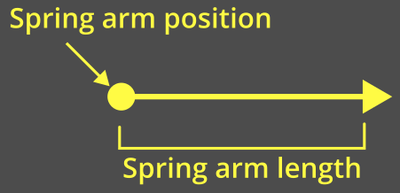
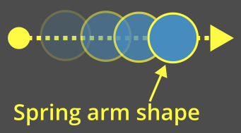
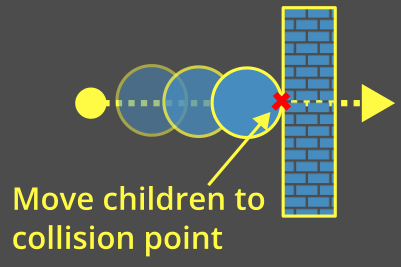
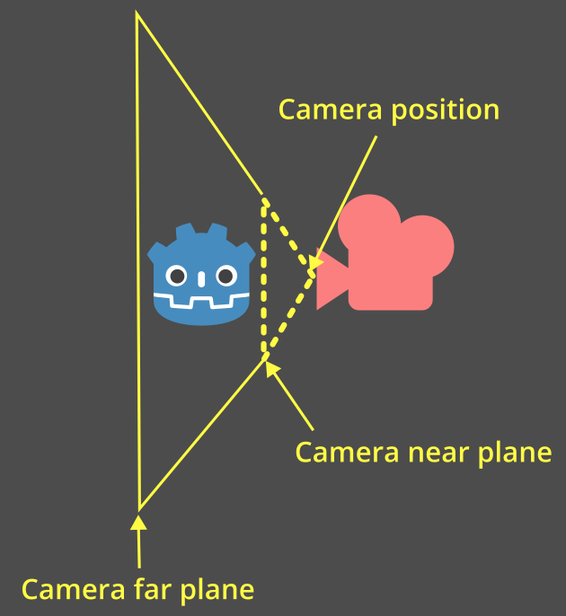
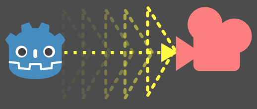
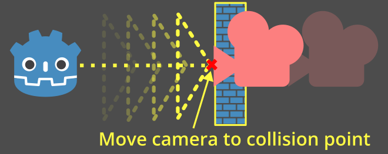
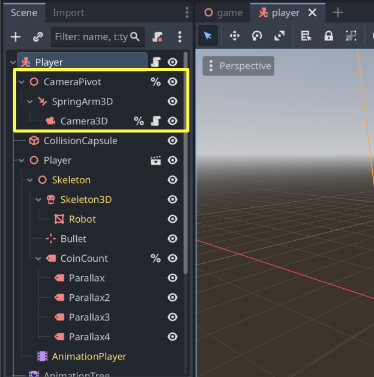
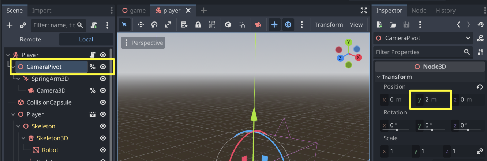
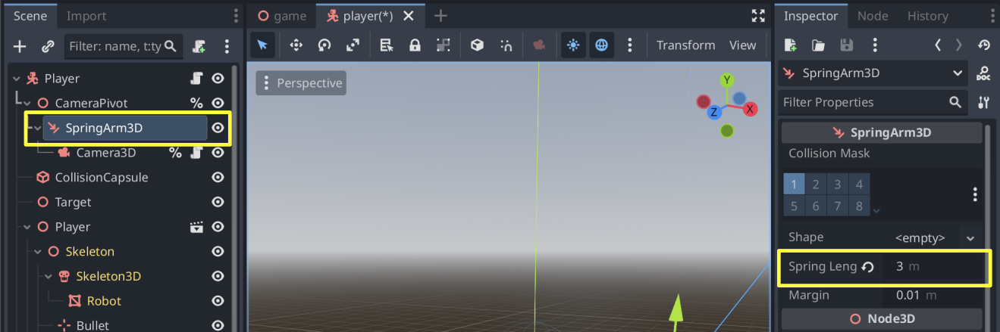

:article_outdated: False

.. _doc_spring_arm:

Third-person camera with spring arm
===================================

Introduction
------------

3D games will often have a third-person camera that follows and
rotates around something such as a player character or a vehicle.

In Godot, this can be done by setting a :ref:`Camera3D <class_Camera3D>` as a child of a node.
However, if you try this without any extra steps, you'll notice that the camera clips through geometry and hides the scene.

This is where the :ref:`SpringArm3D <class_SpringArm3D>` node comes in.

What is a spring arm?
---------------------

A spring arm has two main components that affect its behavior.

The "length" of the spring arm is how far from its global position to check for collisions:

The "shape" of the spring arm is what it uses to check for collisions. The spring arm will "sweep" this shape from its origin out towards its length.

The spring arm tries to keep all of its children at the end of its length. When the shape collides with something, the children are instead placed at or near that collision point:

Spring arm with a camera
------------------------

When a camera is placed as a child of a spring arm, a pyramid representing the camera will be used as the shape.

This pyramid represents the **near plane** of the camera:

.. note:: If the spring arm is given a specific shape, then that shape will **always** be used.

    The camera's shape is only used if the camera is a **direct child** of the spring arm.

    If no shape is provided and the camera is not a direct child, the spring arm will fall back to using a ray cast which is inaccurate for camera collisions and not recommended.

Every physics process frame, the spring arm will perform a motion cast to check if anything is collided with:

When the shape hits something, the camera will be placed at or near the collision point:

Setting up the spring arm and camera
------------------------------------

Let's add a spring arm camera setup to the platformer demo.

.. note:: You can download the Platformer 3D demo on `GitHub <https://github.com/godotengine/godot-demo-projects/tree/master/3d/platformer>`_ or using the `Asset Library <https://godotengine.org/asset-library/asset/2748>`_.

In general, for a third-person camera setup, you will have three nodes as children of the node that you're following:

- `Node3D` (the "pivot point" for the camera)

    - `SpringArm3D`

        - `Camera3D`

Open the ``player/player.tscn`` scene. Set these up as children of our player and give them unique names so we can find them in our script. **Make sure to delete the existing camera node!**

Let's move the pivot point up by ``2`` on the Y-axis so that it's not on the ground:

Give the spring arm a length of ``3`` so that it is placed behind the character:

.. note:: Leave the **Shape** of the spring arm as ``<empty>``. This way, it will use the camera's pyramid shape.

    If you want, you can also try other shapes - a sphere is a common choice since it slides smoothly along edges.

Update the top of ``player/player.gd`` to grab the camera and the pivot points by their unique names:

.. code-block:: gdscript
    :caption: player/player.gd

    # Comment out this existing camera line.
    # @onready var _camera := $Target/Camera3D as Camera3D

    @onready var _camera := %Camera3D as Camera3D
    @onready var _camera_pivot := %CameraPivot as Node3D

Add an ``_unhandled_input`` function to check for camera movement and then rotate the pivot point accordingly:

.. code-block:: gdscript
    :caption: player/player.gd

    @export_range(0.0, 1.0) var mouse_sensitivity = 0.01
    @export var tilt_limit = deg_to_rad(75)

    func _unhandled_input(event: InputEvent) -> void:
        if event is InputEventMouseMotion:
            _camera_pivot.rotation.x -= event.relative.y * mouse_sensitivity
            # Prevent the camera from rotating too far up or down.
            _camera_pivot.rotation.x = clampf(_camera_pivot.rotation.x, -tilt_limit, tilt_limit)
            _camera_pivot.rotation.y += -event.relative.x * mouse_sensitivity

By rotating the pivot point, the spring arm will also be rotated and it will change where the camera is positioned.
Run the game and notice that mouse movement now rotates the camera around the character. If the camera moves into a wall, it collides with it.

.. video:: video/spring_arm_camera.webm
   :alt: Camera attached to a spring arm colliding with walls
   :autoplay:
   :loop:
   :muted:
