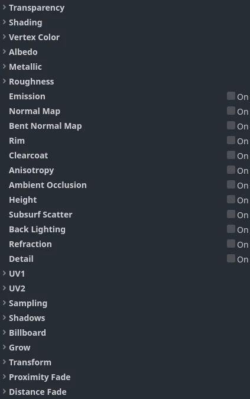
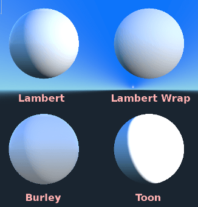

.. _doc_standard_material_3d:

Standard Material 3D and ORM Material 3D
========================================

Introduction
------------

``StandardMaterial3D`` and ``ORMMaterial3D`` (Occlusion, Roughness, Metallic)
are default 3D materials that aim to provide most of the features artists look
for in a material, without the need for writing shader code. However, they can
be converted to shader code if additional functionality is needed.

This tutorial explains the parameters present in both materials.

There are 4 ways to add these materials to an object. A material can be added in
the *Material* property of the mesh. It can be added in the *Material* property of
the node using the mesh (such as a MeshInstance3D node), the *Material Override* property
of the node using the mesh, and the *Material Overlay*.

.. image:: img/add_material.webp

If you add a material to the mesh itself, every time that mesh is used it will have that
material. If you add a material to the node using the mesh, the material will only be used
by that node, it will also override the material property of the mesh. If a material is
added in the *Material Override* property of the node, it will only be used by that node.
It will also override the regular material property of the node and the material property of
the mesh.

The *Material Overlay* property will render a material **over** the current one being used by
the mesh. As an example, this can be used to put a transparent shield effect on a mesh.

BaseMaterial 3D settings
------------------------

StandardMaterial3D has many settings that determine the look of a material. All of these are
under the BaseMaterial3D category

ORM materials are almost exactly the same with one difference. Instead of separate settings
and textures for occlusion, roughness, and metallic, there is a single ORM texture. The different
color channels of that texture are used for each parameter. Programs such as Substance Painter
and Armor Paint will give you the option to export in this format, for these two programs it's
with the export preset for unreal engine, which also uses ORM textures.

Transparency
------------

By default, materials in Godot are opaque. This is fast to render, but it means
the material can't be seen through even if you use a transparent texture in the
**Albedo > Texture** property (or set **Albedo > Color** to a transparent color).

To be able to see through a material, the material needs to be made *transparent*.
Godot offers several transparency modes:

- **Disabled:** Material is opaque. This is the fastest to render, with all
  rendering features supported.

- **Alpha:** Material is transparent. Semi-transparent areas are drawn with
  blending. This is slow to render, but it allows for partial transparency (also
  known as translucency). Materials using alpha blending also can't cast
  shadows, and are not visible in screen-space reflections.

  - **Alpha** is a good fit for particle effects and VFX.

- **Alpha Scissor:** Material is transparent. Semi-transparent areas whose
  opacity is below **Alpha Scissor Threshold** are not drawn (above this
  opacity, these are drawn as opaque). This is faster to render than Alpha and
  doesn't exhibit transparency sorting issues. The downside is that this results
  in "all or nothing" transparency, with no intermediate values possible.
  Materials using alpha scissor can cast shadows.

  - **Alpha Scissor** is ideal for foliage and fences, since these have hard
    edges and require correct sorting to look good.

- **Alpha Hash:** Material is transparent. Semi-transparent areas are drawn
  using dithering. This is also "all or nothing" transparency, but dithering
  helps represent partially opaque areas with limited precision depending on
  viewport resolution. Materials using alpha hash can cast shadows.

  - **Alpha Hash** is suited for realistic-looking hair, although stylized hair
    may work better with alpha scissor.

- **Depth Pre-Pass:** This renders the object's fully opaque pixels via the
  opaque pipeline first, then renders the rest with alpha blending. This allows
  transparency sorting to be *mostly* correct (albeit not fully so, as partially
  transparent regions may still exhibit incorrect sorting). Materials using
  depth prepass can cast shadows.

.. note::

    Godot will automatically force the material to be transparent with alpha
    blending if *any* of these conditions is met:

    - Setting the transparency mode to **Alpha** (as described here).
    - Setting a blend mode other than the default **Mix**
    - Enabling **Refraction**, **Proximity Fade**, or **Distance Fade**.

Comparison between alpha blending (left) and alpha scissor (right) transparency:

.. image:: img/spatial_material12.png

.. warning::

    Alpha-blended transparency has several
    :ref:`limitations <doc_3d_rendering_limitations_transparency_sorting>`:

    - Alpha-blended materials are significantly slower to render, especially if
      they overlap.
    - Alpha-blended materials may exhibit sorting issues when transparent
      surfaces overlap each other. This means that surfaces may render in the
      incorrect order, with surfaces in the back appearing to be in front of
      those which are actually closer to the camera.
    - Alpha-blended materials don't cast shadows, although they can receive shadows.
    - Alpha-blended materials don't appear in any reflections (other than
      reflection probes).
    - Screen-space reflections and sharp SDFGI reflections don't appear on
      alpha-blended materials. When SDFGI is enabled, rough reflections are used
      as a fallback regardless of material roughness.

    Before using the **Alpha** transparency mode, always consider whether
    another transparency mode is more suited for your needs.

.. _doc_standard_material_3d_alpha_antialiasing:

Alpha Antialiasing
~~~~~~~~~~~~~~~~~~

.. note::

    This property is only visible when the transparency mode is
    **Alpha Scissor** or **Alpha Hash**.

While alpha scissor and alpha hash materials are faster to render than
alpha-blended materials, they exhibit hard edges between opaque and transparent
regions. While it's possible to use post-processing-based :ref:`antialiasing
techniques <doc_3d_antialiasing>` such as FXAA and TAA, this is not always
desired as these techniques tend to make the final result look blurrier or
exhibit ghosting artifacts.

There are 3 alpha antialiasing modes available:

- **Disabled:** No alpha antialiasing. Edges of transparent materials will
  appear aliased unless a post-processing-based antialiasing solution is used.
- **Alpha Edge Blend:** Results in a smooth transition between opaque and
  transparent areas. Also known as "alpha to coverage".
- **Alpha Edge Clip:** Results in a sharp, but still antialiased transition
  between opaque and transparent areas. Also known as "alpha to coverage + alpha
  to one".

When the alpha antialiasing mode is set to **Alpha Edge Blend** or **Alpha Edge
Clip**, a new **Alpha Antialiasing Edge** property becomes visible below in the
inspector. This property controls the threshold below which pixels should be
made transparent. While you've already defined an alpha scissor threshold (when
using **Alpha Scissor** only), this additional threshold is used to smoothly
transition between opaque and transparent pixels. **Alpha Antialiasing Edge**
must *always* be set to a value that is strictly below the alpha scissor
threshold. The default of ``0.3`` is a sensible value with an alpha scissor of
threshold of ``0.5``, but remember to adjust this alpha antialiasing edge when
modifying the alpha scissor threshold.

If you find the antialiasing effect not effective enough, try increasing **Alpha
Antialiasing Edge** while making sure it's below **Alpha Scissor Threshold** (if
the material uses alpha scissor). On the other hand, if you notice the texture's
appearance visibly changing as the camera moves closer to the material, try
decreasing **Alpha Antialiasing Edge**.

.. important::

    For best results, MSAA 3D should be set to at least 2× in the Project
    Settings when using alpha antialiasing. This is because this feature relies
    on alpha to coverage, which is a feature provided by MSAA.

    Without MSAA, a fixed dithering pattern is applied on the material's edges,
    which isn't very effective at smoothing out edges (although it can still
    help a little).

Blend Mode
~~~~~~~~~~

Controls the blend mode for the material. Keep in mind that any mode
other than *Mix* forces the object to go through the transparent pipeline.

* **Mix:** Default blend mode, alpha controls how much the object is visible.
* **Add:** The final color of the object is added to the color of the screen,
  nice for flares or some fire-like effects.
* **Sub:** The final color of the object is subtracted from the color of the
  screen.
* **Mul:** The final color of the object is multiplied with the color of the
  screen.
* **Premultiplied Alpha:** The color of the object is expected to have already been
  multiplied by the alpha. This behaves like **Add** when the alpha is ``0.0``
  (fully transparent) and like **Mix** when the alpha is ``1.0`` (opaque).

.. image:: img/spatial_material8.png

Cull Mode
~~~~~~~~~

Determines which side of the object is not drawn when backfaces are rendered:

* **Back:** The back of the object is culled when not visible (default).
* **Front:** The front of the object is culled when not visible.
* **Disabled:** Used for objects that are double-sided (no culling is performed).

.. note::

  By default, Blender has backface culling disabled on materials and will
  export materials to match how they render in Blender. This means that
  materials in Godot will have their cull mode set to **Disabled**. This can
  decrease performance since backfaces will be rendered, even when they are
  being culled by other faces. To resolve this, enable **Backface Culling** in
  Blender's Materials tab, then export the scene to glTF again.

Depth Draw Mode
~~~~~~~~~~~~~~~

Specifies when depth rendering must take place.

* **Opaque Only (default):** Depth is only drawn for opaque objects.
* **Always:** Depth draw is drawn for both opaque and transparent objects.
* **Never:** No depth draw takes place
  (do not confuse this with the No Depth Test option below).
* **Depth Pre-Pass:** For transparent objects, an opaque pass is made first
  with the opaque parts, then transparency is drawn above.
  Use this option with transparent grass or tree foliage.

.. image:: img/material_depth_draw.png

No Depth Test
~~~~~~~~~~~~~

In order for close objects to appear over far away objects, depth testing
is performed. Disabling it has the result of objects appearing over
(or under) everything else.

Disabling this makes the most sense for drawing indicators in world space,
and works very well with the *Render Priority* property of Material
(see the bottom of this page).

.. image:: img/spatial_material3.png

Shading
-------

Shading mode
~~~~~~~~~~~~

Materials support three shading modes: **Per-Pixel**, **Per-Vertex**, and
**Unshaded**.

The **Per-Pixel** shading mode calculates lighting for each pixel, and is a good
fit for most use cases. However, in some cases you may want to increase
performance by using another shading mode.

The **Per-Vertex** shading mode, often called "vertex shading" or "vertex lighting",
instead calculates lighting once for each vertex, and interpolates the result
between each pixel.

On low-end or mobile devices, using per-vertex lighting can considerably increase
rendering performance. When rendering several layers of transparency,
such as when using particle systems, using per-vertex shading can improve
performance, especially when the camera is close to particles.

You can also use per-vertex lighting to achieve a retro look.

  
  Texture from `AmbientCG <https://ambientcg.com/view?id=Bricks051>`__

The **Unshaded** shading mode does not calculate lighting at all. Instead, the
**Albedo** color is output directly. Lights will not affect the material at all,
and unshaded materials will tend to appear considerably brighter than shaded
materials.

Rendering unshaded is useful for some specific visual effects. If maximum
performance is needed, it can also be used for particles, or low-end or
mobile devices.

Diffuse Mode
~~~~~~~~~~~~

Specifies the algorithm used by diffuse scattering of light when hitting
the object. The default is **Burley**. Other modes are also available:

* **Burley:** Default mode, the original Disney Principled PBS diffuse algorithm.
* **Lambert:** Is not affected by roughness.
* **Lambert Wrap:** Extends Lambert to cover more than 90 degrees when
  roughness increases. Works great for hair and simulating cheap
  subsurface scattering. This implementation is energy conserving.
* **Toon:** Provides a hard cut for lighting, with smoothing affected by roughness.
  It is recommended you disable sky contribution from your environment's
  ambient light settings or disable ambient light in the StandardMaterial3D
  to achieve a better effect.

Specular Mode
~~~~~~~~~~~~~

Specifies how the specular blob will be rendered. The specular blob
represents the shape of a light source reflected in the object.

* **SchlickGGX:** The most common blob used by PBR 3D engines nowadays.
* **Toon:** Creates a toon blob, which changes size depending on roughness.
* **Disabled:** Sometimes the blob gets in the way. Begone!

Disable Ambient Light
~~~~~~~~~~~~~~~~~~~~~

Makes the object not receive any kind of ambient lighting that would
otherwise light it.

Disable Fog
~~~~~~~~~~~

Makes the object unaffected by depth-based or volumetric fog. This is useful for particles or other additively blended materials that would otherwise show the shape of the mesh (even in places where it would be invisible without the fog).

Disable Specular Occlusion
~~~~~~~~~~~~~~~~~~~~~~~~~~

Makes the object not have its reflections reduced where they would usually be occluded.

Vertex Color
------------

This setting allows choosing what is done by default to vertex colors that come
from your 3D modeling application. By default, they are ignored.

Use as Albedo
~~~~~~~~~~~~~

Choosing this option means vertex color is used as albedo color.

Is sRGB
~~~~~~~

Most 3D modeling software will likely export vertex colors as sRGB, so toggling
this option on will help them look correct.

Albedo
------

*Albedo* is the base color for the material, on which all the other settings
operate. When set to *Unshaded*, this is the only color that is visible. In
previous versions of Godot, this channel was named *Diffuse*. The change
of name mainly happened because, in PBR (Physically Based Rendering), this color affects many
more calculations than just the diffuse lighting path.

Albedo color and texture can be used together as they are multiplied.

*Alpha channel* in albedo color and texture is also used for the
object transparency. If you use a color or texture with *alpha channel*,
make sure to either enable transparency or *alpha scissoring* for it to work.

Metallic
--------

Godot uses a metallic model over competing models due to its simplicity.
This parameter defines how reflective the material is. The more reflective, the
less diffuse/ambient light affects the material and the more light is reflected.
This model is called "energy-conserving".

The *Specular* parameter is a general amount for the reflectivity (unlike
*Metallic*, this is not energy-conserving, so leave it at ``0.5`` and don't touch
it unless you need to).

The minimum internal reflectivity is ``0.04``, so it's impossible to make a
material completely unreflective, just like in real life.

.. image:: img/spatial_material13.png

Roughness
---------

*Roughness* affects the way reflection happens. A value of ``0`` makes it a
perfect mirror while a value of ``1`` completely blurs the reflection (simulating
natural microsurfacing). Most common types of materials can be achieved with
the right combination of *Metallic* and *Roughness*.

.. image:: img/spatial_material14.png

Emission
--------

*Emission* specifies how much light is emitted by the material (keep in mind this
does not include light surrounding geometry unless :ref:`VoxelGI <doc_using_voxel_gi>`
or :ref:`SDFGI <doc_using_sdfgi>` are used). This value is added to the resulting
final image and is not affected by other lighting in the scene.

.. image:: img/spatial_material15.png

Normal map
----------

Normal mapping allows you to set a texture that represents finer shape detail.
This does not modify geometry, only the incident angle for light. In Godot,
only the red and green channels of normal maps are used for better compression
and wider compatibility.

.. image:: img/spatial_material16.png

.. note::

  Godot requires the normal map to use the X+, Y+ and Z+ coordinates, this is
  known as OpenGL style. If you've imported a material made to be used with
  another engine it may be DirectX style, in which case the normal map needs to
  be converted so its Y axis is flipped.

  More information about normal maps (including a coordinate order table for
  popular engines) can be found
  `here <http://wiki.polycount.com/wiki/Normal_Map_Technical_Details>`__.

Bent normal map
---------------

A bent normal map describes the average direction of ambient lighting. Unlike a
regular normal map, this is used to improve how a material reacts to lighting
rather than add surface detail.

This is achieved in two ways:

* Indirect diffuse lighting is made to match global illumination more closely.
* If specular occlusion is enabled, it is calculated using the bent normals and
  ambient occlusion instead of just from ambient light.
  This includes screen-space ambient occlusion (SSAO) and other sources of
  ambient occlusion.

Godot only uses the red and green channels of a bent normal map for better
compression and wider compatibility.

When creating a bent normal map, there are three things required for it to
work correctly in Godot:

* A **cosine distribution** of rays has to be used when baking.
* The texture must be created in **tangent space**.
* The bent normal map needs to use the X+, Y+, and Z+ coordinates, this is
  known as OpenGL style. If you've imported a material made to be used with
  another engine it may be DirectX style, in which case the bent normal map
  needs to be converted so its Y axis is flipped. This can be achieved by
  setting the green channel under the **Channel Remap** section to
  **Inverted Green** in the import dock.

.. note::

  A bent normal map is different from a regular normal map. The two are not
  interchangeable.

Rim
---

Some fabrics have small micro-fur that causes light to scatter around it. Godot
emulates this with the *Rim* parameter. Unlike other rim lighting implementations,
which just use the emission channel, this one actually takes light into account
(no light means no rim). This makes the effect considerably more believable.

.. image:: img/spatial_material17.png

Rim size depends on roughness, and there is a special parameter to specify how
it must be colored. If *Tint* is ``0``, the color of the light is used for the
rim. If *Tint* is ``1``, then the albedo of the material is used. Using
intermediate values generally works best.

Clearcoat
---------

The *Clearcoat* parameter is used to add a secondary pass of transparent coat
to the material. This is common in car paint and toys. In practice, it's a
smaller specular blob added on top of the existing material.

.. image:: img/clearcoat_comparison.png

Anisotropy
----------

This changes the shape of the specular blob and aligns it to tangent space.
Anisotropy is commonly used with hair, or to make materials such as brushed
aluminum more realistic. It works especially well when combined with flowmaps.

.. image:: img/spatial_material18.png

Ambient Occlusion
-----------------

It is possible to specify a baked ambient occlusion map. This map affects how
much ambient light reaches each surface of the object (it does not affect direct
light by default). While it is possible to use Screen-Space Ambient Occlusion
(SSAO) to generate ambient occlusion, nothing beats the quality of a well-baked
AO map. It is recommended to bake ambient occlusion whenever possible.

.. image:: img/spatial_material19.png

Height
------

Setting a height map on a material produces a ray-marched search to emulate the
proper displacement of cavities along the view direction. This only creates an
illusion of depth, and does not add real geometry — for a height map shape used
for physics collision (such as terrain), see :ref:`class_HeightMapShape3D`. It
may not work for complex objects, but it produces a realistic depth effect for
textures. For best results, *Height* should be used together with normal
mapping.

.. image:: img/spatial_material20.png

Subsurface Scattering
---------------------

*This is only available in the Forward+ renderer, not the Mobile or Compatibility
renderers.*

This effect emulates light that penetrates an object's surface, is scattered,
and then comes out. It is useful to create realistic skin, marble, colored
liquids, etc.

.. image:: img/spatial_material21.png

Back Lighting
-------------

This controls how much light from the lit side (visible to light) is transferred
to the dark side (opposite from the light). This works well for thin objects
such as plant leaves, grass, human ears, etc.

.. image:: img/spatial_material22.png

Refraction
----------

When refraction is enabled, Godot attempts to fetch information from behind the
object being rendered. This allows distorting the transparency in a way similar
to refraction in real life.

Remember to use a transparent albedo texture (or reduce the albedo color's alpha
channel) to make refraction visible, as refraction relies on transparency to
have a visible effect.

Refraction also takes the material roughness into account. Higher roughness
values will make the objects behind the refraction look blurrier, which
simulates real life behavior. If you can't see behind the object when refraction
is enabled and albedo transparency is reduced, decrease the material's
**Roughness** value.

A normal map can optionally be specified in the **Refraction Texture** property
to allow distorting the refraction's direction on a per-pixel basis.

.. image:: img/spatial_material23.png

.. note::

    Refraction is implemented as a screen-space effect and forces the material
    to be transparent. This makes the effect relatively fast, but this results
    in some limitations:

    - :ref:`Transparency sorting <doc_3d_rendering_limitations_transparency_sorting>`
      issues may occur.
    - The refractive material cannot refract onto itself, or onto other
      transparent materials. A refractive material behind another transparent
      material will be invisible.
    - Off-screen objects cannot appear in the refraction. This is most
      noticeable with high refraction strength values.
    - Opaque materials in front of the refractive material will appear to have
      "refracted" edges, even though they shouldn't.

Detail
------

Godot allows using secondary albedo and normal maps to generate a detail
texture, which can be blended in many ways. By combining this with secondary
UV or triplanar modes, many interesting textures can be achieved.

.. image:: img/spatial_material24.png

There are several settings that control how detail is used.

Mask: The detail mask is a black and white image used to control where the
blending takes place on a texture. White is for the detail textures, Black
is for the regular material textures, different shades of gray are for
partial blending of the material textures and detail textures.

Blend Mode: These four modes control how the textures are blended together.

- Mix: Combines pixel values of both textures. At black, only show the material texture,
  at white, only show the detail texture. Values of gray create a smooth blend between
  the two.

- Add: Adds pixel values of one Texture with the other. Unlike mix mode
  both textures are completely mixed at white parts of a mask and not at gray
  parts. The original texture is mostly unchanged at black

- Sub: Subtracts pixel values of one texture with the other. The second
  texture is completely subtracted at white parts of a mask with only a little
  subtraction in black parts, gray parts being different levels of subtraction
  based on the exact texture.

- Mul: Multiplies the RGB channel numbers for each pixel from the top texture
  with the values for the corresponding pixel from the bottom texture.

Albedo: This is where you put an albedo texture you want to blend. If nothing
is in this slot it will be interpreted as white by default.

Normal: This is where you put a normal texture you want to blend. If nothing is
in this slot it will be interpreted as a flat normal map. This can still be used
even if the material does not have normal map enabled.

UV1 and UV2
-----------

Godot supports two UV channels per material. Secondary UV is often useful for
ambient occlusion or emission (baked light). UVs can be scaled and offset,
which is useful when using repeating textures.

.. _doc_standard_material_3d_triplanar_mapping:

Triplanar Mapping
~~~~~~~~~~~~~~~~~

Triplanar mapping is supported for both UV1 and UV2. This is an alternative way
to obtain texture coordinates, sometimes called "Autotexture". Textures are
sampled in X, Y and Z and blended by the normal. Triplanar mapping can be
performed in either world space or object space.

In the image below, you can see how all primitives share the same material with
world triplanar, so the brick texture continues smoothly between them.

.. image:: img/spatial_material25.png

World Triplanar
~~~~~~~~~~~~~~~

When using triplanar mapping, it is computed in object local space. This
option makes it use world space instead.

.. _doc_standard_material_3d_sampling:

Sampling
--------

Filter
~~~~~~

The filtering method for the textures used by the material. See :ref:`this page<class_BaseMaterial3D_property_texture_filter>`
for a full list of options and their description.

Repeat
~~~~~~

if the textures used by the material repeat, and how they repeat. See :ref:`this page<class_BaseMaterial3D_property_texture_repeat>`
for a full list of options and their description.

Shadows
-------

Do Not Receive Shadows
~~~~~~~~~~~~~~~~~~~~~~

Makes the object not receive any kind of shadow that would otherwise
be cast onto it.

Use Shadow to Opacity
~~~~~~~~~~~~~~~~~~~~~

Lighting modifies the alpha so shadowed areas are opaque and non-shadowed
areas are transparent. Useful for overlaying shadows onto a camera feed in AR.

Billboard
---------

Billboard Mode
~~~~~~~~~~~~~~

Enables billboard mode for drawing materials. This controls how the object
faces the camera:

* **Disabled:** Billboard mode is disabled.
* **Enabled:** Billboard mode is enabled. The object's -Z axis will always
  face the camera's viewing plane.
* **Y-Billboard:** The object's X axis will always be aligned with the camera's viewing plane.
* **Particle Billboard:** Most suited for particle systems, because it allows
  specifying :ref:`flipbook animation <doc_process_material_properties_animation>`.

The **Particles Anim** section is only visible when the billboard mode is **Particle Billboard**.

Billboard Keep Scale
~~~~~~~~~~~~~~~~~~~~

Enables scaling a mesh in billboard mode.

Grow
----

Grows the object vertices in the direction pointed by their normals:

.. image:: img/spatial_material10.png

This is commonly used to create cheap outlines. Add a second material pass,
make it black and unshaded, reverse culling (Cull Front), and add some grow:

.. image:: img/spatial_material11.png

.. note::

    For Grow to work as expected, the mesh must have connected faces with shared
    vertices, or "smooth shading". If the mesh has disconnected faces with unique
    vertices, or "flat shading", the mesh will appear to have gaps when using Grow.

Transform
---------

Fixed Size
~~~~~~~~~~

This causes the object to be rendered at the same size no matter the distance.
This is useful mostly for indicators (no depth test and high render priority)
and some types of billboards.

Use Point Size
~~~~~~~~~~~~~~

This option is only effective when the geometry rendered is made of points
(generally it's made of triangles when imported from 3D modeling software). If
so, then those points can be resized (see below).

Point Size
~~~~~~~~~~

When drawing points, specify the point size in pixels.

Use Particle Trails
~~~~~~~~~~~~~~~~~~~

If true, enables parts of the shader required for GPUParticles3D trails to function.
This also requires using a mesh with appropriate skinning, such as RibbonTrailMesh
or TubeTrailMesh. Enabling this feature outside of materials used in GPUParticles3D
meshes will break material rendering.

Use Z Clip Scale
~~~~~~~~~~~~~~~~

Scales the object being rendered towards the camera to avoid clipping into things
like walls. This is intended to be used for objects that are fixed with respect to
the camera like player arms, tools, etc. Lighting and shadows will continue to work
correctly when this setting is adjusted, but screen-space effects like SSAO and SSR
may break with lower scales. Therefore, try to keep this setting as close to 1.0 as
possible.

Use FOV Override
~~~~~~~~~~~~~~~~

Overrides the ``Camera3D``'s field of view angle (in degrees).

.. note::

  This behaves as if the field of view is set on a ``Camera3D`` with
  ``Camera3D.keep_aspect`` set to ``Camera3D.KEEP_HEIGHT``. Additionally, it may not
  look correct on a non-perspective camera where the field of view setting is
  ignored.

Proximity and Distance Fade
---------------------------

Godot allows materials to fade by proximity to each other as well as depending
on the distance from the viewer. Proximity fade is useful for effects such as
soft particles or a mass of water with a smooth blending to the shores.

.. image:: img/spatial_material_proxfade.gif

Distance fade is useful for light shafts or indicators that are only present
after a given distance.

Keep in mind enabling proximity fade or distance fade with **Pixel Alpha** mode
enables alpha blending. Alpha blending is more GPU-intensive and can cause
transparency sorting issues. Alpha blending also disables many material
features such as the ability to cast shadows.

.. note::

    To hide a character when they get too close to the camera, consider using
    **Pixel Dither** or better, **Object Dither** (which is even faster than
    **Pixel Dither**).

**Pixel Alpha** mode: The actual transparency of a pixel of the object changes
with distance to the camera. This is the most effect, but forces the material
into the transparency pipeline (which leads, for example, to no shadows).

**Pixel Dither** mode: What this does is sort of approximate the transparency
by only having a fraction of the pixels rendered.

**Object Dither** mode: Like the previous mode, but the calculated transparency
is the same across the entire object's surface.

Material Settings
-----------------

Render priority
---------------

The rendering order of objects can be changed, although this is mostly
useful for transparent objects (or opaque objects that perform depth draw
but no color draw, such as cracks on the floor).

Objects are sorted by an opaque/transparent queue, then :ref:`render_priority<class_Material_property_render_priority>`,
with higher priority being drawn later. Transparent objects are also sorted by depth.

Depth testing overrules priority. Priority alone cannot force opaque objects to be drawn over each other.

Next Pass
---------

Setting :ref:`next_pass<class_Material_property_next_pass>` on a material
will cause an object to be rendered again with that next material.

Materials are sorted by an opaque/transparent queue, then :ref:`render_priority<class_Material_property_render_priority>`,
with higher priority being drawn later.

Depth will test equal between both materials unless the grow setting or other vertex transformations are used.
Multiple transparent passes should use :ref:`render_priority<class_Material_property_render_priority>` to ensure correct ordering.
