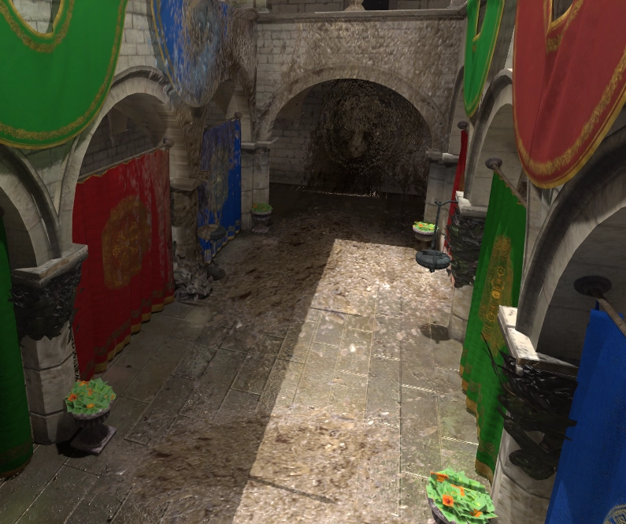
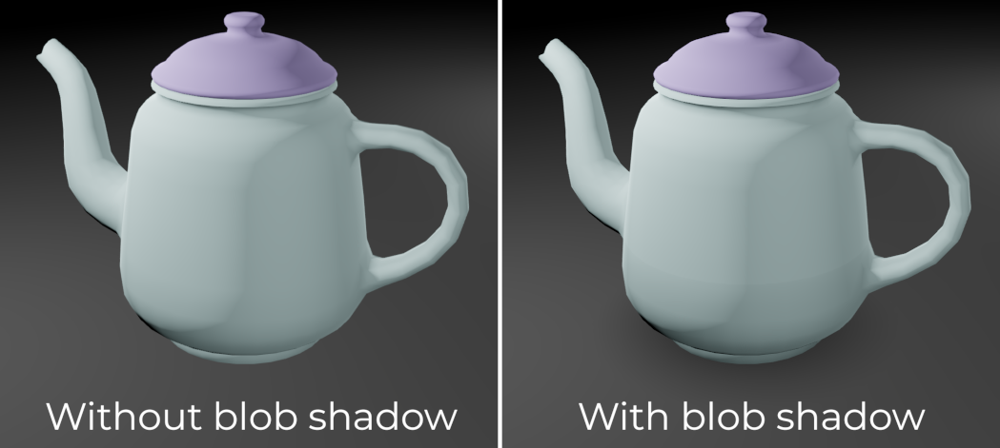

.. _doc_using_decals:

Using decals
============

.. note::

    Decals are only supported in the Clustered Forward and Forward Mobile
    rendering backends, not the Compatibility backend.

    If using the Compatibility backend, consider using Sprite3D as an alternative
    for projecting decals onto (mostly) flat surfaces.

Decals are projected textures that apply on opaque or transparent surfaces in
3D. This projection happens in real-time and doesn't rely on mesh generation.
This allows you to move decals every frame with only a small performance impact,
even when applied on complex meshes.

While decals cannot add actual geometry detail onto the projected surface,
decals can still make use of physically-based rendering to provide similar
properties to full-blown :abbr:`PBR (Physically-Based Rendering)` materials.

On this page, you'll learn:

- How to set up decals in the 3D editor.
- How to create decals during gameplay in a 3D scene (such as bullet impacts).
- How to balance decal configuration between performance and quality.

.. seealso::

    The Godot demo projects repository contains a
    `3D decals demo <https://github.com/godotengine/godot-demo-projects/tree/4.0-dev/3d/decals>`__.

    If you're looking to write arbitrary 3D text on top of a surface, use
    :ref:`doc_3d_text` placed close to a surface instead of a Decal node.

Use cases
---------

Static decoration
^^^^^^^^^^^^^^^^^

Sometimes, the fastest way to add texture detail to a scene is to use decals.
This is especially the case for organic detail, such as patches of dirt or sand
scattered on a large surface. Decals can help break up texture repetition in
scenes and make patterns look more natural. On a smaller scale, decals can also
be used to create detail variations for objects. For example, decals can be used
to add nuts and bolts on top of hard-surface geometry.

Since decals can inject their own :abbr:`PBR (Physically-Based Rendering)`
properties on top of the projected surfaces, they can also be used to create
footprints or wet puddles.

   Dirt added on top of level geometry using decals

Dynamic gameplay elements
^^^^^^^^^^^^^^^^^^^^^^^^^

Decals can represent temporary or persistent gameplay effects such as bullet
impacts and explosion scorches.

Using an AnimationPlayer node or a script, decals can be made to fade over time
(and then be removed using ``queue_free()``) to improve performance.

Blob shadows
^^^^^^^^^^^^

Blob shadows are frequently used in mobile projects (or to follow a retro art
style), as real-time lighting tends to be too expensive on low-end mobile
devices. However, when relying on baked lightmaps with fully baked lights,
dynamic objects will not cast *any* shadow from those lights. This makes dynamic
objects in lightmapped scenes look flat in comparison to real-time lighting,
with dynamic objects almost looking like they're floating.

Thanks to blob shadows, dynamic objects can still cast an approximative shadow.
Not only this helps with depth perception in the scene, but this can also be a
gameplay element, especially in 3D platformers. The blob shadow's length can be
extended to let the player know where they will land if they fall straight down.

Even with real-time lighting, blob shadows can still be useful as a form of
ambient occlusion for situations where SSAO is too expensive or too unstable due
to its screen-space nature. For example, vehicles' underside shadows are
well-represented using blob shadows.

   Blob shadow under object comparison

Quick start guide
-----------------

Creating decals in the editor
^^^^^^^^^^^^^^^^^^^^^^^^^^^^^

1. Create a Decal node in the 3D editor.
2. In the inspector, expand the **Textures** section and load a texture in
   **Textures > Albedo**.
3. Move the Decal node towards an object, then rotate it so the decal is visible
   (and in the right orientation). If the decal appears mirrored, try to rotate
   it by 180 degrees. You can double-check whether it's in the right orientation
   by increasing **Parameters > Normal Fade** to 0.5. This will prevent the Decal
   from being projected on surfaces that are not facing the decal.
4. If your decal is meant to affect static objects only, configure it to prevent
   affecting dynamic objects (or vice versa). To do so, change the decal's
   **Cull Mask** property to exclude certain layers. After doing this, modify
   your dynamic objects' MeshInstance3D nodes to change their visibility layers.
   For instance, you can move them from layer 1 to layer 2, then disable layer 2
   in the decal's **Cull Mask** property.

Decal node properties
---------------------

- **Extents:** The size of the decal. The Y axis determines the length of the
  decal's projection. Keep the projection length as short as possible to improve
  culling opportunities, therefore improving performance.

Textures
^^^^^^^^

- **Albedo:** The albedo (diffuse/color) map to use for the decal. In
  most situations, this is the texture you want to set first. If using a normal
  or ORM map, an albedo map *must* be set to provide an alpha channel. This
  alpha channel will be used as a mask to determine how much the normal/ORM maps
  will affect the underlying surface.
- **Normal:** The normal map to use for the decal. This can be used
  to increase perceived detail on the decal by modifying how light reacts to it.
  The impact of this texture is multiplied by the albedo texture's alpha channel
  (but not **Albedo Mix**).
- **ORM:** The Occlusion/Roughness/Metallic map to use for the decal.
  This is an optimized format for storing PBR material maps. Ambient Occlusion
  map is stored in the red channel, roughness map in the green channel, metallic
  map in the blue channel. The impact of this texture is multiplied by the
  albedo texture's alpha channel (but not **Albedo Mix**).
- **Emission:** The emission texture to use for the decal. Unlike
  **Albedo**, this texture will appear to glow in the dark.

Parameters
^^^^^^^^^^

- **Emission Energy:** The brightness of the emission texture.
- **Modulate:** Multiplies the color of the albedo and emission textures. Use
  this to tint decals (e.g. for paint decals, or to increase variation by
  randomizing each decal's modulation).
- **Albedo Mix:** The opacity of the albedo texture. Unlike using an albedo
  texture with a more transparent alpha channel, decreasing this value below
  ``1.0`` does *not* reduce the impact of the normal/ORM texture on the
  underlying surface. Set this to ``0.0`` when creating normal/ORM-only decals
  such as footsteps or wet puddles.
- **Normal Fade:** Fades the Decal if the angle between the Decal's
  :abbr:`AABB (Axis-Aligned Bounding Box)` and the target surface becomes too large.
  A value of ``0.0`` projects the decal regardless of angle, while a value of ``0.999``
  limits the decal to surfaces that are nearly perpendicular. Setting **Normal
  Fade** to a value greater than ``0.0`` has a small performance cost due to the
  added normal angle computations.

Vertical Fade
^^^^^^^^^^^^^

- **Upper Fade:** The curve over which the decal will fade as the surface gets
  further from the center of the :abbr:`AABB (Axis-Aligned Bounding Box)`
  (towards the decal's projection angle). Only positive values are valid.
- **Lower Fade:** The curve over which the decal will fade as the surface gets
  further from the center of the :abbr:`AABB (Axis-Aligned Bounding Box)` (away
  from the decal's projection angle). Only positive values are valid.

Distance Fade
^^^^^^^^^^^^^

- **Enabled:** Controls whether distance fade (a form of :abbr:`LOD (Level of Detail)`)
  is enabled. The decal will fade out over **Begin + Length**, after which it
  will be culled and not sent to the shader at all. Use this to reduce the number
  of active decals in a scene and thus improve performance.
- **Begin:** The distance from the camera at which the decal begins to fade away
  (in 3D units).
- **Length:** The distance over which the decal fades (in 3D units). The decal
  becomes slowly more transparent over this distance and is completely invisible
  at the end. Higher values result in a smoother fade-out transition, which is
  more suited when the camera moves fast.

Cull Mask
^^^^^^^^^

- **Cull Mask:** Specifies which VisualInstance3D layers this decal will project
  on. By default, decals affect all layers. This is used so you can specify which
  types of objects receive the decal and which do not. This is especially useful
  so you can ensure that dynamic objects don't accidentally receive a Decal
  intended for the terrain under them.

Tweaking performance and quality
--------------------------------

Decal rendering performance is mostly determined by their screen coverage, but
also their number. In general, a few large decals that cover up most of the
screen will be more expensive to render than many small decals that are
scattered around.

To improve rendering performance, you can enable the **Distance Fade** property
as described above. This will make distant decals fade out when they are far
away from the camera (and may have little to no impact on the final scene
rendering). Using node groups, you can also prevent non-essential decorative
decals from spawning based on user configuration.

The way decals are rendered also has an impact on performance. The **Rendering >
Textures > Decals > Filter** advanced project setting lets you control how decal
textures should be filtered. **Nearest/Linear** does not use mipmaps. However,
decals will look grainy at a distance. **Nearest/Linear Mipmaps** will look
smoother at a distance, but decals will look blurry when viewed from oblique
angles. This can be resolved by using **Nearest/Linear Mipmaps Anisotropic**,
which provides the highest quality but is also slower to render.

If your project has a pixel art style, consider setting the filter to one of the
**Nearest** values so that decals use nearest-neighbor filtering. Otherwise,
stick to **Linear**.

Limitations
-----------

Decals cannot affect material properties other than the ones listed above,
such as height (for parallax mapping).

For performance reasons, decals use purely fixed rendering logic. This means
decals cannot use custom shaders. However, custom shaders on the projected
surfaces are able to read the information that is overridden by decals on top of
them, such as roughness and metallic.

When using the Forward+ renderer, Godot uses a *clustering* approach for
decal rendering. As many decals as desired can be added (as long as
performance allows). However, there's still a default limit of 512 *clustered
elements* that can be present in the current camera view. A clustered element is
an omni light, a spot light, a :ref:`decal <doc_using_decals>` or a
:ref:`reflection probe <doc_reflection_probes>`. This limit can be increased by
adjusting the **Rendering > Limits > Cluster Builder > Max Clustered Elements**
advanced project setting.

When using the Forward Mobile backend, only 8 decals can be applied on each
individual Mesh *resource*. If there are more decals affecting a single mesh,
not all of them will be rendered on the mesh.
