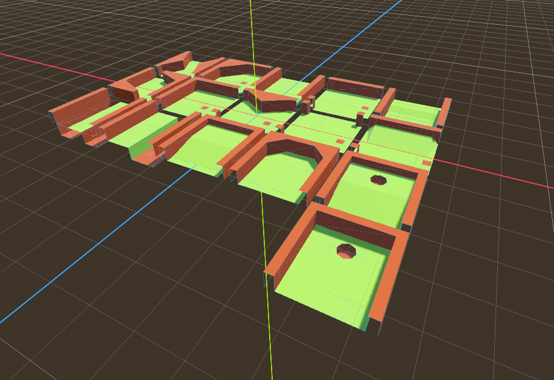
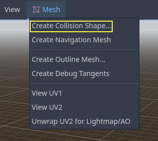
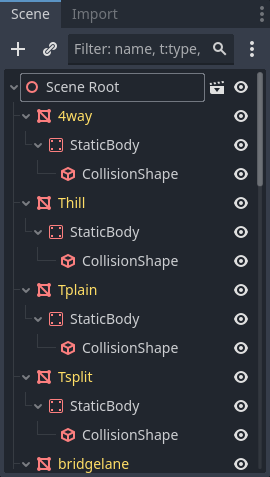
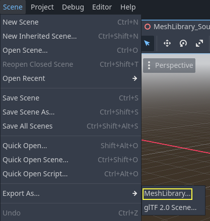
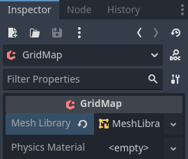
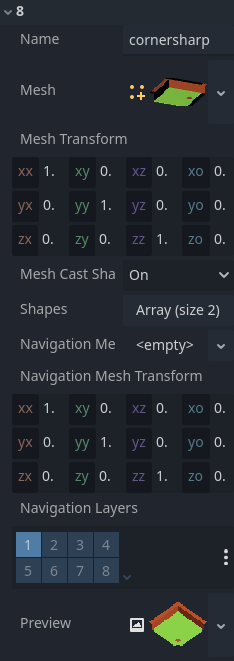
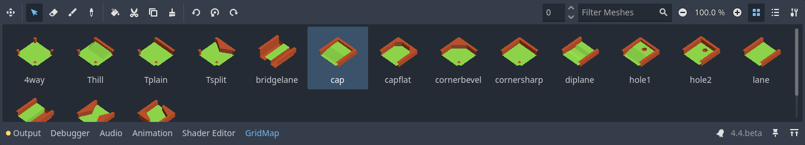
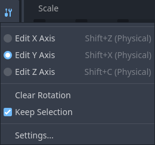

.. _doc_using_gridmaps:

Using GridMaps
==============

Introduction
------------

:ref:`Gridmaps <class_GridMap>` are a tool for creating 3D
game levels, similar to the way :ref:`TileMap <doc_using_tilemaps>`
works in 2D. You start with a predefined collection of 3D meshes (a
:ref:`class_MeshLibrary`) that can be placed on a grid,
as if you were building a level with an unlimited amount of Lego blocks.

Collisions and navigation can also be added to the meshes, just like you
would do with the tiles of a tilemap.

Example project
---------------

To learn how GridMaps work, start by downloading the sample project:
`gridmap_starter.zip <https://github.com/godotengine/godot-docs-project-starters/releases/download/latest-4.x/gridmap_starter.zip>`_.

Unzip this project and add it to the Project Manager using the "Import"
button. You may get a popup saying that it needs to be converted to a newer Godot
version, click **Convert project.godot**.

Creating a MeshLibrary
----------------------

To begin, you need a :ref:`class_MeshLibrary`, which is a collection
of individual meshes that can be used in the gridmap. Open the "mesh_library_source.tscn"
scene to see an example of how to set up the mesh library.

As you can see, this scene has a :ref:`class_Node3D` node as its root, and
a number of :ref:`class_MeshInstance3D` node children.

If you don't need any physics in your scene, then you're done. However, in most
cases you'll want to assign collision bodies to the meshes.

Collisions
----------

You can manually assign a :ref:`class_StaticBody3D` and
:ref:`class_CollisionShape3D` to each mesh. Alternatively, you can use the "Mesh" menu
to automatically create the collision body based on the mesh data.

Note that a "Convex" collision body will work better for simple meshes. For more
complex shapes, select "Create Trimesh Static Body". Once each mesh has
a physics body and collision shape assigned, your mesh library is ready to
be used.

Materials
---------

Only the materials from within the meshes are used when generating the mesh
library. Materials set on the node will be ignored.

NavigationMeshes
----------------

Like all mesh instances, MeshLibrary items can be assigned a :ref:`class_NavigationMesh`
resource, which can be created manually, or baked as described below.

To create the NavigationMesh from a MeshLibrary scene export, place a
:ref:`class_NavigationRegion3D` child node below the main MeshInstance3D for the GridMap
item. Add a valid NavigationMesh resource to the NavigationRegion3D and some source
geometry nodes below and bake the NavigationMesh.

.. note::

    With small grid cells it is often necessary to reduce the NavigationMesh properties
    for agent radius and region minimum size.

.. image:: img/meshlibrary_scene.png

Nodes below the NavigationRegion3D are ignored for the MeshLibrary scene export, so
additional nodes can be added as source geometry just for baking the navmesh.

.. warning::

    The baked cell size of the NavigationMesh must match the NavigationServer map cell
    size to properly merge the navigation meshes of different grid cells.

Lightmaps
---------

It is possible to bake lightmaps onto a GridMap. Lightmap UV2 data will be reused
from meshes if already present. If UV2 data is not present, then it will be
automatically generated on bake with a lightmap texel size of 0.1 units.
To generate UV2 data with a different lightmap texel size, you can set the
global illumination mode in the Import dock to **Static Lightmaps**
and specify the texel size there. This option must be changed *before* the scene
is converted to a MeshLibrary, as changing it later on will not affect
the existing MeshLibrary data.

Aside from this peculiarity, the lightmap baking process is the same as for any other 3D scene.
See :ref:`doc_using_lightmap_gi` for more information about lightmap baking.

MeshLibrary format
------------------

To summarize the specific constraints of the MeshLibrary format, a MeshLibrary
scene has a Node3D as the root node, and several child nodes which will become
MeshLibrary items. Each child of the root node should:

- Be a :ref:`class_MeshInstance3D`, which will become the MeshLibrary item. Only
  this visual mesh will be exported.
- Have a material, in the mesh's material slot, *not* the MeshInstance3D's
  material slots.
- Have up to one :ref:`class_StaticBody3D` child, for collision. The
  StaticBody3D should have one or more :ref:`class_CollisionShape3D` children.
- Have up to one :ref:`class_NavigationRegion3D` child, for navigation. The
  NavigationRegion3D can have one or more additional :ref:`class_MeshInstance3D`
  children, which can be baked for navigation, but won't be exported as a visual
  mesh.

Only this specific format is recognized. Other node types placed as children
will not be recognized and exported. GridMap is not a general-purpose system for
placing *nodes* on a grid, but rather a specific, optimized system, designed to
place *meshes* with collisions and navigation.

Exporting the MeshLibrary
-------------------------

To export the library, click on **Scene > Export As... > MeshLibrary...**, and save it
as a resource.

You can find an already exported MeshLibrary in the project named ``MeshLibrary.tres``.

Using GridMap
-------------

Create a new scene and add a GridMap node. Add the mesh library by dragging
the resource file from the FileSystem dock and dropping it in the **Mesh Library**
property in the Inspector.

Inspector properties
~~~~~~~~~~~~~~~~~~~~

The **Physics Material** setting allows you to override the physics material for
every mesh in the NavigationMesh.

Under **Cells**, the **Size** property should be set to the size of your meshes. You
can leave it at the default value for the demo. Uncheck the **Center Y** property.

The **Collision** options allow you to set the collision layer, collision mask, and
priority for the entire grid. For more information on how those work see the
:ref:`doc_physics_index` section.

Under **Navigation** is the "Bake Navigation" option. If enabled it creates a
navigation region for each cell that uses a mesh library item with a navigation
mesh.

If you click on the MeshLibrary itself in the inspector you can adjust settings for
individual meshes, such as their navigation mesh, navigation layers, or if the mesh
casts shadows.

GridMap panel
~~~~~~~~~~~~~

At the bottom of the editor is the GridMap panel, which should have opened
automatically when you added the GridMap node.

From left to right in the toolbar:

- **Transform**: Adds a gizmo to the scene that allows you to change the
  relative position and rotation of the gridmap in the scene.
- **Selection**: While active you can select an area in the viewport, click and drag
  to select more than one space on the grid.
- **Erase**: While active, click in the viewport and delete meshes.
- **Paint**: While active, click in the viewport and add whatever mesh is currently
  selected in the GridMap panel to the scene.
- **Pick**: While active, clicking on a gridmap mesh in the viewport will cause
  it to be selected in the GridMap panel.
- **Fill**: Fill the area that has been selected in the viewport with whatever mesh
  is selected in the GridMap bottom panel.
- **Move**: Move whatever mesh or meshes are currently selected in the viewport.
- **Duplicate**: Create a copy of whatever the selected mesh or meshes in the
  GridMap are.
- **Delete**: Similar to erase, but for the entire selected area.
- **Cursor Rotate X**: While the paint tool is selected, this will rotate the mesh
  that will be painted on the X-axis. This will also rotate selected areas if they
  are being moved.
- **Cursor Rotate Y**: While the paint tool is selected, this will rotate the mesh
  that will be painted on the Y-axis. This will also rotate selected areas if they
  are being moved.
- **Cursor Rotate Z**: While the paint tool is selected, this will rotate the mesh
  that will be painted on the Z-axis. This will also rotate selected areas if they
  are being moved.
- **Change Grid Floor**: Adjusts what floor is currently being worked on, can be
  changed with the arrows or typing
- **Filter Meshes**: Used to search for a specific mesh in the bottom panel.
- **Zoom**: Controls the zoom level on meshes in the bottom panel.
- **Layout toggles**: These two buttons toggle between different layouts for meshes
  in the bottom panel.
- **Tools dropdown**: This button opens a dropdown menu with a few more options.

Clicking on **Settings** in that dropdown brings up a window that allows you to
change the **Pick Distance**, which is the maximum distance at which tiles can be placed
on a GridMap, relative to the camera position (in meters).

Using GridMap in code
---------------------

See :ref:`class_GridMap` for details on the node's methods and member variables.
