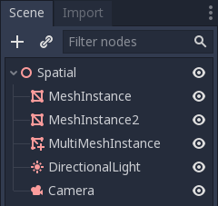
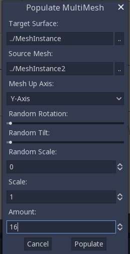
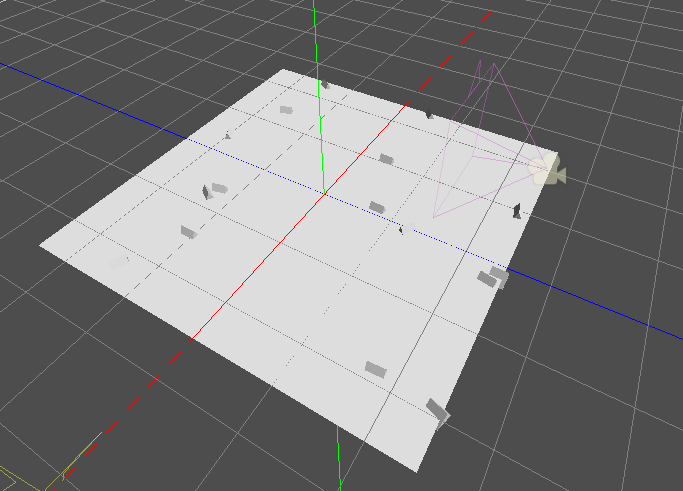

:article_outdated: True

.. _doc_using_multi_mesh_instance:

Using MultiMeshInstance3D
-------------------------

Introduction
~~~~~~~~~~~~

In a normal scenario, you would use a :ref:`MeshInstance3D <class_MeshInstance3D>`
node to display a 3D mesh like a human model for the main character, but in some
cases, you would like to create multiple instances of the same mesh in a scene.
You *could* duplicate the same node multiple times and adjust the transforms
manually. This may be a tedious process and the result may look mechanical.
Also, this method is not conducive to rapid iterations.
:ref:`MultiMeshInstance3D <class_MultiMeshInstance3D>` is one of the possible
solutions to this problem.

MultiMeshInstance3D, as the name suggests, creates multiple copies of a
MeshInstance over a surface of a specific mesh. An example would be having a
tree mesh populate a landscape mesh with trees of random scales and orientations.

Setting up the nodes
~~~~~~~~~~~~~~~~~~~~

The basic setup requires three nodes: the MultiMeshInstance3D node
and two MeshInstance3D nodes.

One node is used as the target, the surface mesh that you want to place multiple meshes
on. In the tree example, this would be the landscape.

The other node is used as the source, the mesh that you want to have duplicated.
In the tree case, this would be the tree itself.

In our example, we would use a :ref:`Node3D <class_Node3D>` node as the root node of
the scene. Your scene tree would look like this:

.. note:: For simplicity's sake, this tutorial uses built-in primitives.

Now you have everything ready. Select the MultiMeshInstance3D node and look at the
toolbar, you should see an extra button called ``MultiMesh`` next to ``View``.
Click it and select *Populate surface* in the dropdown menu. A new window titled
*Populate MultiMesh* will pop up.

MultiMesh settings
~~~~~~~~~~~~~~~~~~

Below are descriptions of the options.

Target Surface
++++++++++++++

The mesh used as the target surface on which to place copies of your
source mesh.

Source Mesh
+++++++++++

The mesh you want duplicated on the target surface.

Mesh Up Axis
++++++++++++

The axis used as the up axis of the source mesh.

Random Rotation
+++++++++++++++

Randomizing the rotation around the up axis of the source mesh.

Random Tilt
+++++++++++

Randomizing the overall rotation of the source mesh.

Random Scale
++++++++++++

Randomizing the scale of the source mesh.

Scale
+++++

The scale of the source mesh that will be placed over the target surface.

Amount
++++++

The amount of mesh instances placed over the target surface.

Select the target surface. In the tree case, this should be the landscape node.
The source mesh should be the tree node. Adjust the other parameters
according to your preference. Press ``Populate`` and multiple copies of the
source mesh will be placed over the target mesh. If you are satisfied with the
result, you can delete the mesh instance used as the source mesh.

The end result should look like this:

To change the result, repeat the previous steps with different parameters.
