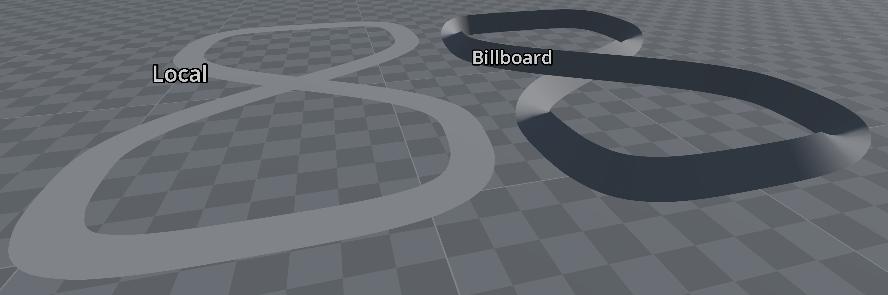
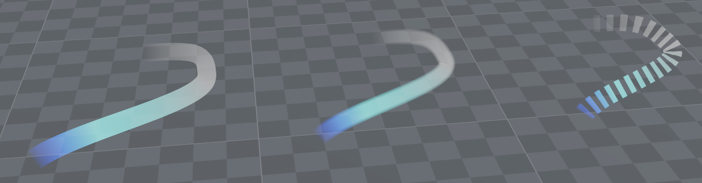
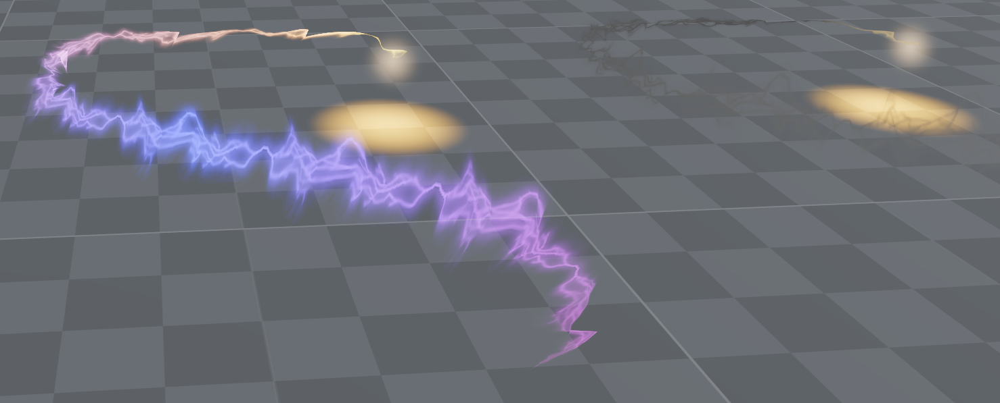
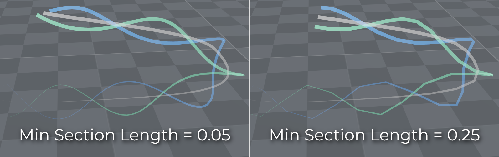
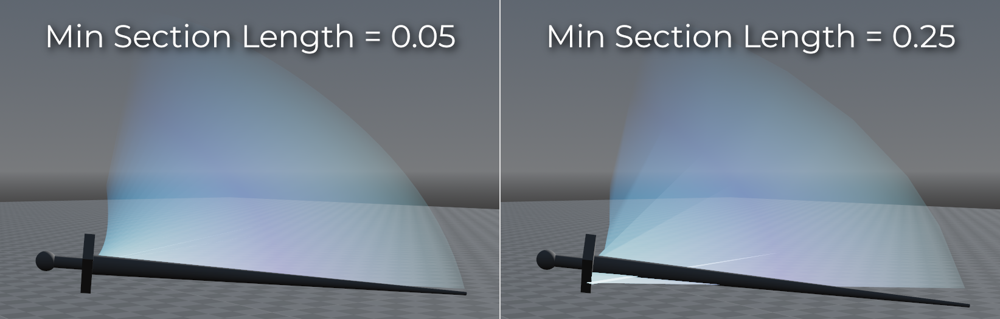

.. _doc_using_trail_3d:

Using Trail3D
=============

.. seealso::

    The Trail3D node is separate from the
    :ref:`particle trails <doc_3d_particles_trails>` functionality
    available in GPUParticles3D.

    Particle trails are only supported in the Forward+ and Mobile renderers,
    while Trail3D works with all renderers. However, Trail3D doesn't support
    displaying trails behind individual particles. Instead, Trail3D is designed
    for standalone trail effects.

Since Godot 4.8, Godot features a :ref:`class_Trail3D` node that can be used to
create trails in 3D space. This node is designed to be used for standalone trail
effects, such as sword slashes or tire tracks.

.. seealso::

    You can see how trails work in the
    `3D Trails demo project <https://github.com/godotengine/godot-demo-projects/tree/master/3d/trails>`__.

Trail3D properties
------------------

Emitting
^^^^^^^^

If enabled, the trail is actively emitting. This can be disabled to stop the
trail from emitting new segments, while still allowing the existing segments to
fade out over time.

If you re-enable the **Emitting** property after disabling it, the trail will
reset, which means all existing segments will be cleared. It will then start
emitting new segments from the current position of the Trail3D node.

.. tip::

    With the exception of **Emitting**, **Limit Mode**, and **Mesh Alignment**,
    all other properties can be adjusted at runtime without causing the trail to
    be reset.

    The trail is emitted based on the node's movement. If you need to visualize it
    while changing properties, consider setting its **Limit Mode** to **Length**,
    then move it around and adjust the properties.

Limit Mode
^^^^^^^^^^

- **Time:** The trail fades over a duration set in **Lifetime**. The trail's
  length is effectively determined by the node's movement speed, with the trail
  appearing longer at higher speeds.
- **Length:** The trail's length is fixed and determined by the **Max Length**
  property. The trail's lifetime is effectively determined by the node's
  movement speed, with the trail appearing to last less long at higher speeds.
  If the trail does not move, it remains visible indefinitely.

Width
^^^^^

The trail's width in meters.

Width Curve
^^^^^^^^^^^

This curve acts as a multiplier for the trail's width along the length of the
trail. Use it to create trails that taper off or have a specific shape. The
curve's horizontal axis represents the trail's length (with X = 0 being the
start of the trail), while the vertical axis represents the width multiplier.

The width curve is applied on a per-vertex basis. If the curve appears to be
applied incorrectly, try decreasing the **Min Section Length** property to
create more vertices along the trail.

Color
^^^^^

The trail's color and opacity (determined by the color's alpha channel).

.. note::

    For both **Color** and **Color Gradient**, the color is set using vertex
    colors. If using a custom shader, make sure to multiply ``ALBEDO`` and
    ``ALPHA`` by ``COLOR.rgb`` and ``COLOR.a`` respectively in ``fragment()``.

    HDR colors from this property are clamped to the SDR range, as vertex colors
    in Godot are clamped between ``0.0`` and ``1.0`` for each channel. To get
    brighter colors out of this property, add a brightness multiplier ``float``
    uniform to the shader and use it to multiply the final color in
    ``fragment()``.

Color Gradient
^^^^^^^^^^^^^^

This gradient acts as a multiplier for the trail's color along the length of the
trail. Use it to create trails that fade out or change color over time. The
gradient's horizontal axis represents the trail's length (with X = 0 being the
start of the trail), while the vertical axis represents the color multiplier.

The color gradient is applied on a per-vertex basis. If the gradient appears to
be applied incorrectly, try decreasing the **Min Section Length** property to
create more vertices along the trail.

Mesh Alignment
^^^^^^^^^^^^^^

When using the **Local** mode, the generated mesh is aligned to the local space
of the trail. This means the mesh rotates and scales based on the trail's
movement and orientation. For example, if you are using a :ref:`class_Path3D` +
:ref:`class_PathFollow3D` setup to draw a trail along a path, the path's tilt is
taken into account. This is generally the mode to use for effects like sword slashes.

When using the **Billboard** mode, the trail will always face the camera,
regardless of its orientation or movement. The node's scale is also ignored.
This mode is useful to create effects that need to be visible from any angle,
such as smoke or fire trails.

   Comparison of local and billboard mesh alignment modes (with shading enabled to ease visualization)

Material Mode
^^^^^^^^^^^^^

Controls what material is used to display the trail. The available options are:

- **Default:** Provides an unshaded material with "mix" blending.
- **Default Additive:** Same as the Default material, but uses additive blending
  instead. You can use it for energy-based effects such as lasers or magic spells.
- **Custom:** A user-provided :ref:`spatial shader <doc_spatial_shader>` that
  can be edited. It is prefilled with a shader that provides the desired
  billboarding mode, based on the value of the **Mesh Alignment** property
  at the time you select the **Custom** material mode. You can edit this shader
  to create your own effects, such as displaying textures or distorting the
  trail's vertices.

   Comparison of untextured and textured trails (with GradientTexture2D for tapered or dashed trails)

   Example of trails using textures and vertex distortion to achieve lightning or smoke effects

There are several examples of custom trail shaders in the
`3D Trails demo project <https://github.com/godotengine/godot-demo-projects/tree/master/3d/trails>`__.

.. note::

    If you change the **Mesh Alignment** property after switching to the **Custom** material mode,
    you will need to adapt your custom shader accordingly:

    - If using the **Local** mode, remove the billboarding code below from the ``vertex()`` function.
    - If using the **Billboard** mode, ensure that the billboarding code is present in the ``vertex()`` function:

    .. code-block:: glsl

        void vertex() {
            // Billboarding code for trails.
            // `CUSTOM0` contains the tangent and width of the trail.
            if (dot(CUSTOM0.xyz, CUSTOM0.xyz) > 0.0) {
                vec3 p = (inverse(MODELVIEW_MATRIX) * vec4(0.0, 0.0, 0.0, 1.0)).xyz;
                p = VERTEX - p;
                vec3 t = CUSTOM0.xyz;
                vec3 binormal = normalize(cross(p, t));
                vec3 normal = normalize(cross(t, binormal));
                vec3 tangent = normalize(cross(binormal, normal));
                VERTEX += CUSTOM0.w * binormal;
                NORMAL = normal;
                TANGENT = tangent;
                BINORMAL = binormal;
            }
      }

Tiling Mode
^^^^^^^^^^^

.. note::

    This tiling mode only has a visible effect on trails that use a custom
    shader, as there is currently no way to supply a texture in the default
    shader.

There are two tiling modes available for the Trail3D's UV map:

- **Unit:** The UV spans the trail's entire length. The UV's aspect ratio will
  change according to the trail's length, which can cause stretching
  of the texture.
- **Length:** The UV has a fixed length in world space. The UV's aspect ratio
  is unaffected by the trail's length.

In both modes, the **Tiling Multiplier** property can be used to scale the UVs.
When using the **Unit** tiling mode, a value of ``1.0`` means that the UVs will span
the entire length of the trail, while a value of ``2.0`` will repeat the texture
twice along the trail's length. This value can be set to a negative number to
flip the UVs.

When **Tiling Mode** is set to **Length**, you can also enable **Pin UV** to ensure UVs
don't move in world space when the trail moves:

.. video:: video/using_trail_3d_pin_uv_comparison.webm
   :alt: Comparison of Trail3D UV modes
   :autoplay:
   :loop:
   :muted:
   :align: default

Min Section Length
^^^^^^^^^^^^^^^^^^

The **Min Section Length** property determines the trail's detail level. Lower
values result in a trail with more segments, while higher values create a trail
with fewer segments. Trails with more segments will look smoother in curved
sections, and allow width/color curves to be represented more accurately.

Adjust this value based on the trail's typical movement speed, the desired
visual effect, and performance considerations (lower values are more demanding on
the CPU and GPU). Trails with shorter lifetimes can generally use lower values,
while trails with longer lifetimes may require higher values to avoid excessive
segment counts.

   Comparison of different Min Section Length values on a corkscrew trail effect

A lower value also allows the trail to better follow the object, with less of a
visible gap between the object and the beginning of the trail:

   Comparison of different Min Section Length values on a sword slash effect
