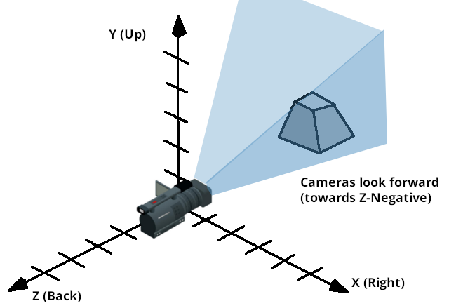

.. _doc_using_transforms:

Using 3D transforms
~~~~~~~~~~~~~~~~~~~

Introduction
------------

If you have never made 3D games before, working with rotations in three dimensions can be confusing at first.
Coming from 2D, the natural way of thinking is along the lines of *"Oh, it's just like rotating in 2D, except now rotations happen in X, Y and Z"*.

At first, this seems easy. For simple games, this way of thinking may even be enough. Unfortunately, it's often incorrect.

Angles in three dimensions are most commonly referred to as "Euler Angles".

.. image:: img/transforms_euler.png

Euler angles were introduced by mathematician Leonhard Euler in the early 1700s.

.. image:: img/transforms_euler_himself.png

This way of representing 3D rotations was groundbreaking at the time, but it has several shortcomings when used in game development (which is to be expected from a guy with a funny
hat).
The idea of this document is to explain why, as well as outlining best practices for dealing with transforms when programming 3D games.

Problems of Euler angles
------------------------

While it may seem intuitive that each axis has a rotation, the truth is that it's just not practical.

Axis order
==========

The main reason for this is that there isn't a *unique* way to construct an orientation from the angles. There isn't a standard mathematical function that
takes all the angles together and produces an actual 3D rotation. The only way an orientation can be produced from angles is to rotate the object angle
by angle, in an *arbitrary order*.

This could be done by first rotating in *X*, then *Y* and then in *Z*. Alternatively, you could first rotate in *Y*, then in *Z* and finally in *X*. Anything works,
but depending on the order, the final orientation of the object will *not necessarily be the same*. Indeed, this means that there are several ways to construct an orientation
from 3 different angles, depending on *the order of the rotations*.

Following is a visualization of rotation axes (in X, Y, Z order) in a gimbal (from Wikipedia). As you can see, the orientation of each axis depends on the rotation of the previous one:

.. image:: img/transforms_gimbal.gif

You may be wondering how this affects you. Let's look at a practical example:

Imagine you are working on a first-person controller (e.g. an FPS game). Moving the mouse left and right controls your view angle parallel to the ground, while moving it up and down moves the player's view up and down.

In this case to achieve the desired effect, rotation must be applied first in the *Y* axis ("up" in this case, since Godot uses a "Y-Up" orientation), followed by rotation in the *X* axis.

.. image:: img/transforms_rotate1.gif

If we were to apply rotation in the *X* axis first, and then in *Y*, the effect would be undesired:

.. image:: img/transforms_rotate2.gif

Depending on the type of game or effect desired, the order in which you want axis rotations to be applied may differ. Therefore, applying rotations in X, Y, and Z is not enough: you also need a *rotation order*.

Interpolation
=============

Another problem with using Euler angles is interpolation. Imagine you want to transition between two different camera or enemy positions (including rotations). One logical way to approach this is to interpolate the angles from one position to the next. One would expect it to look like this:

.. image:: img/transforms_interpolate1.gif

But this does not always have the expected effect when using angles:

.. image:: img/transforms_interpolate2.gif

The camera actually rotated the opposite direction!

There are a few reasons this may happen:

* Rotations don't map linearly to orientation, so interpolating them does not always result in the shortest path (i.e., to go from ``270`` to ``0`` degrees is not the same as going from ``270`` to ``360``, even though the angles are equivalent).
* Gimbal lock is at play (first and last rotated axis align, so a degree of freedom is lost). See `Wikipedia's page on Gimbal Lock <https://en.wikipedia.org/wiki/Gimbal_lock>`_ for a detailed explanation of this problem.

Say no to Euler angles
======================

The result of all this is that you should **not use** the ``rotation`` property of :ref:`class_Node3D` nodes in Godot for games. It's there to be used mainly in the editor, for coherence with the 2D engine, and for simple rotations (generally just one axis, or even two in limited cases). As much as you may be tempted, don't use it.

Instead, there is a better way to solve your rotation problems.

Introducing transforms
----------------------

Godot uses the :ref:`class_Transform3D` datatype for orientations. Each :ref:`class_Node3D` node contains a ``transform`` property which is relative to the parent's transform, if the parent is a Node3D-derived type.

It is also possible to access the world coordinate transform via the ``global_transform`` property.

A transform has a :ref:`class_Basis` (transform.basis sub-property), which consists of three :ref:`class_Vector3` vectors. These are accessed via the ``transform.basis`` property and can be accessed directly by ``transform.basis.x``, ``transform.basis.y``, and ``transform.basis.z``. Each vector points in the direction its axis has been rotated, so they effectively describe the node's total rotation. The scale (as long as it's uniform) can also be inferred from the length of the axes. A *basis* can also be interpreted as a 3x3 matrix and used as ``transform.basis[x][y]``.

A default basis (unmodified) is akin to:

.. tabs::
 .. code-tab:: gdscript GDScript

    var basis = Basis()
    # Contains the following default values:
    basis.x = Vector3(1, 0, 0) # Vector pointing along the X axis
    basis.y = Vector3(0, 1, 0) # Vector pointing along the Y axis
    basis.z = Vector3(0, 0, 1) # Vector pointing along the Z axis

 .. code-tab:: csharp

    // Due to technical limitations on structs in C# the default
    // constructor will contain zero values for all fields.
    var defaultBasis = new Basis();
    GD.Print(defaultBasis); // prints: ((0, 0, 0), (0, 0, 0), (0, 0, 0))

    // Instead we can use the Identity property.
    var identityBasis = Basis.Identity;
    GD.Print(identityBasis.X); // prints: (1, 0, 0)
    GD.Print(identityBasis.Y); // prints: (0, 1, 0)
    GD.Print(identityBasis.Z); // prints: (0, 0, 1)

    // The Identity basis is equivalent to:
    var basis = new Basis(Vector3.Right, Vector3.Up, Vector3.Back);
    GD.Print(basis); // prints: ((1, 0, 0), (0, 1, 0), (0, 0, 1))

This is also an analog of a 3x3 identity matrix.

Following the OpenGL convention, ``X`` is the *Right* axis, ``Y`` is the *Up* axis and ``Z`` is the *Forward* axis.

Together with the *basis*, a transform also has an *origin*. This is a *Vector3* specifying how far away from the actual origin ``(0, 0, 0)`` this transform is. Combining the *basis* with the *origin*, a *transform* efficiently represents a unique translation, rotation, and scale in space.

One way to visualize a transform is to look at an object's 3D gizmo while in "local space" mode.

.. image:: img/transforms_local_space.png

The gizmo's arrows show the ``X``, ``Y``, and ``Z`` axes (in red, green, and blue respectively) of the basis, while the gizmo's center is at the object's origin.

.. image:: img/transforms_gizmo.png

For more information on the mathematics of vectors and transforms, please read the :ref:`doc_vector_math` tutorials.

Manipulating transforms
=======================

Of course, transforms are not as straightforward to manipulate as angles and have problems of their own.

It is possible to rotate a transform, either by multiplying its basis by another (this is called accumulation), or by using the rotation methods.

.. tabs::
 .. code-tab:: gdscript GDScript

    var axis = Vector3(1, 0, 0) # Or Vector3.RIGHT
    var rotation_amount = 0.1
    # Rotate the transform around the X axis by 0.1 radians.
    transform.basis = Basis(axis, rotation_amount) * transform.basis
    # shortened
    transform.basis = transform.basis.rotated(axis, rotation_amount)

 .. code-tab:: csharp

    Transform3D transform = Transform;
    Vector3 axis = new Vector3(1, 0, 0); // Or Vector3.Right
    float rotationAmount = 0.1f;

    // Rotate the transform around the X axis by 0.1 radians.
    transform.Basis = new Basis(axis, rotationAmount) * transform.Basis;
    // shortened
    transform.Basis = transform.Basis.Rotated(axis, rotationAmount);

    Transform = transform;

A method in Node3D simplifies this:

.. tabs::
 .. code-tab:: gdscript GDScript

    # Rotate the transform around the X axis by 0.1 radians.
    rotate(Vector3(1, 0, 0), 0.1)
    # shortened
    rotate_x(0.1)

 .. code-tab:: csharp

    // Rotate the transform around the X axis by 0.1 radians.
    Rotate(new Vector3(1, 0, 0), 0.1f);
    // shortened
    RotateX(0.1f);

This rotates the node relative to the parent node.

To rotate relative to object space (the node's own transform), use the following:

.. tabs::
 .. code-tab:: gdscript GDScript

    # Rotate around the object's local X axis by 0.1 radians.
    rotate_object_local(Vector3(1, 0, 0), 0.1)

 .. code-tab:: csharp

    // Rotate around the object's local X axis by 0.1 radians.
    RotateObjectLocal(new Vector3(1, 0, 0), 0.1f);

Precision errors
================

Doing successive operations on transforms will result in a loss of precision due to floating-point error. This means the scale of each axis may no longer be exactly ``1.0``, and they may not be exactly ``90`` degrees from each other.

If a transform is rotated every frame, it will eventually start deforming over time. This is unavoidable.

There are two different ways to handle this. The first is to *orthonormalize* the transform after some time (maybe once per frame if you modify it every frame):

.. tabs::
 .. code-tab:: gdscript GDScript

    transform = transform.orthonormalized()

 .. code-tab:: csharp

    transform = transform.Orthonormalized();

This will make all axes have ``1.0`` length again and be ``90`` degrees from each other. However, any scale applied to the transform will be lost.

It is recommended you not scale nodes that are going to be manipulated; scale their children nodes instead (such as MeshInstance3D). If you absolutely must scale the node, then re-apply it at the end:

.. tabs::
 .. code-tab:: gdscript GDScript

    transform = transform.orthonormalized()
    transform = transform.scaled(scale)

 .. code-tab:: csharp

    transform = transform.Orthonormalized();
    transform = transform.Scaled(scale);

Obtaining information
=====================

You might be thinking at this point: **"Ok, but how do I get angles from a transform?"**. The answer again is: you don't. You must do your best to stop thinking in angles.

Imagine you need to shoot a bullet in the direction your player is facing. Just use the forward axis (commonly ``Z`` or ``-Z``).

.. tabs::
 .. code-tab:: gdscript GDScript

    bullet.transform = transform
    bullet.speed = transform.basis.z * BULLET_SPEED

 .. code-tab:: csharp

    bullet.Transform = transform;
    bullet.LinearVelocity = transform.Basis.Z * BulletSpeed;

Is the enemy looking at the player? Use the dot product for this (see the :ref:`doc_vector_math` tutorial for an explanation of the dot product):

.. tabs::
 .. code-tab:: gdscript GDScript

    # Get the direction vector from player to enemy
    var direction = enemy.transform.origin - player.transform.origin
    if direction.dot(enemy.transform.basis.z) > 0:
        enemy.im_watching_you(player)

 .. code-tab:: csharp

    // Get the direction vector from player to enemy
    Vector3 direction = enemy.Transform.Origin - player.Transform.Origin;
    if (direction.Dot(enemy.Transform.Basis.Z) > 0)
    {
        enemy.ImWatchingYou(player);
    }

Strafe left:

.. tabs::
 .. code-tab:: gdscript GDScript

    # Remember that +X is right
    if Input.is_action_pressed("strafe_left"):
        translate_object_local(-transform.basis.x)

 .. code-tab:: csharp

    // Remember that +X is right
    if (Input.IsActionPressed("strafe_left"))
    {
        TranslateObjectLocal(-Transform.Basis.X);
    }

Jump:

.. tabs::
 .. code-tab:: gdscript GDScript

    # Keep in mind Y is up-axis
    if Input.is_action_just_pressed("jump"):
        velocity.y = JUMP_SPEED

    move_and_slide()

 .. code-tab:: csharp

    // Keep in mind Y is up-axis
    if (Input.IsActionJustPressed("jump"))
        velocity.Y = JumpSpeed;

    MoveAndSlide();

All common behaviors and logic can be done with just vectors.

Setting information
===================

There are, of course, cases where you want to set information to a transform. Imagine a first person controller or orbiting camera. Those are definitely done using angles, because you *do want* the transforms to happen in a specific order.

For such cases, keep the angles and rotations *outside* the transform and set them every frame. Don't try to retrieve and reuse them because the transform is not meant to be used this way.

Example of looking around, FPS style:

.. tabs::
 .. code-tab:: gdscript GDScript

    # accumulators
    var rot_x = 0
    var rot_y = 0

    func _input(event):
        if event is InputEventMouseMotion and event.button_mask & 1:
            # modify accumulated mouse rotation
            rot_x += event.relative.x * LOOKAROUND_SPEED
            rot_y += event.relative.y * LOOKAROUND_SPEED
            transform.basis = Basis() # reset rotation
            rotate_object_local(Vector3(0, 1, 0), rot_x) # first rotate in Y
            rotate_object_local(Vector3(1, 0, 0), rot_y) # then rotate in X

 .. code-tab:: csharp

    // accumulators
    private float _rotationX = 0f;
    private float _rotationY = 0f;

    public override void _Input(InputEvent @event)
    {
        if (@event is InputEventMouseMotion mouseMotion)
        {
            // modify accumulated mouse rotation
            _rotationX += mouseMotion.Relative.X * LookAroundSpeed;
            _rotationY += mouseMotion.Relative.Y * LookAroundSpeed;

            // reset rotation
            Transform3D transform = Transform;
            transform.Basis = Basis.Identity;
            Transform = transform;

            RotateObjectLocal(Vector3.Up, _rotationX); // first rotate about Y
            RotateObjectLocal(Vector3.Right, _rotationY); // then rotate about X
        }
    }

As you can see, in such cases it's even simpler to keep the rotation outside, then use the transform as the *final* orientation.

Interpolating with quaternions
==============================

Interpolating between two transforms can efficiently be done with quaternions. More information about how quaternions work can be found in other places around the Internet. For practical use, it's enough to understand that pretty much their main use is doing a closest path interpolation. As in, if you have two rotations, a quaternion will smoothly allow interpolation between them using the closest axis.

Converting a rotation to quaternion is straightforward.

.. tabs::
 .. code-tab:: gdscript GDScript

    # Convert basis to quaternion, keep in mind scale is lost
    var a = Quaternion(transform.basis)
    var b = Quaternion(transform2.basis)
    # Interpolate using spherical-linear interpolation (SLERP).
    var c = a.slerp(b,0.5) # find halfway point between a and b
    # Apply back
    transform.basis = Basis(c)

 .. code-tab:: csharp

    // Convert basis to quaternion, keep in mind scale is lost
    var a = transform.Basis.GetQuaternion();
    var b = transform2.Basis.GetQuaternion();
    // Interpolate using spherical-linear interpolation (SLERP).
    var c = a.Slerp(b, 0.5f); // find halfway point between a and b
    // Apply back
    transform.Basis = new Basis(c);

The :ref:`class_Quaternion` type reference has more information on the datatype (it
can also do transform accumulation, transform points, etc., though this is used
less often). If you interpolate or apply operations to quaternions many times,
keep in mind they need to be eventually normalized. Otherwise, they will also
suffer from numerical precision errors.

Quaternions are useful when doing camera/path/etc. interpolations, as the result will always be correct and smooth.

Transforms are your friend
--------------------------

For most beginners, getting used to working with transforms can take some time. However, once you get used to them, you will appreciate their simplicity and power.

Don't hesitate to ask for help on this topic in any of Godot's `online communities <https://godotengine.org/community>`_ and, once you become confident enough, please help others!
