.. _doc_vertex_displacement_with_shaders:

Vertex displacement with shaders
================================

Introduction
------------

This tutorial will teach you how to displace the vertices of 
a :ref:`Plane Mesh<class_PlaneMesh>` inside a shader. Vertex displacement can be used 
for a wide variety of effects, but most commonly it is used
as a quick way to turn a flat plane into a simple terrain. Typically
this is done using a heightmap, but in order to keep everything self
contained, in this tutorial we will use noise in a shader. At the end
of this tutorial we will have a deformed plane that looks like a 
miniature terrain complete with dynamic lighting.

By reading this tutorial you should gain a basic understanding of:

* How to create and subdivide a :ref:`Plane Mesh<class_PlaneMesh>`
* How to create and assign a material to a :ref:`Mesh<class_MeshInstance>`
* How to write a :ref:`Shader<class_Shader>` that displaces the vertices of a :ref:`Mesh<class_MeshInstance>`
* How to pass values (Uniforms) into a :ref:`Shader<class_Shader>` to update the :ref:`Mesh<class_MeshInstance>` in realtime
* How to approximate normals from a height function
* How to use a light with a custom material

The plane mesh
--------------

First, add a :ref:`Spatial<class_Spatial>` node to the scene to act as the root. Next, add a :ref:`MeshInstance<class_MeshInstance>`
as a child. 

.. image:: img/vertex_displacement_new_mesh.png

Select the newly created :ref:`MeshInstance<class_MeshInstance>`. Then click on the button that says "null" 
next to the :ref:`Mesh<class_MeshInstance>` in the Inspector. This will bring up a list of :ref:`PrimitiveMeshes<class_PrimitiveMesh>`.
Select "New PlaneMesh".

.. image:: img/vertex_displacement_planemesh.png

The button will change into a small image of a plane. Click on it to enter into
the Inspector for the :ref:`Plane Mesh<class_MeshInstance>`. 

Then, in the viewport, click in the upper left corner where it says [Perspective].
A menu will appear. In the middle of the menu are options for how to display the scene.
Select 'Display Wireframe'.

.. image:: img/vertex_displacement_viewport_settings.png

This will allow you to see the triangles making up the plane.

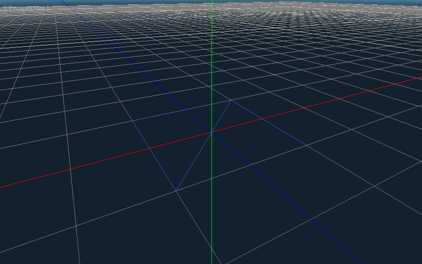

Now set the ``Subdivide Width`` and ``Subdivide Height`` to ``32``.

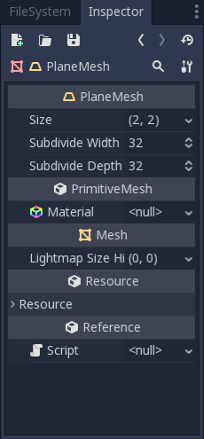

You can see that there are now way more triangles in the :ref:`Mesh<class_MeshInstance>`. This will give
us more vertices to work with and thus allow us to add more detail.

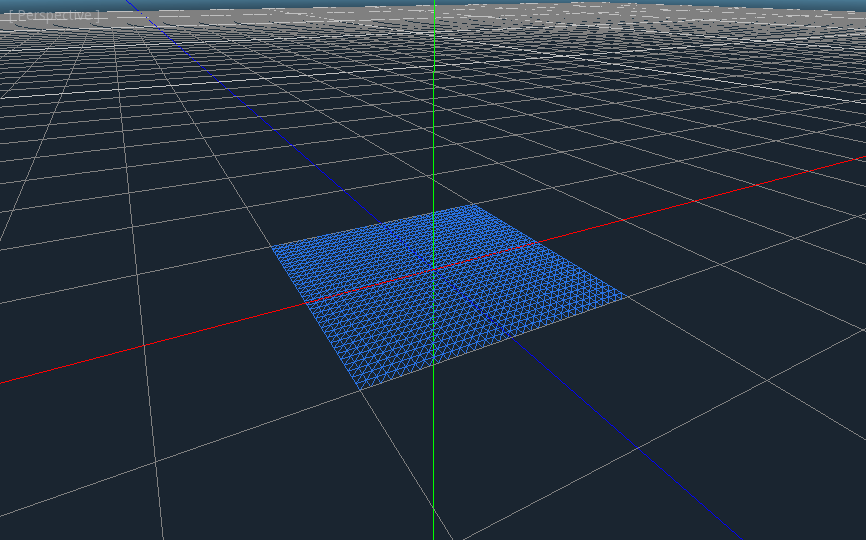

Shader magic
------------

Now that we have a :ref:`Plane Mesh<class_MeshInstance>` to draw lets setup the material that will deform the :ref:`Mesh<class_MeshInstance>`.

Click beside material in the :ref:`Plane Mesh<class_MeshInstance>` Menu and create a new :ref:`ShaderMaterial<class_ShaderMaterial>`.

.. image:: img/vertex_displacement_new_shader_material.png

Then click on the created :ref:`ShaderMaterial<class_ShaderMaterial>`.

Then click beside 'shader' and create a new :ref:`Shader<class_Shader>`.

.. image:: img/vertex_displacement_new_shader.png

Click into the newly created :ref:`Shader<class_Shader>`. You should now see Godot's Shader editor.

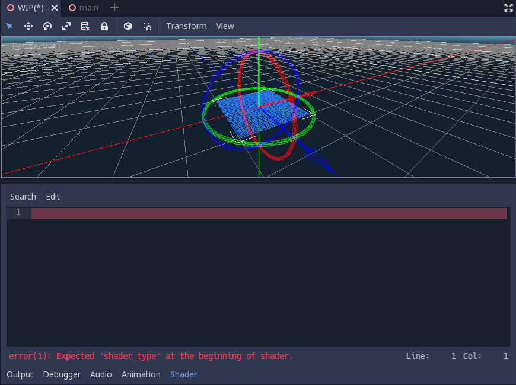

Notice how it is throwing an error? This is because the shader editor reloads shaders on
the fly automatically. The first thing Godot shaders need is a declaration of what type of
shader they are. Accordingly, we set the variable ``shader_type`` to ``spatial``. One more
thing we will add is the ``render_mode``, we will set it to ``unshaded``. This means that
Godot won't run the light shader on this object.

::

  shader_type spatial;
  render_mode unshaded;

This should remove the errors and your :ref:`Mesh<class_MeshInstance>` should turn white. If you were to comment out
the ``render_mode`` the plane would appear blue because it would pick up the sky colors.

Next we will define a vertex shader. The vertex shader determines where the vertices of your
:ref:`Mesh<class_MeshInstance>` appear in the final scene. We will be using it to offset the height of each vertex and
make our flat plane appear like a little terrain. 

We define the vertex shader like so:

::

  void vertex() {

  }

With nothing in the ``vertex`` function Godot will use its default vertex shader. We can easily 
start to make changes by adding a single line:

::

  void vertex() {
    VERTEX.y += cos(VERTEX.x) * sin(VERTEX.z);
  }
  
Adding this line you should get an image like the one below.

.. image:: img/vertex_displacement_cos.png

Okay, lets unpack this. The ``y`` value of the ``VERTEX`` is being increased. And we are passing
the ``x`` and ``z`` components of the ``VERTEX`` as arguments to ``cos`` and ``sin`` this gives us
a wave like appearance across the ``x`` and ``z`` axis. 

What we want to achieve is the look of little hills, after all ``cos`` and ``sin`` already look kind of like
hills. We do so by scaling the inputs to the ``cos`` and ``sin`` functions.

::

  void vertex() {
    VERTEX.y += cos(VERTEX.x * 4.0) * sin(VERTEX.z * 4.0);
  }

.. image:: img/vertex_displacement_cos_scaled.png

This looks better, but it is still too spiky. This is because ``cos`` and ``sin`` output values between ``-1`` and ``1``, 
so the range of the output is much too high. We correct this by multiplying the result by ``0.5`` to reduce the size.

::

  void vertex() {
    VERTEX.y += cos(VERTEX.x * 4.0) * sin(VERTEX.z * 4.0) * 0.5;
  }

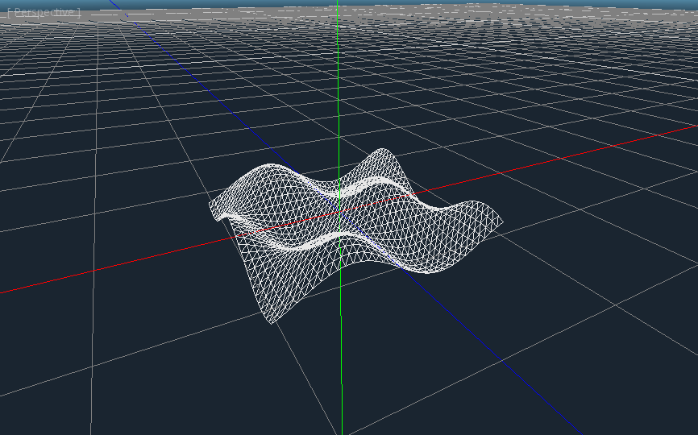

Looks much more hilly now. But ``cos`` and ``sin`` are boring. Lets move onto something more interesting.

Noise
-----

Noise is a very popular tool for procedural generation. Think of it as similar to the cosine function
where you have repeating hills except with noise each hill has a different height. Understanding 
noise is not necessary for this tutorial. There is nothing wrong with simply copying and pasting
the code below.

The first function we use to generate the noise is the ``hash`` function. It gives the random height
for each of the hill tops. 

::

  float hash(vec2 p) {
    return fract(sin(dot(p * 17.17, vec2(14.91, 67.31))) * 4791.9511);
  }

You will find similar functions to this all over the internet. It is lovingly referred to as the
'one-liner hash function'. It works well for simple noise, but there are many better alternatives 
floating around as well. For this tutorial it will work fine. 

Next we define the ``noise`` function. It smoothly interpolates between the random heights.
Again, if this code seems daunting, do not worry, just copy paste and move on with the tutorial.

::

  float noise(vec2 x) {
    vec2 p = floor(x);
    vec2 f = fract(x);
    f = f * f * (3.0 - 2.0 * f);
    vec2 a = vec2(1.0, 0.0);
    return mix(mix(hash(p + a.yy), hash(p + a.xy), f.x), 
           mix(hash(p + a.yx), hash(p + a.xx), f.x), f.y);
  }

Lastly, to add detail we combine successive layers of noise using something called fractal
brownian motion or FBM. Scary name aside FBM noise just adds together layers of noise with
increase frequency and decreasing amplitude. To implement it we run over a for loop where
we increase the frequency each level, decrease the amplitude, and calculate a new layer of noise.

::

  float fbm(vec2 x) {
    float height = 0.0;
    float amplitude = 0.5;
    float frequency = 3.0;
    for (int i = 0; i < 6; i++){
      height += noise(x * frequency) * amplitude;
      amplitude *= 0.5;
      frequency *= 2.0;
    }
    return height;
  }

We can now use this noise function in place of ``cos`` and ``sin`` in the previous section. 

::

  float height = fbm(VERTEX.xz * 4.0);
  VERTEX.y += height * 0.5;

.. image:: img/vertex_displacement_noise1.png

With the noise function in place we already have something that looks kind of cool.
There is a lot of detail, it kind of looks hilly or mountainous. 

Fragment shader
---------------

The difference between a vertex shader and a fragment shader is that the vertex shader
runs per vertex and sets properties such as ``VERTEX`` (position) and ``NORMAL``, while
the fragment shader runs per pixel and, most importantly, sets the ``ALBEDO`` color of the :ref:`Mesh<class_MeshInstance>`.

Now lets look at the :ref:`Mesh<class_MeshInstance>` with a regular shader instead of the wireframe. Set the 
viewport back to 'Display Normal'.

.. image:: img/vertex_displacement_noise2.png

The :ref:`Mesh<class_MeshInstance>` appears completely white because the fragment shader is coloring each pixel white,
but if every pixel is white we lose detail on the :ref:`Mesh<class_MeshInstance>`. So lets color each pixel based
on the height calculated in the vertex shader. We do so by setting the ``COLOR`` variable 
in the vertex shader. And by setting the ``ALBEDO`` in the fragment shader to the calculated
``COLOR`` variable.

::

  void vertex() {
    ...
    COLOR.xyz = vec3(height);
  }

  void fragment(){
    ALBEDO = COLOR.xyz;
  }

With this change we can see the detail of the :ref:`Mesh<class_MeshInstance>`, even without displaying the :ref:`Mesh<class_MeshInstance>`'s wireframe.

.. image:: img/vertex_displacement_noise3.png

Uniforms
--------

Uniform variables allow you to pass data from the game into the shader. They can
be very useful for controlling shader effects. Uniforms can be almost any 
datatype that can be used in the shader. To use a uniform you declare it in
your :ref:`Shader<class_Shader>` using the keyword ``uniform``.

Lets make a uniform that changes the height of the terrain.

::

  uniform float height_scale = 0.5;

Godot lets you initialize a uniform with a value, here ``height_scale`` is set to
``0.5``. You can set uniforms from gdscript by calling the function ``set_shader_param`` 
on the material corresponding to the shader. The value passed from gdscript takes
precedence over the value used to initialize it in the shader.

:: 

  material.set_shader_param("height_scale", 0.5)

Remember that the string passed into ``set_shader_param`` must match the name
of the uniform variable in the :ref:`Shader<class_Shader>`. You can use the uniform variable anywhere 
inside your :ref:`Shader<class_Shader>`. Here, we will use it to set the height value instead
of arbitrarily multiplying by ``0.5``.

::

  VERTEX.y += height * height_scale;

The terrain should look exactly the same, but now we have control over the height easily.
Here is the same terrain with ``height_scale`` set to ``1``:

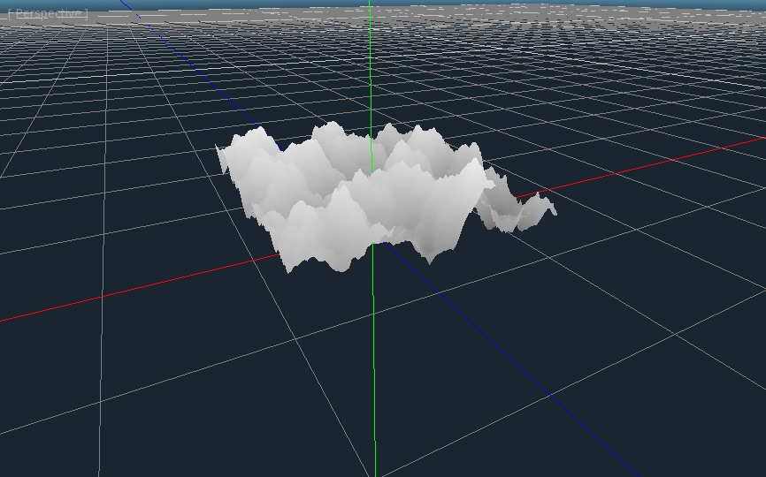

And here it is with ``height_scale`` set to ``0.2``:

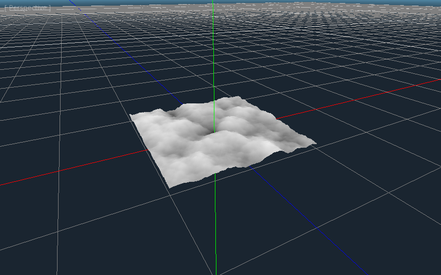

Using uniforms we can even change the value every frame to animate the height of the terrain.
Combined with :ref:`Tweens<class_Tween>` this can be especially useful for simple animations.

Interacting with light
----------------------

As a final part of this tutorial lets try to set up the terrain to interact with light.
First, we will add an :ref:`OmniLight<class_OmniLight>` to the scene.

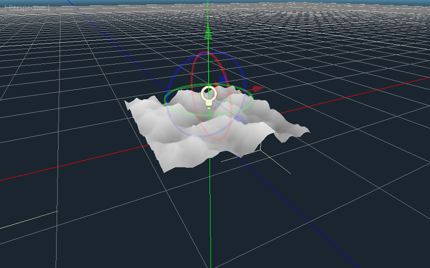

You should notice that nothing changes, this is because we set the ``render_mode`` to ``unshaded``
at the beginning of this tutorial, lets remove that.

::

  shader_type spatial;
  //render_mode unshaded;

.. image:: img/vertex_displacement_light2.png

It looks slightly better now, you can see the light affecting the terrain, and it has
turned blue as a result of the sky. The problem is the light is affecting the terrain
as if it were a flat plane. This is because the light shader uses the normals of the
:ref:`Mesh<class_MeshInstance>` to calculate light. The normals are stored in the :ref:`Mesh<class_MeshInstance>`, but we are changing 
the shape of the :ref:`Mesh<class_MeshInstance>` in the shader so the normals are no longer correct. To fix this
we need to recalculate the normals in the shader. Godot makes this easy for us, all we
have to do is calculate the new normal and set ``NORMAL`` to that value in the vertex shader.
With ``NORMAL`` set Godot will do all the difficult lighting calculations for us.

To calculate the normal from noise we are going to use a technique called 'central differences'.
This is used a lot, especially in places like shadertoy, to calculate normals in shaders. 
What we will do is calculate the noise at four points surrounding the vertex in the ``x`` and ``z`` directions and then calculate 
the slope at the vertex from that. After all a normal is just an indicator of the slope of the
noise.

We calculate the normal with one line in the vertex shader.

::

  vec2 e = vec2(0.01, 0.0);
  vec3 normal = normalize(vec3(fbm(VERTEX.xz - e) - fbm(VERTEX.xz + e), 2.0 * e.x, fbm(VERTEX.xz - e.yx) - fbm(VERTEX.xz + e.yx)));
  NORMAL = normal;

The variable ``e`` just makes it easier to add and subtract the right value from the ``VERTEX``. 
Setting ``e`` to a lower number will increase the level of detail of the normal. 

With ``NORMAL`` calculated the terrain now looks like:

.. image:: img/vertex_displacement_normal.png

This still does not look how we want it to. The issue here is that the noise changes 
faster than the vertices do. So when we calculate the normal at the point of the 
``VERTEX`` it does not align with what we see in the final :ref:`Mesh<class_MeshInstance>`. In order to fix
this we add more vertices. The below image is made with a :ref:`Mesh<class_MeshInstance>` with ``subdivision`` set
to ``100``.

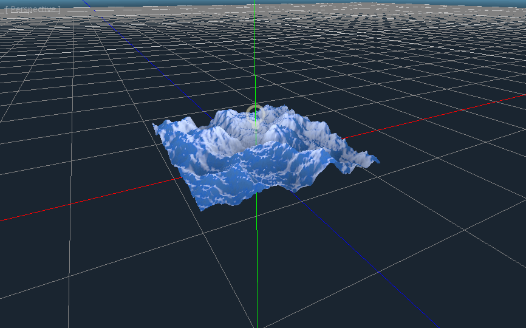

Now we can drag the light around and the lighting will update automatically.

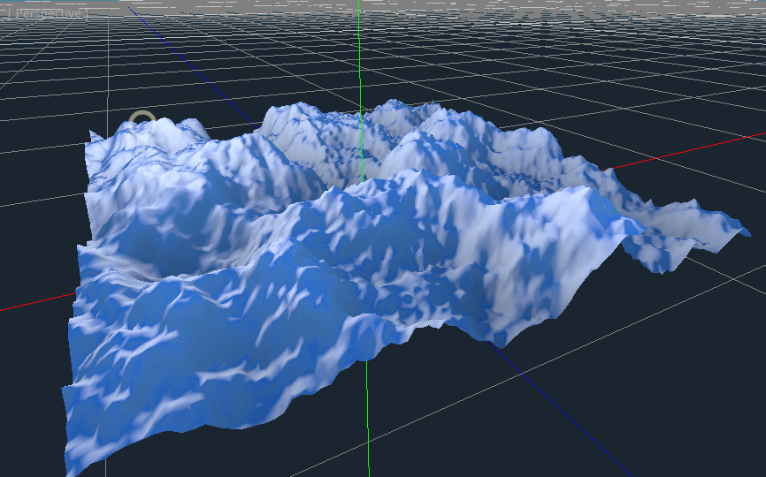

.. image:: img/vertex_displacement_normal_detailed3.png

If you zoom the camera out you can see that the :ref:`Mesh<class_MeshInstance>` now looks like a small terrain.

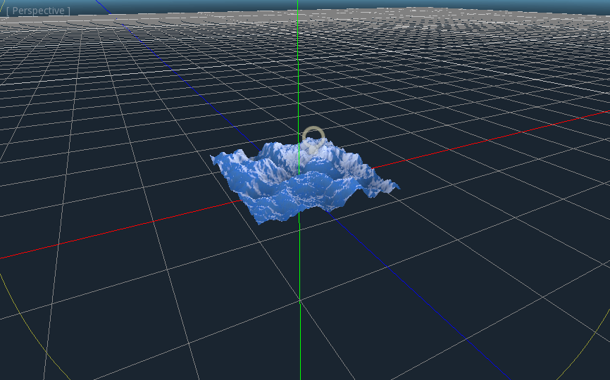

That is everything for this tutorial. Hopefully you understand the basics of vertex
shaders in Godot. As a further exercise try changing the ``height_scale`` from gdscript,
try using different :ref:`Primitive Meshes<class_PrimitiveMesh>`, and try making your
own functions to calculate ``height``.

For further information on how to use shaders in Godot 
you should check out the :ref:`doc_shading_language` page.

