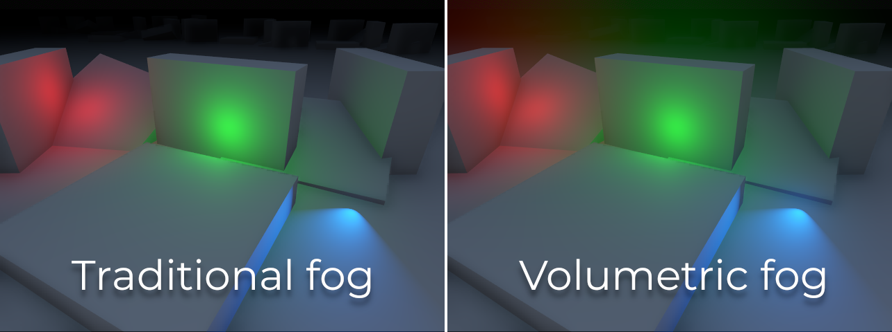
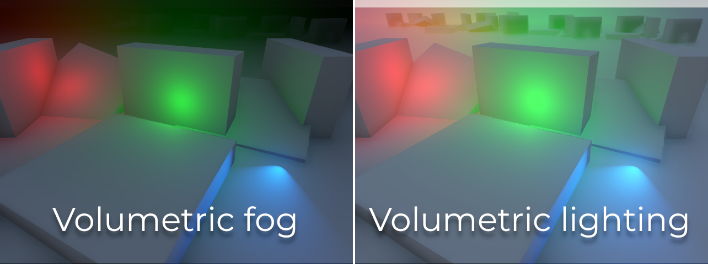
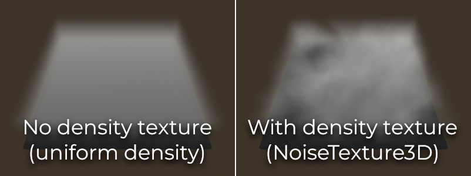

.. _doc_volumetric_fog:

Volumetric fog and fog volumes
==============================

.. note::

    Volumetric fog is only supported in the Clustered Forward rendering backend,
    not Forward Mobile or Compatibility.

As described in :ref:`doc_environment_and_post_processing`, Godot supports
various visual effects including two types of fog: traditional (non-volumetric)
fog and volumetric fog. Traditional fog affects the entire scene at once and
cannot be customized with :ref:`doc_fog_shader`.

Volumetric fog can be used at the same time as non-volumetric fog if desired.

On this page, you'll learn:

- How to set up volumetric fog in Godot.
- What fog volumes are and how they differ from "global" volumetric fog.

.. seealso::

    You can see how volumetric fog works in action using the
    `Volumetric Fog demo project <https://github.com/godotengine/godot-demo-projects/tree/master/3d/volumetric_fog>`__.

Here is a comparison between traditional fog (which does not interact with lighting)
and volumetric fog, which is able to interact with lighting:

Volumetric fog properties
-------------------------

After enabling volumetric fog in the WorldEnvironment node's Environment
resource, you can edit the following properties:

- **Density:** The base *exponential* density of the volumetric fog. Set this to
  the lowest density you want to have globally. FogVolumes can be used to add to
  or subtract from this density in specific areas. A value of ``0.0`` disables
  global volumetric fog while allowing FogVolumes to display volumetric fog in
  specific areas. Fog rendering is exponential as in real life.
- **Albedo:** The Color of the volumetric fog when interacting with lights. Mist
  and fog have an albedo close to white (``Color(1, 1, 1, 1)``) while smoke
  has a darker albedo.
- **Emission:** The emitted light from the volumetric fog. Even with emission,
  volumetric fog will not cast light onto other surfaces. Emission is useful to
  establish an ambient color. As the volumetric fog effect uses
  single-scattering only, fog tends to need a little bit of emission to soften
  the harsh shadows.
- **Emission Energy:** The brightness of the emitted light from the volumetric
  fog.
- **GI Inject:** Scales the strength of Global Illumination used in the
  volumetric fog's albedo color. A value of ``0.0`` means that Global
  Illumination will not impact the volumetric fog. This has a small performance
  cost when set above ``0.0``.
- **Anisotropy:** The direction of scattered light as it goes through the
  volumetric fog. A value close to ``1.0`` means almost all light is scattered
  forward. A value close to ``0.0`` means light is scattered equally in all
  directions. A value close to ``-1.0`` means light is scattered mostly
  backward. Fog and mist scatter light slightly forward, while smoke scatters
  light equally in all directions.
- **Length:** The distance over which the volumetric fog is computed. Increase
  to compute fog over a greater range, decrease to add more detail when a long
  range is not needed. For best quality fog, keep this as low as possible.
- **Detail Spread:** The distribution of size down the length of the froxel
  buffer. A higher value compresses the froxels closer to the camera and places
  more detail closer to the camera.
- **Ambient Inject:** Scales the strength of ambient light used in the
  volumetric fog. A value of ``0.0`` means that ambient light will not impact
  the volumetric fog. This has a small performance cost when set above ``0.0``.
- **Sky Affect:** Controls how much volumetric fog should be drawn onto the
  background sky. If set to ``0.0``, volumetric fog won't affect sky rendering
  at all (including FogVolumes).

Two additional properties are offered in the **Temporal Reprojection** section:

- **Temporal Reprojection > Enabled:** Enables temporal reprojection in the
  volumetric fog. Temporal reprojection blends the current frame's volumetric
  fog with the last frame's volumetric fog to smooth out jagged edges. The
  performance cost is minimal, however it does lead to moving FogVolumes and
  Light3Ds "ghosting" and leaving a trail behind them. When temporal
  reprojection is enabled, try to avoid moving FogVolumes or Light3Ds too fast.
  Short-lived dynamic lighting effects should have **Volumetric Fog Energy** set
  to ``0.0`` to avoid ghosting.
- **Temporal Reprojection > Amount:** The amount by which to blend the last
  frame with the current frame. A higher number results in smoother volumetric
  fog, but makes "ghosting" much worse. A lower value reduces ghosting but can
  result in the per-frame temporal jitter becoming visible.

.. note::

    Unlike non-volumetric fog, volumetric fog has a *finite* range. This means
    volumetric fog cannot entirely cover a large world, as it will eventually
    stop being rendered in the distance.

    If you wish to hide distant areas from the player, it's recommended to
    enable both non-volumetric fog and volumetric fog at the same time, and
    adjust their density accordingly.

Light interaction with volumetric fog
-------------------------------------

To simulate fog light scattering behavior in real life, all light types will
interact with volumetric fog. How much each light will affect volumetric fog can
be adjusted using the **Volumetric Fog Energy** property on each light. Enabling
shadows on a light will also make those shadows visible on volumetric fog.

If fog light interaction is not desired for artistic reasons, this can be
globally disabled by setting **Volumetric Fog > Albedo** to a pure black color
in the Environment resource. Fog light interaction can also be disabled for
specific lights by setting its **Volumetric Fog Energy** to ``0``. Doing so will
also improve performance slightly by excluding the light from volumetric fog
computations.

Using volumetric fog as a volumetric lighting solution
------------------------------------------------------

While not physically accurate, it is possible to tune volumetric fog's settings
to work as volumetric *lighting* solution. This means that unlit parts of the
environment will not be darkened anymore by fog, but light will still be able to
make fog brighter in specific areas.

This can be done by setting volumetric fog density to the lowest permitted value
*greater than zero* (``0.0001``), then increasing the **Volumetric Fog Energy**
property on lights to much higher values than the default to compensate. Values
between ``10000`` and ``100000`` usually work well for this.

Balancing performance and quality
---------------------------------

There are a few project settings available to adjust volumetric fog performance
and quality:

- **Rendering > Environment > Volumetric Fog > Volume Size:** Base size used to
  determine size of froxel buffer in the camera X-axis and Y-axis. The final
  size is scaled by the aspect ratio of the screen, so actual values may differ
  from what is set. Set a larger size for more detailed fog, set a smaller size
  for better performance.
- **Rendering > Environment > Volumetric Fog > Volume Depth:** Number of slices
  to use along the depth of the froxel buffer for volumetric fog. A lower number
  will be more efficient but may result in artifacts appearing during camera
  movement.
- **Rendering > Environment > Volumetric Fog > Use Filter:** Enables filtering
  of the volumetric fog effect prior to integration. This substantially blurs
  the fog which reduces fine details but also smooths out harsh edges and
  aliasing artifacts. Disable when more detail is required.

.. note::

    Volumetric fog can cause banding to appear on the viewport, especially at
    higher density levels. See :ref:`doc_3d_rendering_limitations_color_banding`
    for guidance on reducing banding.

Using fog volumes for local volumetric fog
------------------------------------------

Sometimes, you want fog to be constrained to specific areas. Conversely, you may
want to have global volumetric fog but fog should be excluded from certain
areas. Both approaches can be followed using FogVolume nodes.

Here's a quick start guide to using FogVolumes:

- Make sure **Volumetric Fog** is enabled in the Environment properties. If
  global volumetric fog is undesired, set its **Density** to ``0.0``.
- Create a FogVolume node.
- Assign a new FogMaterial to the FogVolume node's **Material** property.
- In the FogMaterial, set **Density** to a positive value to increase density
  within the FogVolume, or a negative value to subtract the density from global
  volumetric fog.
- Configure the FogVolume's extents and shape as needed.

.. note::

    Thin fog volumes may appear to flicker when the camera moves or rotates.
    This can be alleviated by increasing the
    **Rendering > Environment > Volumetric Fog > Volume Depth** project setting
    (at a performance cost) or by decreasing **Length** in the Environment
    volumetric fog properties (at no performance cost, but at the cost of lower
    fog range). Alternatively, the FogVolume can be made thicker and use a lower
    density in the **Material**.

FogVolume properties
--------------------

- **Extents:** The size of the FogVolume when **Shape** is **Ellipsoid**,
  **Cone**, **Cylinder** or **Box**. If **Shape** is **Cone** or **Cylinder**,
  the cone/cylinder will be adjusted to fit within the extents. Non-uniform
  scaling of cone/cylinder shapes via the **Extents** property is not supported,
  but you can scale the FogVolume node instead.
- **Shape:** The shape of the FogVolume. This can be set to **Ellipsoid**,
  **Cone**, **Cylinder**, **Box** or **World** (acts as global volumetric fog).
- **Material:** The material used by the FogVolume. Can be either a
  built-in FogMaterial or a custom ShaderMaterial (:ref:`doc_fog_shader`).

After choosing **New FogMaterial** in the **Material** property, you can adjust
the following properties in FogMaterial:

- **Density:** The density of the FogVolume. Denser objects are more opaque, but
  may suffer from under-sampling artifacts that look like stripes. Negative
  values can be used to subtract fog from other FogVolumes or global volumetric
  fog.
- **Albedo:** The single-scattering Color of the FogVolume. Internally, member
  albedo is converted into single-scattering, which is additively blended with
  other FogVolumes and global volumetric fog's **Albedo**.
- **Emission:** The Color of the light emitted by the FogVolume. Emitted light
  will not cast light or shadows on other objects, but can be useful for
  modulating the Color of the FogVolume independently from light sources.
- **Height Falloff:** The rate by which the height-based fog decreases in
  density as height increases in world space. A high falloff will result in a
  sharp transition, while a low falloff will result in a smoother transition.
  A value of ``0.0`` results in uniform-density fog. The height threshold is
  determined by the height of the associated FogVolume.
- **Edge Fade:** The hardness of the edges of the FogVolume. A higher value will
  result in softer edges, while a lower value will result in harder edges.
- **Density Texture:** The 3D texture that is used to scale the member density
  of the FogVolume. This can be used to vary fog density within the FogVolume
  with any kind of static pattern. For animated effects, consider using a custom
  :ref:`fog shader <doc_fog_shader>`.
  You can import any image as a 3D texture by
  :ref:`changing its import type in the Import dock <doc_importing_images_changing_import_type>`.

Using 3D noise density textures
^^^^^^^^^^^^^^^^^^^^^^^^^^^^^^^

Since Godot 4.1, there is a NoiseTexture3D resource that can be used to
procedurally generate 3D noise. This is well-suited to FogMaterial density
textures, which can result in more detailed fog effects:

   Screenshot taken with **Volume Size** project setting set to 192 to make
   high-frequency detail more visible in the fog.

To do so, select the **Density Texture** property and choose **New NoiseTexture3D**.
Edit this NoiseTexture3D by clicking it, then click **Noise** at the bottom of the
NoiseTexture3D properties and choose **New FastNoiseLite**. Adjust the noise texture's
width, height and depth according to your fog volume's dimensions.

To improve performance, it's recommended to use low texture sizes (64×64×64 or lower),
as high-frequency detail is difficult to notice in a FogVolume. If you wish to represent
more detailed density variations, you will need to increase
**Rendering > Environment > Volumetric Fog > Volume Size** in the project settings,
which has a performance cost.

.. note::

    NoiseTexture3D's **Color Ramp** affects FogMaterial density textures, but
    since only the texture's red channel is sampled, only the color ramp's red
    channel will affect the resulting density.

    However, using a color ramp will *not* tint the fog volume according to the
    texture. You would need to use a custom shader that reads a Texture3D to
    achieve this.

Custom FogVolume shaders
------------------------

This page only covers the built-in settings offered by FogMaterial. If you need
to customize fog behavior within a FogVolume node (such as creating animated fog),
FogVolume nodes' appearance can be customized using :ref:`doc_fog_shader`.

Faking volumetric fog using quads
---------------------------------

In some cases, it may be better to use specially configured QuadMeshes as an
alternative to volumetric fog:

- Quads work with any rendering method, including Forward Mobile and Compatibility.
- Quads do not require temporal reprojection to look smooth, which makes
  them suited to fast-moving dynamic effects such as lasers. They can also
  represent small details which volumetric fog cannot do efficiently.
- Quads generally have a lower performance cost than volumetric fog.

This approach has a few downsides though:

- The fog effect has less realistic falloff, especially if the camera enters the fog.
- Transparency sorting issues may occur when sprites overlap.
- Performance will not necessarily be better than volumetric fog if there are
  lots of sprites close to the camera.

To create a QuadMesh-based fog sprite:

1. Create a MeshInstance3D node with a QuadMesh resource in the **Mesh**
   property. Set the size as desired.
2. Create a new StandardMaterial3D in the mesh's **Material** property.
3. In the StandardMaterial3D, set **Shading > Shading Mode** to **Unshaded**,
   **Billboard > Mode** to **Enabled**, enable **Proximity Fade** and set
   **Distance Fade** to **Pixel Alpha**.
4. Set the **Albedo > Texture** to the texture below (right-click and choose **Save as…**):

   .. image:: img/volumetric_fog_quad_mesh_texture.webp

5. *After* setting the albedo texture, go to the Import dock, select the texture
   and change its compression mode to **Lossless** to improve quality.

The fog's color is set using the **Albedo > Color** property; its density is set
using the color's alpha channel. For best results, you will have to adjust
**Proximity Fade > Distance** and **Distance Fade > Max Distance** depending on
the size of your QuadMesh.

Optionally, billboarding may be left disabled if you place the quad in a way
where all of its corners are in solid geometry. This can be useful for fogging
large planes that the camera cannot enter, such as bottomless pits.
