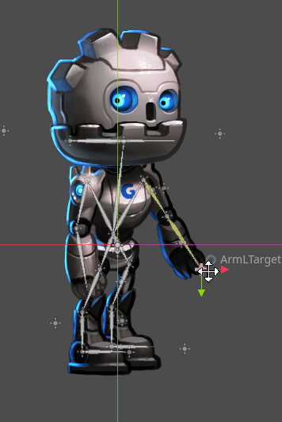

.. _doc_2d_skeletons:

2D skeletons
============

What is cutout animation?
~~~~~~~~~~~~~~~~~~~~~~~~~

Traditionally, `cutout animation <https://en.wikipedia.org/wiki/Cutout_animation>`__
is a type of `stop motion animation <https://en.wikipedia.org/wiki/Stop_motion>`__
in which pieces of paper (or other thin material) are cut into special shapes
and arranged in two-dimensional representations of characters and objects.
Characters' bodies are usually made out of several pieces. The pieces are
arranged and photographed once for each frame of the film. The animator moves
and rotates the parts in small increments between each shot to create the
illusion of movement when the images are played back quickly in sequence.

Simulations of cutout animation can now be created using software as seen in
`South Park <https://en.wikipedia.org/wiki/South_Park>`__ and `Jake and the Never
Land Pirates <https://en.wikipedia.org/wiki/Jake_and_the_Never_Land_Pirates>`__.

In video games, this technique has also become popular. Examples of
this are `Paper Mario <https://en.wikipedia.org/wiki/Super_Paper_Mario>`__ or
`Rayman Origins <https://en.wikipedia.org/wiki/Rayman_Origins>`__ .

Cutout animation in Godot
~~~~~~~~~~~~~~~~~~~~~~~~~

Godot provides tools for working with cutout rigs, and is ideal for the workflow:

-  **The animation system is fully integrated with the engine**: This
   means animations can control much more than just motion of objects. Textures,
   sprite sizes, pivots, opacity, color modulation, and more, can all be animated
   and blended.
-  **Combine animation styles**: AnimatedSprite2D allows traditional cel animation
   to be used alongside cutout animation. In cel animation different animation
   frames use entirely different drawings rather than the same pieces positioned
   differently. In an otherwise cutout-based animation, cel animation can be used
   selectively for complex parts such as hands, feet, changing facial expressions,
   etc.
-  **Custom Shaped Elements**: Custom shapes can be created with
   :ref:`Polygon2D <class_Polygon2D>`
   allowing UV animation, deformations, etc.
-  **Particle Systems**: A cutout animation rig can be combined with particle
   systems. This can be useful for magic effects, jetpacks, etc.
-  **Custom Colliders**: Set colliders and influence areas in different
   parts of the skeletons, great for bosses and fighting games.
-  **Animation Tree**: Allows complex combinations and blending between
   several animations, the same way it works in 3D.

And much more!

Making of GBot
~~~~~~~~~~~~~~

For this tutorial, we will use as demo content the pieces of the
`GBot <https://www.youtube.com/watch?v=S13FrWuBMx4&list=UUckpus81gNin1aV8WSffRKw>`__
character, created by Andreas Esau.

.. image:: img/tuto_cutout_walk.gif

Assets can be downloaded here: :download:`gbot_resources.zip <files/gbot_resources.zip>`.

Setting up the rig
~~~~~~~~~~~~~~~~~~

Create an empty Node2D as the root of the scene, we will work under it:

.. image:: img/tuto_cutout1.png

Create a :ref:`Skeleton2D <class_Skeleton2D>` node as the first child.
Then create a :ref:`Bone2D <class_Bone2D>` as a child of that node.
Create a :ref:`Sprite2D <class_Sprite2D>` as a child of the Bone2D and
add the hip sprite as its texture. Generally, both in 2D and 3D, the hip
is the root of the skeleton. This makes it easier to animate.

.. image:: img/tuto_cutout2.png

Next will be the body. The body needs to be a child of the hip bone, so
create a Bone2D child of the hip bone and a Sprite2D child of the Bone2D for
the body.

.. image:: img/tuto_cutout3.png

This looks good. Let's see if our hierarchy works as a skeleton by
rotating the body bone. We can do this be pressing :kbd:`E` to enter rotate mode,
and dragging with the left mouse button. To exit rotate mode hit :kbd:`ESC`.

.. image:: img/tutovec_torso1.gif

Continue adding body pieces, starting with the
right arm (your left). Make sure to put each sprite in its correct place in the hierarchy,
so its rotations and translations are relative to its parent:

.. image:: img/tuto_cutout4.png

The forearm bone is very short and pointing to the right by default. Uncheck
**Auto Calculate Length and Angle** in the inspector and adjust the length and
angle until it matches the length and angle of the forearm image.

.. image:: img/tuto_cutout5.png

With the left arm there's a problem. In 2D, child nodes appear in front of
their parents:

.. image:: img/tuto_cutout6.png

We want the left arm to appear *behind*
the hip and the body. We could move the left arm nodes behind the hip (above
the hip node in the scene hierarchy), but then the left arm is no longer in its
proper place in the hierarchy. This means it wouldn't be affected by the movement
of the torso. We'll fix this problem with ``RemoteTransform2D`` nodes.

.. note:: You can also fix depth ordering problems by adjusting the Z property
   of any node inheriting from Node2D.

RemoteTransform2D node
~~~~~~~~~~~~~~~~~~~~~~

The :ref:`RemoteTransform2D <class_RemoteTransform2D>` node transforms nodes
somewhere else in the hierarchy. This node applies its own transform (including
any transformation it inherits from its parents) to the remote node it targets.

This allows us to correct the visibility order of our elements, independently of
the locations of those parts in the cutout hierarchy.

Place the sprites as children of the ``Skeleton2D`` node above the hip bone.
Create a ``RemoteTransform2D`` node as a child of the body.
Create another RemoteTransform2D node inside the first.
Use the ``Remote Path`` property of the two new nodes to target the left arm and
left forearm sprites respectively:

.. image:: img/tuto_cutout7.png

Moving the ``RemoteTransform2D`` nodes now moves the sprites. So we can create
animations by adjusting the parent bones.

.. image:: img/tutovec_torso2.gif

Completing the skeleton
~~~~~~~~~~~~~~~~~~~~~~~

Complete the skeleton by following the same steps for the rest of the
parts and add an ``AnimationPlayer``. You may notice that there are
yellow warning signs next to all the bones. Set a rest pose by selecting
the ``Skeleton2D`` in the scene tree and click the "Skeleton2D" button in
the bar above the viewport.

.. image:: img/tuto_cutout9.png

The resulting scene should look similar to this:

.. image:: img/tuto_cutout10.png

The resulting rig will be easy to animate. By selecting the nodes and
rotating them you can animate forward kinematics (FK) efficiently.

For simple objects and rigs this is fine, but there are limitations:

-  Selecting sprites in the main viewport can become difficult in complex rigs.
   The scene tree ends up being used to select parts instead, which can be slower.
-  Inverse Kinematics (IK) is useful for animating extremities like hands and
   feet, and can't be used with our rig in its current state.

IK chains
~~~~~~~~~

IK stands for inverse kinematics. It's a convenient technique for animating the
position of hands, feet and other extremities of rigs like the one we've made.
Imagine you want to pose a character's foot in a specific position on the ground.
Without IK chains, each motion of the foot would require rotating and positioning
several other bones (the shin and the thigh at least). This would be quite
complex and lead to imprecise results. IK allows us to move the foot directly
while the shin and thigh self-adjust.

``Skeleton2D`` has a **Modification Stack** property that holds all the IK
information for the skeleton. There are many different kinds of modifications,
but we will only be using
:ref:`SkeletonModification2DTwoBoneIK <class_SkeletonModification2DTwoBoneIK>`.

Make a ``Node2D`` child of the root node. This will hold all the target nodes used
for IK. Make another ``Node2D`` that is the child of the previously-created node.
This is the target for the left arm.

.. image:: img/tuto_cutout11.png

Create a new modification stack and check the **Enabled** property. Open the
**Modifications** tab and add a new element. We are going to create IK for the
left arm. Create a new ``SkeletonModification2DTwoBoneIK`` as the 0th element.
Assign the target nodepath as the path to the node you just created. The 1st joint
is the left arm bone and the 2nd joint is the left forearm bone.

.. image:: img/tuto_cutout12.png

Once the IK chain is set up, grab the target and move it. You'll see the rest
of the chain adjust as you adjust its position.

If the IK chain goes backwards, check the **Flip Bend Direction** property.

.. image:: img/tutovec_torso4.gif

Animation tips
~~~~~~~~~~~~~~

The following section will be a collection of tips for creating animation for
your cutout rigs. For more information on how the animation system in Godot
works, see :ref:`doc_introduction_animation`.

Setting keyframes and excluding properties
------------------------------------------

Special contextual elements appear in the top toolbar when the animation editor
window is open:

.. image:: img/tuto_cutout13.png

The key button inserts location, rotation, and scale keyframes for the
selected objects or bones at the current playhead position.

The "loc", "rot", and "scl" toggle buttons to the left of the key button modify
its function, allowing you to specify which of the three properties keyframes
will be created for.

Here's an example of how this can be useful: Imagine you have a node which
already has two keyframes animating its scale only. You want to add an
overlapping rotation movement to the same node. The rotation movement should
begin and end at different times from the scale change that's already set up.
You can use the toggle buttons to have only rotation information added when you
add a new keyframe. This way, you can avoid adding unwanted scale keyframes
which would disrupt the existing scale animation.

Keyframing IK chains
~~~~~~~~~~~~~~~~~~~~

When editing IK chains, it's not necessary to select the whole chain to
add keyframes. You can simply select the target node and keyframe it.

Visually move a sprite behind its parent
~~~~~~~~~~~~~~~~~~~~~~~~~~~~~~~~~~~~~~~~

Sometimes it is necessary to have a node change its visual depth relative to
its parent node during an animation. Think of a character facing the camera,
who pulls something out from behind his back and holds it out in front of him.
During this animation the whole arm and the object in his hand would need to
change their visual depth relative to the body of the character.

To help with this there's a keyframable "Show Behind Parent" property on all
Node2D-inheriting nodes. When planning your rig, think about the movements it
will need to perform and give some thought to how you'll use "Show Behind Parent"
and/or ``RemoteTransform2D`` nodes. They provide overlapping functionality.

.. image:: img/tuto_cutout14.png

2D skeletal deform
~~~~~~~~~~~~~~~~~~

Skeletal deform can be used to augment a cutout rig, allowing single pieces to
deform organically (e.g. antennae that wobble as an insect character walks).

This process is described in a :ref:`separate tutorial <doc_2d_skeletal_deform>`.
