:article_outdated: True

.. _doc_2d_skeletons:

2D skeletons
============

Introduction
------------

When working with 3D, skeletal deforms are common for characters and creatures
and most 3D modeling applications support it. For 2D, as this function is not
used as often, it's difficult to find mainstream software aimed for this.

One option is to create animations in third-party software such as Spine or
Dragonbones. This functionality is also supported built-in.

Why would you want to do skeletal animations directly in Godot? The answer is
that there are many advantages to it:

* Better integration with the engine, so less hassle importing and editing from
  an external tool.
* Ability to control particle systems, shaders, sounds, call scripts, colors,
  transparency, etc. in animations.
* The built-in skeletal system in Godot is very efficient and designed for
  performance.

The following tutorial will, then, explain 2D skeletal deformations.

Setup
-----

.. seealso::

   Before starting, we recommend you to go through the
   :ref:`doc_cutout_animation` tutorial to gain a general understanding of
   animating within Godot.

For this tutorial, we will be using a single image to construct our character.
Download it from :download:`gBot_pieces.png ` or save the
image below.

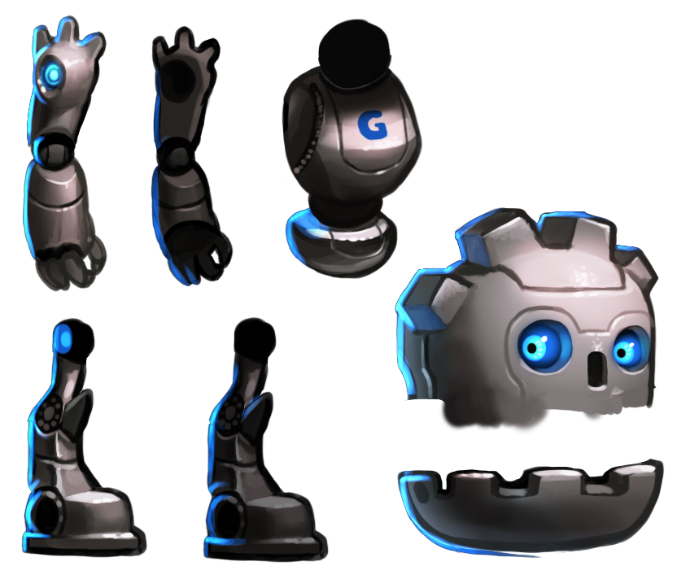

It is also advised to download the final character image
:download:`gBot_complete.png ` to have a good reference
for putting the different pieces together.

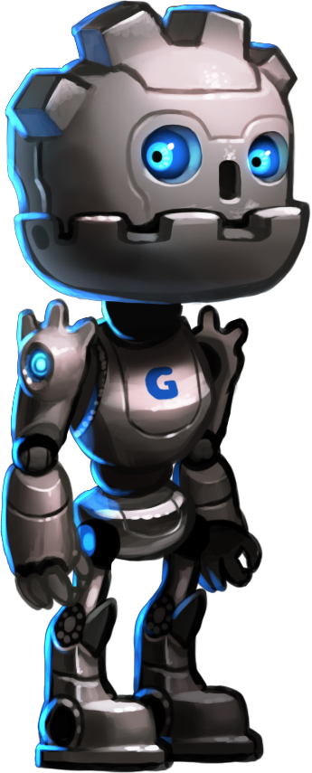

Creating the polygons
---------------------

Create a new scene for your model (if it's going to be an animated character,
you may want to use a ``CharacterBody2D``). For ease of use, an empty 2D node is
created as a root for the polygons.

Begin with a ``Polygon2D`` node. There is no need to place it anywhere in the
scene for now, so simply create it like this:

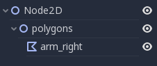

Select it and assign the texture with the character pieces you have downloaded
before:

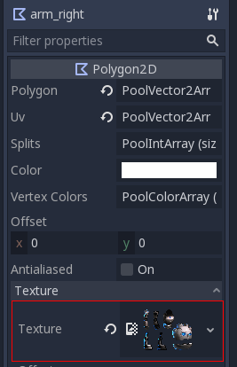

Drawing a polygon directly is not advised. Instead, open the "UV" dialog for the
polygon:

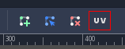

Head over to the *Points* mode, select the pencil and draw a polygon around the
desired piece:

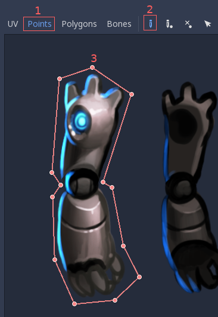

Duplicate the polygon node and give it a proper name. Then, enter the "UV"
dialog again and replace the old polygon with another one in the new desired
piece.

When you duplicate nodes and the next piece has a similar shape, you can edit
the previous polygon instead of drawing a new one.

After moving the polygon, remember to update the UV by selecting
**Edit > Copy Polygon to UV** in the Polygon 2D UV Editor.

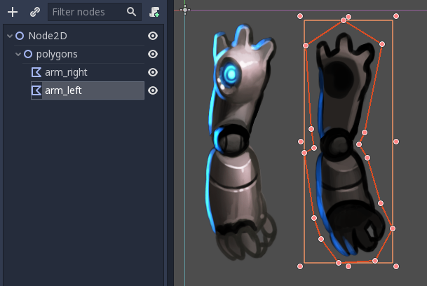

Keep doing this until you mapped all pieces.

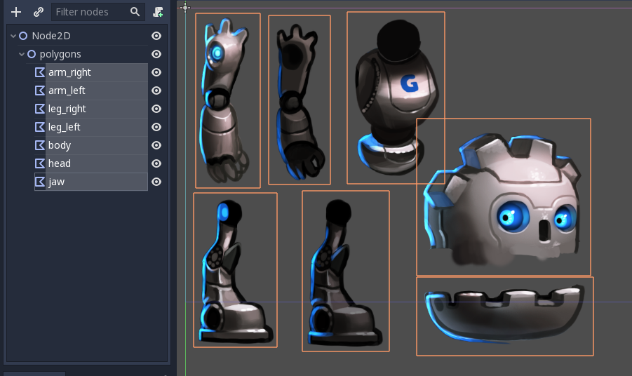

You will notice that pieces for nodes appear in the same layout as they do in
the original texture. This is because by default, when you draw a polygon, the
UV and points are the same.

Rearrange the pieces and build the character. This should be pretty quick. There
is no need to change pivots, so don't bother making sure rotation pivots for
each piece are right; you can leave them be for now.

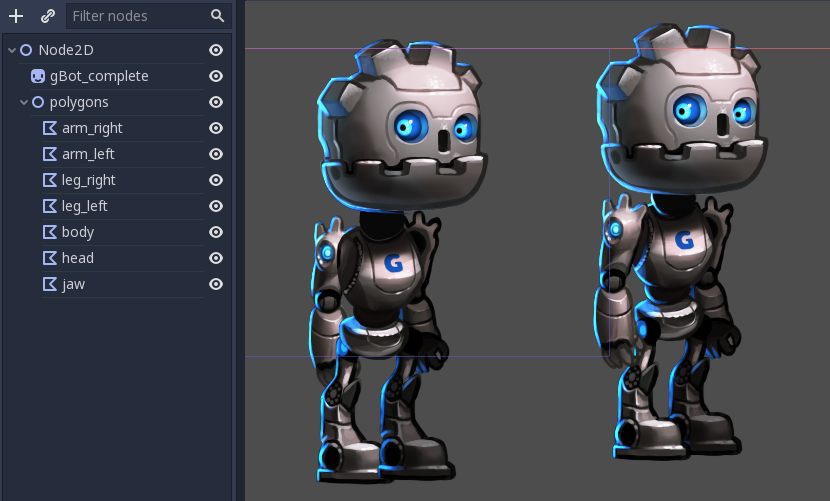

Ah, the visual order of the pieces is not correct yet, as some are covering
wrong pieces. Rearrange the order of the nodes to fix this:

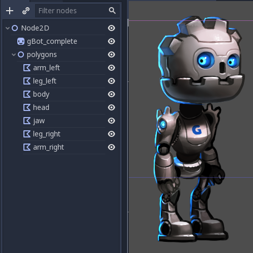

And there you go! It was definitely much easier than in the cutout tutorial.

Creating the skeleton
---------------------

Create a ``Skeleton2D`` node as a child of the root node. This will be the base
of our skeleton:

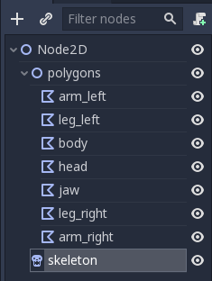

Create a ``Bone2D`` node as a child of the skeleton. Put it on the hip (usually
skeletons start here). The bone will be pointing to the right, but you can
ignore this for now.

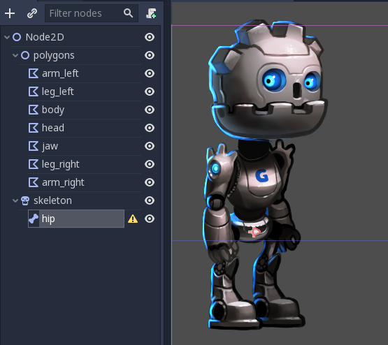

Keep creating bones in hierarchy and naming them accordingly.

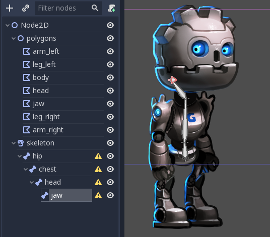

At the end of this chain, there will be a *jaw* node. It is, again, very short
and pointing to the right. This is normal for bones without children. The length
of *tip* bones can be changed with a property in the inspector:

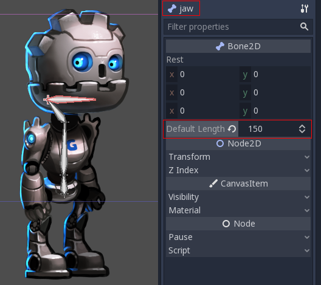

In this case, we don't need to rotate the bone (coincidentally the jaw points
right in the sprite), but in case you need to, feel free to do it. Again, this
is only really needed for tip bones as nodes with children don't usually need a
length or a specific rotation.

Keep going and build the whole skeleton:

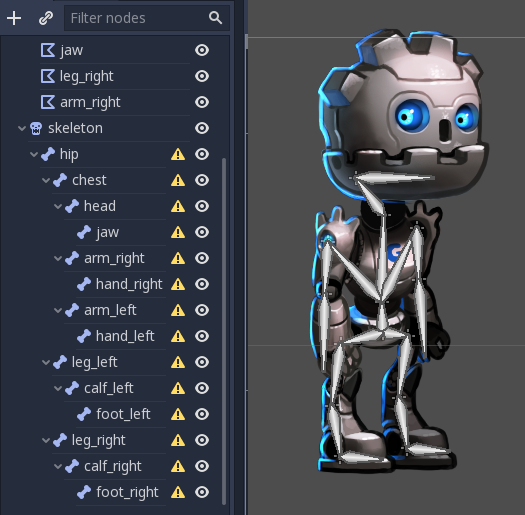

You will notice that all bones raise a warning about a missing rest pose. A rest
pose is the default pose for a skeleton, you can come back to it anytime you want
(which is very handy for animating). To set one click on the *skeleton* node in
the scene tree, then click on the :button:`Skeleton2D` button in the toolbar, and select
``Overwrite Rest Pose`` from the dropdown menu.

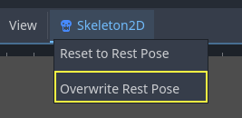

The warnings will go away. If you modify the skeleton (add/remove bones) you
will need to set the rest pose again.

Deforming the polygons
----------------------

Select the previously created polygons and assign the skeleton node to their
``Skeleton`` property. This will ensure that they can eventually be deformed by
it.

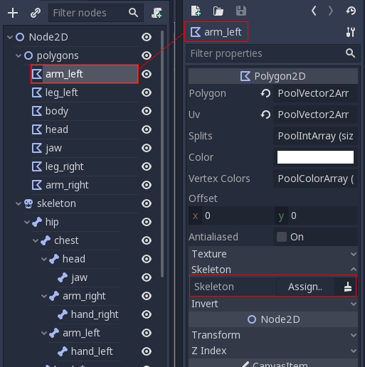

Click the property highlighted above and select the skeleton node:

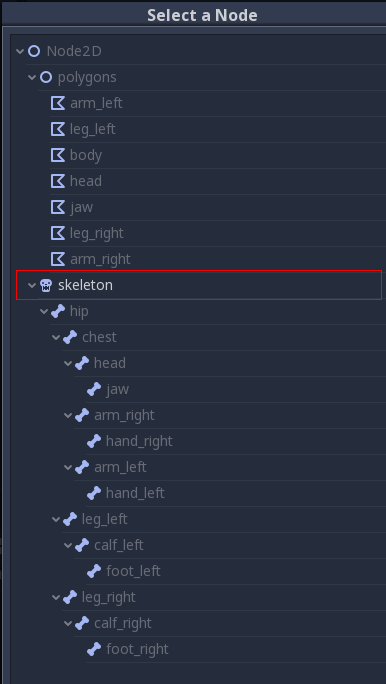

Again, open the UV editor for the polygon and go to the *Bones* section.

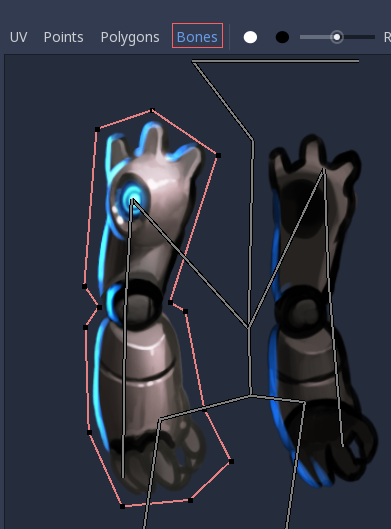

You will not be able to paint weights yet. For this you need to synchronize the
list of bones from the skeleton with the polygon. This step is done only once
and manually (unless you modify the skeleton by adding/removing/renaming bones).
It ensures that your rigging information is kept in the polygon, even if a
skeleton node is accidentally lost or the skeleton modified. Push the "Sync
Bones to Polygon" button to sync the list.

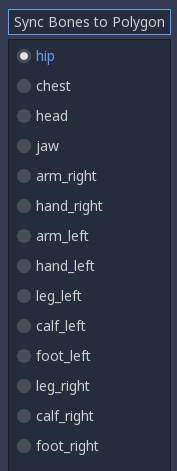

The list of bones will automatically appear. By default, your polygon has no
weight assigned to any of them. Select the bones you want to assign weight to
and paint them:

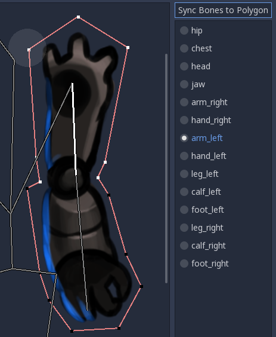

Points in white have a full weight assigned, while points in black are not
influenced by the bone. If the same point is painted white for multiple bones,
the influence will be distributed amongst them (so usually there is not that
much need to use shades in-between unless you want to polish the bending
effect).

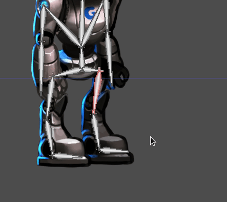

After painting the weights, animating the bones (NOT the polygons!) will have
the desired effect of modifying and bending the polygons accordingly. As you
only need to animate bones in this approach, work becomes much easier!

But it's not all roses. Trying to animate bones that bend the polygon will often
yield unexpected results:

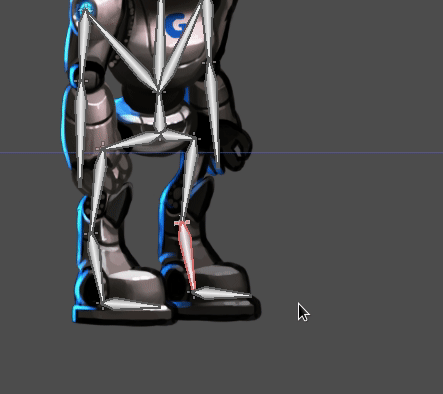

This happens because Godot generates internal triangles that connect the points
when drawing the polygon. They don't always bend the way you would expect. To
solve this, you need to set hints in the geometry to clarify how you expect it
to deform.

Internal vertices
-----------------

Open the UV menu for each bone again and go to the *Points* section. Add some
internal vertices in the regions where you expect the geometry to bend:

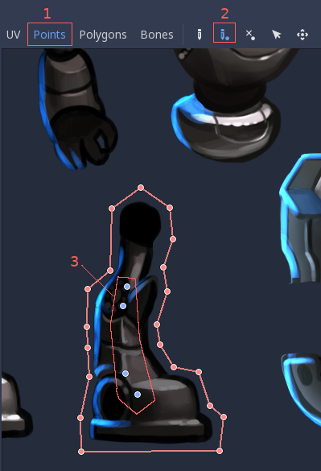

Now, go to the *Polygon* section and redraw your own polygons with more detail.
Imagine that, as your polygons bend, you need to make sure they deform the least
possible, so experiment a bit to find the right setup.

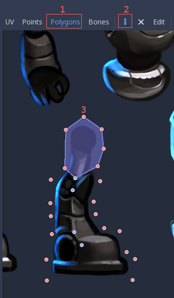

Once you start drawing, the original polygon will disappear and you will be free
to create your own:

.. image:: img/skel2d24.png

This amount of detail is usually fine, though you may want to have more
fine-grained control over where triangles go. Experiment by yourself until you
get the results you like.

**Note:** Don't forget that your newly added internal vertices also need weight
painting! Go to the *Bones* section again to assign them to the right bones.

Once you are all set, you will get much better results:

.. image:: img/skel2d25.gif
