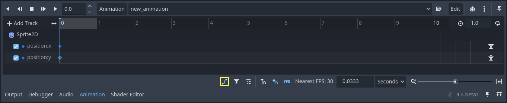

.. _doc_animation_track_types:

Animation Track types
=====================

This page gives an overview of the track types available for Godot's animation
player node on top of the default property tracks.

.. seealso::

   We assume you already read :ref:`doc_introduction_animation`, which covers
   the basics, including property tracks.

.. image:: img/track_types.webp

Property Track
--------------

The most basic track type. See :ref:`doc_introduction_animation`.

Position 3D / Rotation 3D / Scale 3D Track
------------------------------------------

These 3D transform tracks control the location, rotation, and scale of a 3D object.
They make it easier to animate a 3D object's transform compared to using regular
property tracks.

It is designed for animations imported from external 3D models and can reduce resource capacity through compression.

Blend Shape Track
-----------------

A blend shape track is optimized for animating blend shape in :ref:`MeshInstance3D <class_MeshInstance3D>`.

It is designed for animations imported from external 3D models and can reduce resource capacity through compression.

Call Method Track
------------------

A call method track allow you to call a function at a precise time from within an
animation. For example, you can call ``queue_free()`` to delete a node at the
end of a death animation.

.. note:: The events placed on the call method track are not executed when the animation is previewed in the editor for safety.

To create such a track, click "Add Track -> Call Method Track." Then, a window
opens and lets you select the node to associate with the track. To call one of
the node's methods, right-click the timeline and select "Insert Key". A window
opens with a list of available methods. Double-click one to finish creating the
keyframe.

.. image:: img/node_methods.webp

To change the method call or its arguments, click on the key and head to the
inspector dock. There, you can change the method to call. If you expand the
"Args" section, you will see a list of arguments you can edit.

.. image:: img/node_method_args.webp

Bezier Curve Track
------------------

A bezier curve track is similar to a property track, except it allows you to
animate a property's value using a bezier curve.

.. note:: Bezier curve track and property track cannot be blended in :ref:`AnimationPlayer <class_AnimationPlayer>` and :ref:`AnimationTree <class_AnimationTree>`.

To create one, click "Add Track -> Bezier Curve Track". As with property tracks,
you need to select a node and a property to animate. To open the bezier curve
editor, click the curve icon to the right of the animation track.

In the editor, keys are represented by filled diamonds and the outlined
diamonds connected to them by a line control curve's shape.

.. image:: img/bezier_curves.webp

In the right click panel of the editor, you can select the handle mode:

- Free: Allows you to orient a manipulator in any direction without affecting the
  other's position.
- Linear: Does not allow rotation of the manipulator and draws a linear graph.
- Balanced: Makes it so manipulators rotate together, but the distance between
  the key and a manipulator is not mirrored.
- Mirrored: Makes the position of one manipulator perfectly mirror the other,
  including their distance to the key.

.. image:: img/manipulator_modes.webp

Audio Playback Track
--------------------

If you want to create an animation with audio, you need to create an audio
playback track. To create one, your scene must have either an AudioStreamPlayer,
AudioStreamPlayer2D, or AudioStreamPlayer3D node. When creating the track, you
must select one of those nodes.

To play a sound in your animation, drag and drop an audio file from the file
system dock onto the animation track. You should see the waveform of your audio
file in the track.

.. image:: img/audio_track.webp

To remove a sound from the animation, you can right-click it and select "Delete
Key(s)" or click on it and press the :kbd:`Del` key.

The blend mode allows you to choose whether or not to adjust the audio volume when blending in the :ref:`AnimationTree <class_AnimationTree>`.

.. image:: img/blend_mode.webp

Animation Playback Track
------------------------

Animation playback tracks allow you to sequence the animations of other
animation player nodes in a scene. For example, you can use it to animate
several characters in a cut-scene.

To create an animation playback track, select "New Track -> Animation Playback
Track."

Then, select the animation player you want to associate with the track.

To add an animation to the track, right-click on it and insert a key. Select the
key you just created to select an animation in the inspector dock.

.. image:: img/animation_player_animation.webp

If an animation is already playing and you want to stop it early, you can create
a key and have it set to `[STOP]` in the inspector.

.. note:: If you instanced a scene that contains an animation player into your
          scene, you need to enable "Editable Children" in the scene tree to
          access its animation player. Also, an animation player cannot
          reference itself.
