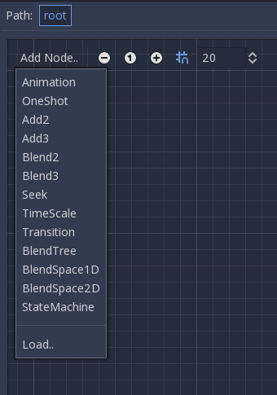

.. _doc_animation_tree:

Animation Tree
============

Introduction
------------

Godot has one of the most flexible animation systems you can find on any game engine via ``AnimationPlayer``. The ability to animate pretty much any property in any node or resource as well as having dedicated transform, bezier, function calling, audio and sub-animation tracks is pretty much unique.

Support by blending those animations via AnimationPlayer, though, is pretty basic as only a fixed cross-fade transition time can be set.

``AnimationTree`` is a new node introduced in Godot 3.1 to deal with advanced transitions. It supersedes the ancient ``AnimationTreePlayer``, while adding a huge amount of features and flexibility.

Creating an AnimationTree
--------------------------

Before using AnimationTree, it must be made clear that an ``AnimationTree`` node does not contain it's own animations. Instead, it uses animations containerd in an ``AnimationPlayer`` node. This way, you can editor your animations (or import them from a 3D file) as always
and then use this extra node to control the playback.

The most common way to use AnimationTree is in a 3D scene. When importing your scenes from a 3D exchange format, they will usually come with animations built-in (either multiple ones or split from a large one on import). At the end, the imported Godot scene will contain the animations in a ``AnimationPlayer`` node.

As you rarely use imported scenes directly in Godot (they are instantiated or inherited), you can place the AnimationTree node in your new scene which contains the imported one. Afterwards, point the AnimationTree node to the AnimationPlayer that was created in the imported scene.

This is how it's done in the Third Person Shooter demo, for reference:

.. image:: img/animtree1.png

A new scene was created for the player with a ``KinematicBody`` as root. Inside this scene, both the original .dae (Collada) file was instantiated and an ``AnimationTree`` node created.

Creating a Tree
---------------

There are three main types of nodes that can be used in AnimationTree:

1. Animation nodes, which References an animation from the linked ``AnimationTree``.
2. Animation Root nodes, which are used to blend sub-nodes
3. Animation Blend nodes, which are used within ``AnimationBlendTree`` as single-graph blending via multiple input ports.

To set a root node in ``AnimationTree``, a few types are available:

* AnimationNodeAnimation: Select an animation from the list and play it. This is the simplest root node, and generally not used directly as root.
* AnimationNodeBlendTree: Contains many *Blend* type nodes, such as mix, blend2, blend3, one shot, etc. This is one of the most commonly used roots.
* AnimationNodeStateMachine: Contains multiple root nodes as children in a graph. Every node is used as a *state*, and provides multiple functions to alternate between states.
* AnimationNodeBlendSpace2D: Allows placing root nodes in a 2D blend space. Controlling the blend position in 2D to mix between multiple animations.
* AnimationNodeBlendSpace1D: Simplified version of the above.

.. image:: img/animtree2.png

When adding a root node, the above types are available.

Blend Tree
----------

An AnimationNodeBlendTree can contain both root and regular nodes used for blending. Nodes are added to the graph from a menu:

All blend trees contain a Output node by default, and something needs to be connected to it in order for animations to play.

The easiest way to test this functionality is to connect an Animation node directly to it:

.. image:: img/animtree4.png

This will, again, just play back the animation. Make sure the AnimTree is active for something to actually happen.

Following is a short description of available nodes:

Blend2 / Blend3
^^^^^^^^^^^^^^^

These nodes will blend between to inputs by a user-specified blend value:

.. image:: img/animtree5.gif

For more complex blending, it is advised instead to use blend spaces.
Blending can also use filters, meaning you can control individually which individual tracks go via the blend function. This is very useful for layering animations on top of each other.

.. image:: img/animtree6.png

One Shot
^^^^^^^^

This node will execute a sub-animation and return when it was completed. Blend times for fading in and out can be customized as well as filters.

.. image:: img/animtree6b.png

Seek
^^^^^^^^

This node can be used to cause a seek command to happen to any sub-children of the graph. After setting the time, this value returns to -1.

TimeScale
^^^^^^^^

Allows scaling the speed of the animation (or reverse it) in any children nodes. Setting it to 0 will pause the animation.

Transition
^^^^^^^^

Very simple state machine (when you don't want to cope with a StateMachine node). Animations can be connected to the outputs and transition times specified.

BlendSpace2D
----------

BlendSpace2D is a node to do advanced blending in 2 dimensions. Points are added to a two dimensional space and then a position
can be controlled to determine blending:

.. image:: img/animtree7.gif

The ranges in X and Y can be controlled (and labeled for convenience). By default, points can be placed anywhere (just RMB click on
the coordinate system or use the *add point* button) and triangles will be generated automatically using Delaunay.

.. image:: img/animtree8.gif

It is also possible to manually draw the triangles by disabling the *auto triangle* option, though this is often not needed:

.. image:: img/animtree9.png

Finally, it is possible to change the blend mode. By default, blending happens by interpolating point inside the closest triangle.
When dealing with 2D animations (frame by frame), you may want to switch to *Discrete* mode. Alternatively, if you want to keep the current play position when switching between discrete animations, there is a *Carry* mode. This mode can be changed in the *Blend* Menu:

.. image:: img/animtree10.png

BlendSpace1D
------------

This is similar to 2D blend spaces, except in one dimension (so triangles are not needed).

StateMachine
------------

This node is a relatively simple state machine, root nodes can be created and connected via lines. States are connected between them via *Transitions*, which are connections with special properties. Transitions are uni-directional, but two can be used to connect in both ways.

.. image:: img/animtree11.gif

There are many types of transitions:

.. image:: img/animtree12.png

* *Immeditate*: Will switch to the next state immediately. Current state will end and blend into the begining of the new one.
* *Sync*: Will switch to the next state immediately, but will seek the new state to playback position of the old state.
* *At End*: Will wait for the current state playback to end, then switch to the beginning of the next state animation.

Transitions also have a few properties. Just click any transition and it will be displayed in the inspector:

.. image:: img/animtree13.png

* *Switch Mode* is the transition type (see above), it can be modified after created here.
* *Auto Advance* will turn on the transition automatically when this state is reached. This works best with the *At End* switch mode.
* *Advance Condition* will turn on auto advance when this condition is set. This is a custom text field that can be filled with a variable name. The variable can be modified from code (more on this later).
* *Xfade Time* Time to cross fade between this state and the next.
* *Priority* This is used together with the travel() function from code (more on this later). When travelling from a state to another, give more priority to this node.
* *Disabled* Ability to disable this transition (will not be used during travel or auto advance).

Root Motion
------------

When working with 3D animations, a popular technique is for animators to use the root skeleton bone to give motion to the rest of the skeleton. This allows animating characters in a way where steps actually match the floor below. It also allows precise interaction
with objects during cinematics.

When playing back the animation in Godot, it is possible to select this bone as the *root motion track*. Doing so will cancel the bone
transformation visually (animation will stay in place).

.. image:: img/animtree14.png

Afterwards, the actual motion can be retrieved via API in ``AnimationTree`` as a transform:

.. tabs::
 .. code-tab:: gdscript GDScript

    anim_tree.get_root_motion_transform()

This can be fed to functions such as ``KinematicBody.move_and_slide`` to control the character movement.

There is also a tool node: ``RootMotionView`` that can be placed in a scene and it will act as a custom floor for your
character and animations (this node is normally disabled during the game).

.. image:: img/animtree15.gif

Controlling from Code
----------------------

After building the tree and previewing it, the only question remaining is "How is all this controlled from code?".

Keep in mind that the animaton nodes are just resources and, as such, they are shared between all the instances. Setting values in the nodes directly will affect all instances of the scene that uses this AnimationTree. This has some cool use cases, though, meaning you can copy and paste parts of your animation tree or reuse nodes with a complex layout (like a state machine or blend space) in different animation trees.

The actual animation data is contained in the AnimationTree node and is accessed via properties. Check the "Parameters" section of the
AnimationTree node and all the parameters wich can be modified in real-time will be found there:

.. image:: img/animtree16.png

This is handy because it makes it possible to animate them from an AnimationPlayer or even the AnimationTree itself, leading to really complex animation logic.

To modify these values from code, the property path must be obtained. This is done easily by hovering the mouse over any of the parameters:

.. image:: img/animtree16.png

Which allows setting them or reading them:

.. tabs::
 .. code-tab:: gdscript GDScript

    anim_tree.set("parameters/eye_blend/blend_amount", 1.0)
    # simpler, alternative form:
    anim_tree["parameters/eye_blend/blend_amount"] = 1.0

 .. code-tab:: csharp

    animTree.Set("parameters/eye_blend/blend_amount", 1.0);

State Machine Travel
---------------------

One of the nice features in Godot StateMachine implementation is the ability to travel. The graph can be instructed to go from the
current state to another one, while visiting all the intermediate ones. This is done via A* algorithm.

To make travel happen, first the ``AnimationNodeStateMachinePlayback`` object must be retrieved from the AnimationTree node (it is exported as a property).

.. tabs::
 .. code-tab:: gdscript GDScript

    var state_machine = anim_tree["parameters/StateMachine/playback"]

 .. code-tab:: csharp

    AnimationNodeStateMachinePlayback stateMachine = animTree.Get("parameters/StateMachine/playback") as AnimationNodeStateMachinePlayback;

Once retrieved, it can be used by calling many of the functions it offers:

.. tabs::
 .. code-tab:: gdscript GDScript

    state_machine.travel("SomeState")

 .. code-tab:: csharp

    stateMachine.Travel("SomeState")

