.. _doc_animation_tree:

Using AnimationTree
===================

Introduction
------------

With :ref:`AnimationPlayer <class_AnimationPlayer>`, Godot has one of the most flexible animation systems that you can find in any game engine.
The ability to animate almost any property in any node or resource, as well as having dedicated transform, bezier,
function calling, audio and sub-animation tracks, is pretty much unique.

However, the support for blending those animations via ``AnimationPlayer`` is relatively limited, as only a fixed cross-fade transition time can be set.

:ref:`AnimationTree <class_AnimationTree>` is a new node introduced in Godot 3.1 to deal with advanced transitions.
It supersedes the ancient ``AnimationTreePlayer``, while adding a huge amount of features and flexibility.

Creating an AnimationTree
-------------------------

Before starting, it must be made clear that an ``AnimationTree`` node does not contain its own animations.
Instead, it uses animations contained in an ``AnimationPlayer`` node. This way, you can edit your animations (or import them from a 3D scene)
as usual and then use this extra node to control the playback.

The most common way to use ``AnimationTree`` is in a 3D scene. When importing your scenes from a 3D exchange format, they will usually come
with animations built-in (either multiple ones or split from a large one on import).
At the end, the imported Godot scene will contain the animations in a ``AnimationPlayer`` node.

As you rarely use imported scenes directly in Godot (they are either instantiated or inherited from), you can place the ``AnimationTree`` node in your
new scene which contains the imported one. Afterwards, point the ``AnimationTree`` node to the ``AnimationPlayer`` that was created in the imported scene.

This is how it's done in the `Third Person Shooter demo <https://github.com/godotengine/tps-demo>`_, for reference:

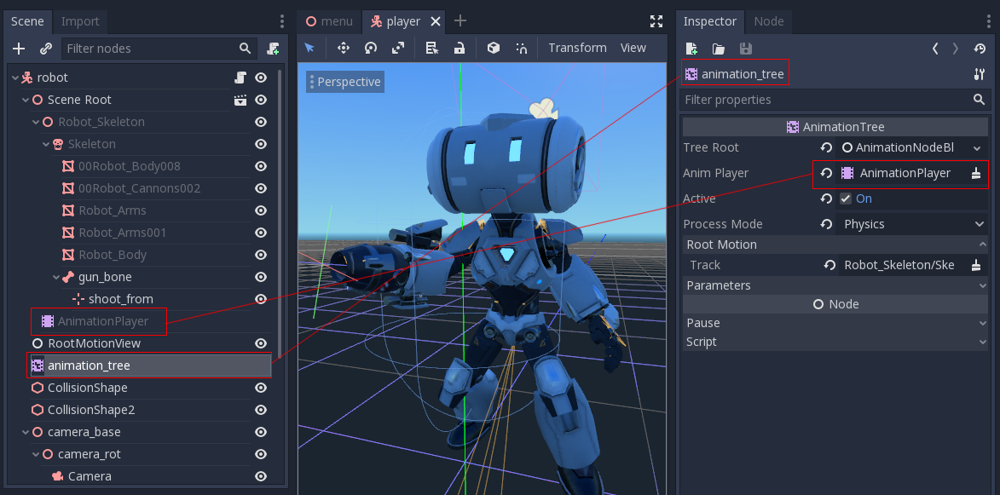

A new scene was created for the player with a ``CharacterBody3D`` as root. Inside this scene, the original ``.dae`` (Collada) file was instantiated
and an ``AnimationTree`` node was created.

Creating a tree
---------------

There are three main types of nodes that can be used in ``AnimationTree``:

1. Animation nodes, which reference an animation from the linked ``AnimationPlayer``.
2. Animation Root nodes, which are used to blend sub-nodes.
3. Animation Blend nodes, which are used within ``AnimationNodeBlendTree`` as single-graph blending via multiple input ports.

To set a root node in ``AnimationTree``, a few types are available:

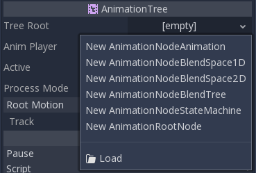

* ``AnimationNodeAnimation``: Selects an animation from the list and plays it. This is the simplest root node, and generally not used directly as root.
* ``AnimationNodeBlendTree``: Contains many *blend* type nodes, such as mix, blend2, blend3, one shot, etc. This is one of the most commonly used roots.
* ``AnimationNodeStateMachine``: Contains multiple root nodes as children in a graph. Each node is used as a *state*, and provides multiple functions to alternate between states.
* ``AnimationNodeBlendSpace2D``: Allows placing root nodes in a 2D blend space. Control the blend position in 2D to mix between multiple animations.
* ``AnimationNodeBlendSpace1D``: Simplified version of the above (1D).

Blend tree
----------

An ``AnimationNodeBlendTree`` can contain both root and regular nodes used for blending. Nodes are added to the graph from a menu:

.. image:: img/animtree3.webp

All blend trees contain an ``Output`` node by default, and something has to be connected to it in order for animations to play.

The easiest way to test this functionality is to connect an ``Animation`` node to it directly:

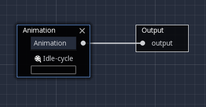

This will simply play back the animation. Make sure that the ``AnimationTree`` is active for something to actually happen.

Following is a short description of available nodes:

Blend2 / Blend3
^^^^^^^^^^^^^^^

These nodes will blend between two or three inputs by a user-specified blend value:

.. image:: img/animtree5.gif

For more complex blending, it is advised to use blend spaces instead.

Blending can also use filters, i.e. you can control individually which tracks go through the blend function.
This is very useful for layering animations on top of each other.

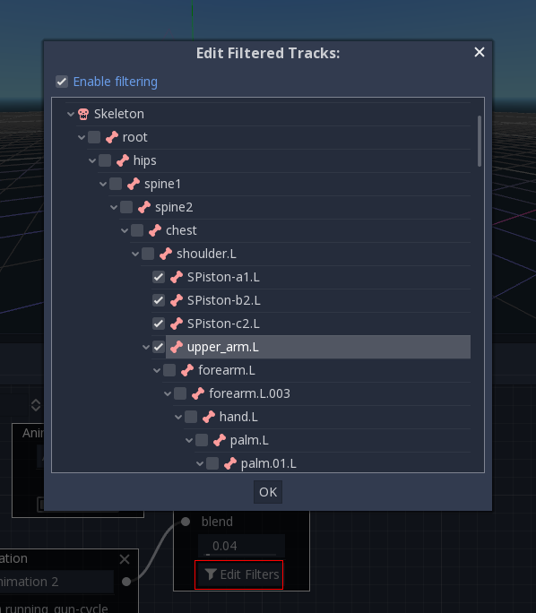

OneShot
^^^^^^^

This node will execute a sub-animation and return once it finishes. Blend times for fading in and out can be customized, as well as filters.

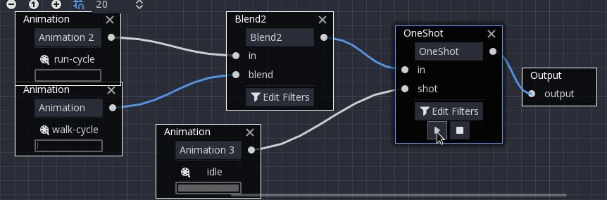

After setting the request and changing the animation playback, the one-shot node automatically clears the request on the next process frame by setting its ``request`` value to ``AnimationNodeOneShot.ONE_SHOT_REQUEST_NONE``.

.. tabs::
 .. code-tab:: gdscript GDScript

    # Play child animation connected to "shot" port.
    animation_tree.set("parameters/OneShot/request", AnimationNodeOneShot.ONE_SHOT_REQUEST_FIRE)
    # Alternative syntax (same result as above).
    animation_tree["parameters/OneShot/request"] = AnimationNodeOneShot.ONE_SHOT_REQUEST_FIRE

    # Abort child animation connected to "shot" port.
    animation_tree.set("parameters/OneShot/request", AnimationNodeOneShot.ONE_SHOT_REQUEST_ABORT)
    # Alternative syntax (same result as above).
    animation_tree["parameters/OneShot/request"] = AnimationNodeOneShot.ONE_SHOT_REQUEST_ABORT

    # Get current state (read-only).
    animation_tree.get("parameters/OneShot/active"))
    # Alternative syntax (same result as above).
    animation_tree["parameters/OneShot/active"]

 .. code-tab:: csharp

    // Play child animation connected to "shot" port.
    animationTree.Set("parameters/OneShot/request", (int)AnimationNodeOneShot.OneShotRequest.Fire);

    // Abort child animation connected to "shot" port.
    animationTree.Set("parameters/OneShot/request", (int)AnimationNodeOneShot.OneShotRequest.Abort);

    // Get current state (read-only).
    animationTree.Get("parameters/OneShot/active");

TimeSeek
^^^^^^^^

This node can be used to cause a seek command to happen to any sub-children of the animation graph. Use this node type to play an ``Animation`` from the start or a certain playback position inside the ``AnimationNodeBlendTree``.

After setting the time and changing the animation playback, the seek node automatically goes into sleep mode on the next process frame by setting its ``seek_request`` value to ``-1.0``.

.. tabs::
 .. code-tab:: gdscript GDScript

    # Play child animation from the start.
    animation_tree.set("parameters/TimeSeek/seek_request", 0.0)
    # Alternative syntax (same result as above).
    animation_tree["parameters/TimeSeek/seek_request"] = 0.0

    # Play child animation from 12 second timestamp.
    animation_tree.set("parameters/TimeSeek/seek_request", 12.0)
    # Alternative syntax (same result as above).
    animation_tree["parameters/TimeSeek/seek_request"] = 12.0

 .. code-tab:: csharp

    // Play child animation from the start.
    animationTree.Set("parameters/TimeSeek/seek_request", 0.0);

    // Play child animation from 12 second timestamp.
    animationTree.Set("parameters/TimeSeek/seek_request", 12.0);

TimeScale
^^^^^^^^^

Allows scaling the speed of the animation (or reverse it) connected to the `in` input via the `scale` parameter. Setting the `scale` to 0 will pause the animation.

Transition
^^^^^^^^^^

Very simple state machine (when you don't want to cope with a ``StateMachine`` node). Animations can be connected to the outputs and transition times can be specified.
After setting the request and changing the animation playback, the transition node automatically clears the request on the next process frame by setting its ``transition_request`` value to an empty string (``""``).

.. tabs::
 .. code-tab:: gdscript GDScript

    # Play child animation connected to "state_2" port.
    animation_tree.set("parameters/Transition/transition_request", "state_2")
    # Alternative syntax (same result as above).
    animation_tree["parameters/Transition/transition_request"] = "state_2"

    # Get current state name (read-only).
    animation_tree.get("parameters/Transition/current_state")
    # Alternative syntax (same result as above).
    animation_tree["parameters/Transition/current_state"]

    # Get current state index (read-only).
    animation_tree.get("parameters/Transition/current_index"))
    # Alternative syntax (same result as above).
    animation_tree["parameters/Transition/current_index"]

 .. code-tab:: csharp

    // Play child animation connected to "state_2" port.
    animationTree.Set("parameters/Transition/transition_request", "state_2");

    // Get current state name (read-only).
    animationTree.Get("parameters/Transition/current_state");

    // Get current state index (read-only).
    animationTree.Get("parameters/Transition/current_index");

BlendSpace2D
^^^^^^^^^^^^

``BlendSpace2D`` is a node to do advanced blending in two dimensions. Points are added to a two-dimensional space and then a position
can be controlled to determine blending:

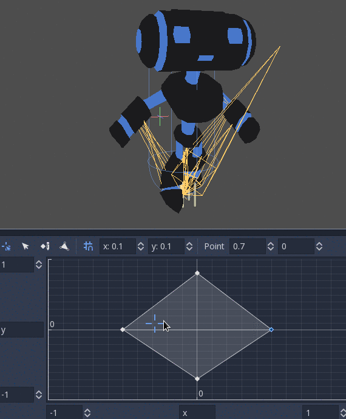

The ranges in X and Y can be controlled (and labeled for convenience). By default, points can be placed anywhere (right-click on
the coordinate system or use the *add point* button) and triangles will be generated automatically using Delaunay.

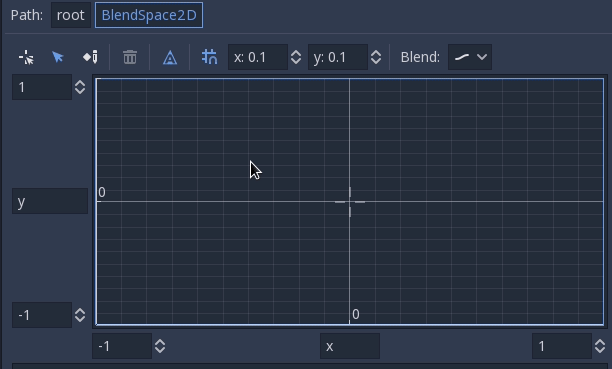

It is also possible to draw the triangles manually by disabling the *auto triangle* option, though this is rarely necessary:

Finally, it is possible to change the blend mode. By default, blending happens by interpolating points inside the closest triangle.
When dealing with 2D animations (frame by frame), you may want to switch to *Discrete* mode.
Alternatively, if you want to keep the current play position when switching between discrete animations, there is a *Carry* mode.
This mode can be changed in the *Blend* menu:

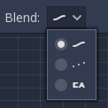

BlendSpace1D
^^^^^^^^^^^^

This is similar to 2D blend spaces, but in one dimension (so triangles are not needed).

StateMachine
^^^^^^^^^^^^

This node acts as a state machine with root nodes as states. Root nodes can be created and connected via lines. States are connected via *Transitions*,
which are connections with special properties. Transitions are uni-directional, but two can be used to connect in both directions.

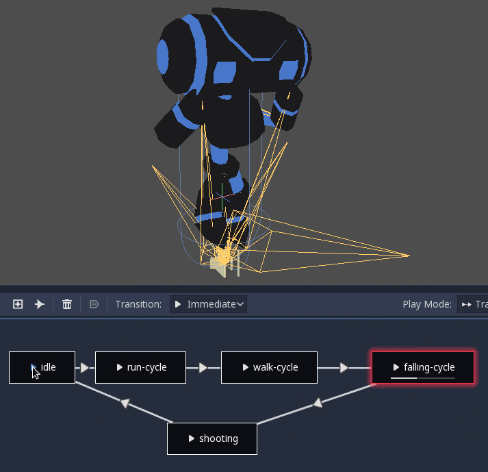

There are many types of transition:

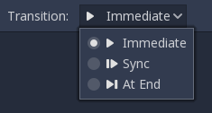

* *Immediate*: Will switch to the next state immediately. The current state will end and blend into the beginning of the new one.
* *Sync*: Will switch to the next state immediately, but will seek the new state to the playback position of the old state.
* *At End*: Will wait for the current state playback to end, then switch to the beginning of the next state animation.

Transitions also have a few properties. Click any transition and it will be displayed in the inspector dock:

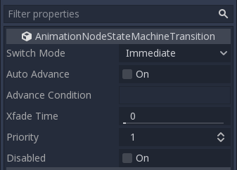

* *Switch Mode* is the transition type (see above), it can be modified after creation here.
* *Auto Advance* will turn on the transition automatically when this state is reached. This works best with the *At End* switch mode.
* *Advance Condition* will turn on auto advance when this condition is set. This is a custom text field that can be filled with a variable name.
  The variable can be modified from code (more on this later).
* *Xfade Time* is the time to cross-fade between this state and the next.
* *Priority* is used together with the ``travel()`` function from code (more on this later). Lower priority transitions are preferred when travelling through the tree.
* *Disabled* toggles disabling this transition (when disabled, it will not be used during travel or auto advance).

For better blending
-------------------

In Godot 4.0+, in order for the blending results to be deterministic (reproducible and always consistent),
the blended property values must have a specific initial value.
For example, in the case of two animations to be blended, if one animation has a property track and the other does not,
the blended animation is calculated as if the latter animation had a property track with the initial value.

When using Position/Rotation/Scale 3D tracks for Skeleton3D bones, the initial value is Bone Rest.
For other properties, the initial value is ``0`` and if the track is present in the ``RESET`` animation,
the value of its first keyframe is used instead.

For example, the following AnimationPlayer has two animations, but one of them lacks a Property track for Position.

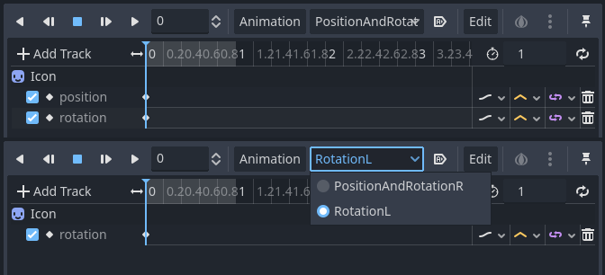

This means that the animation lacking that will treat those Positions as ``Vector2(0, 0)``.

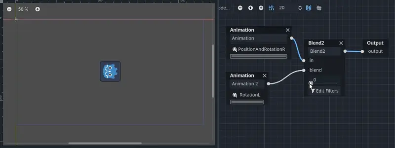

This problem can be solved by adding a Property track for Position as an initial value to the ``RESET`` animation.

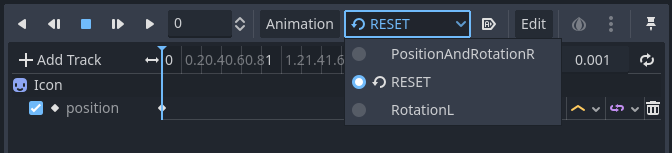

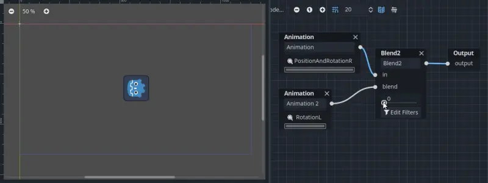

.. note:: Be aware that the ``RESET`` animation exists to define the default pose when loading an object originally.
          It is assumed to have only one frame and is not expected to be played back using the timeline.

Also keep in mind that the Rotation 3D tracks and the Property tracks for 2D rotation
with Interpolation Type set to Linear Angle or Cubic Angle will prevent rotation of more than 180 degrees
from the initial value as blended animation.

This can be useful for Skeleton3Ds to prevent the bones penetrating the body when blending animations.
Therefore, Skeleton3D's Bone Rest values should be as close to the midpoint of the movable range as possible.
**This means that for humanoid models, it is preferable to import them in a T-pose**.

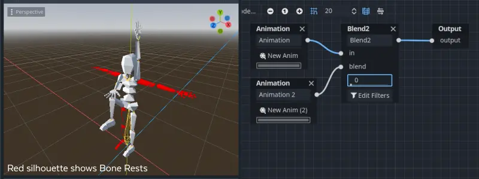

You can see that the shortest rotation path from Bone Rests is prioritized rather than the shortest rotation path between animations.

If you need to rotate Skeleton3D itself more than 180 degrees by blend animations for movement, you can use Root Motion.

Root motion
-----------

When working with 3D animations, a popular technique is for animators to use the root skeleton bone to give motion to the rest of the skeleton.
This allows animating characters in a way where steps actually match the floor below. It also allows precise interaction with objects during cinematics.

When playing back the animation in Godot, it is possible to select this bone as the *root motion track*. Doing so will cancel the bone
transformation visually (the animation will stay in place).

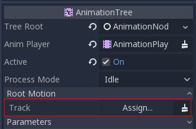

Afterwards, the actual motion can be retrieved via the :ref:`AnimationTree <class_AnimationTree>` API as a transform:

.. tabs::
 .. code-tab:: gdscript GDScript

    # Get the motion delta.
    animation_tree.get_root_motion_position()
    animation_tree.get_root_motion_rotation()
    animation_tree.get_root_motion_scale()

    # Get the actual blended value of the animation.
    animation_tree.get_root_motion_position_accumulator()
    animation_tree.get_root_motion_rotation_accumulator()
    animation_tree.get_root_motion_scale_accumulator()

 .. code-tab:: csharp

    // Get the motion delta.
    animationTree.GetRootMotionPosition();
    animationTree.GetRootMotionRotation();
    animationTree.GetRootMotionScale();

    // Get the actual blended value of the animation.
    animationTree.GetRootMotionPositionAccumulator();
    animationTree.GetRootMotionRotationAccumulator();
    animationTree.GetRootMotionScaleAccumulator();

This can be fed to functions such as :ref:`CharacterBody3D.move_and_slide <class_CharacterBody3D_method_move_and_slide>` to control the character movement.

There is also a tool node, ``RootMotionView``, that can be placed in a scene and will act as a custom floor for your
character and animations (this node is disabled by default during the game).

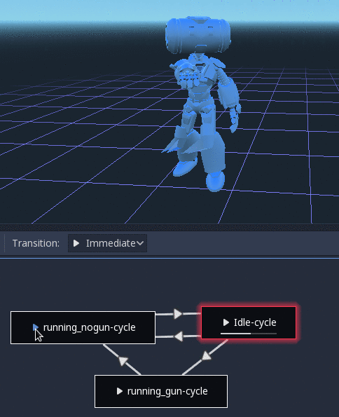

Controlling from code
---------------------

After building the tree and previewing it, the only question remaining is "How is all this controlled from code?".

Keep in mind that the animation nodes are just resources and, as such, they are shared between all instances using them.
Setting values in the nodes directly will affect all instances of the scene that uses this ``AnimationTree``.
This is generally undesirable, but does have some cool use cases, e.g. you can copy and paste parts of your animation tree,
or reuse nodes with a complex layout (such as a state machine or blend space) in different animation trees.

The actual animation data is contained in the ``AnimationTree`` node and is accessed via properties.
Check the "Parameters" section of the ``AnimationTree`` node to see all the parameters that can be modified in real-time:

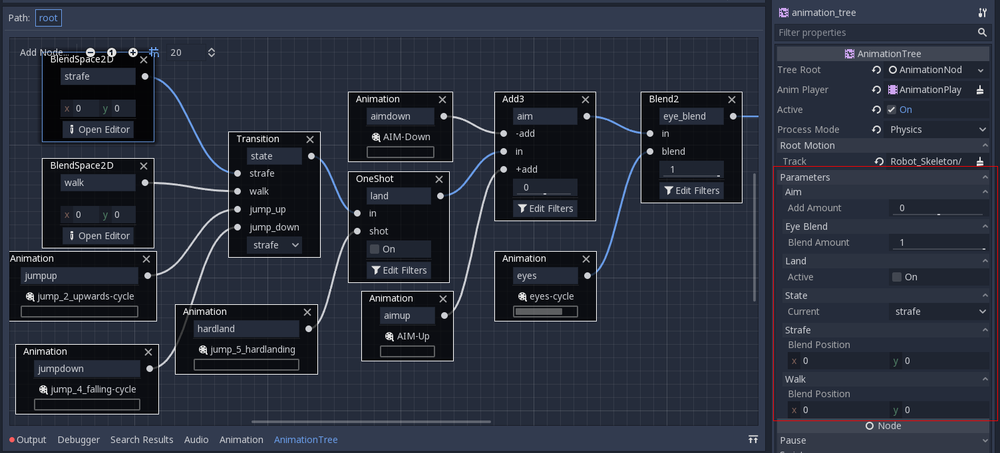

This is handy because it makes it possible to animate them from an ``AnimationPlayer``, or even the ``AnimationTree`` itself,
allowing the realization of very complex animation logic.

To modify these values from code, the property path must be obtained. This is done easily by hovering the mouse over any of the parameters:

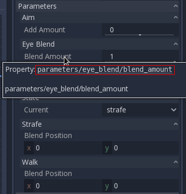

Which allows setting them or reading them:

.. tabs::
 .. code-tab:: gdscript GDScript

    animation_tree.set("parameters/eye_blend/blend_amount", 1.0)
    # Simpler alternative form:
    animation_tree["parameters/eye_blend/blend_amount"] = 1.0

 .. code-tab:: csharp

    animationTree.Set("parameters/eye_blend/blend_amount", 1.0);

State machine travel
--------------------

One of the nice features in Godot's ``StateMachine`` implementation is the ability to travel. The graph can be instructed to go from the
current state to another one, while visiting all the intermediate ones. This is done via the A\* algorithm.
If there is no path of transitions starting at the current state and finishing at the destination state, the graph teleports to the destination state.

To use the travel ability, you should first retrieve the :ref:`AnimationNodeStateMachinePlayback <class_AnimationNodeStateMachinePlayback>`
object from the ``AnimationTree`` node (it is exported as a property).

.. tabs::
 .. code-tab:: gdscript GDScript

    var state_machine = animation_tree["parameters/playback"]

 .. code-tab:: csharp

    AnimationNodeStateMachinePlayback stateMachine = (AnimationNodeStateMachinePlayback)animationTree.Get("parameters/playback");

Once retrieved, it can be used by calling one of the many functions it offers:

.. tabs::
 .. code-tab:: gdscript GDScript

    state_machine.travel("SomeState")

 .. code-tab:: csharp

    stateMachine.Travel("SomeState");

The state machine must be running before you can travel. Make sure to either call ``start()`` or choose a node to **Autoplay on Load**.

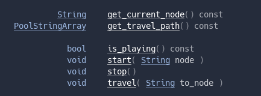
