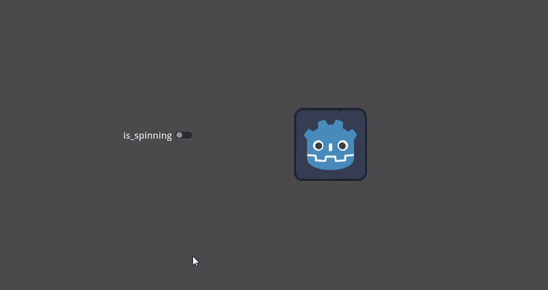

.. _doc_animation_tree:

Using AnimationTree
===================

Introduction
------------

With :ref:`AnimationPlayer <class_AnimationPlayer>`, Godot has one of the most flexible animation systems that you can find in any game engine.
It is pretty much unique in its ability to animate almost any property in any node or resource, and its dedicated transform, bezier,
function calling, audio, and sub-animation tracks.

However, the support for blending those animations via ``AnimationPlayer`` is limited, as you can only set a fixed cross-fade transition time.

:ref:`AnimationTree <class_AnimationTree>` is a new node introduced in Godot 3.1 to deal with advanced transitions.
It replaces the ancient ``AnimationTreePlayer``, while adding a huge amount of features and flexibility.

AnimationTree and AnimationPlayer
---------------------------------

Before starting, know that an ``AnimationTree`` node does not contain its own animations.
Instead, it uses animations contained in an ``AnimationPlayer`` node. You create, edit, or import your animations in an ``AnimationPlayer`` 
and then use an ``AnimationTree`` to control the playback.

``AnimationPlayer`` and ``AnimationTree`` can be used in both 2D and 3D scenes. When importing 3D scenes and their animations, you can use
`name suffixes <https://docs.godotengine.org/en/stable/tutorials/assets_pipeline/importing_3d_scenes/node_type_customization.html#animation-loop-loop-cycle>`_
to simplify the process and import with the correct properties. At the end, the imported Godot scene will contain the animations in an ``AnimationPlayer`` node.
Since you rarely use imported scenes directly in Godot (they are either instantiated or inherited from), you can place the ``AnimationTree`` node in your
new scene which contains the imported one. Afterwards, point the ``AnimationTree`` node to the ``AnimationPlayer`` that was created in the imported scene.

This is how it's done in the `Third Person Shooter demo <https://godotengine.org/asset-library/asset/678>`_, for reference:

A new scene was created for the player with a ``CharacterBody3D`` as root. Inside this scene, the original ``.dae`` (Collada) file was instantiated
and an ``AnimationTree`` node was created.

Creating a tree
---------------

To use an ``AnimationTree``, you have to set a root node. An animation root node is a class that contains and evaluates sub-nodes and outputs an animation. 
There are 3 types of sub-nodes: 

1. Animation nodes, which reference an animation from the linked ``AnimationPlayer``.
2. Animation Root nodes, which are used to blend sub-nodes and can be nested.
3. Animation Blend nodes, which are used in an ``AnimationNodeBlendTree``, a 2D graph of nodes. Blend nodes take multiple input ports and give one output port.

A few types of root nodes are available:

* ``AnimationNodeAnimation``: Selects an animation from the list and plays it. This is the simplest root node, and generally not used as a root.
* ``AnimationNodeBlendTree``: Contains multiple nodes as children in a graph. Many blend nodes are available, such as mix, blend2, blend3, one shot, etc.
* ``AnimationNodeBlendSpace1D``: Allows linear blending between two animation nodes. Control the blend position in a 1D blend space to mix between animations.
* ``AnimationNodeBlendSpace2D``: Allows linear blending between three animation nodes. Control the blend position in a 2D blend space to mix between animations.
* ``AnimationNodeStateMachine``: Contains multiple nodes as children in a graph. Each node is used as a state, with multiple functions used to alternate between states.

Blend tree
----------

When you make an ``AnimationNodeBlendTree``, you get an empty 2d graph in the bottom panel, under the AnimationTree tab. It contains only an ``Output``
node by default. 

In order for animations to play, a node has to be connected to the output. You can add nodes from the **Add Node..** menu or by right clicking an empty space:

The simplest connection to make is to connect an ``Animation`` node to the output directly, which will just play back the animation.

Following is a description of the other available nodes:

Blend2 / Blend3
~~~~~~~~~~~~~~~

These nodes will blend between two or three inputs by a user-specified blend value:

Blending can use **filters** to control individually which tracks get blended and which do not. This can be useful for layering animations on top of each other.

For more complex blending, it is recommended to use blend spaces instead.

OneShot
~~~~~~~

This node will execute an animation once and return when it finishes. You can customize blend times for fading in and out, as well as filters.

.. tabs::
 .. code-tab:: gdscript GDScript

    # Play child animation connected to "shot" port.
    animation_tree.set("parameters/OneShot/request", AnimationNodeOneShot.ONE_SHOT_REQUEST_FIRE)
    # Alternative syntax (same result).
    animation_tree["parameters/OneShot/request"] = AnimationNodeOneShot.ONE_SHOT_REQUEST_FIRE

    # Abort child animation connected to "shot" port.
    animation_tree.set("parameters/OneShot/request", AnimationNodeOneShot.ONE_SHOT_REQUEST_ABORT)
    # Alternative syntax (same result).
    animation_tree["parameters/OneShot/request"] = AnimationNodeOneShot.ONE_SHOT_REQUEST_ABORT

    # Get current state (read-only).
    animation_tree.get("parameters/OneShot/active"))
    # Alternative syntax (same result).
    animation_tree["parameters/OneShot/active"]

 .. code-tab:: csharp

    // Play child animation connected to "shot" port.
    animationTree.Set("parameters/OneShot/request", (int)AnimationNodeOneShot.OneShotRequest.Fire);

    // Abort child animation connected to "shot" port.
    animationTree.Set("parameters/OneShot/request", (int)AnimationNodeOneShot.OneShotRequest.Abort);

    // Get current state (read-only).
    animationTree.Get("parameters/OneShot/active");

TimeSeek
~~~~~~~~

This node allows you to seek to a time in the animation connected to its `in` input. Use this node to play an ``Animation`` starting from a certain playback position.
Note that the seek request value is measured in seconds, so if you would like to play an animation from the beginning, set the value to ``0.0``, or if you would like
to play an animation from 3 seconds in, set the value to ``3.0``.

.. tabs::
 .. code-tab:: gdscript GDScript

    # Play child animation from the start.
    animation_tree.set("parameters/TimeSeek/seek_request", 0.0)
    # Alternative syntax (same result).
    animation_tree["parameters/TimeSeek/seek_request"] = 0.0

    # Play child animation from 12 second timestamp.
    animation_tree.set("parameters/TimeSeek/seek_request", 12.0)
    # Alternative syntax (same result).
    animation_tree["parameters/TimeSeek/seek_request"] = 12.0

 .. code-tab:: csharp

    // Play child animation from the start.
    animationTree.Set("parameters/TimeSeek/seek_request", 0.0);

    // Play child animation from 12 second timestamp.
    animationTree.Set("parameters/TimeSeek/seek_request", 12.0);

TimeScale
~~~~~~~~~

This node allows you to scale the speed of the animation connected to its `in` input. The speed of the animation will be multiplied by the number in the `scale`
parameter. Setting the scale to 0 will pause the animation. Setting the scale to a negative number will play the animation backwards.

Transition
~~~~~~~~~~

This node is a simplified version of a StateMachine. You connect animations to the inputs, and the current state index determines which animation to play.
You may specify a crossfade transition time. In the Inspector, you may change the number of input ports, rearrange inputs, or delete inputs.

.. tabs::
 .. code-tab:: gdscript GDScript

    # Play child animation connected to "state_2" port.
    animation_tree.set("parameters/Transition/transition_request", "state_2")
    # Alternative syntax (same result).
    animation_tree["parameters/Transition/transition_request"] = "state_2"

    # Get current state name (read-only).
    animation_tree.get("parameters/Transition/current_state")
    # Alternative syntax (same result).
    animation_tree["parameters/Transition/current_state"]

    # Get current state index (read-only).
    animation_tree.get("parameters/Transition/current_index"))
    # Alternative syntax (same result).
    animation_tree["parameters/Transition/current_index"]

 .. code-tab:: csharp

    // Play child animation connected to "state_2" port.
    animationTree.Set("parameters/Transition/transition_request", "state_2");

    // Get current state name (read-only).
    animationTree.Get("parameters/Transition/current_state");

    // Get current state index (read-only).
    animationTree.Get("parameters/Transition/current_index");

StateMachine
~~~~~~~~~~~~

When you make an ``AnimationNodeStateMachine``, you get an empty 2d graph in the bottom panel, under the AnimationTree tab. It contains a ``Start`` and ``End``
state by default. 

To add states, right click or use the **create new nodes** button, whose icon is a plus in a box. You can add animations, blendspaces, blendtrees, or even 
another StateMachine. To edit one of these more complex sub-nodes, click on the pencil icon on the right of the state. To return to the original StateMachine,
click **Root** on the top left of the panel.

Before the StateMachine can do anything useful, the states must be connected with transitions. To add a transition, click the **connect nodes** button, which is
a line with a right-facing arrow, and drag between two states. You can create 2 transitions between states, one going in each direction.

There are 3 types of transitions:

.. image:: img/animtree_transitiontypes.png

* *Immediate*: Will switch to the next state immediately. 
* *Sync*: Will switch to the next state immediately, but will seek the new state to the playback position of the old state.
* *At End*: Will wait for the current state playback to end, then switch to the beginning of the next state animation.

Transitions also have a few properties. Click a transition and it will be displayed in the inspector:

.. image:: img/animtree_statemachinetransitionproperties.webp

* *Xfade Time* is the time to cross-fade between this state and the next.
* *Xfade Curve* is a cross-fade following a curve rather than a linear blend.
* *Reset* determines whether the state you are switching into plays from the beginning (true) or not (false).
* *Priority* is used together with the ``travel()`` function from code (more on this later). Lower priority transitions are preferred when travelling through the tree.
* *Switch Mode* is the transition type (see above). It can be changed after creation here.
* *Advance Mode* determines the advance mode. If ``Disabled``, the transition will not be used. If ``Enabled``, the transition will only be used during ``travel()``. If ``Auto``, the transition will be used if the advance condition and expression are true, or if there are no advance conditions/expressions.

Advance Condition and Advance Expression
^^^^^^^^^^^^^^^^^^^^^^^^^^^^^^^^^^^^^^^^

The last 2 properties in a StateMachine transition are ``Advance Condition`` and ``Advance Expression.`` When the Advance Mode is set to *Auto*, these
determine if the transition will advance or not.

Advance Condition is a true/false check. You may put a custom variable name in the text field, and when the StateMachine reaches this transition, 
it will check if your variable is *true*. If so, the transition continues. Note that the advance condition **only** checks if a variable is *true*, 
and it cannot check for falseness.

This gives the Advance Condition a very limited capability. If you wanted to make a transition back and forth based on one property, you would need to make 
2 variables that have opposite values, and check if either of them are true. This is why, in Godot 4, the Advance Expression was added. 

The Advance Expression works similar to the Advance Condition, but instead of checking if one variable is true, it evaluates any expression. An expression
is anything you could put in an ``if`` statement. These are all examples of expressions that would work in the Advance Expression:

* ``is_walking``
* ``is_walking`` == true
* ``is_walking && !is_idle``
* ``velocity > 0``
* ``player.is_on_floor()``

Here is an example of an improperly-set-up StateMachine transition using Advance Condition:

This is not working because there is a ``!`` variable in the Advance Condition, which cannot be checked.

Here is the same example, set up properly, using two opposite variables:

Here is the same example, but using Advance Expression rather than Advance Condition, which eliminates the need for two variables:

.. image:: img/animtree_goodanimexpression.webp

In order to use Advance Expressions, the Advance Expression Base Node has to be set from the Inspector of the AnimationTree node. By default, it is set
to the AnimationTree node itself, but it needs to point to whatever node contains the script with your animation variables.

StateMachine travel
^^^^^^^^^^^^^^^^^^^

One of the nice features in Godot's ``StateMachine`` implementation is the ability to travel. You can instruct the graph to go from the
current state to another one, while visiting all the intermediate ones. This is done via the A\* algorithm.
If there is no path of transitions starting at the current state and finishing at the destination state, the graph teleports to the destination state.

To use the travel ability, you should first retrieve the :ref:`AnimationNodeStateMachinePlayback <class_AnimationNodeStateMachinePlayback>`
object from the ``AnimationTree`` node (it is exported as a property), and then call one of its many functions:

.. tabs::
 .. code-tab:: gdscript GDScript

    var state_machine = animation_tree["parameters/playback"]
    state_machine.travel("SomeState")

 .. code-tab:: csharp

    AnimationNodeStateMachinePlayback stateMachine = (AnimationNodeStateMachinePlayback)animationTree.Get("parameters/playback");
    stateMachine.Travel("SomeState");

The StateMachine must be running before you can travel. Make sure to either call ``start()`` or connect a node to **Start**.

BlendSpace2D and BlendSpace1D
-----------------------------

``BlendSpace2D`` is a node to do advanced blending in two dimensions. Points representing animations are added to a 2D space and then a position between them
is controlled to determine the blending:

You may place these points anywhere on the graph by right clicking or using the **add point** button, whose icon is a pen and point. 
Wherever you place the points, the triangle between them will be generated automatically using Delaunay.
You may also control and label the ranges in X and Y. 

Finally, you may also change the blend mode. By default, blending happens by interpolating points inside the closest triangle. When dealing with 2D 
animations (frame by frame), you may want to switch to *Discrete* mode. Alternatively, if you want to keep the current play position when switching 
between discrete animations, there is a *Carry* mode. This mode can be changed in the *Blend* menu:

BlendSpace1D works just like BlendSpace2D, but in one dimension (a line). Triangles are not used.

For better blending
-------------------

In Godot 4.0+, in order for the blending results to be deterministic (reproducible and always consistent),
the blended property values must have a specific initial value.
For example, in the case of two animations to be blended, if one animation has a property track and the other does not,
the blended animation is calculated as if the latter animation had a property track with the initial value.

When using Position/Rotation/Scale 3D tracks for Skeleton3D bones, the initial value is Bone Rest.
For other properties, the initial value is ``0`` and if the track is present in the ``RESET`` animation,
the value of its first keyframe is used instead.

For example, the following AnimationPlayer has two animations, but one of them lacks a Property track for Position.

.. image:: img/blending1.webp

This means that the animation lacking that will treat those Positions as ``Vector2(0, 0)``.

.. image:: img/blending2.webp

This problem can be solved by adding a Property track for Position as an initial value to the ``RESET`` animation.

.. image:: img/blending3.webp

.. image:: img/blending4.webp

.. note:: Be aware that the ``RESET`` animation exists to define the default pose when loading an object originally.
          It is assumed to have only one frame and is not expected to be played back using the timeline.

Also keep in mind that the Rotation 3D tracks and the Property tracks for 2D rotation
with Interpolation Type set to Linear Angle or Cubic Angle will prevent rotations greater than 180 degrees 
from the initial value as blended animation.

This can be useful for Skeleton3Ds to prevent the bones penetrating the body when blending animations.
Therefore, Skeleton3D's Bone Rest values should be as close to the midpoint of the movable range as possible.
**This means that for humanoid models, it is preferable to import them in a T-pose**.

.. image:: img/blending5.webp

You can see that the shortest rotation path from Bone Rests is prioritized rather than the shortest rotation path between animations.

If you need to rotate Skeleton3D itself more than 180 degrees by blend animations for movement, you can use Root Motion.

Root motion
-----------

When working with 3D animations, a popular technique is for animators to use the root skeleton bone to give motion to the rest of the skeleton.
This allows animating characters in a way where steps actually match the floor below. It also allows precise interaction with objects during cinematics.

When playing back the animation in Godot, it is possible to select this bone as the *root motion track*. Doing so will cancel the bone
transformation visually (the animation will stay in place).

Afterwards, the actual motion can be retrieved via the :ref:`AnimationTree <class_AnimationTree>` API as a transform:

.. tabs::
 .. code-tab:: gdscript GDScript

    # Get the motion delta.
    animation_tree.get_root_motion_position()
    animation_tree.get_root_motion_rotation()
    animation_tree.get_root_motion_scale()

    # Get the actual blended value of the animation.
    animation_tree.get_root_motion_position_accumulator()
    animation_tree.get_root_motion_rotation_accumulator()
    animation_tree.get_root_motion_scale_accumulator()

 .. code-tab:: csharp

    // Get the motion delta.
    animationTree.GetRootMotionPosition();
    animationTree.GetRootMotionRotation();
    animationTree.GetRootMotionScale();

    // Get the actual blended value of the animation.
    animationTree.GetRootMotionPositionAccumulator();
    animationTree.GetRootMotionRotationAccumulator();
    animationTree.GetRootMotionScaleAccumulator();

This can be fed to functions such as :ref:`CharacterBody3D.move_and_slide <class_CharacterBody3D_method_move_and_slide>` to control the character movement.

There is also a tool node, ``RootMotionView``, you can place a scene that will act as a custom floor for your
character and animations (this node is disabled by default during the game).

.. image:: img/animtree15.gif

Controlling from code
---------------------

After building the tree and previewing it, the only question remaining is "How is all this controlled from code?".

Keep in mind that the animation nodes are just resources, so they are shared between all instances using them.
Setting values in the nodes directly will affect all instances of the scene that uses this ``AnimationTree``.
This is generally undesirable, but does have some cool use cases, e.g. you can copy and paste parts of your animation tree,
or reuse nodes with a complex layout (such as a StateMachine or blend space) in different animation trees.

The actual animation data is contained in the ``AnimationTree`` node and is accessed via properties.
Check the "Parameters" section of the ``AnimationTree`` node to see all the parameters that can be modified in real-time:

.. image:: img/animtree_parameters.webp

This is handy because it makes it possible to animate them from an ``AnimationPlayer``, or even the ``AnimationTree`` itself,
allowing very complex animation logic.

To modify these values from code, you must obtain the property path. You can find them by hovering your mouse over any of the parameters:

Then you can set or read them:

.. tabs::
 .. code-tab:: gdscript GDScript

    animation_tree.set("parameters/eye_blend/blend_amount", 1.0)
    # Alternate syntax (same result)
    animation_tree["parameters/eye_blend/blend_amount"] = 1.0

 .. code-tab:: csharp

    animationTree.Set("parameters/eye_blend/blend_amount", 1.0);

.. note:: Advance Expressions from a StateMachine will not be found under the parameters. This is because they are held in another script rather than the 
         AnimationTree itself. Advance `Conditions` will be found under parameters.
