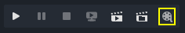
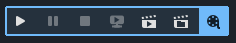
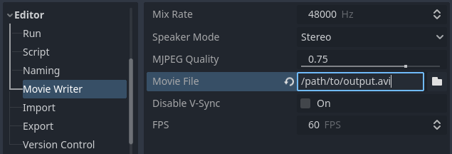
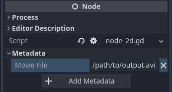

.. _doc_creating_movies:

Creating movies
===============

Godot can record **non-real-time** video and audio from any 2D or 3D project.
This kind of recording is also called *offline rendering*.
There are many scenarios where this is useful:

- Recording game trailers for promotional use.
- Recording cutscenes that will be :ref:`displayed as pre-recorded videos <doc_playing_videos>`
  in the final game. This allows for using higher quality settings
  (at the cost of file size), regardless of the player's hardware.
- Recording procedurally generated animations or motion design. User interaction
  remains possible during video recording, and audio can be included as well
  (although you won't be able to hear it while the video is recording).
- Comparing the visual output of graphics settings, shaders, or rendering techniques
  in an animated scene.

With Godot's animation features such as the AnimationPlayer node, Tweeners,
particles and shaders, it can effectively be used to create any kind of 2D and
3D animations (and still images).

If you are already used to Godot's workflow, you may find yourself more
productive by using Godot for video rendering compared to Blender. That said,
renderers designed for non-real-time usage such as Cycles and Eevee can result
in better visuals (at the cost of longer rendering times).

Compared to real-time video recording, some advantages of non-real-time recording include:

- Use any graphics settings (including extremely demanding settings) regardless
  of your hardware's capabilities. The output video will *always* have perfect
  frame pacing; it will never exhibit dropped frames or stuttering.
  Faster hardware will allow you to render a given animation in less time, but
  the visual output remains identical.
- Render at a higher resolution than the screen resolution, without having to
  rely on driver-specific tools such as NVIDIA's Dynamic Super Resolution or
  AMD's Virtual Super Resolution.
- Render at a higher framerate than the video's target framerate, then
  :ref:`post-process to generate high-quality motion blur <doc_creating_movies_motion_blur>`.
  This also makes effects that converge over several frames (such as temporal antialiasing,
  SDFGI and volumetric fog) look better.

.. warning::

    **This feature is not designed for capturing real-time footage during gameplay.**

    Players should use something like `OBS Studio <https://obsproject.com/>`__ or
    `SimpleScreenRecorder <https://www.maartenbaert.be/simplescreenrecorder/>`__
    to record gameplay videos, as they do a much better job at intercepting the
    compositor than Godot can do using Vulkan or OpenGL natively.

    That said, if your game runs at near-real-time speeds when capturing,
    you can still use this feature (but it will lack audible sound playback,
    as sound is saved directly to the video file).

Enabling Movie Maker mode
-------------------------

To enable Movie Maker mode, click the "movie reel" button in the top-right
corner of the editor *before* running the project:

   Movie Maker mode is disabled, click the "movie reel" icon to enable

The icon gets a background matching the accent color when Movie Maker mode is
enabled:

   Movie Maker mode is enabled, click the "movie reel" icon again to disable

Movie Maker status is **not** persisted when the editor quits, so you must
re-enable Movie Maker mode again after restarting the editor if needed.

.. note::

    Toggling Movie Maker mode while running the project will not have any
    effect until the project is restarted.

Before you can record video by running the project, you still need to configure
the output file path. This path can be set for all scenes in the Project Settings:

   Movie Maker project settings (with Advanced toggle enabled)

Alternatively, you can set the output file path on a per-scene basis by adding a
String metadata with the name ``movie_file`` to the scene's **root node**. This
is only used when the main scene is set to the scene in question, or when
running the scene directly by pressing :kbd:`F6` (:kbd:`Cmd + R` on macOS).

   Inspector view after creating a ``movie_file`` metadata of type String

The path specified in the project settings or metadata can be either absolute,
or relative to the project root.

Once you've configured and enabled Movie Maker mode, it will be automatically used
when running the project from the editor.

Command line usage
^^^^^^^^^^^^^^^^^^

Movie Maker can also be enabled from the :ref:`command line <doc_command_line_tutorial>`:

::

    godot --path /path/to/your_project --write-movie output.avi

If the output path is relative, then it is **relative to the project folder**,
not the current working directory. In the above example, the file will be
written to ``/path/to/your_project/output.avi``. This behavior is similar to the
``--export`` command line argument.

Since Movie Maker's output resolution is set by the viewport size, you can
adjust the window size on startup to override it if the project uses the
``disabled`` or ``canvas_items`` :ref:`stretch mode <doc_multiple_resolutions>`:

::

    godot --path /path/to/your_project --write-movie output.avi --resolution 1280x720

Note that the window size is clamped by your display's resolution. See
:ref:`doc_creating_movies_recording_at_higher_resolution` if you need to record
a video at a higher resolution than the screen resolution.

The recording FPS can also be overridden on the command line,
without having to edit the Project Settings:

::

    godot --path /path/to/your_project --write-movie output.avi --fixed-fps 30

.. note::

    The ``--write-movie`` and ``--fixed-fps`` command line arguments are both available
    in exported projects. Movie Maker mode cannot be toggled while the project is running,
    but you can use the :ref:`OS.execute() <class_OS_method_execute>` method to
    run a second instance of the exported project that will record a video file.

Choosing an output format
-------------------------

Output formats are provided by the :ref:`MovieWriter <class_MovieWriter>` class.
Godot has 2 built-in :ref:`MovieWriters <class_MovieWriter>`, and more can be
implemented by extensions:

AVI (recommended)
^^^^^^^^^^^^^^^^^

AVI container with MJPEG for video and uncompressed audio. Features lossy video
compression, resulting in medium file sizes and fast encoding. The lossy
compression quality can be adjusted by changing
**Editor > Movie Writer > MJPEG Quality**.

The resulting file can be viewed in most video players, but it must be converted
to another format for viewing on the web or by Godot with the VideoStreamPlayer
node. MJPEG does not support transparency. AVI output is currently limited to a
file of 4 GB in size at most.

To use AVI, specify a path to an ``.avi`` file to be created in the
**Editor > Movie Writer > Movie File** project setting.

PNG
^^^

PNG image sequence for video and WAV for audio. Features lossless video
compression, at the cost of large file sizes and slow encoding. This is designed
to be
:ref:`encoded to a video file with an external tool after recording <doc_creating_movies_converting_avi>`.

Transparency is supported, but the root viewport **must** have its
``transparent_bg`` property set to ``true`` for transparency to be visible on
the output image. This can be achieved by enabling the **Rendering > Transparent
Background** advanced project setting. **Display > Window > Size > Transparent**
and **Display > Window > Per Pixel Transparency > Enabled** can optionally be
enabled to allow transparency to be previewed while recording the video, but
they do not have to be enabled for the output image to contain transparency.

To use PNG, specify a ``.png`` file to be created in the
**Editor > Movie Writer > Movie File** project setting. The generated ``.wav``
file will have the same name as the ``.png`` file (minus the extension).

Custom
^^^^^^

If you need to encode directly to a different format or pipe a stream through
third-party software, you can extend the MovieWriter class to create your own
movie writers. This should typically be done using GDExtension for performance
reasons.

Configuration
-------------

In the **Editor > Movie Writer** section of the Project Settings, there are
several options you can configure. Some of them are only visible after enabling
the **Advanced** toggle in the top-right corner of the Project Settings dialog.

- **Mix Rate Hz:** The audio mix rate to use in the recorded audio when writing
  a movie. This can be different from the project's mix rate, but this
  value must be divisible by the recorded FPS to prevent audio from
  desynchronizing over time.
- **Speaker Mode:** The speaker mode to use in the recorded audio when writing
  a movie (stereo, 5.1 surround or 7.1 surround).
- **MJPEG Quality:** The JPEG quality to use when writing a video to an AVI
  file, between ``0.01`` and ``1.0`` (inclusive). Higher quality values result
  in better-looking output at the cost of larger file sizes. Recommended quality
  values are between ``0.75`` and ``0.9``. Even at quality ``1.0``, JPEG
  compression remains lossy. This setting does not affect audio quality and is
  ignored when writing to a PNG image sequence.
- **Movie File:** The output path for the movie. This can be absolute or
  relative to the project root.
- **Disable V-Sync:** If enabled, requests V-Sync to be disabled when writing a
  movie. This can speed up video writing if the hardware is fast enough to
  render, encode and save the video at a framerate higher than the monitor's
  refresh rate. This setting has no effect if the operating system or graphics
  driver forces V-Sync with no way for applications to disable it.
- **FPS:** The rendered frames per second in the output movie. Higher values
  result in smoother animation, at the cost of longer rendering times and larger
  output file sizes. Most video hosting platforms do not support FPS values
  higher than 60, but you can use a higher value and use that to generate motion
  blur.

.. note::

    When using the ``disabled`` or ``2d`` :ref:`stretch modes <doc_multiple_resolutions>`,
    the output file's resolution is set by the window size. Make sure to resize
    the window *before* the splash screen has ended. For this purpose, it's
    recommended to adjust the
    **Display > Window > Size > Window Width Override** and
    **Window Height Override** advanced project settings.

    See also :ref:`doc_creating_movies_recording_at_higher_resolution`.

Quitting Movie Maker mode
-------------------------

To safely quit a project that is using Movie Maker mode, use the X button at the
top of the window, or call ``get_tree().quit()`` in a script. You can also use
the ``--quit-after N`` command line argument where ``N`` is the number of frames
to render before quitting.

Pressing :kbd:`F8` (:kbd:`Cmd + .` on macOS) or pressing :kbd:`Ctrl + C` on the
terminal running Godot is **not recommended**, as it will result in an
improperly formatted AVI file with no duration information. For PNG image
sequences, PNG images will not be negatively altered, but the associated WAV file
will still lack duration information.

Some video players may still be able to play the AVI or WAV file with working
video and audio. However, software that makes use of the AVI or WAV file such as
video editors may not be able to open the file.
:ref:`Using a video converter program <doc_creating_movies_converting_avi>`
can help in those cases.

If you're using an AnimationPlayer to control a "main action" in the scene (such
as camera movement), you can enable the **Movie Quit On Finish** property on the
AnimationPlayer node in question. When enabled, this property will make Godot
quit on its own when an animation is done playing *and* the engine is running in
Movie Maker mode. Note that *this property has no effect on looping animations*.
Therefore, you need to make sure that the animation is set as non-looping.

Using high-quality graphics settings
------------------------------------

The ``movie`` :ref:`feature tag <doc_feature_tags>` can be used to override
specific project settings. This is useful to enable high-quality graphics settings
that wouldn't be fast enough to run in real-time speeds on your hardware.
Remember that putting every setting to its maximum value can still slow down
movie saving speed, especially when recording at higher resolutions. Therefore,
it's still recommended to only increase graphics settings if they make a meaningful
difference in the output image.

This feature tag can also be queried in a script to increase quality settings
that are set in the Environment resource. For example, to further improve SDFGI
detail and reduce light leaking:

::

    extends Node3D

    func _ready():
        if OS.has_feature("movie"):
            # When recording a movie, improve SDFGI cell density
            # without decreasing its maximum distance.
            get_viewport().world_3d.environment.sdfgi_min_cell_size *= 0.25
            get_viewport().world_3d.environment.sdfgi_cascades = 8

.. _doc_creating_movies_recording_at_higher_resolution:

Rendering at a higher resolution than the screen resolution
-----------------------------------------------------------

The overall rendering quality can be improved significantly by rendering at high
resolutions such as 4K or 8K.

.. note::

    For 3D rendering, Godot provides a **Rendering > Scaling 3D > Scale**
    advanced project setting, which can be set above ``1.0`` to obtain
    *supersample antialiasing*. The 3D rendering is then *downsampled* when it's
    drawn on the viewport. This provides an expensive but high-quality form of
    antialiasing, without increasing the final output resolution.

    Consider using this project setting first, as it avoids slowing down movie
    writing speeds and increasing output file size compared to actually
    increasing the output resolution.

If you wish to render 2D at a higher resolution, or if you actually need the
higher raw pixel output for 3D rendering, you can increase the resolution above
what the screen allows.

By default, Godot uses the ``disabled`` :ref:`stretch modes <doc_multiple_resolutions>`
in projects. If using ``disabled`` or ``canvas_items`` stretch mode,
the window size dictates the output video resolution.

On the other hand, if the project is configured to use the ``viewport`` stretch
mode, the viewport resolution dictates the output video resolution. The viewport
resolution is set using the **Display > Window > Size > Viewport Width** and
**Viewport Height** project settings. This can be used to render a video at a
higher resolution than the screen resolution.

To make the window smaller during recording without affecting the output video
resolution, you can set the **Display > Window > Size > Window Width Override**
and **Window Height Override** advanced project settings to values greater than
``0``.

To apply a resolution override only when recording a movie, you can override
those settings with the ``movie`` :ref:`feature tag <doc_feature_tags>`.

Post-processing steps
---------------------

Some common post-processing steps are listed below.

.. note::

    When using several post-processing steps, try to perform all of them in a
    single FFmpeg command. This will save encoding time and improve quality by
    avoiding multiple lossy encoding steps.

.. _doc_creating_movies_converting_avi:

Converting AVI video to MP4
^^^^^^^^^^^^^^^^^^^^^^^^^^^

While some platforms such as YouTube support uploading the AVI file directly, many
others will require a conversion step beforehand. `HandBrake <https://handbrake.fr/>`__
(GUI) and `FFmpeg <https://ffmpeg.org/>`__ (CLI) are popular open source tools
for this purpose. FFmpeg has a steeper learning curve, but it's more powerful.

The command below converts an AVI video to a MP4 (H.264) video with a Constant
Rate Factor (CRF) of 15. This results in a relatively large file, but is
well-suited for platforms that will re-encode your videos to reduce their size
(such as most video sharing websites):

::

    ffmpeg -i input.avi -crf 15 output.mp4

To get a smaller file at the cost of quality, *increase* the CRF value in the
above command.

To get a file with a better size/quality ratio (at the cost of slower encoding
times), add ``-preset veryslow`` before ``-crf 15`` in the above command. On the
contrary, ``-preset veryfast`` can be used to achieve faster encoding at the
cost of a worse size/quality ratio.

.. _doc_creating_movies_converting_image_sequence:

Converting PNG image sequence + WAV audio to a video
^^^^^^^^^^^^^^^^^^^^^^^^^^^^^^^^^^^^^^^^^^^^^^^^^^^^

If you chose to record a PNG image sequence with a WAV file beside it,
you need to convert it to a video before you can use it elsewhere.

The filename for the PNG image sequence generated by Godot always contains 8
digits, starting at 0 with zero-padded numbers. If you specify an output
path ``folder/example.png``, Godot will write ``folder/example00000000.png``,
``folder/example00000001.png``, and so on in that folder. The audio will be saved
at ``folder/example.wav``.

The FPS is specified using the ``-r`` argument. It should match the FPS
specified during recording. Otherwise, the video will appear to be slowed down
or sped up, and audio will be out of sync with the video.

::

    ffmpeg -r 60 -i input%08d.png -i input.wav -crf 15 output.mp4

If you recorded a PNG image sequence with transparency enabled, you need to use
a video format that supports storing transparency. MP4/H.264 doesn't support
storing transparency, so you can use WebM/VP9 as an alternative:

::

    ffmpeg -r 60 -i input%08d.png -i input.wav -c:v libvpx-vp9 -crf 15 -pix_fmt yuva420p output.webm

.. _doc_creating_movies_motion_blur:

Cutting video
^^^^^^^^^^^^^

You can trim parts of the video you don't want to keep after the video is
recorded. For example, to discard everything before 12.1 seconds and keep
only 5.2 seconds of video after that point:

::

    ffmpeg -i input.avi -ss 00:00:12.10 -t 00:00:05.20 -crf 15 output.mp4

Cutting videos can also be done with the GUI tool
`LosslessCut <https://mifi.github.io/lossless-cut/>`__.

Resizing video
^^^^^^^^^^^^^^

The following command resizes a video to be 1080 pixels tall (1080p),
while preserving its existing aspect ratio:

::

    ffmpeg -i input.avi -vf "scale=-1:1080" -crf 15 output.mp4

.. _doc_creating_movies_reducing_framerate:

Reducing framerate
^^^^^^^^^^^^^^^^^^

The following command changes a video's framerate to 30 FPS, dropping some of
the original frames if there are more in the input video:

::

    ffmpeg -i input.avi -r 30 -crf 15 output.mp4

Generating accumulation motion blur with FFmpeg
^^^^^^^^^^^^^^^^^^^^^^^^^^^^^^^^^^^^^^^^^^^^^^^

Godot does not have built-in support for motion blur, but it can still be
created in recorded videos.

If you record the video at a multiple of the original framerate, you can blend
the frames together then reduce the frameate to produce a video with
*accumulation motion blur*. This motion blur can look very good, but it can take
a long time to generate since you have to render many more frames per second (on
top of the time spent on post-processing).

Example with a 240 FPS source video, generating 4× motion blur and decreasing
its output framerate to 60 FPS:

::

    ffmpeg -i input.avi -vf "tmix=frames=4, fps=60" -crf 15 output.mp4

This also makes effects that converge over several frames (such as temporal
antialiasing, SDFGI and volumetric fog) converge faster and therefore look
better, since they'll be able to work with more data at a given time.
See :ref:`doc_creating_movies_reducing_framerate` if you want to get this benefit
without adding motion blur.
