:article_outdated: True

.. _doc_cutout_animation:

Cutout animation
================

What is it?
~~~~~~~~~~~

Traditionally, `cutout animation <https://en.wikipedia.org/wiki/Cutout_animation>`__
is a type of `stop motion animation <https://en.wikipedia.org/wiki/Stop_motion>`__
in which pieces of paper (or other thin material) are cut into special shapes
and arranged in two-dimensional representations of characters and objects.
Characters' bodies are usually made out of several pieces. The pieces are
arranged and photographed once for each frame of the film. The animator moves
and rotates the parts in small increments between each shot to create the
illusion of movement when the images are played back quickly in sequence.

Simulations of cutout animation can now be created using software as seen in
`South Park <https://en.wikipedia.org/wiki/South_Park>`__ and `Jake and the Never
Land Pirates <https://en.wikipedia.org/wiki/Jake_and_the_Never_Land_Pirates>`__.

In video games, this technique has also become popular. Examples of
this are `Paper Mario <https://en.wikipedia.org/wiki/Super_Paper_Mario>`__ or
`Rayman Origins <https://en.wikipedia.org/wiki/Rayman_Origins>`__ .

Cutout animation in Godot
~~~~~~~~~~~~~~~~~~~~~~~~~

Godot provides tools for working with cutout rigs, and is ideal for the workflow:

-  **The animation system is fully integrated with the engine**: This
   means animations can control much more than just motion of objects. Textures,
   sprite sizes, pivots, opacity, color modulation, and more, can all be animated
   and blended.
-  **Combine animation styles**: AnimatedSprite2D allows traditional cel animation
   to be used alongside cutout animation. In cel animation different animation
   frames use entirely different drawings rather than the same pieces positioned
   differently. In an otherwise cutout-based animation, cel animation can be used
   selectively for complex parts such as hands, feet, changing facial expressions,
   etc.
-  **Custom Shaped Elements**: Custom shapes can be created with
   :ref:`Polygon2D <class_Polygon2D>`
   allowing UV animation, deformations, etc.
-  **Particle Systems**: A cutout animation rig can be combined with particle
   systems. This can be useful for magic effects, jetpacks, etc.
-  **Custom Colliders**: Set colliders and influence areas in different
   parts of the skeletons, great for bosses and fighting games.
-  **Animation Tree**: Allows complex combinations and blending between
   several animations, the same way it works in 3D.

And much more!

Making of GBot
~~~~~~~~~~~~~~

For this tutorial, we will use as demo content the pieces of the
`GBot <https://www.youtube.com/watch?v=S13FrWuBMx4&list=UUckpus81gNin1aV8WSffRKw>`__
character, created by Andreas Esau.

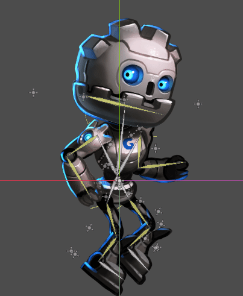

Get your assets:
`cutout_animation_assets.zip <https://github.com/godotengine/godot-docs-project-starters/releases/download/latest-4.x/cutout_animation_assets.zip>`_.

Setting up the rig
~~~~~~~~~~~~~~~~~~

Create an empty Node2D as root of the scene, we will work under it:

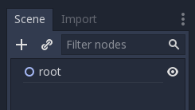

The first node of the model is the hip.
Generally, both in 2D and 3D, the hip is the root of the skeleton. This
makes it easier to animate:

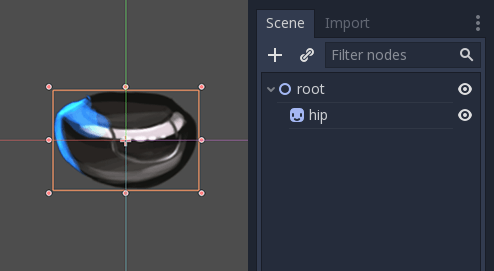

Next will be the torso. The torso needs to be a child of the hip, so
create a child sprite and load the torso texture, later accommodate it properly:

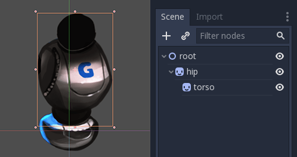

This looks good. Let's see if our hierarchy works as a skeleton by
rotating the torso. We can do this be pressing :kbd:`E` to enter rotate mode,
and dragging with the left mouse button. To exit rotate mode hit :kbd:`ESC`.

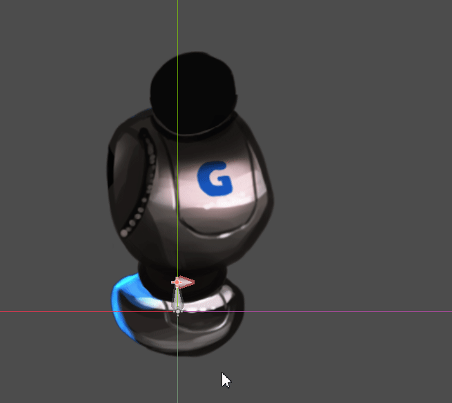

The rotation pivot is wrong and needs to be adjusted.

This small cross in the middle of the :ref:`Sprite2D <class_Sprite2D>` is
the rotation pivot:

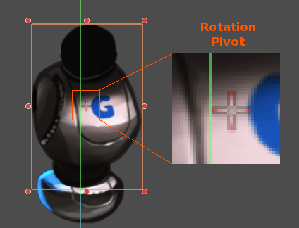

Adjusting the pivot
~~~~~~~~~~~~~~~~~~~

The pivot can be adjusted by changing the *offset* property in the
Sprite2D:

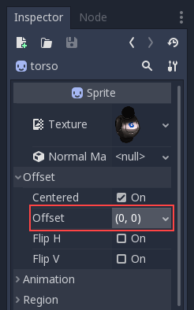

The pivot can also be adjusted *visually*. While hovering over the
desired pivot point,  press :kbd:`V` to move the pivot there for the
selected Sprite2D. There is also a tool in the tool bar that has a
similar function.

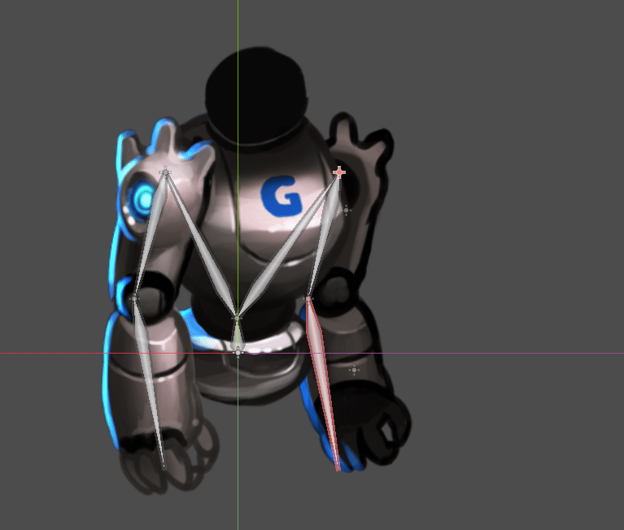

Continue adding body pieces, starting with the
right arm. Make sure to put each sprite in its correct place in the hierarchy,
so its rotations and translations are relative to its parent:

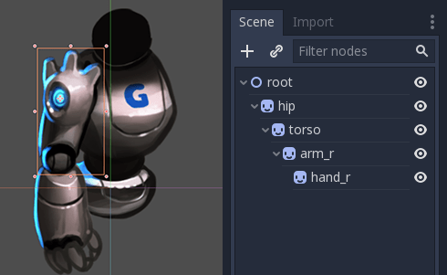

With the left arm there's a problem. In 2D, child nodes appear in front of
their parents:

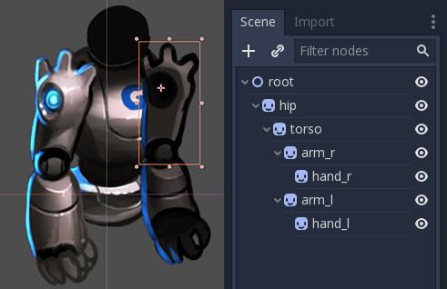

We want the left arm to appear *behind*
the hip and the torso. We could move the left arm nodes behind the hip (above
the hip node in the scene hierarchy), but then the left arm is no longer in its
proper place in the hierarchy. This means it wouldn't be affected by the movement
of the torso. We'll fix this problem with ``RemoteTransform2D`` nodes.

.. note:: You can also fix depth ordering problems by adjusting the Z property
   of any node inheriting from Node2D.

RemoteTransform2D node
~~~~~~~~~~~~~~~~~~~~~~

The :ref:`RemoteTransform2D <class_RemoteTransform2D>` node transforms nodes
somewhere else in the hierarchy. This node applies its own transform (including
any transformation it inherits from its parents) to the remote node it targets.

This allows us to correct the visibility order of our elements, independently of
the locations of those parts in the cutout hierarchy.

Create a ``RemoteTransform2D`` node as a child of the torso. Call it ``remote_arm_l``.
Create another RemoteTransform2D node inside the first and call it ``remote_hand_l``.
Use the ``Remote Path`` property of the two new nodes to target the ``arm_l`` and
``hand_l`` sprites respectively:

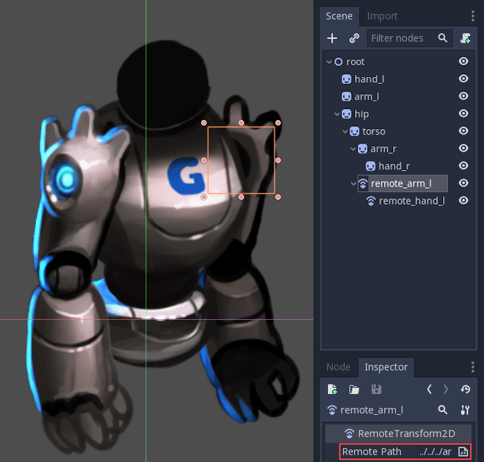

Moving the ``RemoteTransform2D`` nodes now moves the sprites. So we can create
animations by adjusting the ``RemoteTransform2D`` transforms:

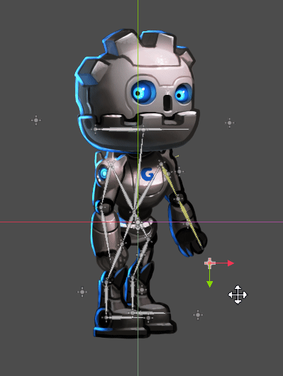

Completing the skeleton
~~~~~~~~~~~~~~~~~~~~~~~

Complete the skeleton by following the same steps for the rest of the
parts. The resulting scene should look similar to this:

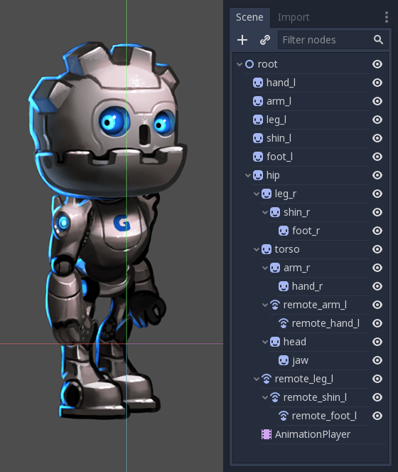

The resulting rig will be easy to animate. By selecting the nodes and
rotating them you can animate forward kinematics (FK) efficiently.

For simple objects and rigs this is fine, but there are limitations:

-  Selecting sprites in the main viewport can become difficult in complex rigs.
   The scene tree ends up being used to select parts instead, which can be slower.
-  Inverse Kinematics (IK) is useful for animating extremities like hands and
   feet, and can't be used with our rig in its current state.

To solve these problems we'll use Godot's skeletons.

Skeletons
~~~~~~~~~

In Godot there is a helper to create "bones" between nodes. The bone-linked
nodes are called skeletons.

As an example, let's turn the right arm into a skeleton. To create
a skeleton, a chain of nodes must be selected from top to bottom:

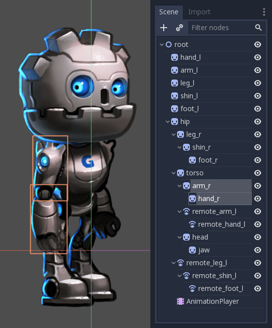

Then, click on the Skeleton menu and select ``Make Bones``.

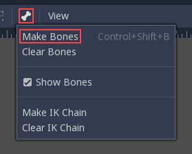

This will add bones covering the arm, but the result may be surprising.

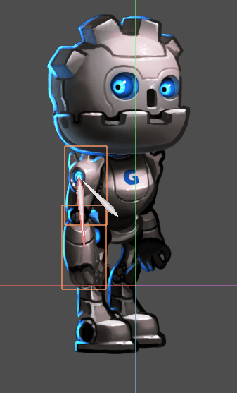

Why does the hand lack a bone? In Godot, a bone connects a
node with its parent. And there's currently no child of the hand node.
With this knowledge let's try again.

The first step is creating an endpoint node. Any kind of node will do,
but :ref:`Marker2D <class_Marker2D>` is preferred because it's
visible in the editor. The endpoint node will ensure that the last bone
has orientation.

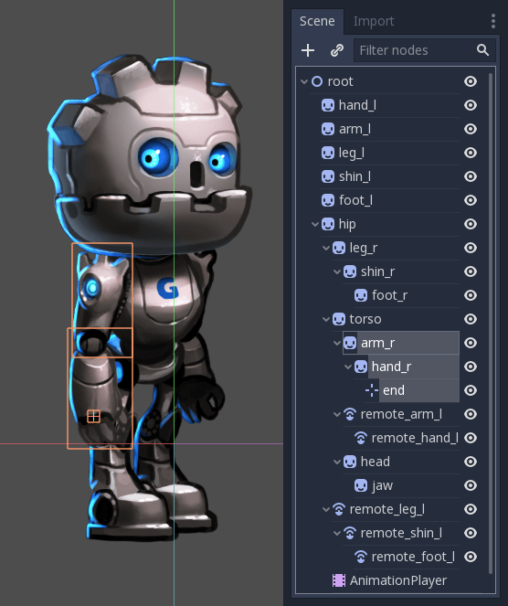

Now select the whole chain, from the endpoint to the arm and create
bones:

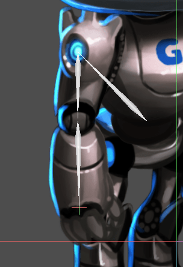

The result resembles a skeleton a lot more, and now the arm and forearm
can be selected and animated.

Create endpoints for all important extremities. Generate bones for all
articulable parts of the cutout, with the hip as the ultimate connection
between all of them.

You may notice that an extra bone is created when connecting the hip and torso.
Godot has connected the hip node to the scene root with a bone, and we don't
want that. To fix this, select the root and hip node, open the Skeleton menu,
click ``clear bones``.

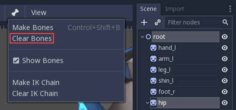

Your final skeleton should look something like this:

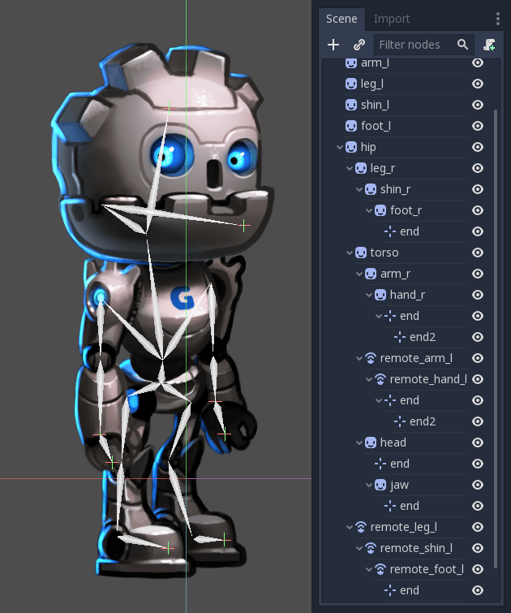

You might have noticed a second set of endpoints in the hands. This will make
sense soon.

Now that the whole figure is rigged, the next step is setting up the IK
chains. IK chains allow for more natural control of extremities.

IK chains
~~~~~~~~~

IK stands for inverse kinematics. It's a convenient technique for animating the
position of hands, feet and other extremities of rigs like the one we've made.
Imagine you want to pose a character's foot in a specific position on the ground.
Without IK chains, each motion of the foot would require rotating and positioning
several other bones (the shin and the thigh at least). This would be quite
complex and lead to imprecise results. IK allows us to move the foot directly
while the shin and thigh self-adjust.

.. note::

    **IK chains in Godot currently work in the editor only**, not
    at runtime. They are intended to ease the process of setting keyframes, and are
    not currently useful for techniques like procedural animation.

To create an IK chain, select a chain of bones from endpoint to
the base for the chain. For example, to create an IK chain for the right
leg, select the following:

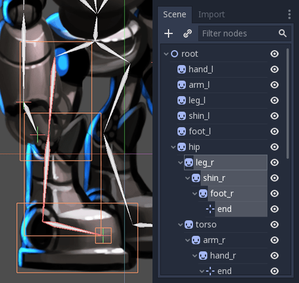

Then enable this chain for IK. Go to Edit > Make IK Chain.

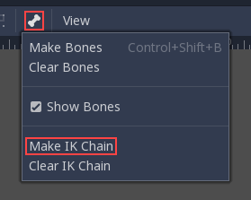

As a result, the base of the chain will turn *Yellow*.

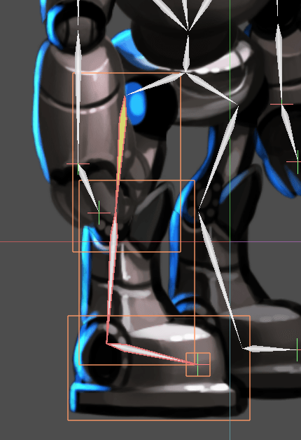

Once the IK chain is set up, grab any child or grand-child of the base of the
chain (e.g. a foot), and move it. You'll see the rest of the chain adjust as you
adjust its position.

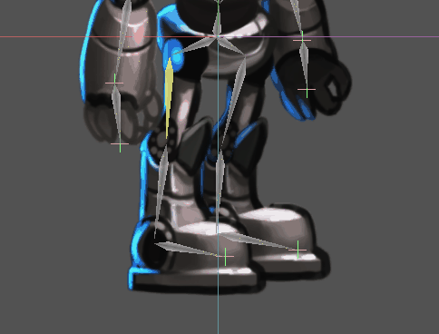

Animation tips
~~~~~~~~~~~~~~

The following section will be a collection of tips for creating animation for
your cutout rigs. For more information on how the animation system in Godot
works, see :ref:`doc_introduction_animation`.

Setting keyframes and excluding properties
------------------------------------------

Special contextual elements appear in the top toolbar when the animation editor
window is open:

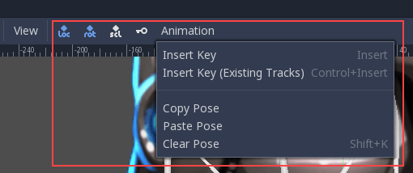

The key button inserts location, rotation, and scale keyframes for the
selected objects or bones at the current playhead position.

The "loc", "rot", and "scl" toggle buttons to the left of the key button modify
its function, allowing you to specify which of the three properties keyframes
will be created for.

Here's an illustration of how this can be useful: Imagine you have a node which
already has two keyframes animating its scale only. You want to add an
overlapping rotation movement to the same node. The rotation movement should
begin and end at different times from the scale change that's already set up.
You can use the toggle buttons to have only rotation information added when you
add a new keyframe. This way, you can avoid adding unwanted scale keyframes
which would disrupt the existing scale animation.

Creating a rest pose
~~~~~~~~~~~~~~~~~~~~

Think of a rest pose as a default pose that your cutout rig should be set to
when no other pose is active in your game. Create a rest pose as follows:

1. Make sure the rig parts are positioned in what looks like a "resting"
arrangement.

2. Create a new animation, rename it "rest".

3. Select all nodes in your rig (box selection should work fine).

4. Make sure the "loc", "rot", and "scl" toggle buttons are all active in the
toolbar.

5. Press the key button. Keys will be inserted for all selected parts storing
their current arrangement. This pose can now be recalled when necessary in
your game by playing the "rest" animation you've created.

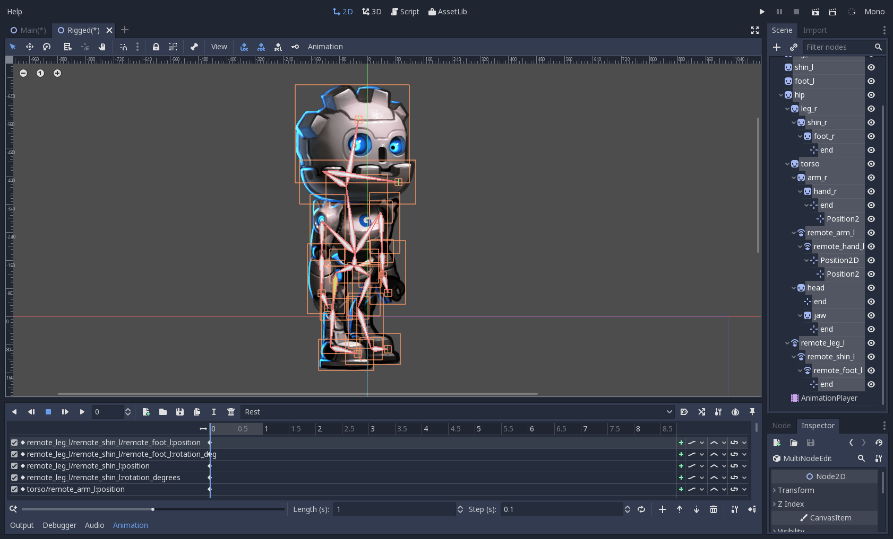

Modifying rotation only
~~~~~~~~~~~~~~~~~~~~~~~

When animating a cutout rig, often it's only the rotation of the nodes that
needs to change.
Location and scale are rarely used.

So when inserting keys, you might find it convenient to have only the "rot"
toggle active most of the time:

This will avoid the creation of unwanted animation tracks for position
and scale.

Keyframing IK chains
~~~~~~~~~~~~~~~~~~~~

When editing IK chains, it's not necessary to select the whole chain to
add keyframes. Selecting the endpoint of the chain and inserting a
keyframe will automatically insert keyframes for all other parts of the chain too.

Visually move a sprite behind its parent
~~~~~~~~~~~~~~~~~~~~~~~~~~~~~~~~~~~~~~~~

Sometimes it is necessary to have a node change its visual depth relative to
its parent node during an animation. Think of a character facing the camera,
who pulls something out from behind his back and holds it out in front of him.
During this animation the whole arm and the object in his hand would need to
change their visual depth relative to the body of the character.

To help with this there's a keyframable "Behind Parent" property on all
Node2D-inheriting nodes. When planning your rig, think about the movements it
will need to perform and give some thought to how you'll use "Behind Parent"
and/or RemoteTransform2D nodes. They provide overlapping functionality.

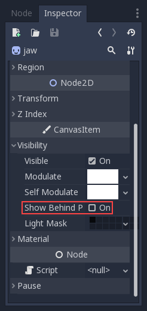

Setting easing curves for multiple keys
~~~~~~~~~~~~~~~~~~~~~~~~~~~~~~~~~~~~~~~

To apply the same easing curve to multiple keyframes at once:

1. Select the relevant keys.
2. Click on the pencil icon in the bottom right of the animation panel. This
   will open the transition editor.
3. In the transition editor, click on the desired curve to apply it.

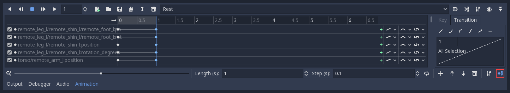

2D Skeletal deform
~~~~~~~~~~~~~~~~~~

Skeletal deform can be used to augment a cutout rig, allowing single pieces to
deform organically (e.g. antennae that wobble as an insect character walks).

This process is described in a :ref:`separate tutorial <doc_2d_skeletons>`.
