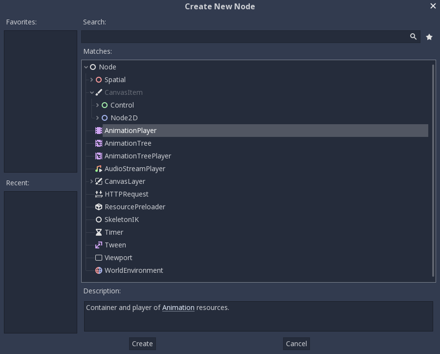
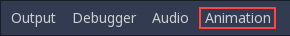
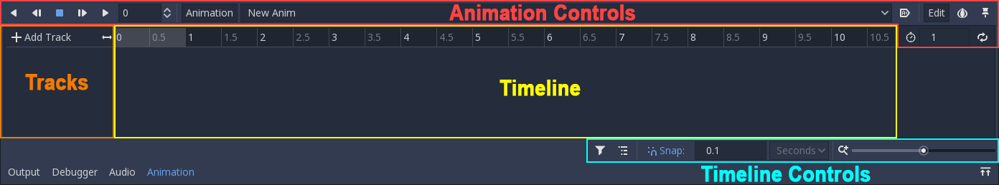
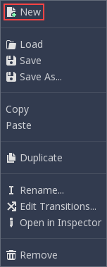
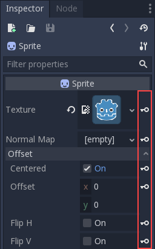
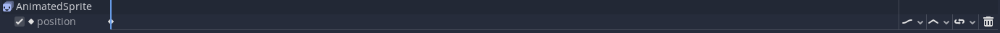
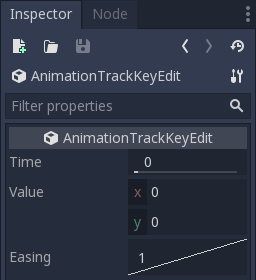
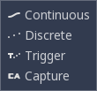
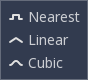
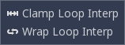

.. _doc_introduction_animation:

Introduction to the animation features
======================================

The :ref:`class_AnimationPlayer` node allows you to create anything
from simple to complex animations.

In Godot, you can animate anything available in the Inspector, such as
Node transforms, sprites, UI elements, particles, visibility and color
of materials, and so on. You can also modify values of script variables
and even call functions.

The AnimationPlayer node
------------------------

To use the animation tools we first have to create an
:ref:`class_AnimationPlayer` node.

.. warning::

   AnimationPlayer inherits from Node instead of Node2D or Node3D, which means
   that the child nodes will not inherit the transform from the parent nodes
   due to a bare Node being present in the hierarchy.

   Therefore, it is not recommended to add nodes that have a 2D/3D transform
   as a child of an AnimationPlayer node.

The AnimationPlayer node is the data container for your animations.
One AnimationPlayer node can hold multiple animations, which can
automatically transition to one another.

   The AnimationPlayer node

After you create an AnimationPlayer node, click on it to
open the Animation Panel at the bottom of the viewport.

   The animation panel position

The animation panel consists of four parts:

   The animation panel

-  Animation controls (i.e. add, load, save, and delete animations)
-  The tracks listing
-  The timeline with keyframes
-  The timeline and track controls, where you can zoom the timeline and
   edit tracks, for example.

Computer animation relies on keyframes
--------------------------------------

A keyframe defines the value of a property at a point in time.

Diamond shapes represent keyframes in the timeline. A line between two
keyframes indicates that the value doesn't change between them.

.. figure:: img/animation_keyframes.png
   :alt: Keyframes in Godot

   Keyframes in Godot

You set values of a node's properties and create animation keyframes for them.
When the animation runs, the engine will interpolate the values between the
keyframes, resulting in them gradually changing over time.

.. figure:: img/animation_illustration.png
   :alt: Two keyframes are all it takes to obtain a smooth motion

   Two keyframes are all it takes to obtain a smooth motion

The timeline defines how long the animation will take. You can insert keyframes
at various points, and change their timing.

.. figure:: img/animation_timeline.png
   :alt: The timeline in the animation panel

   The timeline in the animation panel

Each line in the Animation Panel is an animation track that references a
Normal or Transform property of a node. Each track stores a path to
a node and its affected property. For example, the position track
in the illustration refers to to the ``position`` property of the Sprite2D
node.

.. tip::

   If you animate the wrong property, you can edit a track's path at any time
   by double-clicking on it and typing the new path. Play the animation using the
   "Play from beginning" button |Play from beginning| (or pressing
   :kbd:`Shift + D` on keyboard) to see the changes instantly.

Creating an animation
---------------------

To create an animation click the "Animation" button in the animation editor. From
the list, select "New" (|Add Animation|) to add a new animation. Enter a name for
the animation in the dialog box.

   Add a new animation

Adding property tracks
~~~~~~~~~~~~~~~~~~~~~~

Before an animation keyframe can be created a track needs to be made.
The most common is a property track which is used to keyframe a nodes
properties.

.. note:: Information on other track types is found :ref:`here <doc_animation_track_types>`.

There are three ways to add a property track to an animation with
Godot's editor. 

The first is with key icons in the inspector. When the animation editor
is open, and an animation is open, the properties of nodes in the
inspector will have key icons next to them.

   Keyframes for other properties

Clicking on them will give you the option to use bezier curves and create a reset
track (more on these later), after clicking **Create** it will then create a keyframe
in the animation for that property. subresource properties can also be keyframed like
this, such as the albedo texture of a material for a mesh instance node.

The second method is the convenience buttons. These will appear in the top toolbar
when an animation is open and the editor is in 2D mode.

.. figure:: img/animation_convenience_buttons.png
   :alt: Convenience buttons

   Convenience buttons

These are a way to quickly create keyframes for a node while moving it around in
the scene. The loc rot and scl buttons control which properties a keyframe will
be created for. Click on the key button to create the first keyframe. Since tracks
haven't been set up for the properties yet, Godot will offer to create them.

After adjusting the current time of the animation and changing one of the
selected properties of the node the Key button will create a keyframe for those
properties based on their current value. The Rec button can also be selected,
turning this on makes it so that keyframes are created automatically when one of
the selected properties is changed.

The dropdown menu for this, which can be opened by clicking the 3 dots, gives the
option to create a keyframe and copy a pose.

   The sprite track

The last way to add a property track is with the **Add Track** button in the
top left of the animation editor. Clicking on this opens a list of all the
track types that can be added to an animation.

.. note:: Again, information on those track types is found :ref:`here <doc_animation_track_types>`.

After clicking on property track select the node to make a track for, then from
the next list select the property to animate. This method is mentioned last
because it has two major drawbacks for property tracks. A track for the property
of a nodes subresource can't be created from here, and the option to use bezier
curves or create a RESET track is not given.

Edit keyframes
--------------

You can click on a keyframe in the animation timeline to display and
edit its value in the *Inspector*.

   Keyframe editor editing a key

You can also edit the easing value for a keyframe here by clicking and dragging
its easing curve. This tells Godot how to interpolate the animated property when it
reaches this keyframe.

You can tweak your animations this way until the movement "looks right."

.. |Play from beginning| image:: img/animation_play_from_beginning.png
.. |Add Animation| image:: img/animation_add.png

Track settings
~~~~~~~~~~~~~~

Each track has a settings panel at the end, where you can set its update
mode, track interpolation, and loop mode.

   Track settings

The update mode of a track tells Godot when to update the property
values. This can be:

-  **Continuous:** Update the property on each frame
-  **Discrete:** Only update the property on keyframes
-  **Trigger:** Only update the property on keyframes or triggers.
   Triggers are a type of keyframe used by the
   ``current_animation`` property of a :ref:`class_AnimationPlayer`,
   and Animation Playback tracks.
-  **Capture:** if the first keyframe's time is greater than ``0.0``, the
   current value of the property will be remembered and
   will be blended with the first animation key. For example, you
   could use the Capture mode to move a node that's located anywhere
   to a specific location.

   Track mode

You will usually use "Continuous" mode. The other types are used to
script complex animations.

Track interpolation tells Godot how to calculate the frame values between
keyframes. These interpolation modes are supported:

-  Nearest: Set the nearest keyframe value
-  Linear: Set the value based on a linear function calculation between
   the two keyframes
-  Cubic: Set the value based on a cubic function calculation between
   the two keyframes

   Track interpolation

With Cubic interpolation, animation is slower at keyframes and faster between
them, which leads to more natural movement. Cubic interpolation is commonly
used for character animation. Linear interpolation animates changes at a fixed
pace, resulting in a more robotic effect.

Godot supports two loop modes, which affect the animation when it's set to
loop:

   Loop modes

-  Clamp loop interpolation: When this is selected, the animation stops
   after the last keyframe for this track. When the first keyframe is
   reached again, the animation will reset to its values.
-  Wrap loop interpolation: When this is selected, Godot calculates the
   animation after the last keyframe to reach the values of the first
   keyframe again.

Using RESET tracks
------------------

You can set up a special *RESET* animation to contain the "default pose".
This is used to ensure that the default pose is restored when you save
the scene and open it again in the editor.

For existing tracks, you can add an animation called "RESET" (case-sensitive),
then add tracks for each property that you want to reset.
The only keyframe should be at time 0, and give it the desired default value
for each track.

If AnimationPlayer's **Reset On Save** property is set to ``true``,
the scene will be saved with the effects of the reset animation applied
(as if it had been seeked to time ``0.0``).
This only affects the saved file – the property tracks in the editor stay
where they were.

If you want to reset the tracks in the editor, select the AnimationPlayer node,
open the **Animation** bottom panel then choose **Apply Reset** in the
animation editor's **Animation** dropdown menu.

Onion Skinning
--------------

Godot's animation editor allows you use onion skinning while creating an
animation. To turn this feature on click on the onion icon in the top right
of the animation editor. Now there will be transparent red copies of what
is being animated in its previous positions in the animation.

The three dots button next to the onion skinning button opens a dropdown
menu that lets you adjust how it works, including the ability to use
onion skinning for future frames.
