.. _doc_introduction_animation:

Introduction to the animation features
======================================

The :ref:`class_AnimationPlayer` node allows you to create anything
from simple to complex animations.

In this guide you learn to:

-  Work with the Animation Panel
-  Animate any property of any node
-  Create a simple animation

In Godot, you can animate anything available in the Inspector, such as
Node transforms, sprites, UI elements, particles, visibility and color
of materials, and so on. You can also modify values of script variables
and even call functions.

Create an AnimationPlayer node
------------------------------

To use the animation tools we first have to create an
:ref:`class_AnimationPlayer` node.

The AnimationPlayer node type is the data container for your animations.
One AnimationPlayer node can hold multiple animations, which can
automatically transition to one another.

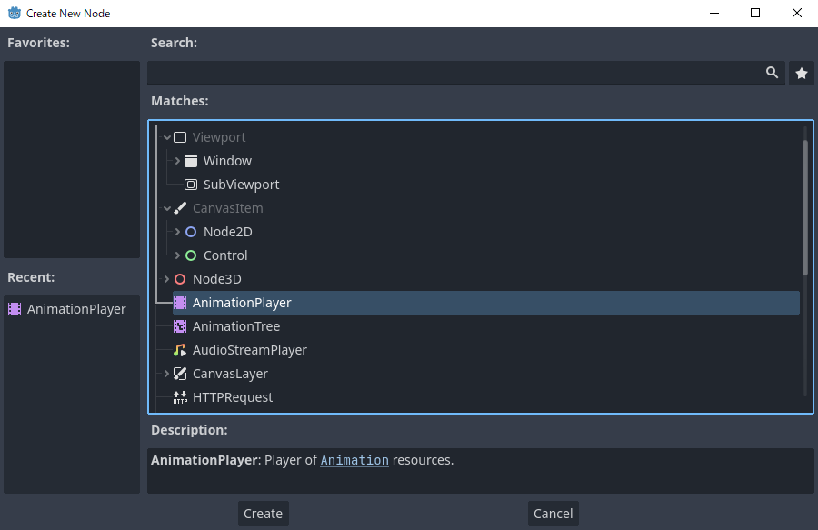

   The AnimationPlayer node

After you create an AnimationPlayer node, click on it to
open the Animation Panel at the bottom of the viewport.

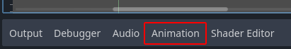

   The animation panel position

The animation panel consists of four parts:

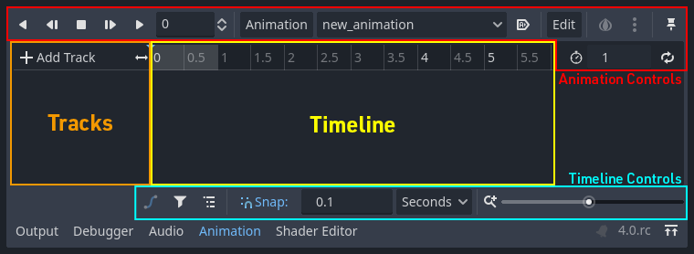

   The animation panel

-  Animation controls (i.e. add, load, save, and delete animations)
-  The tracks listing
-  The timeline with keyframes
-  The timeline and track controls, where you can zoom the timeline and
   edit tracks, for example.

Computer animation relies on keyframes
--------------------------------------

A keyframe defines the value of a property at a point in time.

Diamond shapes represent keyframes in the timeline. A line between two
keyframes indicates that the value doesn't change between them.

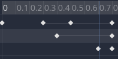

   Keyframes in Godot

You set values of a node's properties and create animation keyframes for them.
When the animation runs, the engine will interpolate the values between the
keyframes, resulting in them gradually changing over time.

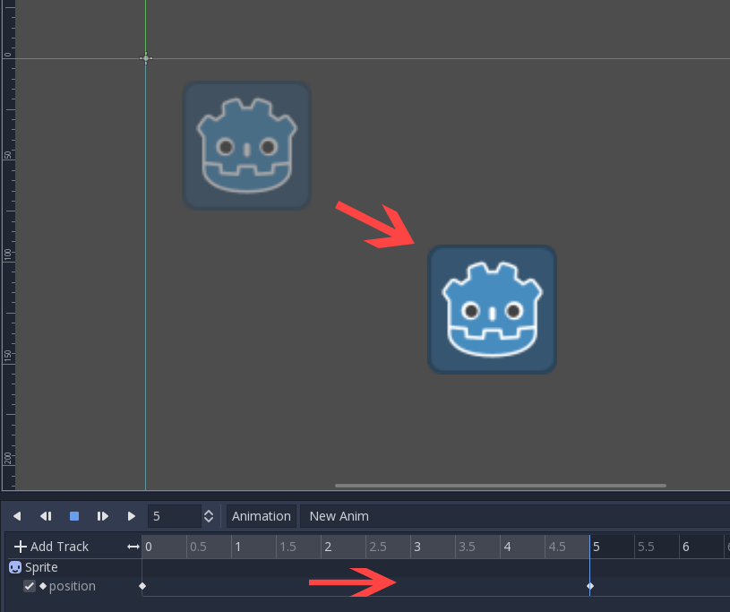

   Two keyframes are all it takes to obtain a smooth motion

The timeline defines how long the animation will take. You can insert keyframes
at various points, and change their timing.

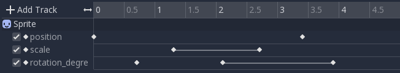

   The timeline in the animation panel

Each line in the Animation Panel is an animation track that references a
Normal or Transform property of a node. Each track stores a path to
a node and its affected property. For example, the position track
in the illustration refers to the ``position`` property of the Sprite2D
node.

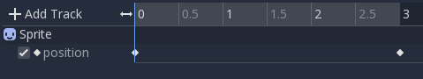

   Example of Normal animation tracks

.. tip::

   If you animate the wrong property, you can edit a track's path at any time
   by double-clicking on it and typing the new path. Play the animation using the
   "Play from beginning" button |Play from beginning| (or pressing
   :kbd:`Shift + D` on keyboard) to see the changes instantly.

Tutorial: Creating a simple animation
-------------------------------------

Scene setup
~~~~~~~~~~~

For this tutorial, we'll create a Sprite node with an AnimationPlayer as
its child. We will animate the sprite to move between two points on the screen.

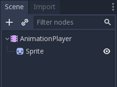

   Our scene setup

.. warning::

   AnimationPlayer inherits from Node instead of Node2D or Node3D, which means
   that the child nodes will not inherit the transform from the parent nodes
   due to a bare Node being present in the hierarchy.

   Therefore, it is not recommended to add nodes that have a 2D/3D transform
   as a child of an AnimationPlayer node.

The sprite holds an image texture. For this tutorial, select the Sprite2D node,
click Texture in the Inspector, and then click Load. Select the default Godot
icon for the sprite's texture.

Adding an animation
~~~~~~~~~~~~~~~~~~~

Select the AnimationPlayer node and click the "Animation" button in the
animation editor. From the list, select "New" (|Add Animation|) to add a new
animation. Enter a name for the animation in the dialog box.

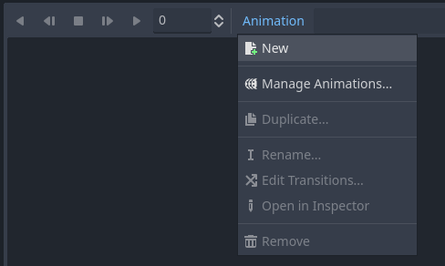

   Add a new animation

Manage an animation libraries
~~~~~~~~~~~~~~~~~~~~~~~~~~~~~

For reusability, the animation is registered in a list in the animation library resource. If you add an animation to AnimationPlayer without specifying any particular settings, the animation will be registered in the [Global] animation library that AnimationPlayer has by default.

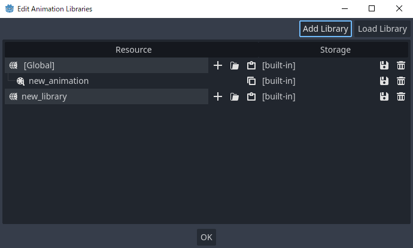

   Manage animations

If there are multiple animation libraries and you try to add an animation, a dialog box will appear with options.

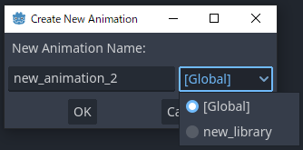

   Add a new animation with library option

Adding a track
~~~~~~~~~~~~~~

To add a new track for our sprite, select it and take a look at the
toolbar:

   Convenience buttons

These switches and buttons allow you to add keyframes for the selected
node's location, rotation, and scale. Since we are only animating the sprite's
position, make sure that only the location switch is selected. The selected
switches are blue.

Click on the key button to create the first keyframe. Since we don't have a
track set up for the Position property yet, Godot will offer to
create it for us. Click **Create**.

Godot will create a new track and insert our first keyframe at the beginning of
the timeline:

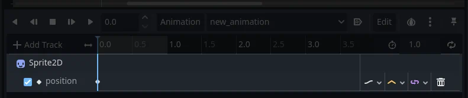

   The sprite track

The second keyframe
~~~~~~~~~~~~~~~~~~~

We need to set our sprite's end location and how long it will take for it to get there.

Let's say we want it to take two seconds to move between the points. By
default, the animation is set to last only one second, so change the animation
length to 2 in the controls on the right side of the animation panel's timeline
header.

   Animation length

Now, move the sprite right, to its final position. You can use the *Move tool* in the
toolbar or set the *Position*'s X value in the *Inspector*.

Click on the timeline header near the two-second mark in the animation panel
and then click the key button in the toolbar to create the second keyframe.

Run the animation
~~~~~~~~~~~~~~~~~

Click on the "Play from beginning" (|Play from beginning|) button.

Yay! Our animation runs:

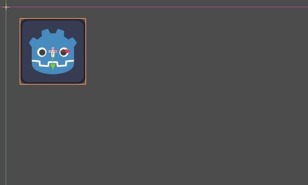

   The animation

Autoplay on load
~~~~~~~~~~~~~~~~

You can make it so an animation plays automatically when the AnimationPlayer nodes
scene starts, or joins another scene. To do this click the "Autoplay on load"
button in the animation editor, it's right next to the edit button.

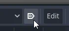

The icon for it will also appear in front of the name of the animation, so you can
easily identify which one is the autoplay animation.

Back and forth
~~~~~~~~~~~~~~

Godot has an interesting feature that we can use in animations. When Animation
Looping is set but there's no keyframe specified at the end of the animation,
the first keyframe is also the last.

This means we can extend the animation length to four seconds now, and Godot
will also calculate the frames from the last keyframe to the first, moving
our sprite back and forth.

   Animation loop

You can change this behavior by changing the track's loop mode. This is covered
in the next chapter.

Track settings
~~~~~~~~~~~~~~

Each property track has a settings panel at the end, where you can set its update
mode, track interpolation, and loop mode.

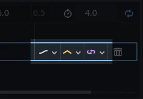

   Track settings

The update mode of a track tells Godot when to update the property
values. This can be:

-  **Continuous:** Update the property on each frame
-  **Discrete:** Only update the property on keyframes
-  **Capture:** if the first keyframe's time is greater than ``0.0``, the
   current value of the property will be remembered and
   will be blended with the first animation key. For example, you
   could use the Capture mode to move a node that's located anywhere
   to a specific location.

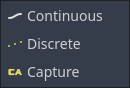

   Track mode

You will usually use "Continuous" mode. The other types are used to
script complex animations.

Track interpolation tells Godot how to calculate the frame values between
keyframes. These interpolation modes are supported:

-  Nearest: Set the nearest keyframe value
-  Linear: Set the value based on a linear function calculation between
   the two keyframes
-  Cubic: Set the value based on a cubic function calculation between
   the two keyframes
-  Linear Angle (Only appears in rotation property): Linear mode with shortest path rotation
-  Cubic Angle (Only appears in rotation property): Cubic mode with shortest path rotation

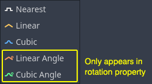

   Track interpolation

With Cubic interpolation, animation is slower at keyframes and faster between
them, which leads to more natural movement. Cubic interpolation is commonly
used for character animation. Linear interpolation animates changes at a fixed
pace, resulting in a more robotic effect.

Godot supports two loop modes, which affect the animation when it's set to
loop:

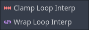

   Loop modes

-  Clamp loop interpolation: When this is selected, the animation stops
   after the last keyframe for this track. When the first keyframe is
   reached again, the animation will reset to its values.
-  Wrap loop interpolation: When this is selected, Godot calculates the
   animation after the last keyframe to reach the values of the first
   keyframe again.

Keyframes for other properties
------------------------------

Godot's animation system isn't restricted to position, rotation, and scale.
You can animate any property.

If you select your sprite while the animation panel is visible, Godot will
display a small keyframe button in the *Inspector* for each of the sprite's
properties. Click on one of these buttons to add a track and keyframe to
the current animation.

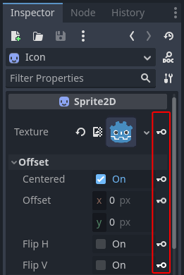

   Keyframes for other properties

Edit keyframes
--------------

You can click on a keyframe in the animation timeline to display and
edit its value in the *Inspector*.

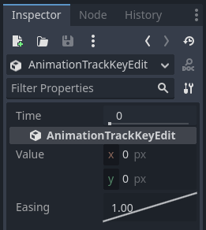

   Keyframe editor editing a key

You can also edit the easing value for a keyframe here by clicking and dragging
its easing curve. This tells Godot how to interpolate the animated property when it
reaches this keyframe.

You can tweak your animations this way until the movement "looks right."

Using RESET tracks
------------------

You can set up a special *RESET* animation to contain the "default pose".
This is used to ensure that the default pose is restored when you save
the scene and open it again in the editor.

For existing tracks, you can add an animation called "RESET" (case-sensitive),
then add tracks for each property that you want to reset.
The only keyframe should be at time 0, and give it the desired default value
for each track.

If AnimationPlayer's **Reset On Save** property is set to ``true``,
the scene will be saved with the effects of the reset animation applied
(as if it had been seeked to time ``0.0``).
This only affects the saved file – the property tracks in the editor stay
where they were.

If you want to reset the tracks in the editor, select the AnimationPlayer node,
open the **Animation** bottom panel then choose **Apply Reset** in the
animation editor's **Edit** dropdown menu.

when using the keyframe icon next to a property in the inspector the editor will
ask you to automatically create a RESET track.

.. note:: RESET tracks is also used as a reference value for blending. See also `For better blending <../animation/animation_tree.html#for-better-blending>`__.

Onion Skinning
--------------

Godot's animation editor allows you use onion skinning while creating an
animation. To turn this feature on click on the onion icon in the top right
of the animation editor. Now there will be transparent red copies of what
is being animated in its previous positions in the animation.

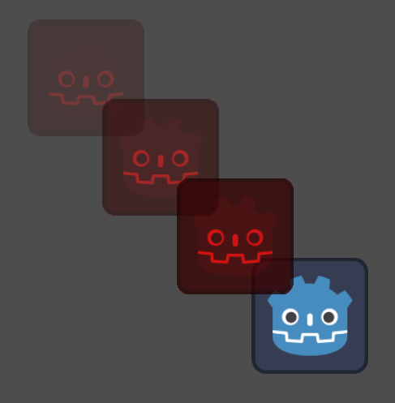

The three dots button next to the onion skinning button opens a dropdown
menu that lets you adjust how it works, including the ability to use
onion skinning for future frames.
