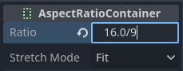

.. _doc_playing_videos:

Playing videos
==============

Godot supports video playback with the :ref:`class_VideoStreamPlayer` node.

Supported playback formats
--------------------------

The only supported format in core is **Ogg Theora** (not to be confused with
Ogg Vorbis audio) with optional Ogg Vorbis audio tracks. It's possible for
extensions to bring support for additional formats.

H.264 and H.265 cannot be supported in core Godot, as they are both encumbered
by software patents. AV1 is royalty-free, but it remains slow to decode on the
CPU and hardware decoding support isn't readily available on all GPUs in use
yet.

WebM was supported in core in Godot 3.x, but support for it was removed in 4.0
as it was too buggy and difficult to maintain.

.. note::

    You may find videos with a ``.ogg`` or ``.ogx`` extensions, which are generic
    extensions for data within an Ogg container.

    Renaming these file extensions to ``.ogv`` *may* allow the videos to be
    imported in Godot. However, not all files with ``.ogg`` or ``.ogx``
    extensions are videos - some of them may only contain audio.

Setting up VideoStreamPlayer
----------------------------

1. Create a VideoStreamPlayer node using the Create New Node dialog.
2. Select the VideoStreamPlayer node in the scene tree dock, go to the inspector
   and load a ``.ogv`` file in the Stream property.

   - If you don't have your video in Ogg Theora format yet, jump to
     :ref:`doc_playing_videos_recommended_theora_encoding_settings`.

3. If you want the video to play as soon as the scene is loaded, check
   **Autoplay** in the inspector. If not, leave **Autoplay** disabled and call
   ``play()`` on the VideoStreamPlayer node in a script to start playback when
   desired.

Handling resizing and different aspect ratios
~~~~~~~~~~~~~~~~~~~~~~~~~~~~~~~~~~~~~~~~~~~~~

By default in Godot 4.0, the VideoStreamPlayer will automatically be resized to match
the video's resolution. You can make it follow usual :ref:`class_Control` sizing
by enabling **Expand** on the VideoStreamPlayer node.

To adjust how the VideoStreamPlayer node resizes depending on window size,
adjust the anchors using the **Layout** menu at the top of the 2D editor
viewport. However, this setup may not be powerful enough to handle all use
cases, such as playing fullscreen videos without distorting the video (but with
empty space on the edges instead). For more control, you can use an
:ref:`class_AspectRatioContainer` node, which is designed to handle this kind of
use case:

Add an AspectRatioContainer node. Make sure it is not a child of any other
container node. Select the AspectRatioContainer node, then set its **Layout** at
the top of the 2D editor to **Full Rect**. Set **Ratio** in the
AspectRatioContainer node to match your video's aspect ratio. You can use math
formulas in the inspector to help yourself. Remember to make one of the operands
a float. Otherwise, the division's result will always be an integer.

   This will evaluate to (approximately) 1.777778

Once you've configured the AspectRatioContainer, reparent your VideoStreamPlayer
node to be a child of the AspectRatioContainer node. Make sure **Expand** is
enabled on the VideoStreamPlayer. Your video should now scale automatically
to fit the whole screen while avoiding distortion.

.. seealso::

    See :ref:`doc_multiple_resolutions` for more tips on supporting multiple
    aspect ratios in your project.

Displaying a video on a 3D surface
~~~~~~~~~~~~~~~~~~~~~~~~~~~~~~~~~~

Using a VideoStreamPlayer node as a child of a :ref:`class_SubViewport` node,
it's possible to display any 2D node on a 3D surface. For example, this can be
used to display animated billboards when frame-by-frame animation would require
too much memory.

This can be done with the following steps:

1. Create a :ref:`class_SubViewport` node. Set its size to match your video's size
   in pixels.
2. Create a VideoStreamPlayer node *as a child of the SubViewport node* and specify
   a video path in it. Make sure **Expand** is disabled, and enable **Autoplay** if needed.
3. Create a MeshInstance3D node with a PlaneMesh or QuadMesh resource in its Mesh property.
   Resize the mesh to match the video's aspect ratio (otherwise, it will appear distorted).
4. Create a new StandardMaterial3D resource in the **Material Override** property
   in the GeometryInstance3D section.
5. Enable **Local To Scene** in the StandardMaterial3D's Resource section (at the bottom).
   This is *required* before you can use a ViewportTexture in its Albedo Texture property.
6. In the StandardMaterial3D, set the **Albedo > Texture** property to **New ViewportTexture**.
   Edit the new resource by clicking it, then specify the path to the SubViewport node
   in the **Viewport Path** property.
7. Enable **Albedo Texture Force sRGB** in the StandardMaterial3D to prevent colors
   from being washed out.
8. If the billboard is supposed to emit its own light,
   set **Shading Mode** to **Unshaded** to improve rendering performance.

See :ref:`doc_viewports` and the
`GUI in 3D demo <https://github.com/godotengine/godot-demo-projects/tree/master/viewport/gui_in_3d>`__
for more information on setting this up.

Looping a video
~~~~~~~~~~~~~~~

For looping a video, the **Loop** property can be enabled. This will seamlessly
restart the video when it reaches its end.

Note that setting the project setting **Video Delay Compensation** to a non-zero
value might cause your loop to not be seamless, because the synchronization of
audio and video takes place at the start of each loop causing occasional missed
frames. Set **Video Delay Compensation** in your project settings to **0** to
avoid frame drop issues.

Video decoding conditions and recommended resolutions
-----------------------------------------------------

Video decoding is performed on the CPU, as GPUs don't have hardware acceleration
for decoding Theora videos. Modern desktop CPUs can decode Ogg Theora videos at
1440p @ 60 FPS or more, but low-end mobile CPUs will likely struggle with
high-resolution videos.

To ensure your videos decode smoothly on varied hardware:

- When developing games for desktop platforms, it's recommended to encode in
  1080p at most (preferably at 30 FPS). Most people are still using 1080p or
  lower resolution displays, so encoding higher-resolution videos may not be
  worth the increased file size and CPU requirements.
- When developing games for mobile or web platforms, it's recommended to encode
  in 720p at most (preferably at 30 FPS or even lower). The visual difference
  between 720p and 1080p videos on a mobile device is usually not that
  noticeable.

Playback limitations
--------------------

There are some limitations with the current implementation of video playback in Godot:

- Streaming a video from a URL is not supported.
- Only mono and stereo audio output is supported. Videos with 4, 5.1 and 7.1
  audio channels are supported but down-mixed to stereo.

.. _doc_playing_videos_recommended_theora_encoding_settings:

Recommended Theora encoding settings
------------------------------------

A word of advice is to **avoid relying on built-in Ogg Theora exporters** (most of the time).
There are 2 reasons you may want to favor using an external program to encode your video:

- Some programs such as Blender can render to Ogg Theora. However, the default
  quality presets are usually very low by today's standards. You may be able to
  increase the quality options in the software you're using, but you may find
  the output quality to remain less than ideal (given the increased file size).
  This usually means that the software only supports encoding to constant bit
  rate (CBR), instead of variable bit rate (VBR). VBR encoding should be
  preferred in most scenarios as it provides a better quality to file size
  ratio.
- Some other programs can't render to Ogg Theora at all.

In this case, you can **render the video to an intermediate high-quality format**
(such as a high-bitrate H.264 video) then re-encode it to Ogg Theora. Ideally,
you should use a lossless or uncompressed format as an intermediate format to
maximize the quality of the output Ogg Theora video, but this can require a lot
of disk space.

`FFmpeg <https://ffmpeg.org/>`__ (CLI) is a popular open source tool
for this purpose. FFmpeg has a steep learning curve, but it's a powerful tool.

Here are example FFmpeg commands to convert an MP4 video to Ogg Theora. Since
FFmpeg supports a lot of input formats, you should be able to use the commands
below with almost any input video format (AVI, MOV, WebM, …).

.. note::

   Make sure your copy of FFmpeg is compiled with libtheora and libvorbis support.
   You can check this by running ``ffmpeg`` without any arguments, then looking
   at the ``configuration:`` line in the command output.

.. warning::

   Current official FFmpeg releases have some bugs in their Ogg/Theora
   multiplexer. It's highly recommended to use one of the latest static daily
   builds, or build from their master branch to get the latest fixes.

.. UPDATE: When the FFmpeg bugfixes for https://trac.ffmpeg.org/ticket/11451 and
.. https://trac.ffmpeg.org/ticket/11454 are included in a stable FFmpeg release,
.. this warning can be removed. That will likely be FFmpeg 7.2 or 8.0, and will
.. likely happen during the Godot 4.5 or 4.6 release cycle.
.. Commits fixing the issues:
.. - https://github.org/FFmpeg/FFmpeg@22aa71d4da37a4ad2b0d28deeace64b57aa2ef50
.. - https://github.org/FFmpeg/FFmpeg@84d85e7ad4ace228265af0c8c5caccc0730042fd
.. - https://github.org/FFmpeg/FFmpeg@6e26f57f672b05e7b8b052007a83aef99dc81ccb

Balancing quality and file size
~~~~~~~~~~~~~~~~~~~~~~~~~~~~~~~

The **video quality** level (``-q:v``) must be between ``1`` and ``10``. Quality
``6`` is a good compromise between quality and file size. If encoding at a high
resolution (such as 1440p or 4K), you will probably want to decrease ``-q:v`` to
``5`` to keep file sizes reasonable. Since pixel density is higher on a 1440p or
4K video, lower quality presets at higher resolutions will look as good or
better compared to low-resolution videos.

The **audio quality** level (``-q:a``) must be between ``-1`` and ``10``. Quality
``6`` provides a good compromise between quality and file size. In contrast to
video quality, increasing audio quality doesn't increase the output file size
nearly as much. Therefore, if you want the cleanest audio possible, you can
increase this to ``9`` to get *perceptually lossless* audio. This is especially
valuable if your input file already uses lossy audio compression. Higher quality
audio does increase the CPU usage of the decoder, so it might lead to audio
dropouts in case of high system load. See
`this page <https://wiki.hydrogenaud.io/index.php?title=Recommended_Ogg_Vorbis#Recommended_Encoder_Settings>`__
for a table listing Ogg Vorbis audio quality presets and their respective
variable bitrates.

The **GOP (Group of Pictures) size** (``-g:v``) is the max interval between
keyframes. Increasing this value can improve compression with almost no impact
on quality. The default size (``12``) is too low for most types of content,
it's therefore recommended using higher GOP values before reducing video
quality. Compression benefits will fade away as the GOP size increases though.
Values between ``64`` and ``512`` usually give the best compression.

.. note::

   Higher GOP sizes will increase max seek times with a sudden increase when
   going beyond powers of two starting at ``64``. Max seek times with GOP size
   ``65`` can be almost twice as long as with GOP size ``64``, depending on
   decoding speed.

FFmpeg: Convert while preserving original video resolution
~~~~~~~~~~~~~~~~~~~~~~~~~~~~~~~~~~~~~~~~~~~~~~~~~~~~~~~~~~

The following command converts the video while keeping its original resolution.
The video and audio's bitrate will be variable to maximize quality while saving
space in parts of the video/audio that don't require a high bitrate (such as
static scenes).

::

    ffmpeg -i input.mp4 -q:v 6 -q:a 6 -g:v 64 output.ogv

FFmpeg: Resize the video then convert it
~~~~~~~~~~~~~~~~~~~~~~~~~~~~~~~~~~~~~~~~

The following command resizes a video to be 720 pixels tall (720p), while
preserving its existing aspect ratio. This helps decrease the file size
significantly if the source is recorded at a higher resolution than 720p:

::

    ffmpeg -i input.mp4 -vf "scale=-1:720" -q:v 6 -q:a 6 -g:v 64 output.ogv

.. Chroma Key Functionality Documentation

Chroma Key Videos
-----------------

Chroma key, commonly known as the "green screen" or "blue screen" effect, allows you to remove a specific color from an image or video and replace it with another background. This effect is widely used in video production to composite different elements together seamlessly.

   .. image:: img/chroma_key_video.webp

We will achieve the chroma key effect by writing a custom shader in GDScript and using a `VideoStreamPlayer` node to display the video content.

Scene Setup
~~~~~~~~~~~

Ensure that the scene contains a `VideoStreamPlayer` node to play the video and a `Control` node to hold the UI elements for controlling the chroma key effect.

   .. image:: img/chroma_key_scene.webp

Writing the Custom Shader
~~~~~~~~~~~~~~~~~~~~~~~~~

To implement the chroma key effect, follow these steps:

1. Select the `VideoStreamPlayer` node in the scene and go to its properties. Under `CanvasItem > Material`, create a new shader named "ChromaKeyShader.gdshader."

2. In the "ChromaKeyShader.gdshader" file, write the custom shader code as shown below:

.. code-block:: glsl

   shader_type canvas_item;

   // Uniform variables for chroma key effect
   uniform vec3 chroma_key_color : source_color = vec3(0.0, 1.0, 0.0);
   uniform float pickup_range : hint_range(0.0, 1.0) = 0.1;
   uniform float fade_amount : hint_range(0.0, 1.0) = 0.1;

   void fragment() {
       // Get the color from the texture at the given UV coordinates
       vec4 color = texture(TEXTURE, UV);

       // Calculate the distance between the current color and the chroma key color
       float distance = length(color.rgb - chroma_key_color);

       // If the distance is within the pickup range, discard the pixel
       // the lesser the distance more likely the colors are
       if (distance <= pickup_range) {
           discard;
       }

       // Calculate the fade factor based on the pickup range and fade amount
       float fade_factor = smoothstep(pickup_range, pickup_range + fade_amount, distance);

       // Set the output color with the original RGB values and the calculated fade factor
       COLOR = vec4(color.rgb, fade_factor);
   }

The shader uses the distance calculation to identify pixels close to the chroma key color and discards them,
effectively removing the selected color. Pixels that are slightly further away from the chroma key color are
faded based on the fade_factor, blending them smoothly with the surrounding colors.
This process creates the desired chroma key effect, making it appear as if the background has been replaced with
another image or video.

The code above represents a simple demonstration of the Chroma Key shader,
and users can customize it according to their specific requirements.

UI Controls
~~~~~~~~~~~

To allow users to manipulate the chroma key effect in real-time, we created sliders in the `Control` node. The `Control` node's script contains the following functions:

.. tabs::
 .. code-tab:: gdscript

    extends Control

    func _on_color_picker_button_color_changed(color):
        # Update the "chroma_key_color" shader parameter of the VideoStreamPlayer's material.
        $VideoStreamPlayer.material.set("shader_parameter/chroma_key_color", color)

    func _on_h_slider_value_changed(value):
        # Update the "pickup_range" shader parameter of the VideoStreamPlayer's material.
        $VideoStreamPlayer.material.set("shader_parameter/pickup_range", value)

    func _on_h_slider_2_value_changed(value):
        # Update the "fade_amount" shader parameter of the VideoStreamPlayer's material.
        $VideoStreamPlayer.material.set("shader_parameter/fade_amount", value)

   func _on_video_stream_player_finished():
        # Restart the video playback when it's finished.
        $VideoStreamPlayer.play()

 .. code-tab:: csharp

    using Godot;

    public partial class MyControl : Control
    {
        private VideoStreamPlayer _videoStreamPlayer;

        public override void _Ready()
        {
            _videoStreamPlayer = GetNode<VideoStreamPlayer>("VideoStreamPlayer");
        }

        private void OnColorPickerButtonColorChanged(Color color)
        {
            // Update the "chroma_key_color" shader parameter of the VideoStreamPlayer's material.
            _videoStreamPlayer.Material.Set("shader_parameter/chroma_key_color", color);
        }

        private void OnHSliderValueChanged(double value)
        {
            // Update the "pickup_range" shader parameter of the VideoStreamPlayer's material.
            _videoStreamPlayer.Material.Set("shader_parameter/pickup_range", value);
        }

        private void OnHSlider2ValueChanged(double value)
        {
            // Update the "fade_amount" shader parameter of the VideoStreamPlayer's material.
            _videoStreamPlayer.Material.Set("shader_parameter/fade_amount", value);
        }

        private void OnVideoStreamPlayerFinished()
        {
            // Restart the video playback when it's finished.
            _videoStreamPlayer.Play();
        }
    }

also make sure that the range of the sliders are appropriate, our settings are :

   .. image:: img/slider_range.webp

Signal Handling
~~~~~~~~~~~~~~~

Connect the appropriate signal from the UI elements to the `Control` node's script.
you created in the `Control` node's script to control the chroma key effect.
These signal handlers will update the shader's uniform variables
in response to user input.

Save and run the scene to see the chroma key effect in action! With the provided UI controls,
you can now adjust the chroma key color, pickup range, and fade amount in real-time, achieving the desired
chroma key functionality for your video content.
