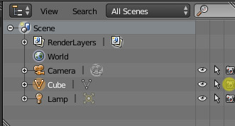

:allow_comments: False

Blender ESCN exporter
=====================

.. note:: This chapter relates to the Blender plugin called "Godot Blender Exporter",
          which can be downloaded here: https://github.com/godotengine/godot-blender-exporter

This plugin can be used to export Blender scenes in a Godot-specific scene format
called ESCN, which is similar to TSCN (text format) but will be imported as binary
SCN for performance.

Details on exporting
--------------------

.. toctree::
   :maxdepth: 1
   :name: toc-learn-workflow-assets-escn_exporter

   material
   physics
   lights
   mesh
   skeleton
   animation

Disabling specific objects
--------------------------

Sometimes you don't want some objects exported (e.g. high-res models used for
baking). An object will not be exported if it is not rendered in the scene.
This can be set in the outliner:

Objects hidden in the viewport will be exported, but will be hidden in the
Godot scene.

Build pipeline integration
--------------------------

If you have hundreds of model files, you don't want your artists to waste time
manually exporting their blend files. To combat this, the exporter provides a
Python function ``io_scene_godot.export(out_file_path)`` that can be called to
export a file. This allows easy integration with other build systems. An
example Makefile and Python script that exports all the blends in a directory
are present in the
`godot-blender-exporter repository <https://github.com/godotengine/godot-blender-exporter>`__.
