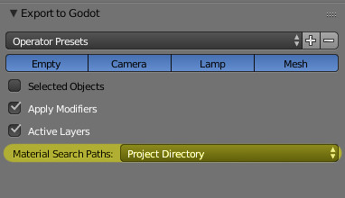

Materials
=========

Using existing Godot materials
------------------------------

One way in which the exporter can handle materials is to attempt to match
the Blender material with an existing Godot material. This has the advantage of
being able to use all of the features of Godot's material system, but it means
that you cannot see your model with the material applied inside Blender.

To do this, the exporter attempts to find Godot materials with names that match
those of the material name in Blender. So if you export an object in Blender
with the material name ``PurpleDots`` then the exporter will search for the
file ``PurpleDots.tres`` and assign it to the object. If this file is not a
``StandardMaterial3D`` or ``ShaderMaterial`` or if it cannot be found, then the
exporter will fall back to exporting the material from Blender.

Where the exporter searches for the ``.tres`` file is determined by the "Material
Search Paths" option:

This can take the value of:
 - Project Directory - Attempts to find the ``project.Godot`` and recursively
   searches through subdirectories. If ``project.Godot`` cannot be found it
   will throw an error. This is useful for most projects where naming conflicts
   are unlikely.
 - Export Directory - Look for materials in subdirectories of the export
   location. This is useful for projects where you may have duplicate
   material names and need more control over what material gets assigned.
 - None - Do not search for materials. Export them from the Blender file.

Export of Cycles/EEVEE materials
--------------------------------

The exporter has a primitive support for converting Cycles/EEVEE material node tree
to Godot Shader Material. Note that some of the Shader Node are not supported yet due to
difficulties in implementation, which are:

- all the ``noisy textures``
- ``generated texture coordinates``
- ``group node``
- shader nodes except ``PrincipledBSDF``, ``Diffuse``, ``Glossy``, ``Glass``, ``add shader`` and ``mix shader``

.. warning::

    If possible, try to use PrincipledBSDF node with GGX distribution as the output shader
    node, it is the only one guaranteed to be exactly correct. Others are just based on approximation.

Sometimes materials may not be valid for exporting (e.g. has some unsupported node) or it
is using Blender Internal Engine, only the diffuse color and a few flags (e.g. unshaded) are
exported and form a StandardMaterial3D.

Generate external materials
---------------------------

The default configuration of material exporting would keep all the materials internal to
the ``escn`` file. There is an option which could enable generating external ``.material``
file when the ``escn`` file opens in Godot.

.. image:: img/external_mat_option.jpg

``.material`` file can be assigned to any material slot to be a external resource.

.. image:: img/gd_dot_material.jpg
