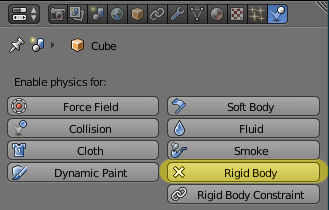
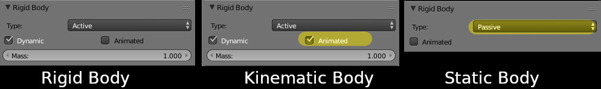
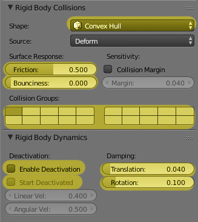
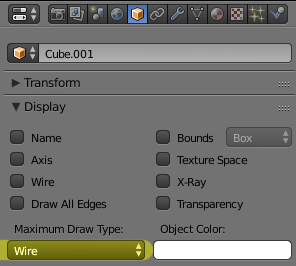

Physics properties
==================

Exporting physics properties is done by enabling "Rigid Body" in Blender's
physics tab:

.. important::
    By default, a single Blender object with rigid body enabled will export as
    three nodes: a PhysicsBody, a CollisionShape, and a MeshInstance3D.

Body type
---------

Blender only has the concept of "Active" and "Passive" rigid bodies. These
turn into Static and RigidBody nodes. To create a kinematic body, enable the
"animated" checkbox on an "Active" body:

Collision shapes
----------------

Many of the parameters for collision shapes are missing from Blender, and many
of the collision shapes are also not present. However, almost all of the
options in Blender's rigid body collision and rigid body dynamics interfaces
are supported:

There are the following caveats:
 - Not all of the collision shapes are supported. Only ``Mesh``, ``Convex
   Hull``, ``Capsule``, ``Sphere`` and ``Box`` are supported in both Blender and
   Godot
 - In Godot, you can have different collision groups and collision masks. In
   Blender you only have collision groups. As a result, the exported object's
   collision mask is equal to its collision group. Most of the time, this is
   what you want.

.. important::
    To build compound physics shapes, parent together multiple objects with
    rigid body enabled. The physics properties are taken from the parent-most
    rigid body, and the rest are used as collision shapes.

Collision geometry only
-----------------------

Frequently you want different geometry for your collision meshes and your
graphical meshes, but by default, the exporter will export a mesh along with the
collision shape. To only export the collision shape, set the object's maximum
draw type to Wire:

This will also influence how the object is shown in Blender's viewport.
Most of the time, you want your collision geometry to be shown see-through when
working on the models, so this works out fairly nicely.
